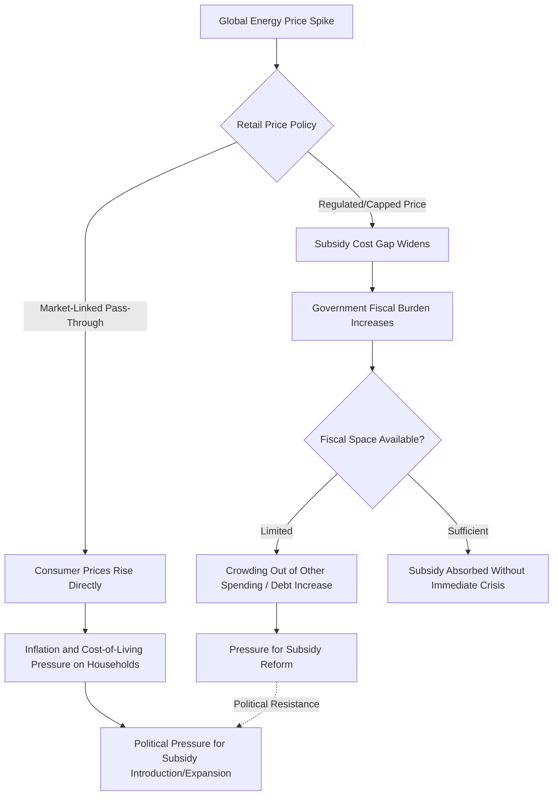

## Energy Subsidies and Fiscal Policy Implications

### Overview

Energy subsidies—government interventions that lower the cost of energy production or consumption below market-reflective levels—represent a major and often underappreciated component of public finances in many economies, with substantial implications for fiscal sustainability, resource allocation efficiency, income distribution, and environmental outcomes. Understanding subsidy typology, measurement approaches, and reform dynamics is central to assessing both the fiscal risk they pose and the political economy challenges involved in reforming them.

**Key Points**

- Subsidies can be explicit (direct budgetary transfers, tax expenditures) or implicit (uninternalized externalities such as environmental and health costs), with implicit subsidies generally estimated to be far larger globally than explicit ones
- Consumption subsidies (lowering retail prices) and production subsidies (supporting producers) create different fiscal and behavioral effects
- Subsidy costs are highly sensitive to global commodity price levels, creating a direct and often underappreciated fiscal risk channel
- Subsidy incidence is frequently regressive in absolute terms despite being intended as consumer protection, since wealthier households often consume more energy in absolute terms
- Subsidy reform is technically straightforward in concept but politically difficult in practice, requiring careful sequencing, compensating measures, and communication to be sustainable

### Typology of Energy Subsidies

#### Explicit (Direct Budgetary) Subsidies

- **Direct price subsidies**: government pays the difference between the market/import cost of energy and a lower regulated retail price, common for gasoline, diesel, cooking gas, and electricity in many emerging and developing economies
- **Tax expenditures**: reduced tax rates, exemptions, or credits applied to energy production or consumption relative to a standard tax baseline (e.g., reduced fuel excise taxes, accelerated depreciation for fossil fuel investment)
- **Direct producer support**: government payments or preferential financing terms provided to energy producers, including both fossil fuel and renewable energy producers depending on jurisdiction and policy objective
- **State-owned enterprise cost absorption**: where a state-owned utility or fuel distributor sells below cost and the resulting losses are absorbed by the government (directly through transfers or indirectly through the enterprise's balance sheet deterioration and eventual recapitalization needs)

#### Implicit Subsidies

- **Uninternalized environmental externalities**: the cost of air pollution, greenhouse gas emissions, and other environmental damages from energy consumption that are not reflected in the market price paid by consumers or producers, representing an implicit subsidy in the sense that the true social cost exceeds the price charged
- **Uninternalized health costs**: costs to public health systems and individuals from air pollution-related illness that are not priced into energy consumption decisions
- **Below-market-value provision of public infrastructure**: government-funded roads, grid infrastructure, or other supporting infrastructure provided without full cost recovery from energy sector beneficiaries

International organizations including the International Monetary Fund have published estimates suggesting implicit subsidies, when environmental and health externalities are included, substantially exceed explicit budgetary subsidies globally, though the magnitude of such estimates depends heavily on the externality valuation methodology and assumptions used (e.g., the social cost of carbon estimate applied), and figures should be treated as methodology-dependent estimates rather than precise, uncontested measurements. [Unverified: specific current global subsidy total estimates change with updated methodology and data; current figures should be verified against the latest IMF or IEA subsidy estimate publications if precise figures are needed]

### Consumption vs. Production Subsidies

| Dimension | Consumption Subsidies | Production Subsidies |
| --- | --- | --- |
| Mechanism | Lower retail price paid by end consumers | Support to producers (tax breaks, direct payments, financing) |
| Primary behavioral effect | Increases energy consumption/demand | Increases energy supply/production incentives |
| Common examples | Fuel price caps, subsidized electricity tariffs, cooking gas subsidies | Fossil fuel extraction tax incentives, renewable production tax credits |
| Fiscal exposure driver | Global commodity price level (gap between market and regulated price) | Production volume and specific incentive structure terms |
| Typical incidence concern | Can be regressive if wealthier households consume more in absolute terms | Depends on whether support flows to large incumbents or new entrants |

### Fiscal Cost Mechanics and Price Sensitivity

For consumption subsidies maintaining a fixed retail price below the market-reflective cost:

$$\text{Subsidy Cost} = (P_{market} - P_{regulated}) \times Q_{consumed}$$

- Because $P_{market}$ moves with global commodity prices while $P_{regulated}$ is often fixed or adjusted only infrequently for political reasons, subsidy costs can expand dramatically during global price spikes—precisely the periods when government fiscal resources may already be under pressure from other sources
- This creates a distinctive fiscal risk profile: subsidy costs are pro-cyclical with global energy prices for importing countries, compounding the trade balance and inflation pressures already discussed in energy price shock transmission, rather than providing any fiscal buffering effect
- $Q_{consumed}$ itself typically rises in response to the subsidized (artificially low) price relative to what consumption would be at market prices, meaning the subsidy cost calculation must account for the demand response to subsidization, not just the price gap on a fixed consumption baseline

### Fiscal Risk Transmission Diagram

### Distributional Incidence of Energy Subsidies

- A well-documented empirical finding across many subsidy-reform studies is that universal energy price subsidies are frequently **regressive in absolute terms**: wealthier households typically consume more energy in absolute quantities (larger vehicles, larger homes, higher electricity consumption), meaning they capture a larger absolute share of subsidy benefits even though the subsidy may represent a larger *proportion* of income for poorer households
- This creates a persistent policy tension: subsidies are frequently politically justified and popularly supported as protecting low-income households, while targeted analysis frequently shows that better-targeted alternatives (direct cash transfers, means-tested support) could protect vulnerable households more efficiently at substantially lower total fiscal cost
- Cooking gas and kerosene subsidies in some contexts represent an exception to this general pattern, as these fuels can be disproportionately used by lower-income households in certain developing-economy contexts, making incidence analysis genuinely dependent on the specific fuel and country context rather than uniformly regressive across all subsidy types [Inference: this reflects a well-documented finding across multiple World Bank and IMF subsidy incidence studies; the degree of regressivity varies substantially by specific fuel type, country income level, and consumption patterns, and should not be treated as a universal fixed ratio]

### Subsidy Reform: Economic Rationale and Political Economy

#### Economic Rationale for Reform

- Subsidies distort price signals, encouraging excess consumption relative to the socially efficient level and reducing incentives for energy efficiency investment
- Fiscal resources committed to broad-based subsidies represent an opportunity cost relative to alternative uses (targeted social spending, infrastructure investment, debt reduction)
- Subsidies can discourage domestic production investment in some cases (where producer prices are also suppressed) or encourage excessive investment in energy-intensive industries that would not be competitive at market prices

#### Political Economy Challenges

- Subsidy removal is highly visible and immediately felt by consumers (retail price increases), while the fiscal benefits and efficiency gains are often diffuse and realized only gradually, creating an asymmetric political salience that favors subsidy maintenance
- Sudden, large price increases from subsidy removal (particularly without compensating measures) have historically triggered social unrest and political instability in various country contexts, making reform sequencing and communication strategy critical rather than optional considerations
- Vested interests benefiting from existing subsidy arrangements (in some cases including politically influential industries or constituencies) can create organized resistance to reform independent of the measure's broader economic merit

#### Reform Sequencing Best Practices

Based on documented reform experiences across multiple countries, commonly recommended elements of successful subsidy reform include:

- **Gradual phased price adjustment** rather than a single large price shock, allowing households and businesses time to adjust consumption and investment patterns
- **Compensating targeted transfers**: introducing or expanding targeted cash transfer programs for vulnerable households timed to coincide with subsidy removal, addressing the distributional concern directly rather than through the inefficient subsidy mechanism
- **Clear public communication**: explaining the fiscal cost of existing subsidies and the intended use of freed fiscal resources, aiming to build public understanding and support for reform
- **Establishing automatic price adjustment mechanisms**: implementing rules-based, formula-driven retail price adjustment linked to international prices going forward, reducing the recurrence of large subsidy gaps building up between periodic discretionary price reviews
- **Sequencing with broader economic conditions**: reform is generally considered more feasible for public acceptance when global prices are relatively low or stable (minimizing the near-term price increase from reform) rather than attempting reform during a price spike

### Illustrative Example: Fiscal Cost Escalation Under a Price Cap

Consider a country maintaining a regulated retail gasoline price of $0.80 per liter, with daily consumption of 10 million liters.

- If the market-reflective price (import cost plus distribution margin) is $0.90/liter, the subsidy cost is:

$$(\$0.90 - \$0.80) \times 10,000,000 = \$1,000,000 \text{ per day}$$

- If global oil prices then rise such that the market-reflective price increases to $1.30/liter, and the government maintains the $0.80 regulated price, the subsidy cost rises to:

$$(\$1.30 - \$0.80) \times 10,000,000 = \$5,000,000 \text{ per day}$$

- This represents a five-fold increase in daily fiscal cost from the price change alone, before accounting for any additional consumption increase induced by the now-larger price gap—illustrating the pro-cyclical fiscal exposure inherent in fixed-price subsidy commitments during global price upswings. [Inference: this is a simplified illustrative calculation holding consumption volume constant; actual fiscal cost escalation would typically be larger still once demand response to the widening subsidy gap is incorporated]

### Common Pitfalls and Misconceptions

- Assuming energy subsidies primarily benefit low-income households, when empirical incidence analysis frequently shows wealthier households capturing a larger absolute share of subsidy value for many fuel types
- Treating explicit budgetary subsidy figures as the complete fiscal and social cost picture, when implicit subsidies from uninternalized environmental and health externalities are estimated to be substantially larger in aggregate
- Assuming subsidy reform can be accomplished through price adjustment alone, without adequate attention to compensating measures and communication strategy that determine political sustainability
- Overlooking the pro-cyclical fiscal risk of fixed-price subsidy commitments, which can create severe fiscal strain precisely during global price spikes when governments may already face other budgetary pressures
- Conflating all subsidy types as equally regressive, when incidence varies meaningfully by specific fuel type and country consumption context (e.g., cooking fuel subsidies in some developing-country contexts versus gasoline subsidies more broadly)

**Related Topics**

- Energy price shocks and inflation transmission channels
- Targeted cash transfer program design as a subsidy reform complement
- Social cost of carbon estimation methodology and controversy
- Case studies in energy subsidy reform: sequencing and political outcomes
- IMF and IEA global energy subsidy estimation methodologies
- Fiscal rules and resource revenue management frameworks
- Energy poverty and affordability policy design
- Carbon pricing as an alternative or complement to subsidy removal
- State-owned enterprise finances in the energy sector
- Political economy of energy price reform and social unrest risk