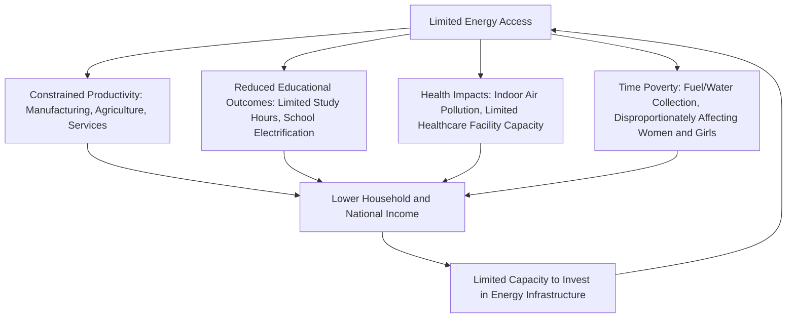

## Energy Poverty and Macroeconomic Development Linkages

### Overview

Energy poverty—the lack of adequate access to modern, reliable, and affordable energy services—both reflects and reinforces broader macroeconomic underdevelopment, creating a bidirectional relationship between energy access and economic growth. Understanding this linkage is central to development economics and energy policy, since inadequate energy access constrains productivity, education, health outcomes, and structural economic transformation, while underdevelopment itself limits the investment capacity needed to expand energy access.

**Key Points**

- Energy poverty is typically measured across multiple dimensions: access (connection to electricity/clean cooking), reliability (outage frequency and duration), and affordability (cost relative to household income)
- The relationship between energy access and economic development runs in both directions, creating potential poverty traps where limited energy access and limited economic development mutually reinforce each other
- Energy access has documented effects on education outcomes, health outcomes, gender-differentiated time use, and small business/informal sector productivity
- Electrification programs show measurable but sometimes more modest economic impacts than early theoretical predictions suggested, an evolving area of empirical development economics research
- Universal energy access remains a globally recognized development priority, formalized as Sustainable Development Goal 7 (SDG7), though progress varies substantially across regions

### Defining and Measuring Energy Poverty

#### Access Dimension

- **Electricity access**: typically measured as the percentage of population with a household electricity connection, though this headline measure can mask substantial variation in connection quality, reliability, and consumption capacity
- **Clean cooking access**: measured as the percentage of population with primary reliance on clean cooking fuels and technologies (as opposed to traditional biomass, coal, or kerosene combined with inefficient stoves), a dimension that receives less public attention than electrification despite affecting a comparably large or larger global population

#### Reliability Dimension

- Even where nominal electricity access exists, frequent outages, voltage fluctuations, and limited hours of supply can substantially undermine the economic and welfare benefits typically associated with electrification, a distinction sometimes described as the difference between "access" and genuinely "reliable" service
- Businesses in areas with unreliable grid supply often invest in backup generation (diesel generators), representing a significant additional cost burden that reduces the competitiveness benefit electrification is theoretically expected to provide

#### Affordability Dimension

- Even where physical access exists, energy costs relative to household income can constrain actual consumption, sometimes described in advanced-economy contexts as "fuel poverty," typically measured through metrics comparing energy expenditure to income or to a poverty-line threshold
- Multidimensional energy poverty indices increasingly attempt to combine access, reliability, and affordability dimensions into composite measures, recognizing that any single dimension alone provides an incomplete picture

### The Bidirectional Development-Energy Relationship

This circular relationship is sometimes described as an energy poverty trap: limited energy access constrains the economic growth that would otherwise generate the resources needed to expand energy access, requiring external intervention (public investment, development finance, targeted subsidies) to break the cycle rather than assuming market-driven growth will resolve it organically over time. [Inference: this poverty trap framing is a standard conceptual model used in development economics literature; the strength of the causal linkages and the necessity of external intervention versus market-driven resolution is debated and likely varies by specific country and sectoral context]

### Documented Channels of Impact

#### Productivity and Structural Transformation

- Reliable electricity access enables mechanization and productivity improvements in manufacturing and services that are difficult or impossible with manual or animal-powered alternatives, supporting the structural transformation from subsistence agriculture toward higher-productivity manufacturing and services that is a hallmark of economic development
- Small and informal businesses, which constitute a substantial share of employment in many developing economies, are particularly affected by unreliable electricity, since they typically lack the capital to invest in backup generation that larger formal enterprises can afford
- Agricultural productivity can be affected through irrigation pump access, cold storage availability (reducing post-harvest crop loss), and processing capability, each of which depends on reliable energy access

#### Education Outcomes

- Electrification has been associated in various empirical studies with increased study time (through lighting extending usable hours after dark) and improved school infrastructure capacity (computer access, refrigeration for school feeding programs, connectivity)
- The magnitude of measured educational impact varies considerably across studies and contexts, and some more recent rigorous impact evaluations have found more modest effects than earlier, less rigorously identified studies suggested, reflecting broader methodological evolution in development economics toward more credible causal identification strategies [Inference: this reflects the well-documented evolution of the electrification impact evaluation literature, which has moved toward more rigorous randomized and quasi-experimental designs that in several cases found smaller effects than earlier correlational studies; specific study findings vary and should be assessed individually]

#### Health Outcomes

- Reliance on traditional biomass and solid fuel cooking is a major source of household air pollution, with documented associations to respiratory illness and other health conditions, particularly affecting women and children who typically spend more time near cooking areas in many household structures
- Electrification of healthcare facilities enables refrigeration for vaccines and medicines, lighting for after-hours care and procedures, and powering of diagnostic and treatment equipment, each contributing to healthcare service quality and availability
- The World Health Organization and other international health bodies have highlighted household air pollution from traditional cooking fuels as a substantial global health burden, though precise mortality and morbidity attribution estimates involve significant methodological complexity and have been revised over time as research methods have evolved [Unverified: specific current global health burden estimates should be verified against current WHO publications, as these figures are periodically revised]

#### Gender-Differentiated Time Use Effects

- In many contexts, women and girls disproportionately bear the burden of fuel and water collection where modern energy access is limited, representing substantial time costs that constrain time available for education, income-generating activities, or leisure
- Clean cooking access and electrification have been associated in various studies with reduced time burden for these activities, potentially freeing time for other productive or educational uses, though the magnitude of this effect and its translation into measurable economic or educational outcomes varies across specific study contexts

### Sustainable Development Goal 7 (SDG7) Framework

SDG7 establishes the global policy framework target of ensuring access to affordable, reliable, sustainable, and modern energy for all, with specific targets addressing:

- Universal access to electricity and clean cooking fuels/technologies
- Substantially increased share of renewable energy in the global energy mix
- Doubling the global rate of improvement in energy efficiency
- Enhanced international cooperation to facilitate access to clean energy research, technology, and investment, particularly for developing countries and least developed countries

Progress tracking toward SDG7 targets is coordinated internationally, with periodic tracking reports published jointly by international agencies (including the International Energy Agency, International Renewable Energy Agency, UN Statistics Division, World Bank, and World Health Organization), documenting substantial regional variation in progress, with certain regions (notably parts of Sub-Saharan Africa) showing continued significant electrification and clean cooking access gaps relative to global averages. [Unverified: specific current progress figures and regional statistics should be verified against the most recent SDG7 tracking report, as these are updated annually and figures in this response should not be treated as current data]

### Electrification Program Design and Evidence

#### Grid Extension vs. Off-Grid/Decentralized Solutions

| Approach | Typical Context | Key Trade-offs |
| --- | --- | --- |
| Central grid extension | Higher-density areas, closer to existing infrastructure | Higher reliability potential, but high upfront capital cost and longer implementation timelines for remote areas |
| Mini-grids | Village or cluster-level, moderate density remote areas | Faster deployment than grid extension, can incorporate renewable generation, but requires local operational and maintenance capacity |
| Solar home systems / off-grid solar | Very remote, low-density, or difficult-terrain areas | Fastest deployment, lowest upfront infrastructure need, but typically provides lower power capacity than grid or mini-grid connections |

- The appropriate technology choice depends substantially on population density, distance from existing grid infrastructure, anticipated demand growth, and available financing, meaning there is no universally optimal electrification technology approach independent of local context
- Off-grid and decentralized renewable solutions (particularly solar) have become increasingly cost-competitive for last-mile electrification in remote areas, changing the economics of electrification planning relative to earlier decades when grid extension was the dominant available technology option

#### Evidence on Economic Impact Magnitude

- A body of rigorous impact evaluation literature (including randomized controlled trials and quasi-experimental studies) examining household and microenterprise electrification impacts has found meaningfully positive but often more modest effects on income, employment, and business outcomes than earlier theoretical or correlational literature suggested
- This evolving evidence base has led to more nuanced policy conclusions: electrification is generally understood as a necessary but not independently sufficient condition for economic development, requiring complementary investments (access to credit, markets, skills, and other infrastructure) to fully translate into productivity and income gains [Inference: this reflects a widely-discussed pattern in the development economics literature regarding electrification impact evaluations; specific quantitative effect sizes vary substantially across studies and contexts and should be assessed individually rather than generalized into a single figure]

### Illustrative Example: Energy Poverty Trap Dynamics

Consider a stylized rural community with no grid electricity access, reliant on kerosene lighting and traditional biomass cooking.

1. Limited lighting hours constrain evening study time for children and limit small business operating hours (e.g., a shop cannot remain open after dark)
2. Traditional cooking fuel reliance requires substantial daily time for fuel collection, disproportionately falling on women and girls, reducing time available for schooling or income-generating activities
3. Limited local economic activity generates limited local tax base and household savings capacity, constraining both public and private capacity to invest in electrification infrastructure
4. Without external intervention (public investment, development finance, or a substantial private investment incentive), the community may remain in a persistent low-energy, low-income equilibrium despite the theoretical productivity gains electrification could provide

This stylized example illustrates why energy access is frequently treated as a public investment and development finance priority rather than left solely to market-driven electrification based on projected consumer willingness to pay, since the poverty trap dynamic can prevent market signals alone from generating sufficient investment in low-income, low-density areas. [Inference: this is an illustrative stylized narrative constructed to demonstrate the standard poverty trap conceptual framework, not a description of a specific documented case]

### Common Pitfalls and Misconceptions

- Assuming electrification alone automatically generates substantial economic development, when rigorous recent evidence suggests effects are often more modest than earlier theoretical predictions and depend on complementary investments
- Focusing exclusively on electricity access statistics while overlooking clean cooking access, which affects a comparably large global population and carries substantial health implications
- Treating "access" (having a connection) as equivalent to genuinely reliable, adequate energy service, when outage frequency and limited supply hours can substantially undermine the economic and welfare benefits electrification is expected to provide
- Assuming a single electrification technology (grid extension) is universally appropriate, when population density, geography, and financing availability make different technology choices appropriate in different contexts
- Overlooking gender-differentiated impacts of energy poverty, particularly time burden effects from fuel and water collection, which represent a substantial and unevenly distributed cost of inadequate energy access

**Related Topics**

- SDG7 tracking methodology and regional progress patterns
- Mini-grid and off-grid solar electrification technology and financing models
- Household air pollution health impact assessment methodology
- Randomized controlled trial evidence on electrification economic impacts
- Energy subsidies and affordability policy design
- Gender and energy access: time use and empowerment linkages
- Structural transformation theory in development economics
- Development finance institutions and energy access investment
- Clean cooking technology transition programs and barriers
- Rural versus urban energy access disparities and policy responses