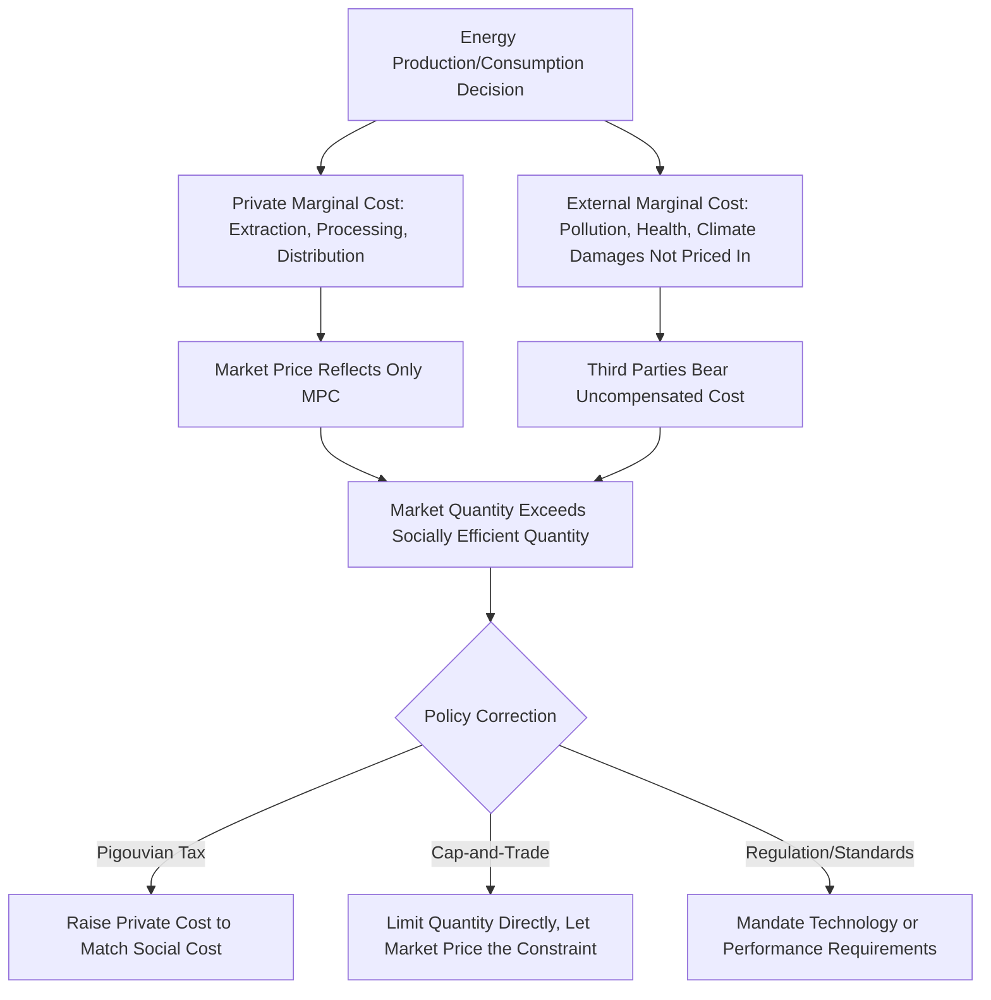

## Externalities from Energy Production and Combustion

### Overview

Externalities from energy production and combustion are costs (or, less commonly, benefits) borne by third parties not directly involved in the energy transaction, arising because market prices for energy typically fail to reflect the full social cost of production and use. This divergence between private and social cost is foundational to environmental economics of energy and provides the core theoretical justification for policy interventions including carbon pricing, emissions regulations, and subsidies for cleaner alternatives.

**Key Points**

- Negative externalities from energy arise across the full lifecycle: extraction, processing, transportation, combustion, and waste disposal, not solely at the point of end-use combustion
- The gap between private marginal cost (what producers/consumers pay) and social marginal cost (including externality damages) leads to socially excessive production and consumption absent correction
- Externality valuation, particularly the social cost of carbon, involves significant methodological and ethical judgment calls that produce a wide range of defensible estimates
- Pigouvian taxation (pricing externalities directly) and cap-and-trade systems represent the two dominant market-based policy approaches to internalizing externalities
- Local/regional externalities (air pollution, water contamination) and global externalities (climate change) require different policy geographic scope and present distinct political economy challenges

### The Core Externality Framework

#### Private vs. Social Marginal Cost

$$MSC = MPC + MEC$$

where $MSC$ is marginal social cost, $MPC$ is marginal private cost (what the producer/consumer actually pays), and $MEC$ is marginal external cost (the uncompensated damage imposed on third parties).

In an unregulated market, production and consumption occur where marginal private cost equals marginal private benefit, resulting in a quantity $Q_{market}$ that exceeds the socially efficient quantity $Q_{efficient}$ where marginal social cost equals marginal social benefit—the standard graphical representation of market failure from negative externalities.

### Lifecycle Stages and Associated Externalities

#### Extraction and Upstream Production

- **Land use and habitat disruption**: surface mining, well pad construction, and associated infrastructure alter or destroy natural habitats, with biodiversity and ecosystem service costs generally not reflected in extraction economics
- **Water contamination and use**: hydraulic fracturing, mining operations, and conventional oil/gas production carry water contamination risks and often substantial water consumption in water-stressed regions, with cleanup and water-scarcity costs frequently externalized
- **Methane leakage**: fugitive methane emissions during natural gas extraction, processing, and transport represent a potent greenhouse gas externality, with methane's global warming potential substantially higher than CO2 over shorter time horizons, making leak detection and reduction a significant point of environmental economics and policy focus
- **Local air quality impacts**: extraction operations (particularly coal mining and certain oil/gas operations) can generate particulate matter and other local air pollutants affecting nearby communities

#### Processing and Transportation

- **Refining emissions**: refineries emit various air pollutants (sulfur dioxide, nitrogen oxides, particulate matter, volatile organic compounds) affecting local and regional air quality, historically concentrated disproportionately near refinery-adjacent communities
- **Transportation spill risk**: pipeline, rail, and marine transport of oil and gas carry spill risk with potentially substantial environmental cleanup costs and ecosystem damage that may not be fully internalized through insurance and liability mechanisms, particularly for low-probability, high-consequence events
- **Transportation emissions**: the energy used to transport fuels themselves generates additional emissions beyond those from the fuel's eventual combustion

#### Combustion

- **Greenhouse gas emissions**: CO2 and other greenhouse gases from fossil fuel combustion are the primary driver of anthropogenic climate change, representing a global externality since emissions anywhere contribute to warming affecting the entire planet, distinguishing it from the more geographically contained externalities discussed above
- **Local and regional air pollutants**: combustion generates particulate matter (PM2.5 and PM10), sulfur dioxide, nitrogen oxides, and other pollutants directly linked to respiratory and cardiovascular health outcomes in exposed populations, with documented health cost burdens that vary by pollutant, combustion technology, and population density/exposure near emission sources
- **Coal combustion externalities**: coal combustion for power generation has been extensively studied and generally found to carry among the highest externality costs per unit of energy produced among major fossil fuels, due to its higher carbon content per unit of energy and typically higher local air pollutant emissions compared to natural gas, though specific comparative magnitudes depend on combustion technology, pollution control equipment, and the specific health/environmental valuation methodology applied [Inference: the general ranking of coal as carrying higher externality costs than natural gas per unit of energy is well-supported across multiple studies; precise quantitative magnitudes vary by study methodology and should be treated as estimates rather than precise figures]

#### Waste and End-of-Life

- **Ash and waste disposal**: coal combustion generates substantial ash waste requiring disposal, with contamination risk to groundwater and surrounding ecosystems if not properly managed
- **Nuclear waste**: nuclear power generates long-lived radioactive waste requiring specialized, long-duration storage and management, representing an externality cost spanning far longer timeframes than most other energy waste streams
- **Decommissioning liabilities**: end-of-life decommissioning of power plants, wells, and mining sites carries costs that, if inadequately provisioned for during the operating life of the asset, can be passed to governments or communities rather than fully borne by the original operator

### The Social Cost of Carbon

#### Definition and Methodology

The social cost of carbon (SCC) represents the estimated monetary value of the damage caused by emitting one additional ton of CO2 (or CO2-equivalent), intended to capture the present value of all future damages from that marginal emission, discounted back to present value.

$$SCC = \sum_{t=0}^{T} \frac{D_t}{(1+r)^t}$$

where $D_t$ represents the monetized climate damage in year $t$ attributable to the marginal ton of emissions, $r$ is the discount rate, and $T$ is the time horizon considered (often extending many decades or longer given the long atmospheric lifetime of CO2).

#### Sources of Estimate Variation

SCC estimates vary substantially across studies and institutions due to several genuinely contested methodological choices rather than simple calculation errors:

- **Discount rate selection**: lower discount rates weight future damages more heavily relative to present costs, producing higher SCC estimates; the appropriate discount rate for long-horizon, intergenerational climate damages is a subject of substantial and unresolved debate among economists, involving both empirical questions (about real interest rates) and ethical questions (about how to weigh the welfare of future generations)
- **Damage function specification**: different integrated assessment models (IAMs) used to estimate SCC embed different assumptions about how physical climate changes translate into economic damages, with some models criticized for potentially underestimating catastrophic or tail-risk damages
- **Equity weighting**: some approaches apply different valuation weights to damages occurring in different regions or income levels, reflecting judgments about the relative social value of harm to different populations, while other approaches use a single global valuation
- **Scope of damages included**: estimates vary in which damage categories are explicitly monetized (agricultural productivity, sea level rise, health impacts, ecosystem damage, migration, conflict risk) versus omitted due to quantification difficulty, with the latter representing a likely systematic underestimate of total damages in most models

Given this range of methodological choices, published SCC estimates have varied by an order of magnitude or more across different studies and time periods, and any specific figure should be understood as reflecting particular modeling choices rather than a single, objectively correct value. [Unverified: specific current official SCC figures used by various government agencies change periodically as models and guidance are updated; current figures should be verified against the relevant current regulatory or scientific source if a specific number is needed]

### Local vs. Global Externality Policy Implications

| Dimension | Local/Regional Externalities (e.g., air pollution) | Global Externalities (e.g., climate change) |
| --- | --- | --- |
| Geographic scope of damage | Concentrated near source | Diffuse globally regardless of emission location |
| Appropriate policy jurisdiction | Local, regional, or national regulation can be effective | Requires international coordination given free-rider incentives |
| Political economy challenge | Concentrated, identifiable affected populations can mobilize politically | Diffuse global damages create weaker direct political constituency for any single jurisdiction's action |
| Typical policy tools | Emissions standards, local pollution taxes, technology mandates | Carbon pricing, international agreements, technology-forcing standards |
| Free-rider risk | Lower (local benefits accrue to acting jurisdiction) | Higher (any jurisdiction's climate benefit is shared globally regardless of who bears the mitigation cost) |

This distinction explains why local air pollution regulation has often advanced more readily in various jurisdictions than comprehensive climate policy: the benefits of local pollution control accrue directly and immediately to the regulating jurisdiction's own population, while climate mitigation benefits are shared globally regardless of which jurisdiction bears the cost, creating a structural free-rider incentive that complicates unilateral climate action relative to local pollution control. [Inference: this represents a standard explanation in environmental economics and political economy literature for differential regulatory progress; specific country policy trajectories involve many additional factors beyond this general structural explanation]

### Policy Instruments for Externality Internalization

#### Pigouvian Taxation

- Directly prices the externality by imposing a tax equal to the estimated marginal external cost, theoretically restoring the efficient market outcome by aligning private cost with social cost
- Carbon taxes are the primary real-world application to greenhouse gas externalities, with the tax rate ideally calibrated to the social cost of carbon (though actual implemented rates in various jurisdictions often diverge from SCC estimates due to political and competitiveness considerations)
- Provides price certainty (the tax rate is known) but quantity uncertainty (the resulting emissions reduction depends on price responsiveness, which may be difficult to predict precisely in advance)

#### Cap-and-Trade Systems

- Sets a firm quantity limit (cap) on total emissions and allows market trading of emission allowances among regulated entities, letting the market determine the resulting price
- Provides quantity certainty (the cap directly limits total emissions) but price uncertainty (the market-clearing allowance price depends on abatement costs and cannot be precisely predicted in advance)
- The choice between carbon taxes and cap-and-trade involves a classic "prices versus quantities" trade-off in environmental economics, with the preferred instrument depending partly on whether policymakers prioritize cost certainty (favoring taxes) or environmental outcome certainty (favoring cap-and-trade), among other design considerations

#### Command-and-Control Regulation

- Direct regulatory standards (technology mandates, emissions performance standards, fuel efficiency requirements) address externalities without relying on price mechanisms
- Can be more politically feasible or administratively straightforward in some contexts than establishing a new pricing mechanism, but generally considered less economically efficient than well-designed market-based instruments since it does not allow abatement to occur where it is cheapest to achieve across different sources

### Illustrative Example: Comparing Externality-Inclusive Costs

Consider two hypothetical power generation sources, coal and natural gas combined-cycle, each generating the same quantity of electricity:

- **Private cost basis**: coal generation may show a lower or comparable private levelized cost of electricity depending on regional fuel prices and existing infrastructure
- **Externality-inclusive comparison**: once local air pollutant health costs and greenhouse gas emissions costs (using an SCC estimate) are added to each technology's private cost, natural gas generation typically shows a smaller total externality addition than coal, given its lower carbon content per unit of energy and generally lower local pollutant emissions per unit of electricity generated with comparable pollution control technology
- This externality-inclusive comparison is precisely the conceptual basis for policies (carbon taxes, emissions standards) intended to make the market price reflect this efficiency-relevant cost difference that private market prices alone do not capture

This illustrates the core purpose of externality-correcting policy: aligning the price signals guiding investment and dispatch decisions with the full social cost comparison, rather than only the private cost comparison that unregulated markets would otherwise use. [Inference: the general directional comparison (coal externalities exceeding natural gas externalities per unit of energy) is well-supported in the literature; specific quantitative magnitudes depend heavily on the specific technologies, pollution control equipment, and valuation methodology compared]

### Common Pitfalls and Misconceptions

- Treating externalities as limited to combustion/end-use emissions, when significant externalities also arise at extraction, processing, and transportation stages of the energy lifecycle
- Assuming the social cost of carbon is a single, objectively determined figure, when it reflects genuinely contested methodological and ethical choices producing a legitimate range of defensible estimates
- Conflating local air pollution externalities and global climate externalities as requiring identical policy approaches, when their differing geographic scope has significant implications for appropriate policy jurisdiction and political economy
- Assuming cap-and-trade and carbon taxes are functionally identical, when the prices-versus-quantities distinction creates meaningfully different risk profiles and policy trade-offs
- Overlooking that a technology can have lower per-unit externalities than an alternative while still carrying non-zero externality costs of its own (e.g., natural gas has lower emissions than coal per unit of energy but is not externality-free)

**Related Topics**

- Carbon pricing mechanisms: taxes versus cap-and-trade design comparison
- Integrated assessment models and social cost of carbon estimation methodology
- Air pollution health impact valuation and epidemiological methodology
- Methane emissions measurement and mitigation in oil and gas operations
- Pigouvian taxation theory and real-world implementation challenges
- Environmental justice and disproportionate externality exposure near energy infrastructure
- Nuclear waste management and long-duration liability economics
- Stranded asset risk and transition finance
- International climate policy coordination and free-rider problem
- Comparative lifecycle emissions analysis across energy sources