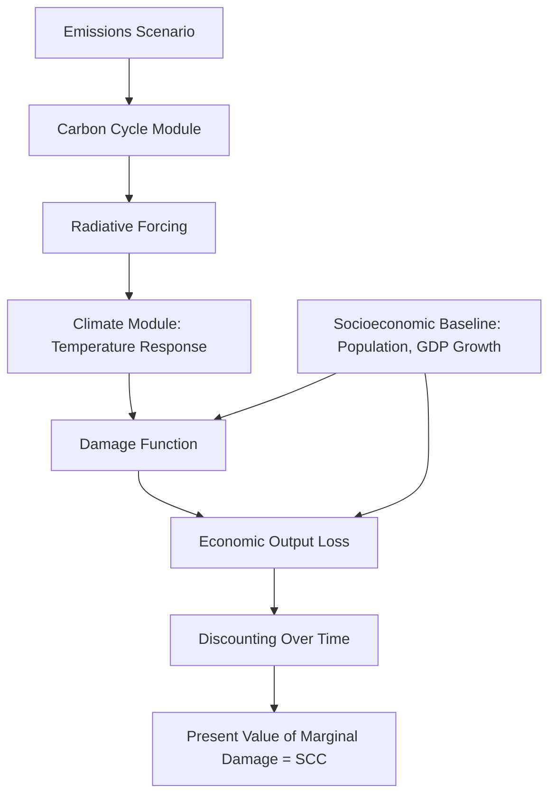

## Social Cost of Carbon and Other Pollutants

### Definition and Conceptual Foundation

The **social cost of carbon (SCC)** is the monetized value of the marginal economic damage caused by emitting one additional metric ton of carbon dioxide (or CO$_2$-equivalent) into the atmosphere, evaluated across the full time horizon over which that ton continues to affect the climate system. It is expressed in dollars per metric ton of CO$_2$ ($/tCO$_2$), typically referenced to a particular emission year.

Formally, the SCC in year $t$ is the discounted present value of all future marginal damages $D$ resulting from a unit pulse of emissions in year $t$:

$$SCC_t = \sum_{s=t}^{T} \frac{D_s(\Delta E_t)}{(1+r)^{s-t}}$$

where $\Delta E_t$ is a marginal unit of emissions released in year $t$, $D_s$ is the incremental damage occurring in year $s$ attributable to that unit, $r$ is the discount rate, and $T$ is the horizon over which damages are tracked (often extending centuries, given CO$_2$'s atmospheric residence time).

The SCC is the theoretical solution to a classic **negative externality**: because emitters do not bear the full cost of the climate damage their emissions cause, private marginal cost diverges from social marginal cost, leading to overproduction of emissions relative to the social optimum. The SCC is the Pigouvian correction — in principle, a carbon tax set equal to the SCC would internalize this externality and restore efficient output.

This concept generalizes to a broader family of **social cost of pollutants**, including the social cost of methane (SC-CH$_4$), nitrous oxide (SC-N$_2$O), and criteria air pollutants like SO$_2$, NO$_x$, and particulate matter (PM$_{2.5}$), each with damage functions specific to their atmospheric behavior and health/environmental pathways.

### Integrated Assessment Models (IAMs)

SCC estimates are derived primarily from **Integrated Assessment Models**, which couple simplified representations of the climate system with economic damage and growth models. The three most historically influential IAMs are:

- **DICE/RICE** (Dynamic Integrated Climate-Economy / Regional variant) — developed by William Nordhaus; uses a global (or regional) Ramsey-type optimal growth model coupled to a simple carbon-cycle and temperature module.
- **PAGE** (Policy Analysis of the Greenhouse Effect) — developed by Chris Hope; emphasizes uncertainty quantification via Monte Carlo simulation and includes discontinuity/catastrophe risk.
- **FUND** (Climate Framework for Uncertainty, Negotiation and Distribution) — developed by Richard Tol; disaggregates damages by region and sector (agriculture, health, sea-level rise, etc.).

**Core IAM structure:**

Each IAM requires four core components:

1. **Socioeconomic baseline** — projected population and GDP growth (often drawn from Shared Socioeconomic Pathways, SSPs).
2. **Emissions-to-concentration module** — a carbon-cycle model translating emissions into atmospheric concentrations.
3. **Concentration-to-temperature module** — a simplified climate model (often a two- or three-box energy balance model) computing radiative forcing and global mean temperature change, calibrated to reproduce the **equilibrium climate sensitivity (ECS)** distribution from full-complexity General Circulation Models.
4. **Damage function** — maps temperature change (and sometimes its rate) to fractional loss of GDP or specific sectoral damages.

A commonly cited DICE-style quadratic damage function takes the form:

$$D(T) = \frac{\Omega \cdot T^2}{1 + \Omega \cdot T^2}$$

or more simply $\Omega(T) = a_1 T + a_2 T^2$, where $T$ is global mean temperature increase above pre-industrial levels and $a_1, a_2$ are empirically calibrated coefficients. [Inference] The precise functional form and coefficients are a subject of active academic dispute, since damage functions are extrapolated from historical, low-warming data to high-warming regimes with limited empirical grounding.

### Key Determinants and Sensitivity of SCC Estimates

**1. Discount rate.** This is the single most consequential and contested parameter. Because carbon damages unfold over centuries, small changes in $r$ produce large changes in present-value SCC. Two philosophical approaches dominate:

- **Descriptive (positive) approach** — sets $r$ based on observed market rates of return (e.g., Nordhaus), typically yielding higher discount rates (~3–5%) and lower SCC values.
- **Prescriptive (normative) approach** — derives $r$ from ethical first principles using the **Ramsey rule**:

$$r = \rho + \eta \cdot g$$

where $\rho$ is the pure rate of time preference (weight placed on the welfare of future generations relative to the present), $\eta$ is the elasticity of marginal utility of consumption (a measure of relative risk/inequality aversion), and $g$ is the expected growth rate of per-capita consumption. The Stern Review (2006) famously used a near-zero $\rho$ (approximately 0.1%), producing much higher SCC estimates than Nordhaus's contemporaneous work, igniting a prominent methodological debate in the field.

**2. Equilibrium climate sensitivity (ECS).** The expected temperature increase from a doubling of atmospheric CO$_2$ concentration. Higher ECS draws imply larger temperature responses per ton emitted and thus higher SCC. ECS is characterized by a probability distribution (not a point estimate), and tail risk in this distribution matters disproportionately for SCC given convex damage functions.

**3. Damage function specification.** Whether the function captures only market-sector impacts (agriculture, energy demand) or also non-market damages (biodiversity loss, mortality, migration, conflict risk) and catastrophic/tipping-point risk substantially affects the estimate. [Inference] Many economists consider standard damage functions to understate risk because they are fit to historical data reflecting mild warming and cannot capture nonlinear tipping-point dynamics (e.g., ice sheet collapse, permafrost methane release).

**4. Equity weighting.** Whether damages in low-income regions/countries are weighted more heavily than an unweighted dollar aggregation would imply, reflecting the declining marginal utility of income.

**5. Socioeconomic and emissions baseline.** Population growth, technological change, and baseline (counterfactual) emissions trajectories.

### Official Estimates and Regulatory Use

In the United States, the **Interagency Working Group (IWG) on the Social Cost of Greenhouse Gases** has produced official SCC estimates used in federal regulatory cost-benefit analysis (e.g., fuel economy standards, power plant emissions rules) since 2010. Key milestones:

- **2010–2016 (Obama administration):** IWG estimates using DICE, PAGE, and FUND averaged, with a central value around $40–50/tCO$_2$ (2020$, 3% discount rate).
- **2017–2020 (Trump administration):** SCC recalculated using only domestic (not global) damages and higher discount rates (7%), reducing the value to roughly $1–7/tCO$_2$.
- **2021–2024 (Biden administration):** Interim value reverted to ~$51/tCO$_2$; EPA's 2023 update (incorporating updated science, near-term Ramsey discounting, and expanded damage categories) raised the central estimate to approximately **$190/tCO$_2$** (2020$, 2.5% near-term discount rate).

[Unverified] Because U.S. SCC policy is subject to administrative and judicial revision with each change in presidential administration, the applicable regulatory value at any given time should be confirmed against current EPA/OMB guidance rather than assumed static.

Other jurisdictions maintain their own shadow prices: the UK Green Book uses a carbon values approach tied to meeting national carbon budgets; Germany's Federal Environment Agency (UBA) publishes its own SCC-equivalent guidance; the EU relies more heavily on carbon market prices (EU ETS) as an implicit — though not necessarily welfare-optimal — carbon price signal for policy purposes.

### Social Cost of Non-CO$_2$ Pollutants

**Social cost of methane (SC-CH$_4$)** and **social cost of nitrous oxide (SC-N$_2$O)** are calculated analogously but require converting non-CO$_2$ greenhouse gases into climate-equivalent damage pathways, since these gases have different atmospheric lifetimes and radiative efficiencies than CO$_2$. Methane, for instance, has a much shorter atmospheric lifetime (~12 years) but a far higher instantaneous radiative forcing per molecule, making the choice of time horizon (20-year vs. 100-year Global Warming Potential) highly consequential for its social cost estimate. EPA's 2023 update placed SC-CH$_4$ at roughly $1,600–1,700/ton and SC-N$_2$O at roughly $54,000–56,000/ton (2020$), reflecting both higher potency and shorter persistence.

**Social cost of criteria air pollutants** (SO$_2$, NO$_x$, PM$_{2.5}$, ozone precursors) is conceptually distinct from the SCC in that these pollutants cause primarily **local and regional** damage (respiratory and cardiovascular illness, premature mortality, crop damage, visibility reduction) rather than global climate damage, and their damages do not depend on cumulative atmospheric stock but rather on local ambient concentration. These are typically estimated using:

- **Concentration-response functions** relating pollutant exposure to health outcomes (often derived from epidemiological studies, e.g., the American Cancer Society Cancer Prevention Study).
- **Value of a Statistical Life (VSL)** to monetize mortality risk reductions — a willingness-to-pay-based measure (U.S. EPA typically uses a VSL in the range of $7–11 million, updated periodically for income growth).
- Integrated damage-estimation tools such as EPA's **COBRA** (CO-Benefits Risk Assessment) model or the **AP2/APEEP** model, which spatially resolve emissions-to-exposure-to-damage pathways by source location.

A key distinguishing feature: because criteria pollutant damages are local, the social cost per ton varies enormously by **emission location** (a ton of PM$_{2.5}$ precursor emitted in a dense urban area causes far more health damage than the same ton emitted in a sparsely populated region), unlike CO$_2$, whose well-mixed atmospheric behavior makes its social cost effectively location-independent.

### Comparative Summary Table

| Pollutant | Damage Type | Spatial Scale | Key Valuation Method | Typical Time Horizon |
| --- | --- | --- | --- | --- |
| CO$_2$ | Climate (warming, sea-level rise, extreme weather) | Global | IAMs (DICE, PAGE, FUND) | Centuries |
| CH$_4$ | Climate + short-lived forcing | Global | IAMs adapted for GWP | Decades (short atmospheric life) |
| N$_2$O | Climate + stratospheric ozone depletion | Global | IAMs adapted for GWP | Century+ |
| SO$_2$/NO$_x$ | Respiratory/cardiovascular illness, acid rain, crop loss | Local/regional | Concentration-response + VSL | Immediate to short-term |
| PM$_{2.5}$ | Premature mortality, morbidity | Local/regional | Concentration-response + VSL | Immediate to short-term |

### Policy Applications

**1. Carbon taxation.** The theoretically "correct" Pigouvian carbon tax rate equals the SCC, internalizing the externality so that private and social marginal costs converge. In practice, implemented carbon taxes (e.g., Sweden's, at over $130/ton as of recent years) and carbon market prices (EU ETS, typically fluctuating in the $60–100/ton range) have often diverged substantially from SCC estimates, reflecting political feasibility constraints rather than pure efficiency calculations.

**2. Cost-benefit analysis of regulations.** SCC is used to monetize the climate benefit side of regulatory impact analyses — for example, quantifying the avoided climate damage from fuel efficiency standards, power plant emission limits, or building codes.

**3. Cap-and-trade calibration.** While cap-and-trade systems set quantity (the cap) rather than price directly, SCC estimates inform the stringency of the cap needed to align with efficient abatement levels, and can be used to set price floors/ceilings (as in California's cap-and-trade program).

**4. Social discounting debates in climate litigation and disclosure.** SCC estimates increasingly appear in corporate climate risk disclosure frameworks and in litigation contexts as a benchmark for "true cost" of emissions.

**Illustrative example:** A power plant burns coal and emits 1 million tons of CO$_2$ annually along with associated SO$_2$ and PM$_{2.5}$. Using an SCC of $190/tCO$_2$, the annual climate externality is:

$$\text{Climate externality} = 1{,}000{,}000 \times \$190 = \$190{,}000{,}000$$

If local SO$_2$/PM$_{2.5}$ damages (estimated via a tool like COBRA, incorporating the plant's specific location and population exposure) add, say, $25 million annually, the plant's **total uninternalized social cost** is approximately $215 million/year — a figure that would not appear on the plant's private balance sheet absent a carbon tax, emissions trading scheme, or environmental regulation forcing internalization.

### Critiques and Limitations

- **Deep uncertainty**: [Inference] Because SCC depends on compounding uncertain inputs (ECS distribution, long-run growth, damage function shape, discount rate), point estimates can vary by an order of magnitude or more across defensible modeling choices, and some economists argue point estimates convey false precision.
- **Tail risk and catastrophic damages**: Standard IAMs are frequently criticized (notably by economist Martin Weitzman, via the "dismal theorem") for inadequately capturing fat-tailed catastrophic risk, since quadratic damage functions calibrated on historical data may severely understate damages at high warming levels.
- **Ethical contestability of discounting**: The choice between descriptive and prescriptive discounting is fundamentally a value judgment about intergenerational equity, not a purely technical/empirical question — meaning reasonable analysts can disagree without either being "wrong" on the economics alone.
- **Domestic vs. global scope**: Whether a national government's SCC should reflect global damages (consistent with a cosmopolitan welfare standard) or only domestic damages (consistent with a narrower national self-interest standard) remains a live and administratively consequential policy question.

### SVG Diagram: Damage Function Convexity and Discounting Interaction

<svg xmlns="http://www.w3.org/2000/svg" viewBox="0 0 720 420" font-family="Helvetica, Arial, sans-serif">
<text x="360" y="24" text-anchor="middle" font-size="16" font-weight="bold" fill="#1a1a1a">SCC Damage Function vs. Temperature (svg_diagram)</text>
<line x1="60" y1="360" x2="680" y2="360" stroke="#333" stroke-width="2" />
<line x1="60" y1="360" x2="60" y2="50" stroke="#333" stroke-width="2" />

<text x="370" y="395" text-anchor="middle" font-size="13" fill="#333">Global Mean Temperature Increase (°C)</text>

<text x="25" y="200" text-anchor="middle" font-size="13" fill="#333" transform="rotate(-90 25 200)">Fractional GDP Damage</text>

<path d="M 60 360 Q 300 340 450 260 Q 600 160 680 60" fill="none" stroke="#c0392b" stroke-width="3" />
<text x="560" y="130" font-size="12" fill="#c0392b">Quadratic damage function D(T)</text>
<path d="M 60 360 Q 300 350 450 320 Q 600 280 680 220" fill="none" stroke="#e67e22" stroke-width="2" stroke-dasharray="6,4" />
<text x="500" y="300" font-size="12" fill="#e67e22">Linear damage assumption (underestimates tail)</text>
<line x1="150" y1="360" x2="150" y2="50" stroke="#999" stroke-width="1" stroke-dasharray="3,3" />
<text x="150" y="45" text-anchor="middle" font-size="11" fill="#666">1.5°C</text>
<line x1="330" y1="360" x2="330" y2="50" stroke="#999" stroke-width="1" stroke-dasharray="3,3" />
<text x="330" y="45" text-anchor="middle" font-size="11" fill="#666">2.0°C</text>
<line x1="550" y1="360" x2="550" y2="50" stroke="#999" stroke-width="1" stroke-dasharray="3,3" />
<text x="550" y="45" text-anchor="middle" font-size="11" fill="#666">4.0°C</text>
<rect x="480" y="70" width="180" height="60" fill="#fdf2e9" stroke="#e67e22" stroke-width="1" />
<text x="490" y="88" font-size="11" fill="#333">Tail-risk region:</text>
<text x="490" y="103" font-size="11" fill="#333">nonlinear/catastrophic</text>
<text x="490" y="118" font-size="11" fill="#333">damages (Weitzman critique)</text>
</svg>

### Next Steps

- **Carbon pricing instruments**: carbon taxes vs. cap-and-trade systems, price vs. quantity instrument choice under uncertainty (Weitzman's prices-vs-quantities framework)
- **Discounting in intergenerational welfare economics**: the Ramsey rule, pure time preference debates, Stern-Nordhaus controversy in depth
- **Integrated Assessment Model mechanics**: detailed walkthroughs of DICE, PAGE, and FUND model equations and calibration
- **Climate tipping points and catastrophic risk economics**: fat-tailed distributions, the Weitzman Dismal Theorem, planetary boundary economics
- **Value of a Statistical Life (VSL) and health damage valuation methods**
- **Border carbon adjustments and carbon leakage**: interaction between domestic carbon pricing and international trade competitiveness
- **EU Emissions Trading System (ETS) and cap-and-trade market design**
- **Environmental Kuznets Curve**: relationship between economic development and pollution intensity
- **Co-benefits of decarbonization**: air quality improvements from reduced fossil fuel combustion as a distinct valuation category