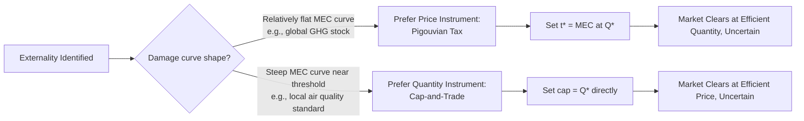

## Pigouvian Taxation Applied to Energy Externalities

### Theoretical Foundation

A **Pigouvian tax** is a tax levied on an activity that generates a negative externality, set equal to the marginal external cost of that activity at the socially efficient output level, so as to align private marginal cost with social marginal cost. The concept originates with Arthur C. Pigou's *The Economics of Welfare* (1920), which argued that when private and social costs diverge, laissez-faire markets systematically overproduce the externality-generating good.

In energy markets, the canonical case is fossil fuel combustion: the private marginal cost (PMC) faced by a producer or consumer reflects extraction, refining, and distribution costs, but excludes the marginal external cost (MEC) imposed on third parties through pollution, climate damage, or other spillovers. The social marginal cost (SMC) is:

$$SMC(Q) = PMC(Q) + MEC(Q)$$

Absent intervention, the market settles at $Q_{market}$, where $PMC = D(Q)$ (demand/marginal private benefit). The socially efficient quantity $Q^*$ occurs where $SMC(Q) = D(Q)$, which is lower than $Q_{market}$ whenever $MEC > 0$. The efficient Pigouvian tax rate $t^*$ is set equal to the marginal external cost evaluated at $Q^*$:

$$t^* = MEC(Q^*)$$

Imposing this tax shifts the effective private marginal cost curve upward by $t^*$, causing the market to internalize the externality and converge on $Q^*$.

### Graphical Intuition (SVG Diagram)

<svg xmlns="http://www.w3.org/2000/svg" viewBox="0 0 720 440" font-family="Helvetica, Arial, sans-serif">
<text x="360" y="24" text-anchor="middle" font-size="16" font-weight="bold" fill="#1a1a1a">Pigouvian Tax and Deadweight Loss Correction (svg_diagram)</text>
<line x1="70" y1="380" x2="670" y2="380" stroke="#333" stroke-width="2" />
<line x1="70" y1="380" x2="70" y2="50" stroke="#333" stroke-width="2" />
<text x="370" y="410" text-anchor="middle" font-size="13" fill="#333">Quantity of Energy (Q)</text>
<text x="30" y="215" text-anchor="middle" font-size="13" fill="#333" transform="rotate(-90 30 215)">Price / Cost ($)</text>
<line x1="120" y1="360" x2="620" y2="90" stroke="#2c3e50" stroke-width="2.5" />
<text x="630" y="85" font-size="12" fill="#2c3e50">PMC (Private MC)</text>
<line x1="120" y1="400" x2="620" y2="60" stroke="#c0392b" stroke-width="2.5" />
<text x="630" y="58" font-size="12" fill="#c0392b">SMC = PMC + MEC</text>
<line x1="120" y1="90" x2="620" y2="360" stroke="#27ae60" stroke-width="2.5" />
<text x="630" y="358" font-size="12" fill="#27ae60">Demand (MPB)</text>
<line x1="470" y1="380" x2="470" y2="130" stroke="#999" stroke-width="1" stroke-dasharray="4,3" />
<text x="470" y="395" text-anchor="middle" font-size="11" fill="#666">Q_market</text>
<line x1="330" y1="380" x2="330" y2="195" stroke="#999" stroke-width="1" stroke-dasharray="4,3" />
<text x="330" y="395" text-anchor="middle" font-size="11" fill="#666">Q*</text>
<path d="M 330 195 L 330 130 L 470 130 L 470 195 Z" fill="#e74c3c" fill-opacity="0.25" stroke="#e74c3c" stroke-width="1" />
<text x="400" y="165" text-anchor="middle" font-size="11" fill="#922b21">Deadweight loss</text>
<line x1="200" y1="325" x2="200" y2="290" stroke="#8e44ad" stroke-width="3" />
<text x="205" y="310" font-size="11" fill="#8e44ad">t* = tax wedge = MEC(Q*)</text>
</svg>

### Distinctive Features of Energy Externalities

Energy markets present several externality types requiring distinct Pigouvian treatment, since the mechanism, spatial scope, and marginal damage function differ substantially by pollutant and activity:

1. **Global stock externalities** — CO$_2$ and other well-mixed greenhouse gases, where marginal damage depends on cumulative atmospheric concentration rather than instantaneous flow, and damage is spatially uniform regardless of emission location (see the [[Social Cost of Carbon]] treatment for full derivation).
2. **Local/regional flow externalities** — SO$_2$, NO$_x$, PM$_{2.5}$, mercury from combustion, where damage depends on ambient concentration at the point of exposure, making the efficient tax rate location-specific.
3. **Energy security and geopolitical externalities** — dependence on imported fuel sources creating macroeconomic vulnerability not priced into private fuel costs. [Inference] Quantifying this externality is considerably more contested than pollution externalities, since it depends on assumptions about supply disruption probability and strategic value, and there is no broad economic consensus on a standard valuation methodology.
4. **Land-use and ecosystem externalities** — habitat disruption from extraction (mining, drilling, transmission corridors), water table depletion from fracking, land subsidence.
5. **Grid externalities** — congestion costs and reliability externalities from variable renewable generation, or from behind-the-meter self-generation reducing utility cost recovery (sometimes termed the "utility death spiral" concern) — these are second-order market design externalities rather than classic Pigouvian pollution externalities.

### Instrument Design in Practice

**Carbon taxes** are the most direct implementation of Pigouvian logic to energy. Design parameters include:

- **Tax base**: upstream (at point of fossil fuel extraction/import — administratively simplest, covers nearly all emissions with few taxpayers) vs. downstream (at point of combustion — more granular but administratively costlier).
- **Rate-setting rule**: fixed nominal schedule with pre-announced escalation (e.g., British Columbia's carbon tax, which began at CAD 10/ton in 2008 and has escalated on a legislated schedule), vs. dynamically linked to updated SCC estimates.
- **Revenue recycling**: lump-sum rebates to households (as in British Columbia and Canada's federal backstop, mitigating regressivity), reductions in distortionary taxes such as payroll or corporate tax ("tax swap," sometimes invoked under the **double dividend hypothesis** — the notion that a Pigouvian tax can simultaneously correct an externality and allow reduction of other distortionary taxes, improving efficiency on two margins), or dedicated green investment funding.

**Sector-specific excise-style Pigouvian taxes** implemented historically include:

- **Fuel excise taxes** partially justified on externality grounds (though often revenue-motivated and earmarked for infrastructure rather than calibrated to marginal damage).
- **Sulfur taxes** (e.g., Sweden's SO$_2$ tax, introduced 1991) directly targeting local/regional air pollution from fuel combustion.
- **NO$_x$ charges** (e.g., Sweden's NO$_x$ fee on large combustion plants, which is revenue-neutral via refund proportional to energy output, preserving the marginal incentive while avoiding a net industry cost burden).

### Comparison: Pigouvian Tax vs. Cap-and-Trade

Both instruments aim to internalize the same externality but differ in which variable is fixed directly:

| Dimension | Pigouvian Tax | Cap-and-Trade |
| --- | --- | --- |
| Variable fixed directly | Price (tax rate) | Quantity (emissions cap) |
| Emissions outcome | Uncertain, depends on marginal abatement cost | Certain (by design of the cap) |
| Price outcome | Certain (tax rate known ex ante) | Uncertain, depends on permit market |
| Revenue | Direct government revenue | Auction revenue (if permits auctioned) or free allocation (no revenue) |
| Administrative complexity | Lower (single rate to administer) | Higher (requires monitoring, registry, trading infrastructure) |
| Performance under cost uncertainty | Preferred when marginal damage curve is relatively flat (Weitzman's prices-vs-quantities result) | Preferred when marginal damage curve is steep relative to abatement cost curve |

Weitzman's (1974) prices-vs-quantities framework formalizes the choice: when the **marginal abatement cost curve** is uncertain but the **marginal damage curve** is relatively flat (as is approximately the case for a global stock pollutant like CO$_2$, since one year's emissions barely shift the damage trajectory), a price instrument (tax) minimizes expected welfare loss relative to a quantity instrument, because quantity instruments risk large price swings when abatement costs turn out higher or lower than anticipated. Conversely, when marginal damage rises steeply beyond a threshold (e.g., a hard local air-quality standard tied to health thresholds), a quantity instrument is preferred because it guarantees the environmental outcome regardless of abatement cost realization.

### Worked Numerical Example

Suppose a regional electricity market has a coal-fired generation fleet with the following simplified linear marginal cost and marginal external damage functions (in $/MWh, where $Q$ is measured in thousands of MWh/day):

- Private marginal cost: $PMC(Q) = 20 + 0.05Q$
- Marginal external damage: $MEC(Q) = 15$ (assume constant per-MWh damage for simplicity, reflecting a fixed emissions intensity per MWh and a fixed $/ton damage estimate)
- Demand: $D(Q) = 80 - 0.1Q$

**Step 1 — Market equilibrium (no tax):** Set $PMC(Q) = D(Q)$:

$$20 + 0.05Q = 80 - 0.1Q \implies 0.15Q = 60 \implies Q_{market} = 400$$

**Step 2 — Efficient quantity:** Set $SMC(Q) = D(Q)$, where $SMC(Q) = PMC(Q) + MEC = 35 + 0.05Q$:

$$35 + 0.05Q = 80 - 0.1Q \implies 0.15Q = 45 \implies Q^* = 300$$

**Step 3 — Efficient tax rate:** Since $MEC$ is constant, $t^* = 15$ $/MWh regardless of quantity.

**Step 4 — Verification:** With the tax applied, the effective private cost becomes $PMC(Q) + 15 = 35 + 0.05Q$, which is identical to $SMC(Q)$ — confirming the tax induces the market to select $Q^* = 300$, exactly correcting the 100-unit overproduction.

**Deadweight loss avoided** by the tax is the triangular area between $SMC$ and $D$ over the interval $[300, 400]$:

$$DWL = \frac{1}{2} \times (400-300) \times \left[SMC(400) - D(400)\right] = \frac{1}{2} \times 100 \times \left[55 - 40\right] = 750 \text{ (\$ thousand/day)}$$

### Political Economy and Implementation Challenges

- **Regressivity**: Energy taxes typically consume a larger budget share for lower-income households (since energy is a necessity with low income elasticity), making revenue recycling design politically and distributionally critical.
- **Carbon leakage and competitiveness**: Unilateral Pigouvian taxation of energy-intensive, trade-exposed industries can shift production (and emissions) to jurisdictions without comparable pricing, motivating border carbon adjustment mechanisms (e.g., the EU's Carbon Border Adjustment Mechanism, CBAM).
- **Salience and political durability**: Explicit taxes are more visible to voters than equivalent-cost regulatory mandates, which [Inference] some public choice economists argue makes Pigouvian taxes politically harder to sustain than functionally equivalent but less transparent regulations, despite the latter typically being less economically efficient.
- **Measurement and monitoring costs**: Accurately estimating MEC requires ongoing scientific and economic research (dose-response functions, VSL updates, evolving climate science), meaning the "correct" tax rate is a moving target rather than a fixed number set once.
- **Interaction with pre-existing tax distortions**: The **tax interaction effect** can offset some or all of a carbon tax's efficiency gain, since a new energy tax interacts with existing labor and capital taxes in the broader economy — a key qualifier to the double-dividend hypothesis noted above; the net welfare effect of revenue recycling depends on which pre-existing distortion the new revenue is used to reduce.

### Real-World Implementation Examples

| Jurisdiction | Instrument | Approx. Rate (recent) | Notable Design Feature |
| --- | --- | --- | --- |
| Sweden | Carbon tax | ~$130+/tCO$_2$ | One of the earliest (1991) and highest-rate carbon taxes globally |
| British Columbia, Canada | Carbon tax | ~CAD 80/tCO$_2$ | Revenue-neutral via personal/corporate tax cuts and rebates |
| Sweden | NO$_x$ charge | Per-kg fee | Refunded to payers proportional to energy output (preserves marginal incentive, zero net revenue) |
| Singapore | Carbon tax | SGD 25/tCO$_2$ (rising to SGD 50–80 by 2030) | Applies to large direct emitters above a threshold |
| Various U.S. states | Gasoline excise tax | Varies by state | Partially externality-justified but largely infrastructure-revenue motivated; rate rarely calibrated to actual MEC |

[Unverified] Specific current-year tax rates should be confirmed against the latest official government or World Bank Carbon Pricing Dashboard data, as these schedules are revised frequently and this table reflects rates as broadly reported in recent years rather than a real-time figure.

### Next Steps

- **Cap-and-trade system design**: allowance allocation methods (auctioning vs. grandfathering), banking and borrowing provisions, price collars
- **Border carbon adjustment mechanisms**: EU CBAM design and WTO compatibility questions
- **Double dividend hypothesis**: strong vs. weak form, tax interaction effects in general equilibrium
- **Distributional/regressivity analysis of carbon pricing**: incidence studies and rebate design (e.g., climate dividends)
- **Social cost of carbon and other pollutants**: deriving the MEC values that Pigouvian taxes are calibrated against
- **Weitzman's prices vs. quantities framework**: formal derivation under cost and benefit uncertainty
- **Fuel subsidy reform**: the mirror-image problem of negative Pigouvian pricing (subsidies exceeding externality-adjusted costs)
- **Environmental tax incidence**: statutory vs. economic incidence in energy markets with variable elasticities