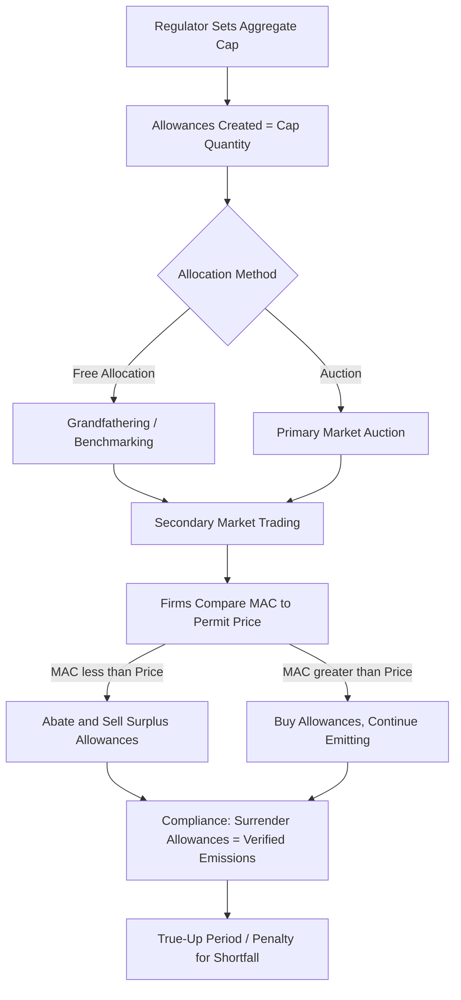
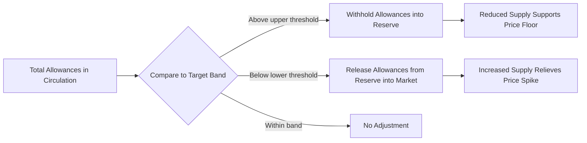

## Cap-and-Trade Systems and Emissions Trading Design

### Theoretical Foundation

**Cap-and-trade** (also termed emissions trading) is a market-based instrument for controlling a negative externality by fixing the aggregate quantity of a pollutant (the "cap") and allowing regulated entities to trade tradable permits (**allowances**) representing the right to emit a defined unit of that pollutant. Unlike a Pigouvian tax, which fixes price and lets quantity adjust (see [[Pigouvian Taxation Applied to Energy Externalities]]), cap-and-trade fixes quantity and lets price emerge from market clearing.

The theoretical justification rests on the **Coase Theorem** insight, formalized by Montgomery (1972): if property rights (emission allowances) are clearly defined and transaction costs are low, a competitive permit market will achieve the cost-minimizing allocation of abatement effort across heterogeneous emitters, regardless of the initial allocation of allowances. Firms with low marginal abatement cost (MAC) reduce emissions and sell surplus allowances; firms with high MAC buy allowances rather than abate, until marginal abatement costs are equalized across all regulated sources at the market-clearing permit price $P^*$:

$$MAC_1(q_1) = MAC_2(q_2) = \dots = MAC_n(q_n) = P^*$$

This **equimarginal principle** is the central efficiency result: the total abatement target is achieved at minimum aggregate cost, since abatement is undertaken wherever it is cheapest, and higher-cost abaters simply purchase allowances instead.

### Core Market Mechanics

**Key design components:**

1. **Cap-setting**: The regulator determines total allowable emissions for the compliance period, typically declining over time along a pre-announced trajectory to achieve a long-run reduction target.
2. **Allowance allocation**: Free allocation via **grandfathering** (based on historical emissions) or **benchmarking** (based on output-per-unit-emissions standards, which preserves incentives for efficient new entrants better than pure grandfathering), versus **auctioning**, where firms purchase allowances directly from the regulator.
3. **Monitoring, Reporting, and Verification (MRV)**: Robust MRV infrastructure is essential to trading system integrity — without credible verification of actual emissions, the environmental guarantee of the cap collapses regardless of market design quality.
4. **Compliance and true-up**: At the end of each compliance period, regulated entities must surrender allowances equal to verified emissions; shortfalls trigger penalties, often set well above the expected permit price to deter noncompliance.
5. **Registry infrastructure**: A centralized electronic registry tracks allowance ownership, transfers, and retirement, analogous to a securities settlement system.

### Allocation Methods in Detail

| Method | Mechanism | Efficiency Properties | Distributional Effect |
| --- | --- | --- | --- |
| **Grandfathering** | Free allowances based on historical emissions baseline | Achieves the same abatement efficiency as auctioning (per Coase/Montgomery result) since the *marginal* incentive to abate is identical regardless of allocation | Windfall profits to incumbent emitters; can raise entry barriers for new firms with no baseline |
| **Benchmarking** | Free allowances based on an output-based emissions-intensity standard (e.g., allowances per ton of steel or MWh produced) | Preserves output incentive better than grandfathering but can dull the incentive to reduce output as an abatement margin | Rewards efficient producers relative to sector average; still confers windfall value |
| **Auctioning** | Firms purchase allowances competitively from the regulator | Equivalent static efficiency to free allocation for the abatement decision; but generates government revenue and avoids windfall profits | No windfall; revenue can be recycled to offset other distortions or fund transition support |

An important, frequently misunderstood point: because the marginal cost of holding (versus selling) an allowance is its market price regardless of how it was obtained, firms behave identically at the margin whether allowances were given away or purchased. Free allocation therefore does **not** weaken the emissions-reduction incentive relative to auctioning — it only affects the distribution of scarcity rents. This is why the empirical debate over free allocation centers on windfall profits and competitiveness protection, not on environmental effectiveness.

### Price Stability Mechanisms

Because cap-and-trade fixes quantity, permit prices can be volatile if marginal abatement costs are uncertain or demand for allowances shifts (e.g., due to unexpected economic growth, fuel price changes, or weather). Common stabilization tools include:

- **Banking and borrowing**: Allowing firms to save unused allowances for future compliance periods (banking) or use future-period allowances against current obligations (borrowing, less common due to environmental integrity concerns) smooths price volatility across time and allows firms to respond to intertemporal cost-minimization opportunities.
- **Price floors**: A minimum auction reserve price below which allowances cannot be sold, preventing price collapse during periods of low abatement cost or demand shock (used in California's cap-and-trade program and the Regional Greenhouse Gas Initiative, RGGI).
- **Price ceilings / cost containment reserves**: A mechanism releasing additional allowances into the market if prices exceed a specified trigger, capping compliance costs (functions similarly to a "safety valve," blending some price-instrument characteristics into a quantity-based system).
- **Market Stability Reserve (MSR)**: The EU ETS's mechanism, which automatically withholds or releases allowances from/to the market based on the volume of allowances in circulation relative to a target band, addressing structural oversupply without requiring discretionary regulatory intervention.

### Major Real-World Systems

**EU Emissions Trading System (EU ETS)** — the largest and longest-running cap-and-trade system, launched 2005, covering power generation, industry, and (more recently) aviation and shipping within the EU/EEA. Structured in successive "phases" with progressively tightening caps and increasing auction share (moving from predominantly free allocation in Phase I toward majority auctioning in later phases). The Market Stability Reserve was introduced to address a large allowance surplus that had suppressed prices for years following the 2008 financial crisis.

**Regional Greenhouse Gas Initiative (RGGI)** — a U.S. Northeast/Mid-Atlantic state-level cap-and-trade program covering power sector CO$_2$ emissions, notable for auctioning nearly all allowances from inception (rather than free allocation) and recycling proceeds into state energy efficiency and consumer programs.

**California Cap-and-Trade Program** — covers a broad multi-sector base (power, industry, transportation fuels, natural gas distribution), linked with Quebec's system to form a joint carbon market; includes an auction price floor and price ceiling (via allowance price containment reserves), and permits limited use of **offsets** (verified emissions reductions from outside the capped sectors) for compliance, subject to quantitative limits and protocol-specific eligibility rules.

**China National ETS** — launched nationally in 2021 initially covering the power sector, using a benchmarking (intensity-based) allocation approach rather than an absolute cap, meaning total allowances scale with output — a structurally different design from the EU's absolute-cap approach. [Unverified] Sector coverage expansion (e.g., to steel, cement, aviation) has been under discussion; current sectoral scope should be verified against the latest Ministry of Ecology and Environment announcements, as this system has expanded incrementally since launch.

**U.S. Acid Rain Program (SO$_2$ trading)** — the historically foundational cap-and-trade program (established under the 1990 Clean Air Act Amendments) targeting SO$_2$ emissions from power plants, widely credited by economists as demonstrating that market-based instruments could achieve environmental targets at substantially lower cost than the command-and-control regulation it replaced.

### Worked Numerical Example: Equimarginal Cost Minimization

Consider two power plants subject to a joint cap, with linear marginal abatement cost curves:

- Plant A: $MAC_A(q_A) = 10 + 2q_A$ ($/ton, where $q_A$ = tons abated)
- Plant B: $MAC_B(q_B) = 5 + 0.5q_B$

Suppose uncontrolled emissions are 100 tons each (200 tons total), and the cap requires a total reduction of 60 tons (to 140 tons total), meaning $q_A + q_B = 60$.

**Cost-minimizing allocation** requires $MAC_A(q_A) = MAC_B(q_B)$:

$$10 + 2q_A = 5 + 0.5q_B$$

Substituting $q_B = 60 - q_A$:

$$10 + 2q_A = 5 + 0.5(60 - q_A) \implies 10 + 2q_A = 5 + 30 - 0.5q_A \implies 2.5q_A = 25 \implies q_A = 10$$

So $q_B = 50$. The market-clearing permit price is:

$$P^* = MAC_A(10) = 10 + 2(10) = 30 \text{ \$/ton}$$

Check: $MAC_B(50) = 5 + 0.5(50) = 30$ ✓ — confirming equimarginal cost minimization: Plant B (lower-cost abater) does the bulk of the abatement (50 tons) while Plant A (higher-cost abater) abates less (10 tons) and would purchase allowances to cover the remaining gap between its uncontrolled emissions and its actual abatement.

**Compare to a uniform command-and-control standard** requiring each plant to abate 30 tons (achieving the same 60-ton total reduction): Plant A's cost would be $\int_0^{30}(10+2q)dq = 300 + 900 = 1{,}200$, while Plant B's cost would be $\int_0^{30}(5+0.5q)dq = 150+225=375$, for a total of $1,575. Under the cost-minimizing trading allocation, total cost is $\int_0^{10}(10+2q)dq + \int_0^{50}(5+0.5q)dq = 200 + 875 = 1{,}075$ — a savings of $500, illustrating the efficiency gain from allowing trade rather than imposing a uniform abatement mandate.

### Offsets and Linkage

**Offsets** allow regulated entities to meet a portion of their compliance obligation using verified emissions reductions from sources outside the capped sectors (e.g., forestry, agriculture, methane capture at uncapped facilities). Offsets can lower overall compliance cost by tapping abatement opportunities outside the direct cap, but raise well-documented integrity concerns:

- **Additionality**: whether the offset project's emissions reduction would not have occurred absent the offset revenue (a persistent and difficult-to-verify requirement).
- **Permanence**: particularly relevant for forestry/land-use offsets, where sequestered carbon can be released by fire, disease, or land-use reversal.
- **Leakage**: whether protecting one area from deforestation (for instance) simply displaces the activity elsewhere.

**Linkage** refers to connecting two or more separate cap-and-trade systems (as with California and Quebec) so that allowances from either system are mutually valid for compliance in both. Linkage expands the effective size of the trading pool, which — per the equimarginal principle — further lowers aggregate abatement cost by widening the pool of MAC curves available for equalization, but requires substantial harmonization of MRV standards, penalty structures, and market oversight rules between the linked jurisdictions.

### Cap-and-Trade vs. Carbon Tax: Design Trade-offs Recap

| Dimension | Cap-and-Trade | Carbon Tax |
| --- | --- | --- |
| Emissions certainty | High (fixed by cap) | Low (depends on price responsiveness) |
| Price certainty | Low (market-determined) | High (set administratively) |
| Preferred under Weitzman framework when... | Marginal damage curve is steep | Marginal damage curve is relatively flat |
| Administrative complexity | Higher (registry, MRV, auction infrastructure, market oversight) | Lower (single rate applied at point of taxation) |
| Vulnerability to price volatility | Requires explicit stabilization tools (banking, floors, MSR) | Not applicable — price fixed by design |
| Revenue | Depends on allocation method (auction generates revenue; free allocation does not) | Direct and predictable revenue stream |

### Critiques and Limitations

- **Market power and manipulation risk**: A small number of large emitters holding disproportionate allowance shares could theoretically exercise market power over the permit price, though empirically this has been a modest concern in most implemented systems given diversified participant bases.
- **Price volatility**: Without stabilization mechanisms, permit prices can swing sharply with macroeconomic conditions (as seen in the EU ETS's multi-year price collapse following the 2008 recession, prior to MSR implementation), undermining the investment-signal value of the price for long-lived capital decisions.
- **Windfall profits under free allocation**: Firms receiving free allowances but passing through the opportunity cost of those allowances to consumer prices (as observed in EU ETS power sector pricing) can realize substantial windfall profits — a widely documented phenomenon in early EU ETS phases that motivated the shift toward auctioning.
- **Offset integrity**: [Inference] Persistent skepticism among environmental economists and NGOs regarding additionality verification suggests offset-heavy compliance strategies may overstate real-world emissions reductions in some programs, though the magnitude varies significantly by offset protocol and verification rigor.
- **Interaction with other policies**: Overlapping policies (e.g., renewable portfolio standards operating alongside a cap) can shift *where* abatement occurs without necessarily changing the total emissions outcome, since the binding cap — not the overlapping policy — determines the aggregate quantity; this is sometimes termed the **"waterbed effect."**

### Next Steps

- **Social cost of carbon and other pollutants**: the damage estimates informing efficient cap-setting
- **Pigouvian taxation applied to energy externalities**: the price-instrument alternative and Weitzman's prices-vs-quantities comparison
- **Border carbon adjustment mechanisms**: addressing leakage risk under unilateral cap-and-trade
- **Offset protocol design and additionality verification methodologies**
- **EU ETS Market Stability Reserve**: detailed mechanics and historical price impact
- **Renewable Portfolio Standards and Renewable Energy Certificates (RECs)**: a related but structurally distinct tradable-credit instrument
- **Command-and-control vs. market-based environmental regulation**: comparative cost-effectiveness literature
- **U.S. Acid Rain Program**: historical case study in cap-and-trade cost savings relative to projected command-and-control costs