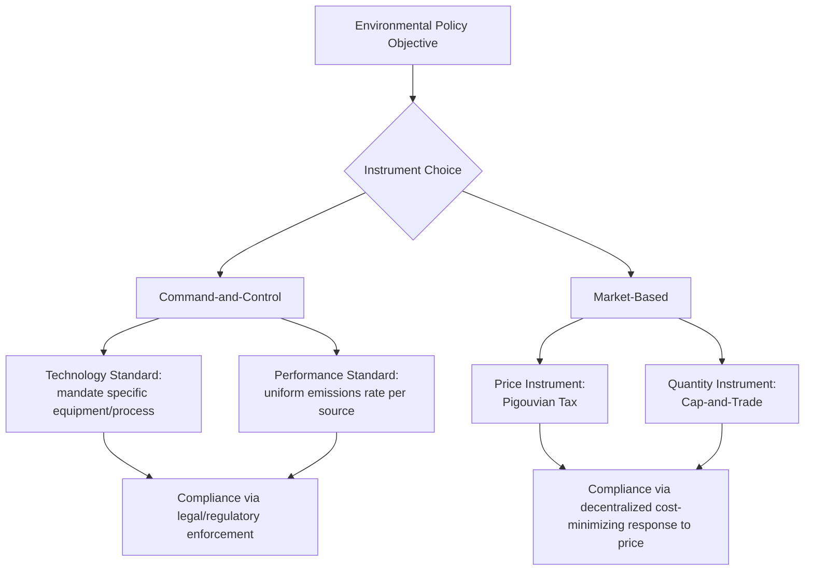
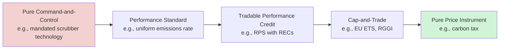

## Command-and-Control vs Market-Based Environmental Regulation

### Definitions and Conceptual Distinction

**Command-and-control (CAC) regulation** refers to environmental policy instruments in which a regulator directly mandates specific actions, technologies, or emissions limits for regulated entities, with compliance enforced through legal/administrative penalties rather than market price signals. **Market-based regulation** (also termed economic incentive-based or price/quantity instruments) instead alters the relative prices or creates tradable property rights so that self-interested economic actors are induced, through decentralized decision-making, to achieve a policy objective at lower aggregate cost.

The distinction maps onto two broad instrument families already covered in this chapter: Pigouvian taxes (see [[Pigouvian Taxation Applied to Energy Externalities]]) and cap-and-trade (see [[Cap-and-Trade Systems and Emissions Trading Design]]) are the canonical market-based instruments; CAC regulation instead specifies either a **technology standard** (mandating a specific abatement technology or input, e.g., requiring flue-gas desulfurization scrubbers) or a **performance standard** (mandating a uniform emissions rate or absolute limit per facility, without specifying the means of compliance).

### The Core Economic Critique of Command-and-Control

The central efficiency argument against uniform CAC standards is that they typically ignore heterogeneity in **marginal abatement cost (MAC)** across regulated firms. If a regulator imposes a uniform performance standard (e.g., "every facility must reduce emissions by 30%"), firms with low MAC are not incentivized to abate beyond the mandated level, while firms with high MAC bear a disproportionately large cost burden relative to what an equalized-marginal-cost allocation would require. This violates the **equimarginal principle**: aggregate abatement cost is minimized only when $MAC_1 = MAC_2 = \dots = MAC_n$ across all sources, a condition uniform standards do not generally satisfy unless, by coincidence, all firms share identical cost structures.

This is precisely the numerical result demonstrated in the [[Cap-and-Trade Systems and Emissions Trading Design]] worked example: a uniform 30-ton abatement mandate across two plants with differing MAC curves costs $1,575 in that example, versus $1,075 under a cost-minimizing tradable-permit allocation achieving the identical 60-ton aggregate reduction — a 32% cost saving purely from reallocating *where* abatement occurs, with no change in the environmental outcome.

**Additional standard critiques of CAC:**

- **No incentive for abatement beyond the standard**: Once a firm meets a technology or performance mandate, it has no further financial incentive to innovate or abate further, whereas under a tax or cap-and-trade, every ton of pollution carries a positive marginal cost (the tax rate or permit price) up to the point of full elimination, continuously rewarding further abatement and innovation.
- **Technology lock-in**: Technology standards in particular can freeze the regulated industry onto a specific compliance technology, discouraging the development or adoption of superior alternatives that emerge after the standard is set — sometimes termed the **"regulatory ratchet"** or innovation-stifling effect.
- **Informational burden on the regulator**: Setting an efficient uniform standard requires the regulator to know each firm's MAC curve in detail; market-based instruments instead let decentralized private information about cost structures reveal itself through firms' trading and abatement decisions, without the regulator needing to know individual MAC curves in advance.
- **Political economy of "grandfathering old sources"**: Many CAC frameworks (including major provisions of the U.S. Clean Air Act) impose stricter standards on new sources than existing ones (**New Source Review**), which can perversely incentivize firms to prolong the operating life of older, dirtier facilities rather than replace them with cleaner new capacity — an unintended consequence extensively documented in the environmental economics literature.

### The Case for Command-and-Control

Despite the efficiency critique, CAC regulation retains practical and normative advantages in specific circumstances, and dominates real-world environmental law more than pure market-based instrument advocacy might suggest:

1. **Administrative simplicity and enforceability**: A clear technology mandate ("install a scrubber meeting X specification") is often easier to monitor and enforce than a tradable-permit system requiring continuous emissions monitoring, a functioning registry, and market oversight infrastructure — particularly relevant in jurisdictions with limited regulatory capacity.
2. **Situations with few, easily identified point sources and low cost heterogeneity**: When regulated firms have similar cost structures (e.g., a narrow, technologically homogeneous industry), the efficiency loss from a uniform standard relative to trading is small, while the administrative savings from avoiding market infrastructure can be substantial.
3. **Addressing highly localized, acute hazards**: For pollutants with steep, threshold-driven local health effects (e.g., certain hazardous air pollutants near a specific facility), a hard technology or emissions-rate requirement at the specific source guarantees the local outcome directly, whereas a trading system could, in principle, allow a "hotspot" to persist if the selling and buying facilities are unevenly distributed in space — a documented concern in environmental justice critiques of cap-and-trade systems, since trading equalizes *aggregate* cost but not necessarily the *spatial distribution* of residual pollution.
4. **Situations with weak price responsiveness or market failure risk**: If a workable permit or tax market cannot be reliably established (thin markets, risk of manipulation, absent MRV infrastructure), a direct mandate may outperform a poorly functioning market-based system in practice, even if it is theoretically less efficient under idealized conditions.
5. **Non-economic or precautionary values**: Some regulatory objectives (e.g., banning a specific highly hazardous substance outright) are treated as involving values that resist marginal cost-benefit trade-offs — a "bright line" prohibition rather than an internalized-cost calculation, reflecting an ethical rather than purely allocative policy judgment. [Inference] This is a normative rather than strictly economic argument, and whether it should override efficiency considerations is a matter of policy philosophy rather than settled economic analysis.
6. **Distributional and environmental justice considerations**: Because market-based instruments allow abatement to concentrate wherever it is cheapest, communities near high-MAC (low-abating) facilities may bear a disproportionate pollution burden even as aggregate emissions decline — a concern that has shaped design debates (e.g., California's cap-and-trade program includes complementary CAC-style measures specifically to address local hotspot risk in disadvantaged communities).

### Comparative Summary Table

| Dimension | Command-and-Control | Market-Based Instruments |
| --- | --- | --- |
| Static cost-efficiency | Generally inefficient absent identical firm cost structures | Cost-minimizing via equimarginal principle |
| Dynamic efficiency (innovation incentive) | Weak — no incentive beyond compliance threshold | Strong — continuous marginal incentive to abate further |
| Informational requirements on regulator | High (must know or approximate each firm's MAC) | Low (market reveals cost information through trading/price response) |
| Administrative/monitoring complexity | Often lower (inspect for compliance with a fixed standard) | Often higher (MRV, registries, market oversight) or, for a tax, comparably low |
| Spatial/hotspot control | Direct and source-specific | Weaker — aggregate cap does not guarantee even spatial distribution |
| Political durability/transparency | High — visible, easily explained mandate | Variable — tax salience can invite political resistance; cap-and-trade complexity can obscure cost to voters |
| Historical prevalence | Dominant in most environmental statutes (e.g., much of the U.S. Clean Air Act, water quality permitting) | Growing since 1990s (SO$_2$ trading, EU ETS, carbon taxes), but layered atop, not replacing, most CAC frameworks |

### Illustrative Numerical Comparison

Extending the two-plant example from the cap-and-trade treatment: Plant A has $MAC_A(q_A) = 10 + 2q_A$ and Plant B has $MAC_B(q_B) = 5 + 0.5q_B$, with a required joint reduction of 60 tons.

**Uniform CAC standard (30 tons each):**

$$Cost_A = \int_0^{30}(10+2q)\,dq = 300 + 900 = 1{,}200 \qquad Cost_B = \int_0^{30}(5+0.5q)\,dq = 150+225=375$$

$$Total_{CAC} = 1{,}575$$

**Market-based (equimarginal) allocation** ($q_A=10$, $q_B=50$, at $P^*=\$30$/ton, as derived previously):

$$Total_{Market} = 200 + 875 = 1{,}075$$

$$\text{Cost savings from market-based instrument} = 1{,}575 - 1{,}075 = \$500 \;(\approx 32\%)$$

This numerical pattern — market-based instruments achieving the *same* environmental target at meaningfully lower aggregate cost — is the central quantitative argument economists raise in policy design debates, and has been empirically corroborated in real-world comparisons such as the U.S. Acid Rain Program (SO$_2$ trading), where realized compliance costs came in substantially below costs projected under the CAC-style alternatives originally proposed.

### Hybrid and Real-World Blended Approaches

In practice, most environmental regulatory regimes combine both approaches rather than choosing one exclusively:

- **U.S. Clean Air Act**: Establishes National Ambient Air Quality Standards (a CAC-style, health-based performance target) but implements the SO$_2$ Acid Rain Program (market-based cap-and-trade) as a specific compliance mechanism for one pollutant category, alongside technology-based New Source Performance Standards for others.
- **EU ETS with complementary directives**: The EU ETS (market-based) operates alongside industrial emissions directives that impose specific technology/performance requirements (e.g., Best Available Techniques, BAT) for facility permitting, meaning firms face both a carbon price *and* CAC-style technology conditions simultaneously.
- **California cap-and-trade with local toxics rules**: California layers its economy-wide cap-and-trade program with facility-specific CAC requirements (e.g., AB 617) specifically to prevent localized pollution hotspots that an aggregate cap alone would not address — a direct policy response to the environmental justice critique above.
- **Renewable Portfolio Standards (RPS) alongside carbon pricing**: An RPS is itself a hybrid — a quantity mandate (a CAC-style requirement that a minimum share of generation come from renewables) implemented via a tradable-credit market (RECs), illustrating that the CAC/market-based dichotomy is better understood as a spectrum of instrument design choices than a strict binary.

### Choosing Between Instruments: Decision Framework

Economic guidance for instrument choice generally weighs:

1. **Cost heterogeneity across sources** — high heterogeneity favors market-based instruments (larger efficiency gain from trade); low heterogeneity narrows the CAC efficiency penalty.
2. **Spatial uniformity of damage** — well-mixed pollutants (e.g., CO$_2$) are well-suited to aggregate trading since location doesn't affect damage; spatially concentrated, health-threshold pollutants favor source-specific CAC or spatially-differentiated trading zones.
3. **Monitoring feasibility** — market-based instruments require credible, cost-effective continuous emissions monitoring; where this is infeasible, CAC (based on periodic inspection or input specification) may be the only enforceable option.
4. **Marginal damage curve steepness relative to marginal abatement cost uncertainty** — per the Weitzman prices-vs-quantities framework covered under Pigouvian taxation, this consideration also bears on whether *within* the market-based family a price (tax) or quantity (cap-and-trade) instrument dominates.
5. **Institutional and political capacity** — jurisdictions lacking established market infrastructure, credible registries, or independent regulatory enforcement capacity may find CAC more practically implementable in the near term, even where a market-based instrument would be theoretically superior.

### Next Steps

- **Pigouvian taxation applied to energy externalities**: full price-instrument mechanics and worked examples
- **Cap-and-trade systems and emissions trading design**: full quantity-instrument mechanics, allocation methods, and price stability tools
- **Environmental justice and pollution hotspots**: spatial distribution concerns under aggregate market-based caps
- **New Source Review and regulatory ratchet effects**: unintended consequences of asymmetric CAC standards for new vs. existing facilities
- **Renewable Portfolio Standards and Renewable Energy Certificates**: hybrid quantity-mandate/tradable-credit design
- **Best Available Technology (BAT) standards in industrial permitting**
- **U.S. Acid Rain Program case study**: realized vs. projected compliance costs under trading vs. proposed CAC alternatives
- **Weitzman's prices vs. quantities framework**: formal treatment of instrument choice under uncertainty