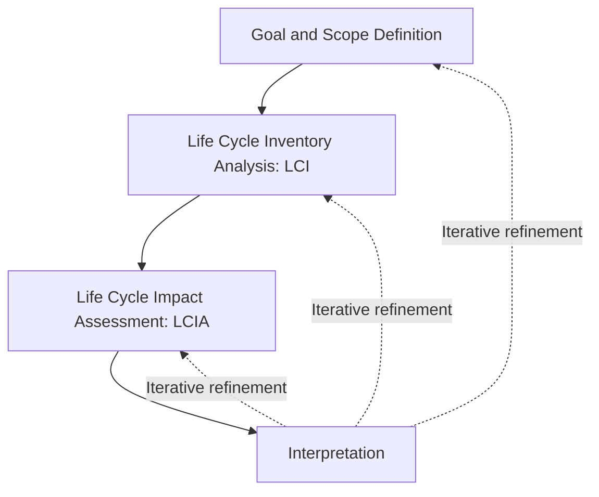

## Life-Cycle Assessment of Energy Sources

### Definition and Purpose

**Life-cycle assessment (LCA)** is a standardized methodology for quantifying the environmental impacts of a product, process, or system across its entire life span — from raw material extraction through manufacturing, transport, use, and end-of-life disposal or recycling (the **"cradle-to-grave"** scope, or **"cradle-to-cradle"** when recycling loops are included). Applied to energy sources, LCA answers a question that a simple point-of-use emissions comparison cannot: what is the *total* environmental burden of generating a unit of energy, once upstream (extraction, construction, manufacturing) and downstream (decommissioning, waste disposal) impacts are included, not merely the combustion or operational-phase emissions?

This distinction matters substantially in energy economics because policy comparisons based only on operational emissions can be misleading — for example, comparing "zero-emission" wind or solar generation to fossil fuels purely on combustion-stage emissions ignores the embodied emissions in turbine or panel manufacturing, while comparing nuclear power's operational emissions alone omits the mining, enrichment, and long-term waste management burdens.

The methodology is standardized internationally under **ISO 14040/14044**, which define four iterative phases:

1. **Goal and Scope Definition** — specifies the functional unit (the basis for comparison, e.g., "1 kWh of delivered electricity" or "1 GJ of primary energy"), system boundaries (which life-cycle stages are included/excluded), and the intended application of the study.
2. **Life Cycle Inventory (LCI)** — compiles a detailed inventory of all material and energy inputs and outputs (emissions, resource extraction, waste) across every process step within the system boundary.
3. **Life Cycle Impact Assessment (LCIA)** — translates the raw inventory data into aggregated environmental impact categories (e.g., global warming potential, acidification potential, eutrophication, human toxicity, land use) using characterization factors.
4. **Interpretation** — evaluates results for consistency, completeness, and sensitivity, and draws conclusions relative to the study's original goal.

### System Boundaries and Functional Units

Selecting the **functional unit** is the single most consequential methodological choice in comparative energy LCA, since it determines what basis different technologies are compared on. Common functional units include:

- **Per unit of delivered energy**: $/kWh or $/GJ of electricity or heat delivered to the end user (accounting for transmission and conversion losses) — the most common basis for cross-technology electricity comparisons.
- **Per unit of installed capacity**: relevant for comparing embodied construction-phase impacts independent of the operational profile (capacity factor) of the plant.
- **Per unit of service delivered**: for transport energy, this might be passenger-km or ton-km, accounting for vehicle efficiency alongside fuel-cycle impacts.

**System boundary scope** determines which stages are counted:

| Boundary Type | Stages Included |
| --- | --- |
| **Cradle-to-gate** | Raw material extraction through manufacturing, excluding use phase and disposal |
| **Cradle-to-grave** | Full life cycle including use phase and end-of-life disposal |
| **Cradle-to-cradle** | Cradle-to-grave plus recycling/material recovery loops back into new production |
| **Well-to-wheel** (transport fuels) | Fuel extraction/production ("well-to-tank") plus vehicle combustion/use ("tank-to-wheel") |

Inconsistent boundary choices across studies are a major source of apparent disagreement in published LCA literature; a headline comparison of "solar vs. coal emissions" is only meaningful if both studies use comparable boundaries (e.g., both cradle-to-grave, both normalized to delivered kWh, both using comparable capacity factor assumptions).

### Core Impact Categories Relevant to Energy

While **global warming potential (GWP)**, expressed as gCO$_2$-eq/kWh, is the most frequently cited energy LCA metric (directly relevant to the [[Social Cost of Carbon and Other Pollutants]] policy discussion), a comprehensive LCA evaluates multiple impact categories simultaneously:

- **Global Warming Potential (GWP)** — aggregated CO$_2$-equivalent emissions across the life cycle, using standardized 100-year (or alternative horizon) equivalency factors for CH$_4$, N$_2$O, and other greenhouse gases.
- **Acidification Potential** — SO$_2$- and NO$_x$-driven acid deposition impacts, particularly relevant to coal combustion life cycles and certain metal-smelting stages of renewable technology manufacturing (e.g., aluminum production for wind turbine components).
- **Eutrophication Potential** — nutrient loading of water bodies, relevant to biofuel feedstock cultivation (fertilizer runoff) and some mining wastewater streams.
- **Human Toxicity / Ecotoxicity Potential** — heavy metal releases (e.g., from coal ash, mining tailings, or certain photovoltaic cell manufacturing processes involving cadmium or lead compounds in some panel chemistries).
- **Land Use / Land Transformation** — area disturbed or converted per unit energy output, a category where biofuels and utility-scale solar/wind frequently score less favorably per unit of *energy density* than fossil or nuclear generation, despite favorable GWP performance.
- **Water Consumption/Withdrawal** — a critical category for thermoelectric generation (coal, nuclear, and natural gas plants using once-through or evaporative cooling), and for certain biofuel feedstocks with high irrigation requirements.
- **Resource Depletion (Abiotic Depletion Potential)** — consumption of finite mineral and metal resources, an increasingly emphasized category given the mineral intensity of renewable and battery-storage technologies (lithium, cobalt, rare earth elements, copper).

### Comparative Life-Cycle GWP Estimates by Technology

The following ranges synthesize commonly cited literature patterns (notably drawing on meta-analyses such as those compiled by the IPCC and NREL's harmonized LCA studies). [Unverified] Because published life-cycle GWP estimates vary considerably by study vintage, regional grid mix assumed for embodied manufacturing energy, and technology generation modeled, the figures below should be treated as illustrative order-of-magnitude ranges rather than precise, universally applicable values — current authoritative sources (e.g., IPCC AR6 WG3 annexes, NREL LCA Harmonization Project) should be consulted for specific study or policy applications.

| Energy Source | Approximate Life-Cycle GWP (gCO$_2$-eq/kWh) | Dominant Life-Cycle Stage(s) Contributing |
| --- | --- | --- |
| Coal (pulverized, no CCS) | ~800–1,000+ | Combustion (operational phase dominates overwhelmingly) |
| Natural gas (combined cycle) | ~400–500 | Combustion plus upstream methane leakage during extraction/transport |
| Solar photovoltaic | ~20–50 | Manufacturing (polysilicon production, panel assembly) — operational phase near-zero |
| Wind (onshore) | ~10–15 | Manufacturing and installation (steel, concrete, composite blades) |
| Wind (offshore) | ~10–20 | Manufacturing plus more intensive foundation/installation phase |
| Nuclear | ~10–15 | Uranium mining/enrichment and plant construction — operational phase near-zero |
| Hydropower | Highly variable, ~5–20 (run-of-river) to much higher for some reservoir hydro | Reservoir methane emissions from flooded biomass decomposition (site-specific, can be substantial in tropical reservoirs) |
| Biomass (varies substantially by feedstock and land-use assumptions) | Highly variable, sometimes higher than fossil comparators when land-use change is included | Feedstock cultivation, land-use change, and combustion |

Two points warrant emphasis regarding this table:

1. **Renewable and nuclear technologies are not literally zero-emission**; their life-cycle GWP is dominated by embodied manufacturing/construction emissions rather than an operational combustion stage, but the *magnitude* is roughly one to two orders of magnitude below unabated fossil combustion.
2. **Hydropower and biomass exhibit the widest variance** across the table, because their impacts are highly site- and feedstock-specific rather than driven by a relatively standardized industrial manufacturing process (as with solar panels or wind turbines) — reservoir hydro in tropical regions with substantial flooded biomass can, in some documented cases, approach or exceed fossil-fuel life-cycle emissions due to methane released from anaerobic decomposition of submerged vegetation, while temperate run-of-river hydro is typically very low-emission.

### Illustrative SVG: Life-Cycle Emissions Stage Contribution by Technology

<svg xmlns="http://www.w3.org/2000/svg" viewBox="0 0 720 420" font-family="Helvetica, Arial, sans-serif">
<text x="360" y="24" text-anchor="middle" font-size="15" font-weight="bold" fill="#1a1a1a">Life-Cycle Emission Stage Contribution by Technology (svg_diagram)</text>

<text x="20" y="70" font-size="12" fill="#333">Coal</text>

<rect x="90" y="55" width="30" height="20" fill="`#7f8c8d`" />

<rect x="120" y="55" width="480" height="20" fill="`#2c3e50`" />

<text x="610" y="70" font-size="10" fill="#333">Combustion dominant</text>

<text x="20" y="120" font-size="12" fill="#333">Natural Gas</text>

<rect x="90" y="105" width="50" height="20" fill="`#7f8c8d`" />

<rect x="140" y="105" width="260" height="20" fill="`#2c3e50`" />

<text x="410" y="120" font-size="10" fill="#333">Upstream leakage + combustion</text>

<text x="20" y="170" font-size="12" fill="#333">Solar PV</text>

<rect x="90" y="155" width="80" height="20" fill="`#7f8c8d`" />

<rect x="170" y="155" width="5" height="20" fill="`#2c3e50`" />

<text x="185" y="170" font-size="10" fill="#333">Manufacturing dominant; near-zero operational</text>

<text x="20" y="220" font-size="12" fill="#333">Wind</text>

<rect x="90" y="205" width="45" height="20" fill="`#7f8c8d`" />

<rect x="135" y="205" width="3" height="20" fill="`#2c3e50`" />

<text x="150" y="220" font-size="10" fill="#333">Manufacturing/installation dominant</text>

<text x="20" y="270" font-size="12" fill="#333">Nuclear</text>

<rect x="90" y="255" width="40" height="20" fill="`#7f8c8d`" />

<rect x="130" y="255" width="3" height="20" fill="`#2c3e50`" />

<text x="145" y="270" font-size="10" fill="#333">Mining/enrichment/construction dominant</text>

<text x="20" y="320" font-size="12" fill="#333">Reservoir</text>

<text x="20" y="335" font-size="12" fill="#333">Hydro</text>

<rect x="90" y="305" width="35" height="20" fill="`#7f8c8d`" />

<rect x="125" y="305" width="180" height="20" fill="`#16a085`" />

<text x="315" y="320" font-size="10" fill="#333">Highly site-specific reservoir methane</text>

<rect x="90" y="380" width="18" height="14" fill="#7f8c8d" />
<text x="115" y="392" font-size="11" fill="#333">Manufacturing/construction</text>
<rect x="320" y="380" width="18" height="14" fill="#2c3e50" />
<text x="345" y="392" font-size="11" fill="#333">Operational/combustion</text>
<rect x="530" y="380" width="18" height="14" fill="#16a085" />
<text x="555" y="392" font-size="11" fill="#333">Site-specific factor</text>
</svg>

### Energy Return on Investment (EROI) as an LCA-Adjacent Metric

**Energy Return on Investment (EROI)** measures the ratio of usable energy delivered by a source over its lifetime to the energy invested in extracting, processing, and converting it:

$$EROI = \frac{E_{output}}{E_{input}}$$

While not strictly an LCA impact category, EROI draws on the same life-cycle inventory data (energy inputs at each life-cycle stage) and is frequently reported alongside LCA results as a complementary indicator of net energy viability. A declining EROI for a given resource (e.g., documented declining EROI for conventional oil extraction as easily accessible reserves deplete and extraction shifts toward more energy-intensive unconventional sources) signals that a larger share of gross energy output must be reinvested merely to sustain extraction, reducing net energy available to the broader economy. [Inference] EROI comparisons across fundamentally different energy carriers (e.g., a dispatchable fuel vs. intermittent electricity) require care in interpretation, since the two are not perfect economic substitutes and a raw EROI ratio does not by itself capture dispatchability, storage requirements, or grid-integration costs.

### Comparative Multi-Criteria View and Trade-offs

A defining insight of comprehensive energy LCA is that **no energy source dominates across all impact categories simultaneously**, which is a central reason single-metric comparisons (especially GWP-only comparisons) can be policy-misleading:

- **Solar PV**: low operational GWP but non-trivial land use per unit energy (for utility-scale ground-mount installations) and mineral/resource depletion concerns tied to silver, silicon-refining energy intensity, and (for certain panel chemistries) cadmium telluride or other materials requiring end-of-life management.
- **Wind**: low GWP and modest land *footprint* (turbines occupy a small fraction of the land area within a wind farm's spatial extent, allowing co-located agricultural use) but raises concerns in specific impact categories such as rare-earth element depletion (permanent-magnet generators) and localized ecological impacts (avian/bat mortality, noted qualitatively in ecological impact assessments though not typically a formal LCIA impact category).
- **Nuclear**: very low operational GWP and modest land footprint per unit energy delivered, but carries distinct long-term radiological waste management considerations that fall outside standard LCIA impact categories and are typically assessed through separate risk-based frameworks rather than folded into a single aggregated LCA score.
- **Biomass**: potentially favorable GWP if grown and harvested sustainably with genuinely renewable feedstock cycling, but highly sensitive to land-use change assumptions — converting natural forest or grassland to bioenergy feedstock cultivation can produce a large one-time "carbon debt" that may take decades to repay through avoided fossil emissions, a widely discussed complication in biofuel policy LCA literature.
- **Natural gas**: substantially lower combustion-stage GWP than coal, but upstream fugitive methane emissions (a potent short-lived greenhouse gas) during extraction, processing, and pipeline transport can materially affect the full life-cycle comparison — the magnitude of this effect is sensitive to assumed leakage rates, which vary considerably by basin, extraction method, and measurement methodology, and remain an area of active empirical measurement and refinement (e.g., via satellite-based methane monitoring).

### Applications in Energy Policy

- **Comparative technology assessment**: informing renewable portfolio standard technology eligibility, green bond/taxonomy criteria (e.g., EU Taxonomy sustainable finance classification), and public R&D prioritization.
- **Embodied carbon accounting in carbon pricing design**: determining whether upstream (extraction-based) or downstream (combustion-based) points of regulation better capture full life-cycle emissions, relevant to the tax-base design question raised in Pigouvian carbon tax implementation.
- **Environmental Product Declarations (EPDs)** and eco-labeling: standardized, third-party-verified LCA-based disclosures increasingly required in public procurement and green building certification schemes.
- **Life-cycle-based emissions factors in Scope 3 corporate carbon accounting**: corporate greenhouse gas inventories under the GHG Protocol increasingly rely on supply-chain (upstream/downstream) LCA data for indirect emissions reporting.
- **Biofuel sustainability criteria**: regulatory frameworks such as the EU Renewable Energy Directive and the U.S. Renewable Fuel Standard incorporate life-cycle GWP thresholds (relative to a fossil comparator) as an eligibility criterion for biofuel credit generation, directly operationalizing LCA methodology within a market-based instrument (tradable biofuel credits).

### Critiques and Methodological Limitations

- **Data quality and regional specificity**: LCI databases (e.g., ecoinvent, GaBi) rely on process data that may be dated, regionally unrepresentative, or proprietary/non-transparent, introducing uncertainty that propagates through to final impact estimates.
- **Allocation problems in multi-output processes**: When a single process yields multiple co-products (e.g., a biorefinery producing both fuel and animal feed), allocating shared upstream burdens between co-products (by mass, energy content, or economic value) is methodologically contested and can materially shift results depending on the allocation rule chosen.
- **Temporal and technological representativeness**: LCA studies often rely on current or historical process data, which may not reflect anticipated future efficiency improvements (e.g., declining embodied energy in solar panel manufacturing as production scales and process efficiency improves), potentially overstating the relative burden of rapidly maturing technologies.
- **Boundary and functional unit inconsistency across studies**, as discussed above, complicates meta-analysis and cross-study comparison, a recurring critique in systematic literature reviews of energy LCA.
- **Single-score aggregation risk**: Reducing a multi-category LCIA result to a single weighted composite score (sometimes used for simplified public communication) necessarily embeds subjective value judgments about the relative importance of, say, climate impact versus toxicity versus land use — a normative weighting choice that a disaggregated multi-category presentation avoids.

### Next Steps

- **Social cost of carbon and other pollutants**: connecting life-cycle GWP estimates to monetized damage valuation
- **Energy Return on Investment (EROI) across resource types**: declining EROI trends in conventional fossil extraction
- **Renewable Portfolio Standards and biofuel sustainability criteria**: policy applications of LCA thresholds
- **Land-use change and the biofuel "carbon debt" literature**
- **Mineral resource depletion and critical minerals policy**: lithium, cobalt, and rare-earth supply chains for renewable/storage technology
- **Scope 1/2/3 corporate carbon accounting and the GHG Protocol**
- **Reservoir hydropower methane emissions**: site-specific measurement methodologies
- **Nuclear waste management and long-term radiological risk assessment frameworks**