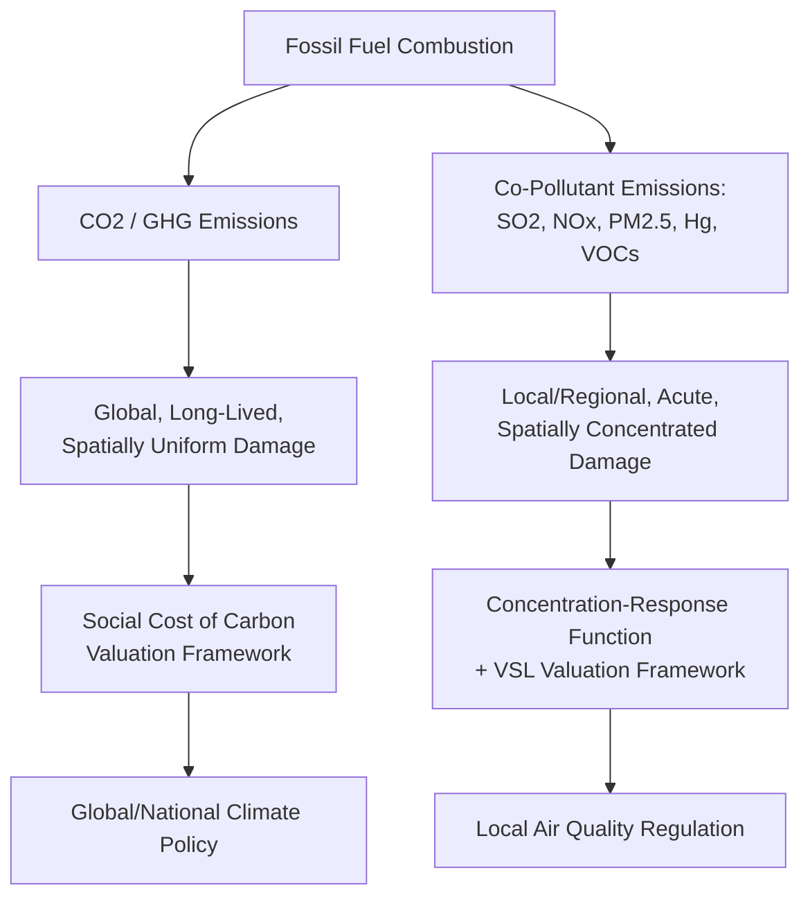

## Co-Pollutants and Local Environmental Health Economics

### Definition and Conceptual Framing

**Co-pollutants** are the pollutants emitted jointly with a primary target pollutant — typically CO$_2$ in the energy-economics context — as a byproduct of the same combustion or industrial process. When fossil fuels are burned for energy, the combustion process simultaneously releases greenhouse gases (the global, long-lived externality) and a suite of **criteria air pollutants**: sulfur dioxide (SO$_2$), nitrogen oxides (NO$_x$), fine particulate matter (PM$_{2.5}$ and PM$_{10}$), carbon monoxide (CO), volatile organic compounds (VOCs), and trace hazardous air pollutants (mercury, heavy metals). **Local environmental health economics** is the subfield concerned with quantifying and valuing the human health and welfare damages these co-pollutants cause, which — unlike the globally-diffused climate externality — accrue predominantly to populations near the emission source.

This distinction is economically consequential in three respects central to policy design:

1. **Spatial scope of damage**: Climate damage from a ton of CO$_2$ is (to a first approximation) independent of *where* it is emitted, since CO$_2$ is well-mixed in the global atmosphere. Co-pollutant damage is highly location-dependent, since ambient concentration — and therefore population exposure — depends on proximity, population density, prevailing wind patterns, and topography at the specific emission site.
2. **Temporal scope of damage**: Climate damages unfold over decades to centuries; co-pollutant health damages manifest largely within the same year or a few years of exposure (acute respiratory/cardiovascular events, though some effects, such as certain cancers, involve longer latency).
3. **Policy instrument implications**: Because co-pollutant damage is spatially concentrated rather than globally uniform, a nationally or globally uniform carbon price does not, by itself, guarantee an efficient outcome for co-pollutant exposure — a point directly connecting to the environmental justice and "hotspot" critique of aggregate cap-and-trade systems discussed in [[Command-and-Control vs Market-Based Environmental Regulation]].

### The Co-Benefits Concept

A central analytical result in this literature is that policies designed primarily to reduce CO$_2$ emissions — decarbonizing electricity generation, retiring coal plants, electrifying transport — simultaneously reduce co-pollutant emissions, generating **co-benefits** (also termed ancillary benefits) in the form of avoided local air pollution health damage. Because co-pollutant health damages are often valued using well-established, empirically robust epidemiological methods (relative to the more contested long-horizon climate damage functions underlying the SCC), co-benefit estimates frequently constitute a *substantial share* — in some published assessments, a majority — of the total monetized benefit of a given decarbonization policy, even before climate benefits are counted.

[Inference] This has an important strategic policy implication: because local air quality co-benefits accrue quickly, locally, and to identifiable current populations (unlike diffuse, long-horizon climate benefits), they are sometimes considered a more politically persuasive justification for decarbonization policy in some contexts, even though the underlying economic logic treats both as legitimate, additive components of total social benefit rather than substitutes.

### Valuation Methodology: The Damage Pathway Approach

Local environmental health economics typically employs a **damage pathway (impact pathway) approach**, tracing emissions through a sequence of physical and biological linkages to a final monetized damage estimate:

**Step-by-step mechanics:**

1. **Emissions inventory** — facility- or source-specific emissions of each co-pollutant, typically drawn from continuous emissions monitoring systems (CEMS) or engineering estimates.
2. **Atmospheric dispersion/transport modeling** — translates emissions at a stack location into predicted ambient concentration changes across a spatial grid of "receptor" locations, accounting for meteorology, plume rise, chemical transformation (e.g., SO$_2$ and NO$_x$ converting to secondary PM$_{2.5}$ through atmospheric chemistry), and terrain.
3. **Concentration-response function (C-R function)** — an empirically estimated relationship (typically derived from large cohort epidemiological studies, e.g., the American Cancer Society Cancer Prevention Study II or the Harvard Six Cities Study lineage of research) linking a unit change in ambient pollutant concentration to a probabilistic change in a health outcome (premature mortality, hospital admissions, asthma exacerbation, lost workdays).
4. **Economic valuation** — converts the physical health outcome change into a dollar damage estimate, predominantly via the **Value of a Statistical Life (VSL)** for mortality risk and **cost-of-illness** or **willingness-to-pay** estimates for morbidity outcomes.

### Value of a Statistical Life (VSL)

VSL is the standard economic metric for valuing small changes in mortality risk, and is **not** the value of any individual's life, but rather the aggregate willingness to pay across a population for a marginal reduction in mortality *risk*, divided by that risk reduction:

$$VSL = \frac{WTP_{individual}}{\Delta risk}$$

For example, if each of 100,000 people is willing to pay $50 for a policy that reduces their individual annual mortality risk by 1 in 100,000 (i.e., prevents on average 1 statistical death across the population), the implied VSL is:

$$VSL = \frac{\$50}{1/100{,}000} = \$5{,}000{,}000$$

VSL estimates are typically derived from either **revealed preference** studies (observing real-world trade-offs between wage premiums and occupational fatality risk, or safety-equipment purchase behavior) or **stated preference** (contingent valuation) surveys. U.S. EPA VSL guidance has historically centered in the range of roughly $7–11 million (varying by update year and income-adjustment methodology); [Unverified] the specific current value should be confirmed against the latest EPA guidance document, since VSL is periodically updated for income growth and revised meta-analytic evidence.

**Key VSL properties and critiques:**

- **Income elasticity**: VSL rises with income, both across countries (motivating debate over whether uniform global VSL or income-adjusted regional VSL should be used in international policy comparisons) and over time within a country (motivating periodic upward revision of VSL for real income growth).
- **Age-adjustment controversy**: Some analysts have proposed age-adjusted VSL (reflecting fewer expected remaining life-years for older populations, sometimes framed via a **Value of a Statistical Life-Year, VSLY**), a proposal that generated substantial public controversy when floated in a mid-2000s EPA analysis (sometimes termed the "senior death discount" in press coverage) and was subsequently withdrawn from standard regulatory practice.
- **Distinction from cost-of-illness**: VSL captures broader welfare loss (including pain, suffering, and foregone consumption/leisure) beyond narrow medical treatment costs, and is generally larger than a pure cost-of-illness estimate for the same health outcome.

### Concentration-Response Functions and Key Epidemiological Evidence

The dose-response relationship linking PM$_{2.5}$ exposure to premature mortality is among the most extensively studied relationships in environmental epidemiology, given its centrality to air quality regulatory cost-benefit analysis. A simplified log-linear C-R function form commonly used in regulatory impact assessments:

$$\Delta Mortality = Population \times Baseline\ Mortality\ Rate \times \left(1 - e^{-\beta \cdot \Delta C}\right)$$

where $\beta$ is an empirically estimated coefficient (derived from cohort studies) and $\Delta C$ is the change in ambient PM$_{2.5}$ concentration ($\mu g/m^3$). [Inference] The precise magnitude of $\beta$, and whether the C-R relationship remains linear at very low ambient concentrations or exhibits a threshold/non-linear shape, remains an area of ongoing epidemiological research and is not settled with the same degree of consensus as the qualitative direction of the relationship (higher PM$_{2.5}$ exposure increases mortality risk).

### Integrated Assessment and Screening Tools

Given the complexity of the damage-pathway chain, several standardized software tools have been developed to streamline co-pollutant damage estimation for policy analysis:

- **EPA's COBRA (CO-Benefits Risk Assessment)** — a screening-level tool combining simplified source-receptor dispersion matrices, EPA-endorsed C-R functions, and VSL to estimate health co-benefits of emissions changes, widely used in state-level air quality and energy policy analysis in the U.S.
- **AP2/APEEP (Air Pollution Emission Experiments and Policy analysis model)** — an academically developed integrated assessment model (originally by Nicholas Muller and Robert Mendelsohn) that computes source-specific, spatially resolved marginal damage estimates for criteria pollutants across the U.S., enabling damage-per-ton estimates that vary by *specific facility location* rather than a single national average.
- **InMAP (Intervention Model for Air Pollution)** — a reduced-complexity atmospheric chemistry and transport model enabling faster, spatially resolved estimation of PM$_{2.5}$ formation and exposure from emissions changes, used in academic and policy research settings requiring finer spatial resolution than simplified screening tools.
- **BenMAP-CE (Environmental Benefits Mapping and Analysis Program)** — EPA's detailed health benefits modeling platform, used in formal regulatory impact analyses for air quality rules, allowing user-specified concentration-response functions and detailed population/baseline health data inputs.

### Location-Specific Marginal Damage: A Worked Illustration

Because co-pollutant damage depends on population exposure at the specific emission site, the same ton of SO$_2$ or PM$_{2.5}$ precursor can generate vastly different damage estimates depending on location. Consider two hypothetical facilities emitting an identical quantity of PM$_{2.5}$ precursor:

- **Facility A** (dense urban location, population within damage radius = 2,000,000): marginal damage estimate $\approx$ $8,000–12,000/ton (illustrative range, reflecting high population exposure)
- **Facility B** (rural/remote location, population within damage radius = 20,000): marginal damage estimate $\approx$ $200–500/ton (illustrative range, reflecting low population exposure)

[Inference] This illustrative order-of-magnitude gap is broadly consistent with the qualitative pattern documented in the AP2/APEEP marginal damage literature — that co-pollutant marginal damages can vary by more than an order of magnitude across emission locations within a single country — though the specific numeric values above are illustrative rather than drawn from a specific verified source and should not be cited as precise figures. This spatial variance is the core economic rationale for **location-differentiated regulation** (e.g., stricter permitting requirements near dense populations) or **spatially-refined trading zones** rather than a single uniform national damage estimate or a single national trading market for co-pollutants.

### Comparative Table: Climate vs. Co-Pollutant Externality Characteristics

| Dimension | CO$_2$ / Climate Externality | Co-Pollutants (SO$_2$, NO$_x$, PM$_{2.5}$) |
| --- | --- | --- |
| Spatial scope | Global, uniform | Local/regional, highly location-dependent |
| Temporal scope | Decades to centuries (stock pollutant) | Acute, largely within same year (flow pollutant) |
| Primary valuation method | Integrated Assessment Models, discounted damage | Concentration-response function + VSL |
| Key uncertainty driver | Discount rate, climate sensitivity, damage function shape | Epidemiological dose-response coefficient, population exposure data |
| Efficient policy instrument implication | Uniform national/global price (tax or cap) is efficient regardless of emission location | Location-differentiated pricing or source-specific standards needed for full efficiency |
| Relevant standardized U.S. tool | IWG Social Cost of Greenhouse Gases | EPA COBRA, BenMAP-CE, AP2/APEEP |

### Environmental Justice Dimensions

Because co-pollutant exposure is spatially concentrated, and because the siting of fossil fuel infrastructure (power plants, refineries, compressor stations) has historically correlated with proximity to lower-income and minority communities in numerous documented empirical studies, co-pollutant health economics intersects directly with **environmental justice** analysis. Key economic implications:

- **Distributional incidence of decarbonization co-benefits**: If decarbonization policy retires the highest-marginal-damage facilities first (i.e., those near dense populations), co-benefits are disproportionately realized by nearby, often historically overburdened communities — an equity-enhancing feature of certain decarbonization pathways, though this outcome depends on *which* facilities are targeted, not decarbonization per se.
- **Hotspot risk under uniform market-based instruments**: As discussed in the CAC-vs-market-based comparison, an aggregate cap-and-trade system for a co-pollutant does not guarantee that abatement occurs at the highest-marginal-damage locations, since trading equalizes only aggregate *cost*, not the *location* of residual emissions — motivating complementary spatially-targeted CAC measures (e.g., California's AB 617 community-level air monitoring and reduction program) layered atop broader market-based climate policy.
- **Cumulative exposure and multi-source burden**: Standard damage-pathway analysis often evaluates marginal changes from a single source, but affected communities frequently face **cumulative exposure** from multiple co-located sources, a methodological and equity consideration that has motivated cumulative-impact assessment requirements in some state-level environmental justice legislation. [Unverified] The specific analytical requirements and legal thresholds for cumulative-impact assessment vary by jurisdiction and are subject to ongoing legislative and regulatory development; current requirements should be verified against the specific jurisdiction's latest statutory and regulatory text.

### Policy Applications

- **Regulatory cost-benefit analysis**: Co-pollutant co-benefits are a standard, often dominant, line item in U.S. EPA regulatory impact analyses for power sector rules (e.g., historical analyses of the Clean Power Plan and its successor rules routinely found PM$_{2.5}$-related co-benefits comparable to or exceeding directly targeted pollutant benefits).
- **Fuel and technology choice at the margin**: Location-specific marginal damage estimates (e.g., from AP2/APEEP) can inform siting decisions and technology choice (e.g., prioritizing retirement of high-marginal-damage urban-adjacent coal units over lower-damage rural units, even where CO$_2$ emissions rates are similar).
- **Electrification and co-benefit stacking**: Transportation electrification policy analysis increasingly incorporates co-pollutant co-benefits from reduced tailpipe NO$_x$ and PM emissions in dense urban corridors, alongside upstream power-sector emissions changes (which may occur at a different, less densely populated location) — requiring a full damage-pathway comparison across both the emissions-reduction site (tailpipe) and the emissions-shift site (power plant).
- **International co-benefit estimation for development finance**: Multilateral development bank climate finance appraisals increasingly incorporate local air-quality co-benefit valuation alongside GHG metrics, particularly relevant in rapidly industrializing economies with high ambient PM$_{2.5}$ baseline concentrations.

### Next Steps

- **Social cost of carbon and other pollutants**: full comparative treatment of global stock-pollutant valuation methodology
- **Command-and-control vs market-based environmental regulation**: the hotspot/spatial-distribution critique of aggregate trading systems
- **Value of a Statistical Life**: derivation methods, revealed vs. stated preference approaches, income-elasticity adjustment
- **Environmental justice and cumulative impact assessment frameworks**
- **Concentration-response function estimation**: cohort study design and epidemiological methodology in air quality economics
- **Electrification co-benefit analysis**: transportation and building electrification's local air quality implications
- **Life-cycle assessment of energy sources**: connecting co-pollutant emissions factors to upstream/downstream life-cycle stages
- **Regulatory Impact Analysis (RIA) methodology**: how co-benefits are incorporated in formal U.S. federal rulemaking cost-benefit analysis