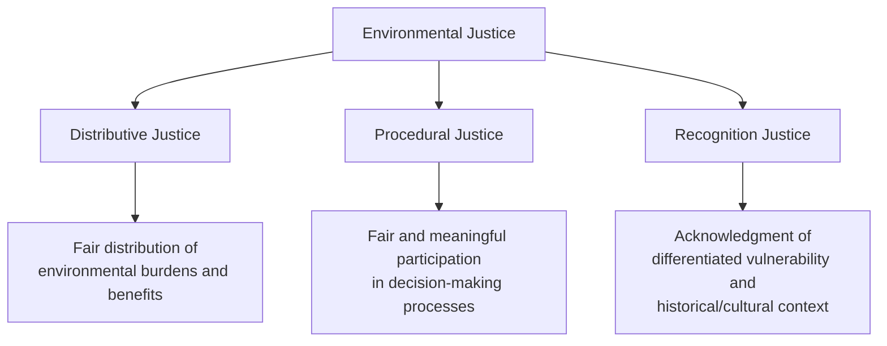
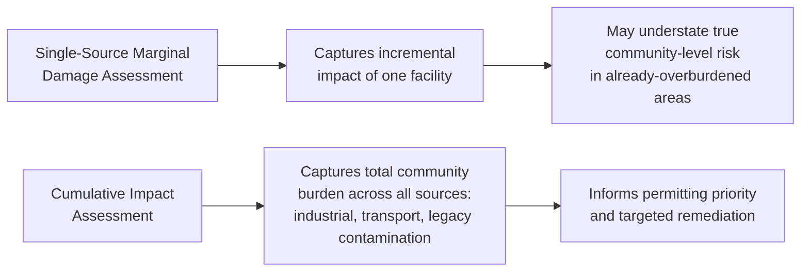

## Environmental Justice Dimensions of Energy Systems

### Definition and Conceptual Framework

**Environmental justice (EJ)** refers to the fair distribution of environmental benefits and burdens across populations, and the meaningful inclusion of all communities — regardless of race, income, or other demographic characteristics — in environmental decision-making. Applied to energy systems, EJ analysis examines how the costs (pollution exposure, land disturbance, displacement, price burden) and benefits (electricity access, employment, tax revenue, clean-energy co-benefits) of energy production, transmission, and consumption are distributed across different populations, and whether that distribution is disproportionate along socioeconomic or demographic lines.

The U.S. EPA's widely referenced framework identifies three interlocking dimensions of environmental justice, each with distinct implications for energy policy analysis:

- **Distributive justice** — whether environmental burdens (pollution exposure, land-use disruption) and benefits (energy access, employment, revenue) are allocated fairly across populations; this is the dimension most amenable to standard economic quantification (e.g., via the marginal damage estimation methods covered in [[Co-Pollutants and Local Environmental Health Economics]]).
- **Procedural justice** — whether affected communities have meaningful, timely, and adequately resourced opportunities to participate in permitting, siting, and regulatory decisions that affect them, rather than being formally notified after decisions are effectively finalized.
- **Recognition justice** — whether policy processes acknowledge differentiated vulnerability (e.g., pre-existing health burden, limited adaptive capacity, historical exclusion from infrastructure investment) rather than treating all communities as an undifferentiated average.

### Historical and Empirical Pattern of Energy Infrastructure Siting

A substantial empirical literature, beginning with foundational studies in the 1980s–1990s (e.g., the U.S. General Accounting Office's 1983 study of hazardous waste site location and the United Church of Christ's 1987 *Toxic Wastes and Race* report) and extended by subsequent peer-reviewed research, has documented statistically significant correlations between the siting of polluting energy and industrial infrastructure and the racial and socioeconomic composition of surrounding communities. Commonly examined infrastructure types in the energy-specific literature include:

- Fossil fuel power plants (particularly coal and older oil/gas peaker units)
- Petroleum refineries and petrochemical facilities
- Compressor stations and pipeline infrastructure
- Fossil fuel extraction sites (well pads, surface mining operations)
- Waste incineration and ash disposal/storage facilities

[Inference] The underlying causal mechanisms generating this correlation are debated in the academic literature — competing explanations include disparate siting decisions by firms/regulators (siting bias), lower relative land costs in already-disadvantaged areas attracting industrial development, and demographic change *following* siting (as property values near polluting facilities decline, driving out higher-income residents and drawing in lower-income populations) — and most rigorous studies find that some combination of these mechanisms, rather than a single dominant explanation, better fits observed patterns. This causal ambiguity does not change the *distributive* empirical finding (disproportionate co-location), but it is directly relevant to designing effective remedial policy, since different causal mechanisms imply different points of intervention.

### Cumulative Impact and the Limits of Single-Source Analysis

Standard marginal damage assessment (as covered in the co-pollutant health economics treatment) typically evaluates the incremental health impact of a single emissions source or a single regulatory change. Environmental justice analysis emphasizes that many affected communities face **cumulative exposure** from multiple co-located sources — a power plant, a highway corridor, an industrial facility, and legacy contamination may all overlap spatially — such that the community's total pollution burden substantially exceeds what any single-source regulatory review would capture.

This has motivated methodological and regulatory developments including:

- **Cumulative impact assessment (CIA) frameworks**, which some jurisdictions now require as part of permitting review, evaluating a proposed facility's incremental contribution against the community's *existing* aggregate burden rather than in isolation.
- **Screening tools that aggregate multiple burden indicators**, such as the U.S. EPA's EJScreen and California's CalEnviroScreen, which combine pollution exposure indicators (ambient PM$_{2.5}$, ozone, diesel particulate matter, proximity to hazardous facilities), environmental effects indicators (proximity to superfund/hazardous waste sites), and socioeconomic/health vulnerability indicators (poverty rate, linguistic isolation, pre-existing asthma/cardiovascular disease prevalence) into a composite score used to prioritize regulatory attention and funding.

[Unverified] The specific indicators, weighting methodology, and regulatory applications of these screening tools are periodically updated and vary by jurisdiction; current tool versions and their specific use in permitting or funding decisions should be verified against the latest tool documentation, since these frameworks have been revised multiple times since initial release and their legal/regulatory status is subject to policy change.

### Economic Incidence of Energy Costs and the "Energy Burden"

A distinct but related EJ dimension concerns the **distributional incidence of energy costs** on the consumption side, independent of pollution exposure. **Energy burden** is typically defined as the share of household income spent on home energy bills (electricity and heating fuel):

$$Energy\ Burden = \frac{Annual\ Home\ Energy\ Expenditure}{Annual\ Household\ Income}$$

Because energy is a necessity with low income elasticity of demand, low-income households systematically bear a higher energy burden than higher-income households for comparable energy consumption — a pattern well-documented in U.S. Department of Energy Low-Income Energy Affordability Data (LEAD) analyses and analogous studies internationally. This regressivity has direct implications for the policy instruments covered elsewhere in this chapter:

- **Carbon tax regressivity**: A carbon tax, absent revenue recycling, raises energy prices roughly proportionally for all consumers, which — combined with low-income households' higher baseline energy burden — produces a regressive incidence pattern, motivating the rebate/dividend recycling designs discussed under [[Pigouvian Taxation Applied to Energy Externalities]].
- **Cap-and-trade allowance value pass-through**: Similarly, permit price pass-through to retail electricity rates under cap-and-trade can carry comparable regressive incidence absent offsetting revenue use, a consideration in the design of programs like RGGI's consumer-benefit-directed auction proceeds.
- **Utility disconnection and shutoff policy**: Energy burden analysis also informs utility regulatory policy on payment assistance programs, disconnection moratoria, and rate design (e.g., inclining block rates, which can either help or harm low-income ratepayers depending on their specific consumption patterns relative to the block thresholds).

### The Energy Transition and "Just Transition" Economics

The shift away from fossil fuel-based energy systems raises a distinct set of EJ considerations concerning **transition costs** borne by workers and communities economically dependent on fossil fuel industries (coal mining regions, oil and gas extraction communities, fossil-fuel power plant host communities reliant on associated tax revenue and employment). The **"just transition"** concept, originating in the labor movement and increasingly incorporated into climate policy design, addresses:

- **Worker transition support**: retraining programs, wage insurance, early retirement/pension bridge support for displaced fossil fuel sector workers, whose skill sets and geographic location may not directly transfer to emerging clean-energy sector jobs.
- **Community fiscal transition**: many fossil fuel host communities rely heavily on property tax or severance tax revenue from extraction/generation facilities to fund schools and local services; plant/mine closure can trigger a fiscal cliff independent of, and often faster-moving than, direct employment effects.
- **Targeted federal/state transition funding mechanisms**: examples include place-based economic development funding directed at coal-community regions and dedicated transition assistance provisions within broader climate legislation.

[Inference] The economic magnitude and effectiveness of just-transition support mechanisms relative to the scale of displaced employment and fiscal loss in affected communities is an actively debated and empirically unsettled question in the policy literature, with assessments varying considerably depending on the specific program, region, and time horizon evaluated.

### Distributive Justice on the Benefits Side: Clean Energy Access and Co-Benefit Distribution

EJ analysis also examines whether the *benefits* of the energy transition — not only its burdens — are equitably distributed:

- **Access to rooftop solar and distributed energy resources**: Rooftop solar adoption has historically skewed toward higher-income, homeowning populations (renters and lower-income homeowners face structural barriers including upfront capital cost, split incentives between landlords and tenants, and limited access to financing), motivating policy responses such as community solar programs (allowing subscription-based access to shared solar generation without requiring individual rooftop ownership) and low-income solar carve-outs within state renewable incentive programs.
- **Electric vehicle incentive distribution**: EV purchase incentives (tax credits, rebates) have similarly been documented in multiple studies to disproportionately benefit higher-income purchasers able to afford new vehicle purchases, motivating point-of-sale rebate redesign and used-EV incentive provisions intended to broaden access.
- **Co-benefit distribution from decarbonization**, as discussed in the co-pollutant treatment: if decarbonization policy prioritizes retirement of the highest-marginal-damage (typically urban-proximate) facilities, local air-quality co-benefits accrue disproportionately to nearby communities — a potentially equity-enhancing outcome, though this result is contingent on *which* facilities are targeted for retirement, not an automatic consequence of decarbonization broadly.

### Procedural Justice in Energy Siting and Permitting

Procedural justice concerns center on whether affected communities have genuine opportunity to influence siting and permitting decisions for both fossil fuel infrastructure and *new* clean energy infrastructure (transmission lines, utility-scale solar/wind, battery storage facilities, critical mineral mining), since large-scale renewable buildout itself generates siting and land-use conflicts that raise analogous procedural questions to those historically associated with fossil infrastructure. Key procedural mechanisms and critiques include:

- **Public comment and hearing requirements** under environmental review statutes (e.g., NEPA in the U.S.), which EJ advocates have argued frequently occur too late in the decision process to meaningfully alter project design or siting, and may be inaccessible to communities facing language barriers, limited access to technical expertise, or resource constraints relative to project proponents.
- **Community benefit agreements (CBAs)**: negotiated agreements between project developers and host communities providing direct compensation, local hiring commitments, or infrastructure investment in exchange for community support or non-opposition — an increasingly common tool in utility-scale renewable and transmission project development.
- **Free, prior, and informed consent (FPIC)** standards, particularly relevant to energy infrastructure sited on or near Indigenous lands, reflecting international frameworks (e.g., the UN Declaration on the Rights of Indigenous Peoples) though [Unverified] the specific legal enforceability and application of FPIC standards varies substantially by jurisdiction and project type, and should be verified against the applicable national/subnational legal framework for any specific project context.

### Policy Instruments Addressing Environmental Justice in Energy

| Instrument Type | Example Mechanism | EJ Dimension Addressed |
| --- | --- | --- |
| Cumulative impact permitting review | California AB 617 community air monitoring/reduction program | Distributive (addresses hotspot risk under aggregate caps) |
| Screening/prioritization tools | EPA EJScreen, CalEnviroScreen | Distributive (informs targeting of regulatory/funding attention) |
| Revenue recycling / climate dividends | Carbon tax rebates, RGGI proceeds directed to low-income efficiency programs | Distributive (addresses energy burden regressivity) |
| Low-income clean energy access programs | Community solar carve-outs, low-income weatherization assistance | Distributive (addresses unequal access to transition benefits) |
| Just transition funding | Place-based economic development funding for fossil-dependent regions | Distributive (addresses transition fiscal/employment cliff) |
| Community benefit agreements | Negotiated developer-community agreements for renewable/transmission siting | Procedural (formalizes community input and compensation) |
| Enhanced public participation requirements | Extended comment periods, technical assistance grants for affected communities | Procedural (addresses resource asymmetry in permitting review) |

### Integrating EJ into Standard Cost-Benefit Analysis

A methodological challenge actively debated in the environmental economics literature is how — or whether — standard benefit-cost analysis, which typically aggregates costs and benefits without regard to *who* bears them, should be modified to reflect distributive justice concerns. Approaches proposed and applied in varying degrees include:

- **Distributional weighting**: applying higher weights to damages or benefits accruing to lower-income or historically overburdened populations, reflecting the declining marginal utility of income (analogous to the equity-weighting approaches discussed for international SCC estimation), rather than treating each dollar of cost or benefit as equally weighted regardless of recipient.
- **Disaggregated reporting alongside aggregate net benefit**: presenting distributional incidence tables (impacts by income quintile, by demographic group, by geography) alongside — rather than folded into — the standard aggregate net-benefit calculation, preserving analytical transparency about who specifically gains and loses.
- **Minimum distributive constraints**: treating a policy's aggregate net benefit as necessary but not sufficient, with an additional requirement that no identifiable subpopulation bear a disproportionate net burden beyond a specified threshold, functioning as a side constraint on otherwise standard efficiency-based policy selection.

[Inference] There is no current consensus methodology for formally integrating distributive justice weighting into regulatory cost-benefit analysis in the way that discounting or VSL methodology has become standardized; practice varies considerably by agency, jurisdiction, and specific rulemaking, and this remains an active area of methodological development rather than settled analytical practice.

### Next Steps

- **Co-pollutants and local environmental health economics**: the marginal damage estimation methods underlying distributive justice analysis
- **Command-and-control vs market-based environmental regulation**: hotspot risk under aggregate trading instruments
- **Pigouvian taxation applied to energy externalities**: revenue recycling design and regressivity mitigation
- **Just transition policy design**: worker retraining, fiscal transition support, and comparative program evaluation
- **Utility rate design and low-income energy assistance programs**
- **Distributional weighting in benefit-cost analysis**: theoretical foundations and applied methodologies
- **Community solar and distributed energy resource access policy**
- **Free, prior, and informed consent standards in energy infrastructure siting on Indigenous lands**