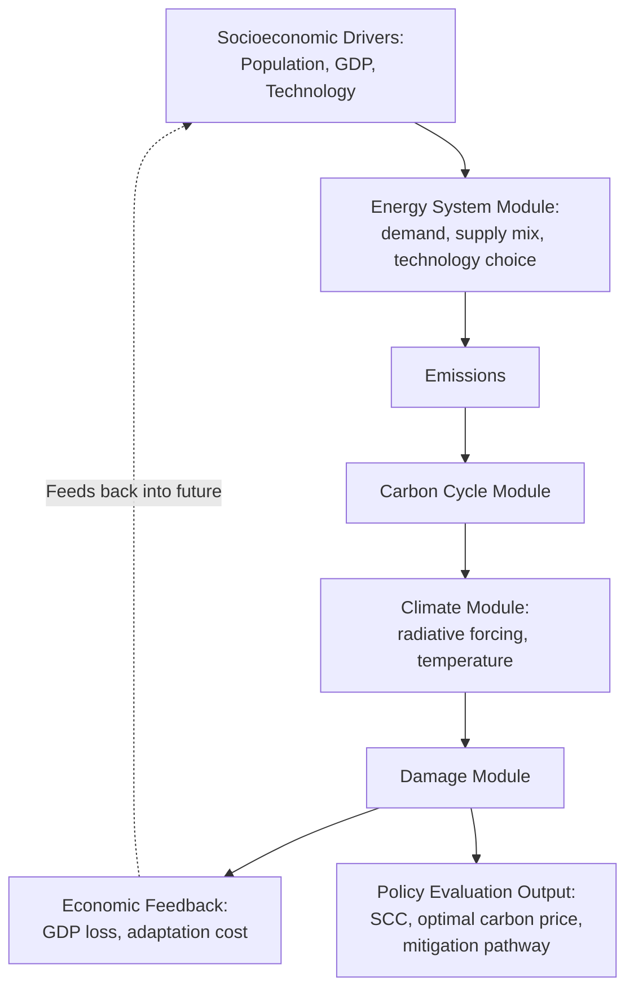
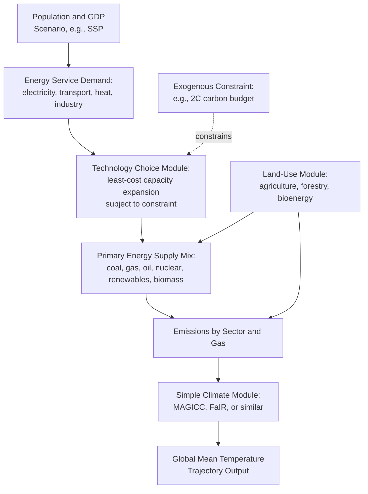

## Integrated Assessment Models Linking Energy, Economy, and Climate

### Definition and Purpose

**Integrated Assessment Models (IAMs)** are quantitative modeling frameworks that couple representations of the energy system, the broader macroeconomy, and the climate system into a single analytical structure, enabling researchers and policymakers to evaluate how energy and climate policy choices propagate through economic and physical systems simultaneously. Unlike standalone climate models (which take emissions as an exogenous input) or standalone energy-system models (which typically do not compute climate feedback), IAMs close the loop: economic activity drives energy demand and emissions, emissions drive atmospheric concentration and climate change, and climate change feeds back into economic damages that affect future economic activity and policy choices.

IAMs were introduced in the [[Social Cost of Carbon and Other Pollutants]] treatment specifically as the tool used to derive SCC estimates (DICE, PAGE, FUND). This entry expands the treatment to the broader IAM landscape, including the distinct family of **process-based / detailed technology IAMs** used primarily for energy-transition and mitigation-pathway analysis rather than damage-function-based cost-benefit optimization.

### Two Major IAM Families

The IAM literature is conventionally divided into two methodologically distinct families, which serve different analytical purposes and should not be conflated despite sharing the "integrated assessment model" label:

**1. Cost-benefit / welfare-optimization IAMs** (e.g., DICE, PAGE, FUND, as covered in the SCC entry) — these models compute an economically optimal emissions trajectory by maximizing discounted social welfare, trading off the cost of abatement against the avoided cost of climate damage. They rely on a **highly aggregated, reduced-form representation of the energy sector** (often a single abatement-cost curve rather than an explicit technology mix) in order to keep the model computationally tractable for optimization over long time horizons and to isolate the core discounting/damage-function economics.

**2. Process-based / detailed technology IAMs** (e.g., MESSAGE, REMIND, IMAGE, GCAM, WITCH — the modeling families underlying most IPCC Working Group III mitigation scenario literature) — these models represent the energy system in far greater technological granularity: explicit representations of electricity generation technologies, industrial processes, land-use and agriculture, and energy end-use sectors, typically solving for a **least-cost pathway to satisfy an exogenously specified emissions or temperature constraint** (rather than jointly optimizing the constraint itself against a damage function). These models are the primary tool underlying the mitigation scenario database used in IPCC assessment reports and national long-term decarbonization strategy analysis.

| Dimension | Cost-Benefit IAMs (DICE, PAGE, FUND) | Process-Based IAMs (MESSAGE, REMIND, GCAM, IMAGE) |
| --- | --- | --- |
| Primary output | Optimal carbon price / SCC | Technology pathway to meet a specified target |
| Energy sector detail | Highly aggregated (abatement cost curve) | Highly disaggregated (explicit technologies, vintages, capacity) |
| Emissions target | Endogenously determined via welfare optimization | Typically exogenously specified (e.g., 1.5°C, 2°C, net-zero by year X) |
| Damage function | Central, explicit, and consequential to model output | Often simplified or absent, since the model doesn't optimize against damages |
| Typical application | SCC estimation, discount-rate sensitivity analysis | Mitigation scenario design, technology roadmap analysis, IPCC scenario database |
| Computational approach | Intertemporal welfare optimization (Ramsey-type growth model) | Cost-minimizing linear/dynamic programming over technology choices |

### Core Architecture of Process-Based IAMs

Key structural components common across major process-based IAMs:

1. **Socioeconomic driver scenarios** — typically drawn from the **Shared Socioeconomic Pathways (SSPs)**, a standardized set of five narrative-quantitative scenarios (SSP1 through SSP5) developed by the IAM research community to represent alternative population, GDP, urbanization, and technological development trajectories, spanning storylines from "sustainability" (SSP1) to "fossil-fueled development" (SSP5).
2. **Energy service demand projection** — translates socioeconomic drivers into demand for energy services (electricity, mobility, heating/cooling, industrial process heat), often incorporating price-responsiveness and efficiency improvement assumptions.
3. **Technology choice/capacity expansion module** — the core computational engine, typically a linear or mixed-integer programming solver that selects the least-cost combination of energy supply and conversion technologies to meet projected demand subject to any imposed emissions or resource constraints, often incorporating technology-specific learning curves (cost declining with cumulative deployment).
4. **Land-use and agriculture module** — critical for capturing bioenergy potential, land-use-change emissions, and competition between food production, bioenergy feedstock cultivation, and afforestation/reforestation carbon removal pathways.
5. **Simplified climate module** — most process-based IAMs couple to a reduced-complexity climate emulator (e.g., MAGICC or FaIR) rather than a full Earth System Model, translating the model's emissions trajectory into an approximate global mean temperature response, sufficient for scenario classification (e.g., "likely below 2°C") without the computational cost of a full-complexity climate model.

### Representative Concentration Pathways and Shared Socioeconomic Pathways

IAM scenario output is standardized around two complementary frameworks used extensively in IPCC assessment reports:

- **Representative Concentration Pathways (RCPs)** — define trajectories of radiative forcing (measured in W/m$^2$ by year 2100) resulting from a given emissions/concentration pathway, independent of the specific socioeconomic story that produced them (e.g., RCP2.6, RCP4.5, RCP6.0, RCP8.5).
- **Shared Socioeconomic Pathways (SSPs)** — define the socioeconomic narrative (population, GDP, technology, governance) that, combined with a given climate policy stringency assumption, produces a specific emissions trajectory.

The two are combined in the **SSP-RCP scenario matrix** (e.g., "SSP2-4.5" denotes the "middle of the road" socioeconomic narrative combined with policy stringency producing approximately 4.5 W/m$^2$ forcing by 2100), allowing researchers to distinguish the socioeconomic driver assumptions from the resulting climate outcome — a structural improvement over the earlier generation of scenarios (used in IPCC AR5's predecessor, AR4) which conflated the two.

### Damage Functions and Climate Feedback in Cost-Benefit IAMs

Returning to the cost-benefit IAM family for the specific mechanics of the economy-climate feedback loop: the **damage function** is the critical link translating physical climate change back into economic loss, typically expressed as a fraction of GDP lost as a function of global mean temperature increase $T$:

$$Y_{net}(t) = Y_{gross}(t) \times \left[1 - \Omega(T(t))\right]$$

where $Y_{gross}(t)$ is output absent climate damage (determined by the standard Ramsey-type growth model's capital, labor, and technology inputs) and $\Omega(T)$ is the damage fraction. This net output then determines the capital available for both consumption and reinvestment in the next period, meaning **climate damage compounds through the capital accumulation process** over the model's multi-century horizon — a structural feature that makes the model's long-run growth assumptions (and the compounding effect of even small annual damage fractions) highly consequential to final welfare and SCC results.

### Illustrative Simplified Numerical Example

Consider a highly simplified two-period cost-benefit IAM to illustrate the core optimization logic (substantially simplified relative to actual DICE-class models, which use many more periods and a continuous optimization):

- Period 1 gross output: $Y_1 = 100$
- Abatement reduces period-1 emissions but costs $C(a) = 5a^2$ (where $a$ is the fraction of baseline emissions abated, $0 \le a \le 1$)
- Period-2 damage (as a fraction of period-2 output) depends inversely on period-1 abatement: $\Omega = 0.20(1-a)$
- Period-2 gross output (absent damage): $Y_2 = 150$
- Discount factor between periods: $\delta = 0.9$

**Net welfare-relevant consumption:**

$$W(a) = \left[Y_1 - C(a)\right] + \delta \times Y_2 \times (1-\Omega(a))$$

$$W(a) = \left[100 - 5a^2\right] + 0.9 \times 150 \times \left[1 - 0.20(1-a)\right]$$

Expanding: $W(a) = 100 - 5a^2 + 135\left[1 - 0.2 + 0.2a\right] = 100 - 5a^2 + 135(0.8 + 0.2a) = 100 - 5a^2 + 108 + 27a$

$$W(a) = 208 + 27a - 5a^2$$

**First-order condition** for optimal abatement $a^*$: $\frac{dW}{da} = 27 - 10a = 0 \implies a^* = 2.7$

Since $a$ is bounded at 1 (100% abatement), the constraint binds and $a^* = 1$ — in this simplified example, full abatement is welfare-maximizing because the marginal damage avoided (27, from the linear damage term) exceeds marginal abatement cost even at full abatement ($10 \times 1 = 10$). This illustrates the qualitative logic (marginal abatement cost balanced against marginal discounted avoided damage) underlying actual IAM optimization, though real models solve this balance continuously across many periods, technologies, and a full damage-function specification rather than the two-period linear-quadratic simplification shown here.

### Key Methodological Debates in IAM Design

- **Damage function extrapolation**: As noted in the SCC treatment, damage functions are calibrated substantially on historical, low-warming data and extrapolated to high-warming scenarios (3–5°C+) with limited direct empirical grounding, a concern raised prominently by critics including Robert Pindyck and others questioning whether IAM-derived SCC estimates convey more precision than the underlying science supports.
- **Discrete technology representation vs. smooth abatement-cost curves**: Process-based IAMs' explicit technology representation can better capture path-dependency, lock-in, and technology-specific constraints (e.g., grid integration limits for variable renewables, critical mineral supply constraints) than the smooth aggregated abatement-cost curves used in cost-benefit IAMs, but at the cost of dramatically higher computational complexity and reduced tractability for full intertemporal welfare optimization.
- **Treatment of negative emissions technologies**: Many net-zero pathway scenarios from process-based IAMs rely substantially on **Bioenergy with Carbon Capture and Storage (BECCS)** or direct air capture deployment at scale to achieve net-negative emissions in the latter half of the century, an assumption that has drawn methodological criticism regarding the feasibility of the land-use, water, and infrastructure scale-up implied by some scenario pathways. [Inference] The degree to which current IAM scenario literature over-relies on unproven-at-scale negative emissions technology, versus appropriately representing a genuinely available mitigation option, remains an actively contested question among IAM practitioners and critics rather than a settled methodological consensus.
- **Model diversity and structural uncertainty**: Because different IAMs embed different technology cost assumptions, damage function specifications, and solution algorithms, running the same policy scenario across multiple IAMs (a **model intercomparison exercise**, as conducted for IPCC scenario database compilation) frequently produces a wide spread of results, and this structural (model-choice) uncertainty is a distinct source of variance from the input-parameter uncertainty (discount rate, ECS) discussed in the SCC entry.

### Applications in Policy Analysis

- **National and international climate target-setting**: Process-based IAM scenario libraries underpin the technical basis for IPCC carbon budget estimates and national long-term decarbonization strategy modeling (e.g., informing Nationally Determined Contribution target-setting under the Paris Agreement framework).
- **Social cost of carbon estimation**: as detailed in the dedicated SCC entry, cost-benefit IAMs remain the primary technical basis for official U.S. and international SCC values used in regulatory cost-benefit analysis.
- **Technology roadmap and infrastructure investment planning**: Process-based IAM output (e.g., projected power-sector technology mix under a given carbon budget) informs long-term utility integrated resource planning and national infrastructure investment prioritization.
- **Stress-testing policy robustness across socioeconomic uncertainty**: Running policy scenarios across the full SSP range allows analysts to evaluate whether a given policy design remains effective/cost-efficient across a range of plausible future socioeconomic conditions, rather than relying on a single central projection.

### Comparative Table: Major Named IAMs

| Model | Type | Developing Institution (representative) | Notable Feature |
| --- | --- | --- | --- |
| DICE/RICE | Cost-benefit | Yale (William Nordhaus) | Foundational Ramsey-optimal growth model; basis for Nobel-recognized SCC methodology |
| PAGE | Cost-benefit | Independent (Chris Hope) | Monte Carlo uncertainty propagation; explicit catastrophic risk parameter |
| FUND | Cost-benefit | Independent (Richard Tol) | Regionally and sectorally disaggregated damage estimation |
| MESSAGE | Process-based | International Institute for Applied Systems Analysis (IIASA) | Detailed energy-system linear programming; widely used in IPCC scenario database |
| REMIND | Process-based | Potsdam Institute for Climate Impact Research (PIK) | Couples general equilibrium macroeconomic module with detailed energy technology representation |
| GCAM | Process-based | Pacific Northwest National Laboratory (PNNL) | Strong land-use, agriculture, and bioenergy representation |
| IMAGE | Process-based | PBL Netherlands Environmental Assessment Agency | Integrated land-use and biodiversity impact modeling alongside energy system |
| WITCH | Process-based (hybrid) | RFF-CMCC European Institute on Economics and the Environment | Game-theoretic regional strategic interaction representation |

[Unverified] Institutional affiliations and model development leadership evolve over time as research groups and funding arrangements change; the table reflects commonly cited institutional associations in the IAM literature and should be verified against current model documentation for specific research or citation purposes.

### Next Steps

- **Social cost of carbon and other pollutants**: detailed treatment of cost-benefit IAM output and discount-rate sensitivity
- **Shared Socioeconomic Pathways and Representative Concentration Pathways**: full scenario framework methodology
- **Carbon budgets and remaining emissions allowances**: deriving policy targets from IAM-based climate constraints
- **Bioenergy with Carbon Capture and Storage (BECCS) and negative emissions technology feasibility**
- **Technology learning curves and cost decline modeling in energy-system IAMs**
- **Model intercomparison projects**: structural uncertainty across IAM frameworks
- **Nationally Determined Contributions and the Paris Agreement ratchet mechanism**
- **General equilibrium modeling of energy-economy interactions**: CGE model structure as a complementary/alternative approach to IAM technology-detail modeling