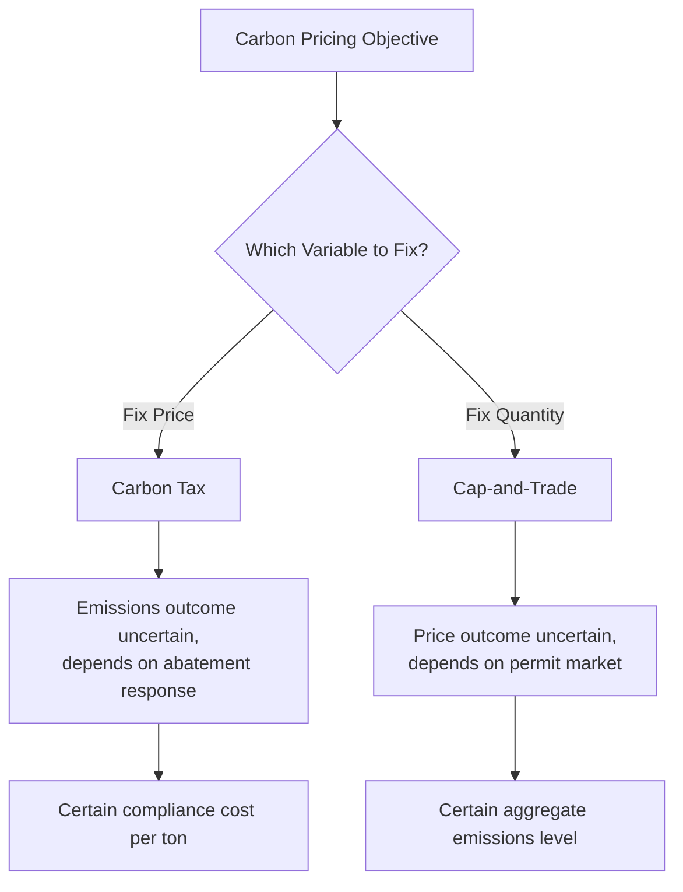
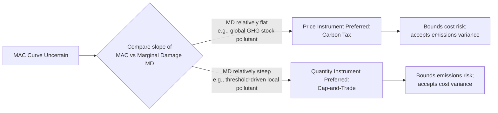
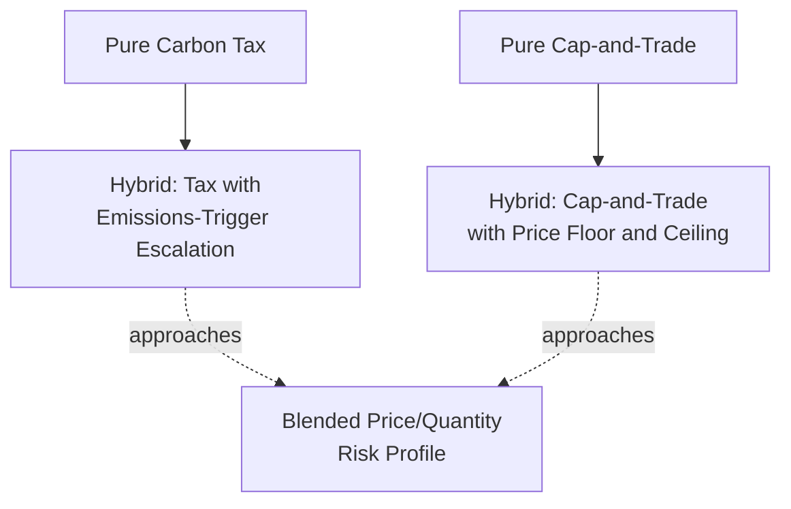

## Carbon Pricing Design: Taxes vs Cap-and-Trade Comparison

### Framing the Comparison

**Carbon pricing** encompasses the two dominant market-based instruments for internalizing the climate externality: the **carbon tax** (a price instrument, fixing the marginal cost per ton of CO$_2$-equivalent and letting the resulting quantity emerge from market response) and **cap-and-trade** (a quantity instrument, fixing the aggregate emissions cap and letting the resulting price emerge from permit market clearing). Both instruments were introduced separately in this course — the carbon tax as an application of Pigouvian taxation (see [[Pigouvian Taxation Applied to Energy Externalities]]) and cap-and-trade as a general emissions trading design (see [[Cap-and-Trade Systems and Emissions Trading Design]]). This entry synthesizes the comparative economic analysis specifically for carbon, integrating the theoretical, empirical, and political-economy dimensions of the choice between them.

### Theoretical Equivalence Under Certainty

Under conditions of perfect information and certainty about the marginal abatement cost (MAC) curve, a carbon tax set at rate $t^*$ and a cap set at quantity $Q^*$ are **formally equivalent** if $t^* = MAC(Q^*)$ — that is, if the regulator knows the MAC curve precisely, setting the tax equal to the marginal abatement cost at the desired quantity produces identical emissions and identical marginal cost to setting the cap directly at that quantity. This equivalence is the textbook starting point for comparing the instruments, but it collapses once realistic uncertainty about the MAC curve is introduced — which is precisely the condition motivating the Weitzman framework below.

$$\underbrace{t^* = MAC(Q^*)}_{\text{tax sets price, quantity emerges}} \quad \Longleftrightarrow \quad \underbrace{Q^* = MAC^{-1}(t^*)}_{\text{cap sets quantity, price emerges}}$$

### The Weitzman Prices-vs-Quantities Framework

Martin Weitzman's foundational 1974 analysis provides the standard framework for choosing between price and quantity instruments under **uncertainty about the marginal abatement cost curve** (the regulator does not know firms' true abatement costs with certainty ex ante). The key result: the relative slopes of the marginal abatement cost (MAC) curve and the marginal damage (MD) curve determine which instrument minimizes expected welfare loss when the regulator's cost estimate turns out to be wrong.

**Case 1 — Relatively flat marginal damage curve** (approximately the case for CO$_2$, since one year's global emissions barely shift the marginal climate damage trajectory measured against a centuries-long stock accumulation): if the MAC curve is uncertain and turns out steeper (more costly to abate) than expected, a **quantity instrument** (fixed cap) forces achievement of the target regardless of cost, risking a large, potentially very costly price spike. A **price instrument** (fixed tax) instead lets emissions settle wherever abatement cost equals the tax rate, avoiding the cost spike at the expense of achieving somewhat less abatement than originally targeted — and because the damage curve is flat, that quantity deviation costs relatively little in additional climate damage. **Prices are preferred when the damage curve is flatter than the abatement cost curve.**

**Case 2 — Steep marginal damage curve near a threshold** (more plausible for a local pollutant with a health-based concentration threshold, or a hypothetical hard planetary tipping-point boundary): if abatement cost turns out lower than expected under a quantity instrument, the cap still guarantees the environmental target is met exactly. Under a price instrument in the same scenario, firms abate less than optimal (since the tax rate no longer matches the now-lower true MAC at the target quantity), and if damage rises steeply beyond the threshold, this quantity shortfall is costly. **Quantities are preferred when the damage curve is steeper than the abatement cost curve.**

Formally, Weitzman shows the expected welfare loss differential between price and quantity instruments is proportional to the difference in curvature:

$$\Delta W \propto \frac{1}{2}\sigma^2\left(MD'' - MAC''\right)$$

where $\sigma^2$ is the variance of the cost-shock uncertainty, $MD''$ is the slope (second derivative of total damage, i.e., slope of marginal damage) and $MAC''$ is the slope of the marginal abatement cost curve. When $MD'' < MAC''$ (damage curve flatter than abatement cost curve), the price instrument has the lower expected welfare loss, and vice versa. [Inference] Because global climate damage is widely characterized as having a comparatively flat marginal damage curve relative to the often steep and uncertain marginal abatement cost curves observed for specific sectors in the near term, this result is frequently cited as theoretical support for carbon taxation over cap-and-trade specifically for the global GHG stock-pollutant case — though this is a directional theoretical argument rather than a precise empirical calculation, and practitioners disagree on how confidently the relative curve slopes can be estimated in practice.

### Comprehensive Comparative Table

| Dimension | Carbon Tax | Cap-and-Trade |
| --- | --- | --- |
| Instrument type | Price instrument | Quantity instrument |
| Emissions outcome certainty | Low — depends on realized price responsiveness | High — fixed by cap design |
| Price/cost certainty | High — statutory rate known in advance | Low — market-determined, can be volatile |
| Preferred under Weitzman when... | Marginal damage curve relatively flat | Marginal damage curve relatively steep |
| Administrative complexity | Lower — single rate applied at point of taxation | Higher — requires registry, MRV infrastructure, auction/allocation mechanism, market oversight |
| Revenue generation | Direct and predictable | Depends on allocation method (auctioning generates revenue; free allocation does not) |
| Ease of linking across jurisdictions | Requires harmonizing tax rates or mutual recognition arrangements (structurally simpler in principle) | Requires harmonizing MRV standards, penalty structures, and registries (more institutionally demanding, as in the California-Quebec linkage) |
| Interaction with price volatility in fuel/energy markets | Adds a stable increment atop volatile underlying energy prices | Can compound volatility if permit price and fuel price move together, absent stabilization tools |
| Amenability to price-stability tools | Not applicable — price is fixed by design | Requires explicit tools (banking, price floors/ceilings, market stability reserves) to manage volatility |
| Political salience | High — visible line-item price increase, can face direct political resistance | Often lower direct visibility to end consumers, though pass-through still occurs |
| Historical prevalence for GHG specifically | British Columbia, Sweden, Singapore, and other national/subnational carbon taxes | EU ETS, RGGI, California-Quebec, China National ETS |

### Hybrid Instrument Designs

Because pure price and pure quantity instruments each carry distinct risk profiles, several **hybrid designs** have been developed to capture benefits of both approaches:

- **Cap-and-trade with a price floor and ceiling (price collar)**: combines quantity certainty (the cap) with a bounded price range, preventing both price collapse (via an auction reserve price floor, as in California and RGGI) and price spikes beyond a defined ceiling (via a cost-containment reserve releasing additional allowances above a trigger price). This design explicitly imports price-instrument-like stability into a fundamentally quantity-based system.
- **Carbon tax with a quantity-adjustment trigger**: less common in practice, but conceptually a tax rate that automatically escalates if emissions are tracking above a target trajectory, importing quantity-instrument-like target assurance into a price-based system. [Unverified] Specific jurisdictions implementing this exact trigger-adjustment design should be verified against current program documentation, as this hybrid approach is less standardized in practice than the price-collar cap-and-trade design.
- **Tax-and-cap combinations (policy layering)**: some jurisdictions have implemented a carbon tax and a cap-and-trade system covering different, non-overlapping sectors (rather than a single instrument covering the whole economy), reflecting political feasibility and sector-specific administrative considerations rather than a unified theoretical optimum.

### Empirical Comparison of Real-World Programs

| Program | Instrument | Approx. Recent Price/Rate | Sector Coverage | Notable Design Choice |
| --- | --- | --- | --- | --- |
| Sweden Carbon Tax | Tax | ~$130+/tCO$_2$ | Broad, phased in since 1991 | Among highest carbon tax rates globally; predates most cap-and-trade systems |
| British Columbia Carbon Tax | Tax | ~CAD 80/tCO$_2$ | Broad | Revenue-neutral via tax swap/rebate design |
| EU ETS | Cap-and-trade | Market-determined, historically volatile, more recently trading in a higher and steadier band | Power, industry, aviation, shipping (phased expansion) | Market Stability Reserve for structural surplus management |
| RGGI | Cap-and-trade | Market-determined via quarterly auction | Power sector (Northeast/Mid-Atlantic U.S. states) | Near-total auctioning from inception; proceeds recycled to state efficiency programs |
| California Cap-and-Trade | Cap-and-trade | Market-determined, bounded by price floor/ceiling | Broad multi-sector (power, industry, transport fuels) | Price collar; linked with Quebec; permits limited offset use |
| Singapore Carbon Tax | Tax | SGD 25/tCO$_2$, scheduled to rise | Large direct emitters | Legislated escalation schedule announced in advance |

[Unverified] Specific current-year rates and coverage details should be verified against official government sources or the World Bank Carbon Pricing Dashboard, as these programs are revised on an ongoing basis and the table reflects broadly reported figures rather than a real-time snapshot.

### Worked Comparative Example: Volatility Under Uncertainty

Suppose the true marginal abatement cost curve is $MAC(Q) = 100 - 0.5Q$ but the regulator's estimate, used to set policy, was $MAC_{est}(Q) = 100 - 0.8Q$ (i.e., the regulator overestimated how steeply costs would rise, leading it to underestimate required abatement effort for a given price).

**Under a tax set using the flawed estimate**: Suppose the regulator wants to induce $Q=60$ abatement and sets $t = MAC_{est}(60) = 100 - 0.8(60) = 52$. Applying this tax to the *true* MAC curve: $52 = 100 - 0.5Q \implies Q = 96$. Actual abatement (96) overshoots the target (60) by 36 units — the tax achieves *more* abatement than intended, at higher aggregate cost than planned, but the **price paid per ton (52) remains exactly as budgeted**.

**Under a cap set using the same flawed estimate at $Q=60$**: The quantity target is achieved exactly (60 units of abatement, by construction of a binding cap), but the market-clearing price reveals itself as $P^* = MAC(60) = 100 - 0.5(60) = 70$ — **34.6% higher than the regulator's planned price of 52**. Firms face an unanticipated cost shock relative to what the policy design intended.

This example illustrates the Weitzman logic concretely: the tax "absorbs" the estimation error through a quantity deviation (emissions differ from plan, but the marginal cost per ton stays fixed and predictable), while the cap "absorbs" the same estimation error through a price deviation (emissions stay exactly on target, but the cost per ton is unpredictable and can spike). Which absorption pattern is preferable depends — per Weitzman — on whether the resulting quantity deviation (under the tax) or price deviation (under the cap) is more costly to bear, which in turn depends on the relative curvature of the damage function versus the abatement cost function.

### Distributional and Political Economy Comparison

- **Revenue use and regressivity mitigation**: Both instruments can generate revenue (a tax directly; a cap-and-trade system if allowances are auctioned rather than freely allocated) that can be recycled to offset regressive incidence on low-income households, as discussed in the environmental justice and Pigouvian tax treatments — the *availability* of this option depends on auction share/tax design choice rather than being an inherent property distinguishing the two instrument types.
- **Political durability and framing**: A visible, explicit tax rate can face more direct political resistance ("new tax" framing) even when net household impact is offset by rebates, whereas cap-and-trade's price emergence through a less visible market mechanism has, in some documented cases, faced comparatively less direct "tax" framing resistance despite producing economically comparable consumer price effects — though [Inference] the empirical political-economy literature on which framing effect dominates in a given jurisdiction is context-dependent and not a settled general rule.
- **Windfall profit risk**: Cap-and-trade systems using free allocation (grandfathering or benchmarking) can generate windfall profits to incumbent emitters passing through the opportunity cost of allowances to consumers, a documented phenomenon in early EU ETS phases; a carbon tax has no directly analogous windfall-profit mechanism since there is no free allocation of a scarce asset — though pass-through pricing dynamics still apply to tax incidence.
- **International linkage potential**: A harmonized international carbon tax faces the practical difficulty that sovereign tax policy is highly resistant to external coordination, whereas cap-and-trade linkage (as demonstrated by California-Quebec) provides a more institutionally tested pathway for cross-jurisdictional market integration, though at the cost of the harmonization requirements noted in the comparative table above.

### Critiques Common to Both Instruments

- **Carbon leakage**: Both instruments, if implemented unilaterally, risk shifting emissions-intensive production to jurisdictions without comparable carbon pricing, motivating border carbon adjustment mechanisms regardless of which instrument is chosen domestically.
- **Incomplete sectoral coverage**: Both instruments in practice typically exclude some emissions sources (e.g., certain agricultural emissions, some transport fuel categories) due to administrative or political constraints, meaning neither instrument, as actually implemented, achieves the textbook economy-wide efficient outcome that theoretical treatments assume.
- **Interaction with complementary policies**: Both instruments can experience the "waterbed effect" noted in the cap-and-trade treatment when combined with overlapping mandates (e.g., renewable portfolio standards), where the complementary policy shifts *where* abatement occurs without necessarily changing the *aggregate* outcome determined by the binding instrument.

### Next Steps

- **Pigouvian taxation applied to energy externalities**: full carbon tax mechanics and worked examples
- **Cap-and-trade systems and emissions trading design**: full quantity-instrument mechanics and allocation methods
- **Border carbon adjustment mechanisms**: addressing leakage under either instrument choice
- **Weitzman's prices vs. quantities framework**: extended formal derivation and applications beyond carbon
- **Environmental justice dimensions of energy systems**: distributional incidence considerations applicable to either instrument
- **Carbon market linkage**: institutional requirements for cross-jurisdictional cap-and-trade integration
- **Revenue recycling design**: comparative effectiveness of dividend, tax-swap, and green-investment recycling models
- **Integrated assessment models linking energy, economy, and climate**: deriving the SCC benchmark against which either instrument's efficiency can be evaluated