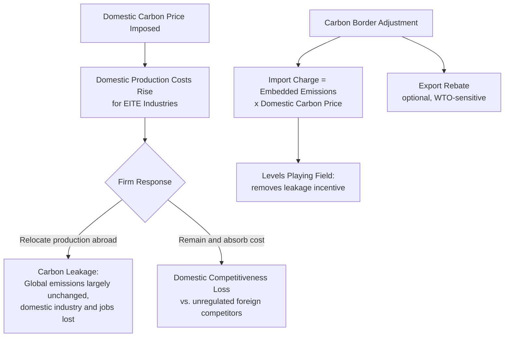
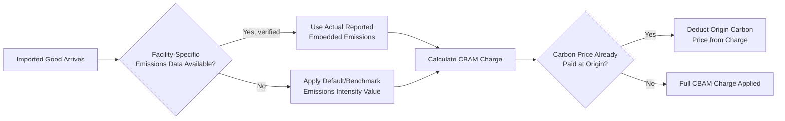

## Carbon Border Adjustment Mechanisms

### Definition and Rationale

A **carbon border adjustment mechanism (CBAM)** is a trade policy instrument that imposes a carbon-price-equivalent charge on imported goods based on the emissions embedded in their production, and/or provides a rebate on exports, so that domestic carbon pricing does not place domestically produced goods at a competitive disadvantage relative to goods produced in jurisdictions without comparable carbon pricing. CBAMs are the primary policy response to the **carbon leakage** problem, which arises whenever carbon pricing (whether a carbon tax or cap-and-trade, as covered in [[Carbon Pricing Design: Taxes vs Cap-and-Trade Comparison]]) is implemented unilaterally or asymmetrically across jurisdictions.

**Carbon leakage** occurs through two principal channels:

1. **Competitiveness (production-shifting) leakage**: emissions-intensive, trade-exposed (EITE) production relocates to jurisdictions with laxer or absent carbon pricing, so that global emissions are not reduced by the amount the domestic policy intended — production, and its associated emissions, simply moves elsewhere rather than being genuinely abated.
2. **Fossil-fuel-price leakage**: reduced fossil fuel demand in the pricing jurisdiction can lower global fossil fuel prices, partially offsetting the intended demand reduction by inducing higher consumption elsewhere — a more indirect, general-equilibrium channel distinct from direct production relocation.

### Economic Logic

The theoretical objective of a CBAM is to extend the domestic carbon price's incentive structure to imported goods, so that the **effective carbon price faced by consumers is equalized regardless of where a good was produced**, restoring the efficiency property of carbon pricing that unilateral domestic-only pricing undermines. Formally, if $t_d$ is the domestic carbon price and $E_m$ is the embedded emissions intensity of an imported good, an idealized CBAM charge is:

$$CBAM\ Charge = E_m \times t_d$$

so that the landed cost of the imported good reflects the same carbon cost per unit of embedded emissions that a domestic producer would face under the domestic carbon price. If the exporting country already imposes its own comparable carbon price $t_f$ on the embedded emissions, the CBAM charge is typically designed to be reduced accordingly (a **carbon price credit/deduction**), avoiding double-charging:

$$CBAM\ Charge = E_m \times \max(0,\ t_d - t_f)$$

This deduction mechanism is central to CBAM design because it creates an explicit financial incentive for trading partners to adopt their own domestic carbon pricing (since doing so allows them to retain the associated revenue themselves rather than having it captured by the importing jurisdiction's border charge) — a frequently cited secondary policy objective of CBAM design beyond leakage prevention alone.

### The EU Carbon Border Adjustment Mechanism (Reference Implementation)

The **EU CBAM** is the most developed real-world implementation to date and serves as the primary reference case for CBAM design. Key structural features, based on its published legislative design:

- **Sectoral scope (initial phase)**: covers iron and steel, cement, aluminum, fertilizers, electricity, and hydrogen — sectors selected as high-emissions-intensity, trade-exposed, and where the EU ETS already imposes a domestic carbon price on equivalent domestic production.
- **Mechanism**: importers of covered goods must purchase and surrender **CBAM certificates** corresponding to the embedded emissions of their imports, with the certificate price linked to the prevailing EU ETS allowance price, ensuring the border charge tracks the domestic carbon price dynamically rather than being fixed at a static rate.
- **Transitional reporting period**: an initial phase requiring only emissions reporting by importers (without financial obligation), intended to allow exporters, importers, and the European Commission to build the necessary emissions-verification infrastructure and refine embedded-emissions calculation methodologies before financial charges take effect.
- **Phase-in coordinated with EU ETS free allocation phase-out**: the CBAM's financial obligation is designed to phase in gradually as free allocation of EU ETS allowances to domestic EITE industries is simultaneously phased out, since maintaining both free allocation *and* a border charge simultaneously would constitute a form of double protection for domestic industry, raising both economic double-counting and potential WTO compatibility concerns.
- **Deduction for carbon price already paid**: importers can deduct any carbon price already effectively paid in the country of origin for the embedded emissions, from the CBAM charge owed, consistent with the double-charging avoidance principle above.

[Unverified] Because CBAM legislative and implementation details — sectoral scope expansion, specific certificate pricing mechanics, and phase-in timelines — have been subject to ongoing refinement and could have changed since this material was prepared, current implementation status, sectoral coverage, and specific dates should be verified against the European Commission's official CBAM documentation for any application requiring precise current details.

### Embedded Emissions Calculation Methodologies

A central technical and administrative challenge in CBAM design is accurately determining the **embedded emissions** of an imported good — the emissions released in producing it, which for imports (unlike domestic production under an ETS or tax with direct facility-level monitoring) must typically be estimated through a combination of:

1. **Actual/reported emissions data**: where exporting facilities can provide verified, facility-specific emissions data (increasingly feasible as more countries adopt their own emissions monitoring and reporting infrastructure).
2. **Default values / benchmark emissions intensities**: standardized emissions-intensity values (emissions per ton of steel, cement, aluminum, etc.) applied when facility-specific data is unavailable or unverifiable, typically derived from average emissions intensities in the country/region of origin or from a conservative (higher) default value intended to preserve an incentive for exporters to supply verified actual data (since a lower verified emissions figure would reduce their CBAM liability relative to the default).
3. **Direct vs. indirect emissions scope**: whether the embedded-emissions calculation includes only direct (Scope 1, on-site combustion/process) emissions, or also indirect emissions from purchased electricity (Scope 2) — a materially significant methodological choice for electricity-intensive sectors like aluminum, where indirect emissions from grid electricity can substantially exceed direct on-site emissions depending on the exporting country's electricity generation mix.

### WTO Compatibility and Legal Considerations

CBAM design must navigate World Trade Organization rules, particularly concerning **non-discrimination** principles (most-favored-nation treatment and national treatment) and the conditions under which environmental measures can qualify for exceptions under **GATT Article XX** (general exceptions, including measures necessary to protect human, animal, or plant life/health, and measures relating to conservation of exhaustible natural resources). Key legal design considerations include:

- **Like products treatment**: whether goods with different embedded-emissions intensities but otherwise physically similar characteristics (e.g., steel produced via a high-emissions blast furnace process vs. a lower-emissions electric arc furnace process) can be treated differently under WTO "like products" doctrine — an unsettled and actively litigated area of trade law given that WTO jurisprudence has historically emphasized physical product characteristics over production-process differences (the "process and production methods," or PPM, debate).
- **Non-discrimination across trading partners**: a CBAM must generally apply consistently to all trading partners with comparable embedded emissions, rather than differentiating based on the exporting country's identity per se (though differentiation based on the exporting country's *own carbon pricing level* — via the deduction mechanism — is generally considered defensible under Article XX exceptions if applied in a genuinely non-discriminatory, emissions-based manner rather than as disguised protectionism).
- **Revenue use and export rebate design**: export rebates (refunding domestic carbon costs on goods sold abroad) raise separate WTO subsidy-discipline considerations distinct from the import-charge side of a CBAM, and most implemented/proposed CBAM designs (including the EU's) have focused on the import-charge mechanism while treating export rebates more cautiously or omitting them, given the additional legal complexity.

[Inference] Because no CBAM has yet been subject to a completed WTO dispute settlement ruling directly testing its legality as of general available analysis, the precise boundaries of WTO-compatible CBAM design remain a matter of legal interpretation and academic/practitioner debate rather than settled adjudicated law; jurisdictions designing CBAMs have generally sought to structure them defensively around the Article XX exception framework and non-discrimination principles, but this represents a considered legal strategy rather than a judicially confirmed safe harbor.

### Comparison with Alternative Leakage-Mitigation Approaches

CBAM is one of several policy responses to carbon leakage; understanding its trade-offs requires comparison with the alternatives it is often proposed to replace or complement:

| Approach | Mechanism | Key Advantage | Key Limitation |
| --- | --- | --- | --- |
| **Free allocation of allowances** | EITE industries receive allowances at no cost (grandfathering/benchmarking) rather than purchasing them | Simple to implement; no border/trade law complexity | Preserves output-based carbon-cost protection but weakens the domestic price signal for the protected sector; generates windfall profits (as discussed in cap-and-trade design) |
| **Output-based rebating** | Firms receive a rebate proportional to output (not tied to specific allowance allocation), preserving marginal abatement incentive while offsetting average cost burden | Maintains stronger marginal incentive than pure free allocation | Still does not address the pricing gap for imported competing goods |
| **Carbon border adjustment (CBAM)** | Import charge (and potentially export rebate) based on embedded emissions | Directly addresses the price gap for imports at the point of competition; creates external incentive for trading partners to adopt their own carbon pricing | Administrative complexity of embedded-emissions verification; WTO legal uncertainty; can trigger retaliatory trade tension |
| **International carbon price floor agreements** | Coordinated minimum carbon price commitments across multiple jurisdictions (a negotiated multilateral approach) | Addresses leakage at its source by narrowing the price differential itself, rather than compensating for it at the border | Requires multilateral political agreement, historically difficult to achieve at meaningful scale and stringency |
| **Sectoral exemption / phase-in schedules** | Simply exempting the most trade-exposed sectors from the domestic carbon price, or phasing in coverage slowly | Administratively simple | Undermines the price signal's coverage and long-run effectiveness for the exempted sectors |

### Worked Illustrative Example

Consider a domestic steel producer facing a carbon price of $t_d = \$80$/tCO$_2$ under the domestic ETS, with an embedded emissions intensity of 1.8 tCO$_2$ per ton of steel produced (a plausible order-of-magnitude figure for blast-furnace steel production, though actual intensities vary by process and facility). The domestic carbon cost per ton of steel is:

$$Domestic\ carbon\ cost = 1.8 \times 80 = \$144\ \text{per ton of steel}$$

**Scenario A — Foreign exporter with no domestic carbon price** ($t_f = 0$), same embedded emissions intensity (1.8 tCO$_2$/ton):

$$CBAM\ charge = 1.8 \times \max(0,\ 80 - 0) = \$144\ \text{per ton}$$

The imported steel now faces the same effective carbon cost as domestic steel, eliminating the leakage-inducing cost gap.

**Scenario B — Foreign exporter with a domestic carbon price of $t_f = \$30$/tCO$_2$** already applied to the same production:

$$CBAM\ charge = 1.8 \times \max(0,\ 80-30) = 1.8 \times 50 = \$90\ \text{per ton}$$

The importer pays a reduced CBAM charge reflecting the carbon cost already internalized at origin, while the *combined* carbon cost borne by the imported good ($30 \times 1.8 = \$54$ paid at origin, plus $90 at the border $= \$144$ total) again equals the domestic carbon cost — illustrating how the deduction mechanism preserves cost equalization while avoiding double-charging.

**Scenario C — More carbon-efficient foreign producer** with embedded emissions intensity of only 1.0 tCO$_2$/ton and no domestic carbon price:

$$CBAM\ charge = 1.0 \times 80 = \$80\ \text{per ton}$$

Because the CBAM charge scales with *actual* embedded emissions rather than a flat per-unit import tariff, a genuinely lower-emissions foreign producer faces a proportionally lower border charge than a higher-emissions competitor — preserving, rather than blunting, the incentive for cleaner production methods globally, which is a distinguishing design feature relative to a simple flat tariff on imported goods from a given country.

### Political Economy and International Relations Considerations

- **Retaliation risk**: Trading partners, particularly developing economies without comparable domestic carbon pricing infrastructure, have raised concerns that CBAMs function as disguised protectionism or impose disproportionate compliance burdens on exporters lacking the administrative capacity for detailed emissions verification, a concern raised prominently in international trade and climate finance discussions (e.g., within UNFCCC-adjacent forums).
- **Incentivizing global carbon pricing adoption**: As noted above, the deduction-for-origin-carbon-price mechanism is explicitly intended to create a first-mover advantage disincentive removal — encouraging exporting countries to adopt their own carbon pricing to capture the associated revenue domestically rather than ceding it to the importing jurisdiction's treasury via the border charge.
- **Administrative burden on smaller exporters**: [Inference] Detailed, verified embedded-emissions reporting requirements may impose disproportionately higher compliance costs (relative to revenue) on smaller exporters or those in countries with less developed emissions-monitoring infrastructure, a concern that has motivated proposals for simplified default-value pathways specifically calibrated to ease this burden, though the adequacy of such simplified pathways in practice remains a subject of ongoing policy design discussion.
- **Interaction with development and equity considerations**: CBAMs raise questions analogous to those discussed in the environmental justice treatment regarding differentiated responsibility — specifically, whether it is equitable to impose current carbon-pricing-equivalent costs on developing-country exporters whose historical cumulative emissions contribution to the climate problem is comparatively small, a normative question distinct from the CBAM's narrower economic leakage-prevention rationale.

### Next Steps

- **Carbon pricing design: taxes vs cap-and-trade comparison**: the domestic pricing framework that CBAMs are designed to protect
- **Cap-and-trade systems and emissions trading design**: free allocation and its interaction with CBAM phase-in
- **WTO law and environmental trade measures**: GATT Article XX jurisprudence and the "like products" doctrine in depth
- **Embedded/Scope 3 emissions accounting methodologies**: verification infrastructure for cross-border emissions reporting
- **International carbon price floor negotiations**: multilateral alternatives to unilateral border adjustment
- **Environmental justice dimensions of energy systems**: differentiated responsibility considerations in international climate policy
- **Global supply chain decarbonization incentives**: how CBAM-style mechanisms propagate carbon pricing signals through trade-exposed value chains