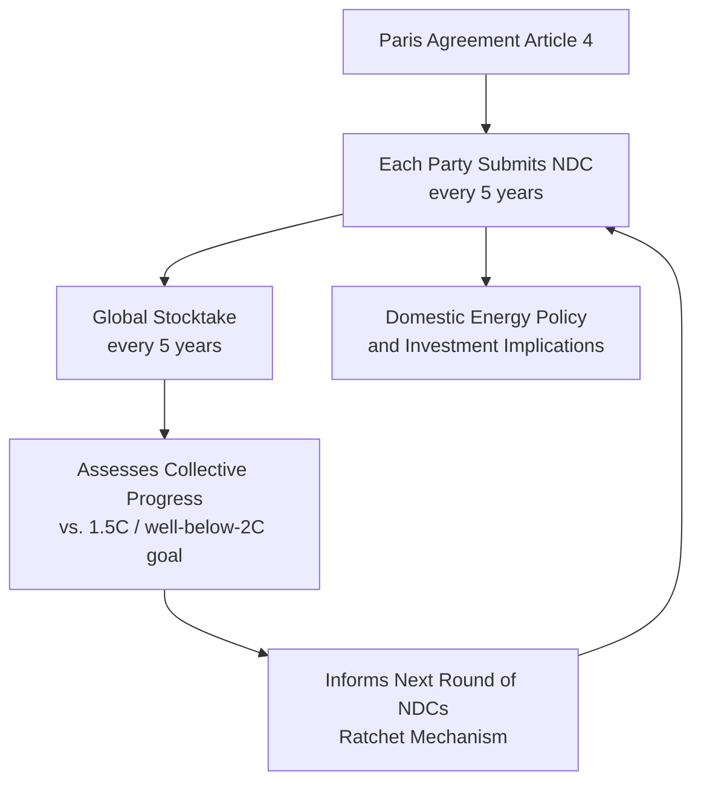
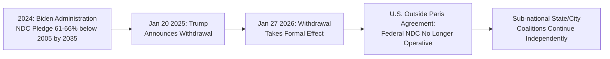

## Nationally Determined Contributions and Energy Sector Implications

### Definition and Legal Architecture

**Nationally Determined Contributions (NDCs)** are the national climate action plans each Party to the Paris Agreement (2015) is required to prepare, communicate, and maintain, setting out its intended greenhouse gas mitigation targets and, in many submissions, adaptation commitments. Unlike the top-down, internationally negotiated emissions targets of the earlier Kyoto Protocol, NDCs are **self-determined**: each country sets its own target reflecting its "highest possible ambition" given national circumstances, with no internationally enforced penalty mechanism for non-achievement — compliance rests on a **transparency and accountability framework** (reporting, review, and public scrutiny) rather than binding sanctions, a design feature often termed a "pledge and review" or "bottom-up" architecture, distinguishing it structurally from the top-down, legally binding national targets under Kyoto.

Under **Article 4** of the Paris Agreement, Parties must communicate successive NDCs every five years, with each successive NDC required to represent a **progression** beyond the previous one and reflect the Party's highest possible ambition (the **ratchet mechanism**) — a structural design intended to compensate for the absence of binding enforcement by building in a procedural expectation of increasing stringency over time. Parties are requested to submit new or updated NDCs every five years, and may at any time adjust an existing NDC to enhance its ambition. [UNFCCC](https://unfccc.int/process-and-meetings/the-paris-agreement/nationally-determined-contributions-ndcs)

### NDC Submission Cycles and the Global Stocktake

After the original NDCs in 2015 and the second round in 2020/2021, the third round of NDCs was due in 2025, detailing countries' intended climate actions through 2035. This third-round cycle is explicitly linked to the **Global Stocktake (GST)**, the Paris Agreement's periodic collective-progress review mechanism: the first Global Stocktake concluded in 2023, and Parties agreed to align their new NDCs with the goal of limiting warming to 1.5°C above pre-industrial levels, with particularly important GST outcomes including commitments to triple global renewable energy capacity by 2030 and double the global average annual rate of energy efficiency improvement. [United Nations](https://www.un.org/en/climatechange/all-about-ndcs)[Umweltbundesamt](https://www.umweltbundesamt.de/en/topics/climate-energy/nationally-determined-contributions-ndc)

The **energy sector implications** of this GST-informed ratchet are direct and specific: because energy-related CO$_2$ emissions constitute the large majority of most countries' total GHG inventories, the renewable capacity tripling and efficiency doubling targets emerging from the GST function as concrete, quantified energy-system benchmarks against which national NDC energy-sector commitments are increasingly assessed and compared.

### Current State of Third-Round NDC Ambition (as of 2025)

The empirical picture from the 2025 submission round shows a persistent gap between aggregate national ambition and the temperature goals the Agreement is designed to achieve. The UNFCCC's 2025 NDC Synthesis Report Update, published 10 November 2025, is based on 64 new or updated NDCs submitted by 64 Parties between 1 January 2024 and 30 September 2025, covering about 30 percent of total global emissions in 2019 — a limited dataset from which the secretariat cautions against drawing wide-ranging global conclusions. Nonetheless, the available synthesis suggests a significant ambition shortfall: implementing the NDCs submitted for target year 2035 would produce only a 12 percent reduction in global greenhouse gas emissions by 2035 compared to 2019, and the world is heading toward warming of 2.3 to 2.5°C by the end of the century under the 2025 NDCs — well above the Agreement's 1.5°C goal. [UNFCCC](https://unfccc.int/process-and-meetings/the-paris-agreement/nationally-determined-contributions-ndcs/2025-ndc-synthesis-report)[Umweltbundesamt](https://www.umweltbundesamt.de/en/topics/climate-energy/nationally-determined-contributions-ndc)

[Unverified] Because the NDC synthesis dataset was explicitly limited in coverage at time of the November 2025 update (covering only a subset of Parties and total emissions), and additional Parties continue submitting or revising NDCs on an ongoing basis, the specific aggregate warming-trajectory and emissions-gap figures cited here should be treated as a snapshot subject to revision as later synthesis reports incorporate additional submissions, rather than a final, settled global assessment.

Submission timing itself has also lagged the formal deadline: most countries missed the original 10 February 2025 deadline to update their NDCs under Paris Agreement terms. The EU, one of the larger emitters, used an extended timeline: the EU's updated NDC deadline was extended to September 2025, allowing the UN climate secretariat time to assess the collective effect of national climate plans ahead of COP30 in Belém, Brazil, in November 2025, and the EU's third NDC, approved by the Council and submitted ahead of COP30, reiterates the EU's existing goal of a net 55% GHG reduction by 2030 and introduces an indicative 2035 contribution range of 66.25% to 72.5%, on a path toward carbon neutrality by 2050. [Paris Agreement: What are NDCs and why do they matter? +2](https://www.weforum.org/stories/2025/02/cop29-ndcs-and-why-they-matter/)

### U.S. Position: Withdrawal from the Paris Agreement

A material and directly relevant development for this course topic is the **withdrawal of the United States from the Paris Agreement**, which has direct implications for U.S. federal energy policy alignment with any NDC framework. President Trump announced on his second-term inauguration day, January 20, 2025, that the U.S. would again withdraw from the Paris climate agreement, echoing his first-term 2017 withdrawal announcement. The withdrawal, formally set in motion via a written statement to the United Nations confirming that U.S. participation would end on January 27, 2026, took effect on that date, making the U.S. the only country to have withdrawn from the agreement twice. This withdrawal places the U.S. alongside Iran, Libya, and Yemen as the only nations standing outside the Paris Agreement. [statista](https://statista.com/chart/amp/9656/the-state-of-the-paris-agreement)

This has direct energy-sector policy relevance: a last-ditch NDC submission by the outgoing Biden administration in 2024 had pledged to reduce U.S. greenhouse gas emissions 61–66 percent compared to 2005 levels by 2035, but the subsequent Trump administration's broad rollback of climate action has made pursuit of that pledge unlikely, even as some U.S. state and city coalitions say they will continue striving toward the former federal commitment independently. [Unverified] Because sub-national U.S. climate commitments (state-level targets, coalitions such as the U.S. Climate Alliance) operate independently of the federal NDC and are subject to their own ongoing policy developments, their current specific targets and aggregate effect should be verified against current state-level sources for any application requiring precision.

### NDC Structural Components and Energy Sector Content

While NDC content and format vary by Party (reflecting the "nationally determined," bottom-up design), most substantive NDCs addressing energy typically include:

1. **Economy-wide or sector-specific emissions targets** — often expressed as a percentage reduction from a base year (e.g., the EU's "net 55% below 1990 levels by 2030" formulation) or as an emissions-intensity target relative to GDP (a format more commonly used by some large developing economies).
2. **Renewable energy capacity and generation-share targets** — directly operationalizing the GST-derived tripling-of-renewable-capacity benchmark within national energy planning.
3. **Energy efficiency improvement commitments** — targeting the rate of improvement in energy intensity (energy consumed per unit of GDP or per unit of output in key sectors), operationalizing the GST's efficiency-doubling benchmark.
4. **Fossil fuel phase-down/phase-out provisions** — increasingly explicit in more recent NDC submissions following COP26 and COP28 negotiated language on coal phase-down and, more broadly, transitioning away from fossil fuels in energy systems.
5. **Sectoral energy-system transition pathways** — power sector decarbonization trajectories, transport electrification targets, industrial decarbonization roadmaps, and building energy-efficiency standards, providing the granular linkage between the aggregate NDC target and the underlying **energy technology mix and investment pathway** required to achieve it.
6. **Long-Term Low-Emission Development Strategies (LT-LEDS)** — complementary longer-horizon (typically to 2050) strategy documents that some Parties submit alongside their NDC, providing the extended energy-system transition narrative underlying the nearer-term NDC target.

### Article 6 and International Carbon Market Cooperation

A structurally important recent development affecting how NDCs can be achieved is the operationalization of **Article 6** of the Paris Agreement, which establishes frameworks for voluntary international cooperation — including carbon markets — allowing Parties to transfer mitigation outcomes toward one another's NDCs. Following the completion of Article 6 negotiations at COP29, more Parties are beginning to define their approach to voluntary cooperation and establish the legal, regulatory, and institutional arrangements needed to participate. [UNFCCC](https://unfccc.int/process-and-meetings/the-paris-agreement/nationally-determined-contributions-ndcs/2025-ndc-synthesis-report)

This has direct energy sector relevance: Article 6 mechanisms create a pathway for cross-border financing of energy-transition projects (e.g., renewable generation capacity, grid infrastructure, energy efficiency retrofits) in one country to count, in whole or part, toward the mitigation target of the financing country's NDC — conceptually extending the carbon market linkage logic discussed in [[Cap-and-Trade Systems and Emissions Trading Design]] to an international, NDC-linked context, though [Unverified] the specific accounting rules, double-counting safeguards, and operational status of Article 6 trading mechanisms are still being implemented by individual Parties and should be verified against current UNFCCC Article 6 guidance for any application requiring current operational detail.

### NDC Ambition-Implementation Gap: Analytical Framework

Energy economists analyzing NDC adequacy typically distinguish between three related but distinct gaps, each with different energy-policy diagnostic implications:

| Gap Type | Definition | Energy Sector Diagnostic Focus |
| --- | --- | --- |
| **Ambition gap** | Difference between the sum of current NDC targets and the emissions trajectory required for the 1.5°C/well-below-2°C goal | Whether announced national targets are collectively stringent enough — a top-down, aggregate assessment |
| **Implementation gap** | Difference between a country's NDC target and its currently enacted/projected domestic policies (i.e., whether existing policy is sufficient to achieve the stated pledge) | Whether specific energy-sector policy instruments (carbon pricing, renewable mandates, efficiency standards) are calibrated to actually deliver the pledged energy-system transition |
| **Finance/investment gap** | Difference between the capital investment flowing into low-carbon energy infrastructure and the investment level required to achieve stated NDC energy targets | Whether power-sector, grid, and industrial capital expenditure trajectories are consistent with the technology deployment rates implied by the NDC |

[Inference] Of these three, the implementation gap is generally considered by energy policy analysts to be the most immediately actionable diagnostic for domestic energy policy design, since it directly identifies which specific instruments (carbon price level, renewable portfolio standard stringency, efficiency code adoption) would need strengthening to close the gap between stated ambition and enacted policy — though quantifying this gap with precision requires detailed country-specific energy-system modeling of the type discussed in [[Integrated Assessment Models Linking Energy, Economy, and Climate]].

### Linkage to Other Energy Policy Instruments

NDCs function as the top-level political commitment that domestic instruments are, in principle, designed to implement — creating direct linkages to instruments covered elsewhere in this course:

- **Carbon pricing calibration**: A country's NDC target provides the aggregate emissions constraint that domestic carbon tax rates or cap-and-trade cap trajectories (see [[Carbon Pricing Design: Taxes vs Cap-and-Trade Comparison]]) are, in a well-designed policy architecture, calibrated to achieve — though in practice many countries' domestic carbon pricing stringency has not been formally derived from or reconciled with their NDC trajectory, a documented implementation-gap pattern.
- **Renewable Portfolio Standards and technology mandates**: NDC renewable-capacity and generation-share commitments are frequently operationalized domestically through renewable portfolio standards, feed-in tariffs, or auction-based renewable procurement mechanisms.
- **Integrated Assessment Model scenario alignment**: Process-based IAM scenario libraries (MESSAGE, REMIND, GCAM, IMAGE) are used extensively to assess whether aggregate NDC ambition, if fully implemented, is consistent with specific temperature-outcome pathways — the modeling basis underlying the "2.3 to 2.5°C" trajectory assessment cited above.
- **Carbon border adjustment mechanisms**: As discussed under [[Carbon Border Adjustment Mechanisms]], divergent NDC ambition and domestic carbon-pricing stringency across countries is a primary driver of the carbon leakage concern that CBAMs are designed to address — meaning the pace and consistency of NDC implementation across major trading partners directly affects CBAM policy design and calibration.

### Next Steps

- **Integrated assessment models linking energy, economy, and climate**: the modeling basis for assessing NDC-implied temperature outcomes
- **Carbon pricing design: taxes vs cap-and-trade comparison**: domestic instrument calibration against NDC targets
- **Carbon border adjustment mechanisms**: interaction with divergent international NDC ambition levels
- **Article 6 international carbon market cooperation**: mechanics, double-counting safeguards, and operational status
- **Long-Term Low-Emission Development Strategies (LT-LEDS)**: extended-horizon energy transition planning
- **Renewable Portfolio Standards and national renewable capacity targets**: domestic operationalization of NDC energy commitments
- **Global Stocktake process and the Paris Agreement ratchet mechanism**
- **Sub-national and coalition-based climate commitments**: state, city, and regional climate action in the absence of federal-level NDC participation