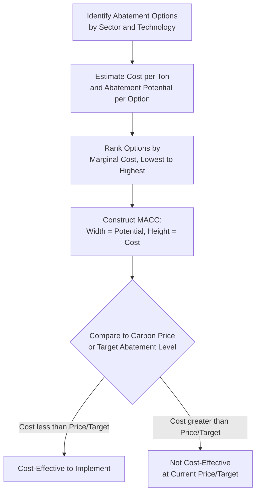
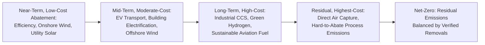

## Net-Zero Pathway Economics and Marginal Abatement Cost Curves

### Definition and Conceptual Foundation

**Net-zero** refers to a state in which anthropogenic greenhouse gas emissions are balanced by an equivalent quantity of anthropogenic removals over a specified period, such that net emissions to the atmosphere are zero. **Net-zero pathway economics** is the analytical study of the least-cost (or otherwise optimal) sequencing of abatement actions across sectors and time required to reach this state by a target date, typically informed by the **marginal abatement cost curve (MACC)** — a graphical and analytical tool ranking available abatement options by their cost per ton of emissions reduced.

The MACC is the central organizing device connecting this topic to the broader chapter: it operationalizes the equimarginal principle already introduced in [[Cap-and-Trade Systems and Emissions Trading Design]] and [[Command-and-Control vs Market-Based Environmental Regulation]] — cost-minimizing abatement requires equalizing marginal cost across all available options — but extends it from a static, single-period comparison across a handful of firms to a **multi-decade, economy-wide, multi-sector abatement sequencing problem**.

### The Marginal Abatement Cost Curve: Construction and Interpretation

A MACC is typically constructed as a bar chart in which:

- The **horizontal axis** represents cumulative abatement potential (tons of CO$_2$-equivalent reduced per year, or over the curve's time horizon), with each bar's width proportional to that option's abatement potential.
- The **vertical axis** represents the marginal cost of abatement for each option ($/tCO$_2$-eq), which can be **positive** (net cost to implement) or **negative** (net cost savings — a "negative-cost" abatement option that pays for itself, such as many energy efficiency retrofits with rapid payback periods).
- Bars are ordered from lowest to highest marginal cost, so the curve's shape directly shows the total cost of achieving any given cumulative abatement level: the area under the curve up to a chosen abatement quantity represents (approximately) the total cost of achieving that quantity if pursued in cost-minimizing order.

### SVG Illustration: Stylized Marginal Abatement Cost Curve

<svg xmlns="http://www.w3.org/2000/svg" viewBox="0 0 740 440" font-family="Helvetica, Arial, sans-serif">
<text x="370" y="24" text-anchor="middle" font-size="15" font-weight="bold" fill="#1a1a1a">Stylized Marginal Abatement Cost Curve (svg_diagram)</text>
<line x1="80" y1="240" x2="700" y2="240" stroke="#333" stroke-width="1.5" />
<line x1="80" y1="380" x2="80" y2="60" stroke="#333" stroke-width="2" />
<text x="390" y="410" text-anchor="middle" font-size="12" fill="#333">Cumulative Abatement Potential (Mt CO2-eq/yr)</text>
<text x="35" y="220" text-anchor="middle" font-size="12" fill="#333" transform="rotate(-90 35 220)">Marginal Cost ($/tCO2-eq)</text>
<rect x="80" y="270" width="60" height="-30" fill="#27ae60" />
<text x="105" y="255" font-size="9" fill="#1a1a1a" text-anchor="middle">LED lighting</text>
<rect x="140" y="240" width="70" height="60" fill="#27ae60" transform="translate(0,-60)" />
<rect x="140" y="180" width="70" height="60" fill="#27ae60" />
<text x="175" y="175" font-size="9" fill="#1a1a1a" text-anchor="middle">Building insulation</text>
<rect x="210" y="240" width="80" height="20" fill="#f1c40f" />
<text x="250" y="235" font-size="9" fill="#1a1a1a" text-anchor="middle">Onshore wind</text>
<rect x="290" y="240" width="90" height="60" fill="#f39c12" />
<text x="335" y="235" font-size="9" fill="#1a1a1a" text-anchor="middle">Utility solar PV</text>
<rect x="380" y="240" width="70" height="110" fill="#e67e22" />
<text x="415" y="235" font-size="9" fill="#1a1a1a" text-anchor="middle">EV transport</text>
<rect x="450" y="240" width="90" height="160" fill="#d35400" />
<text x="495" y="235" font-size="9" fill="#1a1a1a" text-anchor="middle">Industrial CCS</text>
<rect x="540" y="240" width="80" height="200" fill="#c0392b" />
<text x="580" y="235" font-size="9" fill="#1a1a1a" text-anchor="middle">Direct Air Capture</text>
<rect x="620" y="240" width="70" height="140" fill="#922b21" />
<text x="655" y="235" font-size="9" fill="#1a1a1a" text-anchor="middle">Green hydrogen (hard-to-abate)</text>
<line x1="80" y1="130" x2="700" y2="130" stroke="#999" stroke-width="1" stroke-dasharray="5,4" />
<text x="695" y="122" font-size="10" fill="#666" text-anchor="end">Illustrative carbon price</text>
</svg>

### Interpreting the "Hockey Stick" and Negative-Cost Segment

Empirical economy-wide MACCs (most famously popularized in McKinsey's global MACC studies) typically exhibit a characteristic **"hockey stick"** shape: a segment of negative-cost or low-cost options (energy efficiency in buildings, industrial process improvements, some low-cost renewable generation) followed by a steeply rising segment of progressively more expensive options (industrial process emissions in hard-to-abate sectors, carbon capture and storage, direct air capture, synthetic/e-fuels) as the curve approaches full decarbonization.

The **negative-cost segment** — abatement options that reduce net cost even before accounting for any externality benefit — presents a persistent puzzle in the economics literature, sometimes termed the **"energy efficiency gap"**: if these options genuinely pay for themselves, standard economic theory predicts profit-maximizing firms and utility-maximizing households would already have adopted them without requiring policy intervention. Commonly cited explanations for this apparent gap include:

- **Split incentives** — the party making the investment decision (e.g., a landlord) does not capture the resulting energy savings (which accrue to the tenant), blunting the incentive to invest even where the aggregate return is positive.
- **Capital constraints and high implicit discount rates** — households and some firms may face effective discount rates on efficiency investments far higher than market interest rates, due to liquidity constraints, risk aversion regarding uncertain future energy prices, or behavioral present-bias.
- **Information and search costs** — imperfect information about available efficiency options, expected savings, and installer quality can deter adoption even when the underlying investment is genuinely positive-NPV.
- **Hidden costs not captured in engineering-economic MACC estimates** — MACC studies often estimate costs using engineering/technical analysis that may omit transaction costs, comfort/convenience trade-offs, or the option value of waiting, which behavioral and applied microeconomic critiques argue can rationalize at least part of the apparent gap without requiring a market failure explanation. [Inference] The relative weight of "genuine market failure" versus "unmeasured real cost" explanations for the efficiency gap remains actively debated in the applied economics literature, and the appropriate policy response differs substantially depending on which explanation dominates in a given context.

### MACC Limitations as an Analytical Tool

Despite its widespread use in policy communication, the MACC framework has several well-documented methodological limitations that energy economists routinely flag:

1. **Static snapshot, not dynamic pathway**: A standard MACC represents abatement potential and cost at a single point in time (or for a single target year), but does not capture how costs evolve with technology learning, how early deployment of one technology affects the future cost of complementary technologies, or how the *sequencing* of abatement actions affects total system cost — a significant limitation given that decarbonization is inherently a multi-decade dynamic process.
2. **Interaction and interdependency effects ignored**: MACCs typically treat abatement options as independent and additive, but many options interact — e.g., building electrification's cost-effectiveness depends on the carbon intensity of the electricity grid it draws from, meaning the same efficiency or electrification measure's "cost per ton" shifts as the power sector itself decarbonizes, violating the assumption of a fixed, option-by-option marginal cost.
3. **Technology learning curves not captured in a static curve**: Costs for maturing technologies (battery storage, electrolyzers for green hydrogen, direct air capture) have historically declined substantially with cumulative deployment (a pattern described by **experience curves** or **Wright's Law**, often parameterized as a percentage cost reduction per doubling of cumulative capacity), meaning a MACC snapshot can significantly overstate the long-run cost of currently expensive options if deployed at scale over time.
4. **Abatement potential estimates are frequently contested**: Technical/engineering abatement potential (what is physically possible) often differs substantially from realistically achievable potential given behavioral, regulatory, financing, and supply-chain constraints, and MACC studies vary in which concept of "potential" they report.
5. **Uniform national or global aggregation obscures local variation**: A single aggregated MACC obscures substantial regional variation in resource availability (solar/wind resource quality, existing grid infrastructure, industrial composition), meaning a nationally- or globally-averaged MACC may not accurately represent the cost-effective pathway for any specific region.

### Net-Zero Pathway Sequencing: The Role of Hard-to-Abate Sectors

A defining feature of net-zero pathway economics is the recognition that abatement cost is highly heterogeneous across sectors, with a subset of **"hard-to-abate" sectors** — heavy industry (steel, cement, chemicals), aviation, shipping, and certain agricultural emissions — clustering at the high-cost end of the MACC due to a combination of high process-heat requirements difficult to electrify directly, limited current availability of cost-competitive low-carbon alternatives, and long asset lifetimes creating lock-in risk.

This sectoral cost heterogeneity has direct implications for **pathway sequencing economics**: a cost-minimizing net-zero trajectory generally implies pursuing the lowest-marginal-cost abatement options earliest and most aggressively, while hard-to-abate sector emissions persist longer into the pathway and are addressed later — either as their own technology costs decline through learning, or ultimately offset by carbon dioxide removal (CDR) for any residual emissions that remain technically or economically infeasible to eliminate by the target date.

### Worked Illustrative Example: Cost-Minimizing Sequencing Under a Carbon Budget

Suppose a jurisdiction has four abatement options with the following characteristics, and a target of 100 Mt CO$_2$/year cumulative abatement:

| Option | Marginal Cost ($/tCO$_2$) | Abatement Potential (Mt/yr) |
| --- | --- | --- |
| Building efficiency retrofits | -20 (net savings) | 15 |
| Onshore wind | 10 | 30 |
| Grid-scale battery storage + solar | 35 | 25 |
| Industrial process CCS | 90 | 20 |
| Direct air capture | 180 | 15 |

**Cost-minimizing sequencing** (lowest marginal cost first) to reach 100 Mt/yr:

$$15\ (\text{efficiency}) + 30\ (\text{wind}) + 25\ (\text{solar/storage}) + 20\ (\text{CCS}) = 90\ \text{Mt/yr}$$

This covers 90 Mt at a blended cost calculated as:

$$Total\ Cost = (15 \times -20) + (30 \times 10) + (25 \times 35) + (20 \times 90) = -300 + 300 + 875 + 1{,}800 = \$2{,}675\ \text{thousand/yr (illustrative units)}$$

The remaining 10 Mt/yr required to reach the 100 Mt target must draw on the next-cheapest option — direct air capture at $180/tCO$_2$ — adding $10 \times 180 = \$1,800$ (thousand/yr), for a total cost of $4,475 (thousand/yr) to hit the full target.

**Contrast with a uniform/non-optimized sequencing** (e.g., pursuing all five options at 20 Mt/yr each regardless of relative cost, reflecting a hypothetical politically-driven rather than cost-minimizing allocation): $20 \times (-20+10+35+90+180) = 20 \times 295 = \$5,900$ (thousand/yr) — substantially higher than the cost-minimizing sequencing's $4,475, illustrating the same equimarginal cost-minimization logic previously demonstrated in the cap-and-trade worked example, now applied across a multi-technology abatement portfolio rather than across firms.

### Carbon Dioxide Removal and the Residual Emissions Gap

Because the marginal cost of eliminating the final increment of emissions in hard-to-abate sectors typically rises steeply (as illustrated by the direct air capture and industrial CCS segments of the stylized MACC above), most net-zero pathway analyses — consistent with the process-based IAM scenario literature discussed in [[Integrated Assessment Models Linking Energy, Economy, and Climate]] — do not project literal zero gross emissions by the target date, but rather a **residual emissions level** balanced by **carbon dioxide removal (CDR)**:

$$Net\ Emissions = Gross\ Emissions_{residual} - CDR_{deployed} = 0$$

CDR pathways commonly incorporated into net-zero economic analysis include:

- **Afforestation/reforestation and improved land management** — generally among the lower-cost CDR options currently available, but constrained by land availability, permanence risk (carbon storage reversal via fire, disease, or land-use change), and measurement/verification challenges.
- **Bioenergy with Carbon Capture and Storage (BECCS)** — combines bioenergy generation with captured and geologically stored CO$_2$, frequently featured prominently in IAM net-zero scenario literature, though [Inference] the land, water, and biomass supply-chain scale implied by some high-BECCS-reliance scenarios has drawn sustained methodological and feasibility critique, as previously noted in the IAM entry.
- **Direct Air Capture (DAC)** — technologically flexible (not land-constrained in the same way as biological removal) but currently among the highest-cost CDR options, positioned at the top of most MACCs, with cost trajectories highly dependent on future technology learning and dedicated low-carbon energy input availability.
- **Enhanced weathering and ocean-based CDR approaches** — earlier-stage technologies with less mature cost data and more significant measurement/verification and ecological-impact uncertainty than the above categories.

### Investment and Capital Reallocation Dimensions

Net-zero pathway economics extends beyond the MACC's static cost-ranking to encompass the **capital reallocation** required to shift investment flows from high-carbon to low-carbon energy infrastructure at the pace and scale implied by the pathway. Key economic considerations include:

- **Stranded asset risk**: existing fossil fuel infrastructure (power plants, extraction assets, pipelines) with capital not yet fully depreciated may need to be retired before the end of its otherwise-expected economic life to remain consistent with a net-zero-aligned emissions trajectory, creating a **stranded asset** — a capital loss borne by asset owners, investors, or (depending on regulatory cost-recovery arrangements) ratepayers.
- **Capital cost of low-carbon technologies and the cost of capital**: many low-carbon energy technologies (renewables, nuclear, transmission infrastructure) are comparatively capital-intensive with low ongoing operating costs relative to fossil alternatives, meaning their levelized cost is disproportionately sensitive to the **cost of capital** (interest rates, project risk premiums) — a consideration that gives risk-mitigating policy tools (loan guarantees, contracts-for-difference, other de-risking mechanisms) outsized leverage on overall pathway cost relative to their nominal fiscal size.
- **Sequencing and lock-in avoidance**: net-zero pathway analysis places emphasis on avoiding new long-lived high-carbon capital investment (e.g., a new coal plant with a 40-year expected life) that would either need to be retired early (stranded) or would lock in emissions inconsistent with the target trajectory if operated for its full expected life — a dynamic consideration not captured in a static MACC snapshot.

### Policy Applications

- **Carbon price trajectory design**: A MACC-informed understanding of where abatement options cluster by cost directly informs the carbon price *level and trajectory* needed to induce voluntary adoption of successive cost tiers over time, connecting directly to the Pigouvian tax and cap-and-trade design treatments elsewhere in this course.
- **Sectoral policy targeting**: Recognition that a uniform economy-wide carbon price alone may be insufficient to address hard-to-abate sector emissions (given their position at the steep end of the MACC and potential competitiveness/leakage exposure) has motivated complementary sector-specific policy tools — green public procurement standards, contracts-for-difference for first-of-a-kind industrial decarbonization projects, and dedicated hydrogen/CCS infrastructure investment support.
- **R&D and innovation policy prioritization**: MACC analysis identifying which technologies sit at the high-cost end of the curve helps prioritize public research and development funding toward the technologies (e.g., green hydrogen electrolyzers, direct air capture) where cost reduction through learning-by-doing and R&D would most reduce the total cost of achieving net-zero.
- **National net-zero target credibility assessment**: MACC-based bottom-up sectoral analysis provides a complementary cross-check against the top-down NDC and IAM-scenario-based assessments discussed in [[Nationally Determined Contributions and Energy Sector Implications]], helping identify whether a stated net-zero target is technically and economically consistent with the specific abatement options actually available within the relevant timeframe.

### Next Steps

- **Integrated assessment models linking energy, economy, and climate**: dynamic pathway modeling as a complement to static MACC analysis
- **Nationally determined contributions and energy sector implications**: top-down target-setting informed by bottom-up MACC analysis
- **Technology learning curves and Wright's Law**: dynamic cost decline modeling for emerging abatement technologies
- **Stranded asset risk and just transition economics**: capital reallocation and asset-retirement considerations
- **Carbon dioxide removal methodologies**: BECCS, direct air capture, and land-based removal comparative economics
- **The energy efficiency gap**: behavioral and market-failure explanations for negative-cost abatement non-adoption
- **Cost of capital and de-risking policy instruments**: contracts-for-difference, loan guarantees, and capital-intensive technology deployment
- **Hard-to-abate sector decarbonization**: industrial process heat, aviation, and shipping-specific policy design