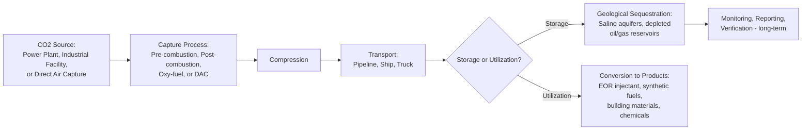
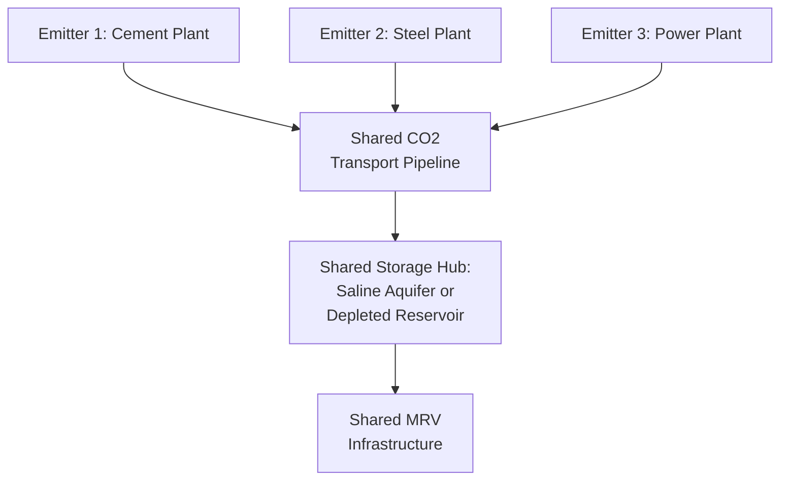

## Carbon Capture, Utilization, and Storage Economics

### Definition and System Components

**Carbon Capture, Utilization, and Storage (CCUS)** refers to a suite of technologies that capture CO$_2$ emissions from large point sources (power plants, industrial facilities) or directly from ambient air, and either permanently sequester the captured CO$_2$ in geological formations (**storage**) or convert it into commercial products (**utilization**), such as synthetic fuels, building materials, or enhanced oil recovery injectant. The economics of CCUS is distinguished from most other abatement options on the [[Net-Zero Pathway Economics and Marginal Abatement Cost Curves|net-zero MACC]] by its **multi-stage cost structure**, spanning capture, transport, and storage/utilization, each with distinct cost drivers and technology maturity levels.

### Capture Technology Pathways and Cost Drivers

Three principal capture configurations exist for point-source capture, each with distinct cost and applicability profiles:

1. **Post-combustion capture** — CO$_2$ is separated from flue gas after conventional combustion, typically using amine-based chemical absorption; this configuration can be retrofitted to existing fossil fuel power plants and industrial facilities, making it the most commonly deployed configuration for retrofit applications, though the flue gas's relatively dilute CO$_2$ concentration (particularly for natural gas combustion) increases the energy penalty of separation.
2. **Pre-combustion capture** — fuel is first converted to a syngas (via gasification or reforming), CO$_2$ is separated from the resulting hydrogen-rich stream before combustion; this configuration achieves higher CO$_2$ concentration in the separation stream (lower separation energy penalty) but requires a fundamentally different plant design (integrated gasification combined cycle, IGCC), limiting retrofit applicability to existing conventional combustion plants.
3. **Oxy-fuel combustion** — fuel is combusted in a high-purity oxygen stream (rather than air) producing a flue gas stream that is predominantly CO$_2$ and water vapor, simplifying downstream separation, but requiring an air separation unit to produce the oxygen feed, itself an energy-intensive process.

**Direct Air Capture (DAC)** — a fundamentally distinct category — captures CO$_2$ directly from ambient air rather than a concentrated point-source stream. Because atmospheric CO$_2$ concentration (approximately 420 ppm, versus flue gas concentrations often in the 4–15% range for point sources) is orders of magnitude more dilute, DAC's thermodynamic separation energy requirement per ton of CO$_2$ captured is substantially higher than point-source capture, placing DAC at the high-cost end of the abatement cost curve as illustrated in the net-zero MACC entry, though DAC carries the distinct advantage of being applicable regardless of emission source location (relevant for addressing genuinely diffuse or hard-to-capture-at-source emissions, and for direct carbon removal rather than avoided-emissions accounting).

### Cost Structure: Capture, Transport, and Storage

**Capture cost** is typically the dominant component of total CCUS cost and is highly sensitive to the CO$_2$ concentration and volume of the source stream — a relationship sometimes summarized as a **cost hierarchy by source type**:

| Source Category | Relative CO$_2$ Concentration | Relative Capture Cost |
| --- | --- | --- |
| Ethanol fermentation, ammonia production | Very high (often near-pure CO$_2$ stream) | Lowest — often the cheapest capture applications |
| Natural gas processing | High | Low |
| Cement, steel production | Moderate | Moderate |
| Coal-fired power generation | Moderate | Moderate-to-high |
| Natural gas combined cycle power generation | Lower (more dilute flue gas) | Higher |
| Direct air capture | Very low (ambient, ~420 ppm) | Highest |

This concentration-cost relationship is a key reason why early commercial CCUS deployment has concentrated disproportionately in high-concentration industrial applications (natural gas processing, ethanol production) rather than power-sector applications, despite power generation's larger absolute emissions volume — the marginal cost per ton captured is simply far more favorable at high-concentration sources.

**Transport cost** depends on distance, volume, and mode (pipeline transport exhibits strong economies of scale and is generally the lowest-cost option for large, sustained volumes over moderate distances; shipping becomes relevant for cross-border or trans-oceanic transport where pipeline infrastructure is infeasible). Transport cost is a comparatively small share of total CCUS cost for projects with proximate, well-suited storage sites, but can become a significant cost driver — and a major project-siting constraint — where capture sources are geographically distant from suitable geological storage formations, motivating the **CCUS hub-and-cluster** model discussed below.

**Storage cost** depends on the geological formation type (saline aquifers versus depleted oil/gas reservoirs, which often benefit from pre-existing characterization data and infrastructure from prior hydrocarbon extraction), injection well drilling and completion costs, and long-term monitoring, reporting, and verification (MRV) obligations extending potentially decades beyond active injection, to confirm storage permanence and detect any leakage.

### The Hub-and-Cluster Model

Given the fixed-cost-intensive nature of CO$_2$ transport and storage infrastructure (pipeline construction, storage site characterization and permitting), CCUS project economics benefit substantially from **shared infrastructure models**, in which multiple capture sources (an industrial cluster) share common transport pipeline and storage infrastructure, spreading fixed infrastructure costs across a larger aggregate CO$_2$ volume and improving the economics for individual emitters — particularly smaller facilities that could not independently justify dedicated transport and storage infrastructure.

[Unverified] Because CCUS hub development is an active area of infrastructure buildout in multiple jurisdictions, with new hub projects announced, financed, and in some cases delayed or cancelled on an ongoing basis, current project status, capacity, and specific locations should be verified against current industry and government project-tracking sources for any application requiring up-to-date project-level detail.

### Enhanced Oil Recovery: The Historical Utilization Pathway

**Enhanced Oil Recovery (EOR)** — injecting captured CO$_2$ into depleting oil reservoirs to increase extractable oil volume — has historically been the dominant commercial utilization pathway for captured CO$_2$, predating climate-motivated CCUS policy by decades and originally developed purely as an oil-extraction technique. EOR's economic significance for CCUS is that it can generate **direct revenue** (from the incrementally recovered oil) that offsets some or all of the capture and transport cost, historically making EOR-linked CCUS projects economically viable in some cases even without a carbon price or dedicated subsidy.

This pathway raises a distinct and widely discussed **accounting and climate-integrity question**: because the CO$_2$ injected for EOR enables extraction of additional oil that is subsequently combusted (itself releasing CO$_2$), the *net* climate benefit of EOR-linked CCUS depends on the balance between CO$_2$ permanently stored underground versus the additional emissions from the incrementally recovered and combusted oil — a lifecycle accounting question that has generated substantial debate regarding whether, and under what specific conditions, EOR-linked CCUS should qualify for climate policy credit (e.g., under carbon tax credit programs) on the same basis as pure geological storage with no associated hydrocarbon extraction.

### Policy Support Mechanisms

Given CCUS's currently high cost relative to many other abatement options on the MACC (as discussed in the net-zero pathway entry) and its comparatively early commercial deployment stage for power-sector and dilute-source applications, most existing CCUS projects rely substantially on dedicated policy support rather than a general economy-wide carbon price alone. Common mechanisms include:

- **Per-ton tax credits for captured and stored/utilized CO$_2$** — a direct financial incentive scaled to captured tonnage, differentiated by pathway (storage typically credited at a higher rate than EOR-linked utilization, reflecting the storage-permanence distinction discussed above, and DAC typically credited at the highest rate given its higher cost and direct-removal characteristic). [Unverified] Specific credit values, eligibility rules, and program names vary by jurisdiction and are subject to legislative revision; current rates should be verified against the applicable jurisdiction's current tax code or program documentation.
- **Contracts-for-difference (CfD) and carbon price guarantee mechanisms** — providing project developers a guaranteed effective carbon price (topping up the market/policy carbon price to a contracted strike price if the prevailing price falls short), reducing revenue uncertainty for capital-intensive, long-lived CCUS infrastructure investment — a mechanism structurally analogous to renewable energy CfDs used in some jurisdictions' offshore wind procurement.
- **Capital grants and infrastructure co-funding** — direct public co-investment in shared transport and storage hub infrastructure, reflecting the public-good characteristics of shared infrastructure (non-rival, difficult for a single private investor to fully capture the option value of enabling future connectees) discussed in the hub-and-cluster model above.
- **Inclusion in emissions trading systems as an eligible compliance pathway** — allowing captured and permanently stored CO$_2$ to reduce a regulated facility's net emissions for cap-and-trade or carbon tax compliance purposes, directly connecting CCUS project economics to the broader carbon pricing framework discussed in [[Carbon Pricing Design: Taxes vs Cap-and-Trade Comparison]].

### Cost Trajectory and Technology Learning

As with other maturing energy technologies discussed in the net-zero pathway entry, CCUS capture costs are generally expected — though with meaningfully wide uncertainty bands reflecting the technology's earlier and more heterogeneous deployment history relative to, for instance, solar PV or lithium-ion batteries — to decline with cumulative deployment and technological learning, particularly for capture technology (solvent formulation improvements, process heat integration, modularization of capture equipment). [Inference] The empirical learning-rate evidence for CCUS specifically is less extensive and more contested than for renewable generation or battery technologies, given CCUS's smaller cumulative deployed capacity to date and its more heterogeneous mix of source types and capture configurations, making cost-decline projections for CCUS carry proportionally greater uncertainty than comparable projections for more extensively deployed technologies.

### Comparative Economic Positioning on the Abatement Cost Curve

Reprising the net-zero pathway MACC framework, CCUS applications occupy a range of positions depending on source type and configuration:

| CCUS Application | Approximate Relative Cost Position | Key Cost Driver |
| --- | --- | --- |
| High-purity industrial sources (ethanol, ammonia) | Low-to-moderate | Minimal separation energy penalty |
| Natural gas processing | Low-to-moderate | High native CO$_2$ concentration in process stream |
| Cement and steel process emissions | Moderate-to-high | Process (not just combustion) emissions with limited alternative abatement options, making CCUS comparatively attractive despite its own cost |
| Power generation (coal, natural gas) | Moderate-to-high | Energy penalty for capture reduces net plant output/efficiency |
| Direct Air Capture | Highest | Very low ambient CO$_2$ concentration drives high separation energy requirement |

This positioning explains why CCUS is frequently characterized in net-zero pathway analysis as a **priority option specifically for hard-to-abate industrial process emissions** (cement's process emissions from limestone calcination, for instance, have no direct fuel-switching alternative the way power generation does), even where CCUS is not currently cost-competitive for power-sector applications against alternative low-carbon generation technologies (wind, solar, nuclear) that have achieved greater cost reduction through more extensive cumulative deployment.

### Utilization Pathways Beyond EOR

Beyond EOR, a range of **CO$_2$ utilization** pathways convert captured CO$_2$ into commercial products, with economics varying substantially by product and market:

- **Mineralization and building materials** — captured CO$_2$ reacted with calcium- or magnesium-bearing minerals (or incorporated into concrete curing processes) to produce building materials with embedded, permanently mineralized CO$_2$; this pathway offers genuine long-term storage permanence (comparable to geological storage) combined with a marketable product, though total addressable CO$_2$ volume is constrained by construction materials market size.
- **Synthetic fuels (e-fuels)** — captured CO$_2$ combined with low-carbon hydrogen (via the [[Net-Zero Pathway Economics and Marginal Abatement Cost Curves|hard-to-abate sector]] hydrogen pathways) to produce synthetic hydrocarbon fuels for aviation or shipping applications where direct electrification is currently infeasible; this pathway's climate benefit depends critically on the captured CO$_2$ source (capture from a fossil point source versus DAC) and the carbon intensity of the hydrogen input, since the CO$_2$ is ultimately re-released upon fuel combustion (a **cycling**, rather than permanent storage, pathway) — meaning e-fuels function primarily as a low-carbon fuel substitute rather than a net emissions-removal pathway, a distinction with direct implications for climate policy accounting treatment.
- **Chemical feedstocks** — captured CO$_2$ as an input to various chemical synthesis processes (e.g., certain polymer and specialty chemical production), generally a smaller-volume, higher-value application relative to fuels or building materials.

[Inference] Utilization pathways that ultimately re-release the captured CO$_2$ (synthetic fuels, some chemical applications) provide climate benefit primarily through fossil-fuel *displacement* rather than net atmospheric carbon removal, a distinction that is sometimes conflated in public discussion of "carbon utilization" but that carries materially different climate-accounting and policy-eligibility implications than genuinely permanent storage or mineralization pathways.

### Critiques and Limitations

- **Energy penalty and net efficiency loss**: Capture processes consume substantial energy (for solvent regeneration, compression, and in some configurations, oxygen separation), reducing the net output or efficiency of the host facility — a real resource cost that must be included in full lifecycle cost and emissions accounting, and that is sometimes understated in simplified project-level cost comparisons.
- **Long-term storage integrity and liability**: Geological CO$_2$ storage requires monitoring commitments extending potentially decades beyond active injection to verify no leakage occurs, raising **long-term liability allocation** questions — who bears responsibility (and cost) for monitoring and any remediation if a storage site is found to leak decades after project completion, after the original developer may no longer exist in its original form — a policy and legal design challenge distinct from, but economically consequential alongside, the upfront capital cost economics discussed above.
- **Deployment scale relative to net-zero pathway requirements**: [Inference] Given CCUS's currently modest cumulative global deployed capacity relative to the volumes implied by net-zero pathway scenarios reliant on substantial CCUS/BECCS contribution (as discussed in the IAM and net-zero pathway entries), there is active debate in the literature regarding whether current deployment trajectories, financing availability, and hub infrastructure buildout rates are consistent with the scale of CCUS deployment assumed in many net-zero scenario pathways — a feasibility concern analogous to, and often discussed alongside, the BECCS scale-up feasibility critique noted in the IAM entry.
- **Opportunity cost relative to alternative abatement options**: Given CCUS's position at the moderate-to-high end of the MACC for many applications, critics have argued that policy support directed toward CCUS in sectors where lower-cost alternative abatement options exist (e.g., some power-sector applications where renewable generation may be more cost-competitive) may not represent the most cost-effective use of limited public financial support, relative to prioritizing CCUS specifically for genuinely hard-to-abate process emissions lacking comparable alternatives.

### Next Steps

- **Net-zero pathway economics and marginal abatement cost curves**: CCUS's positioning within the broader abatement option ranking
- **Carbon pricing design: taxes vs cap-and-trade comparison**: CCUS as a compliance pathway within carbon pricing systems
- **Hydrogen economy economics**: green/blue hydrogen production cost and its interaction with CCUS-linked "blue" hydrogen and e-fuel pathways
- **Technology learning curves and Wright's Law**: applicability and uncertainty specific to CCUS cost projections
- **Long-term liability and monitoring frameworks for geological CO2 storage**
- **Enhanced oil recovery lifecycle accounting**: net climate benefit methodology and policy eligibility debates
- **CCUS hub-and-cluster infrastructure development**: shared infrastructure economics and public co-investment rationale
- **Carbon dioxide removal methodologies**: comparative economics of DAC versus biological and mineralization-based removal