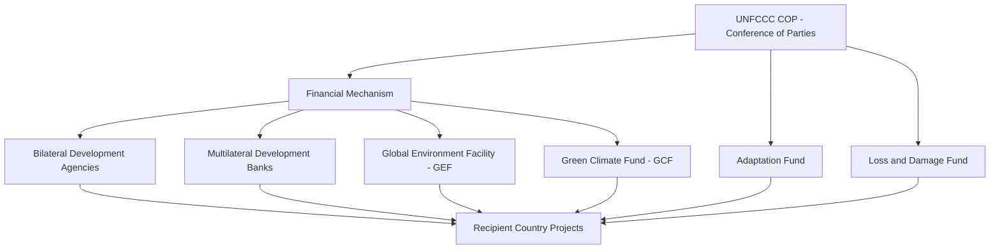
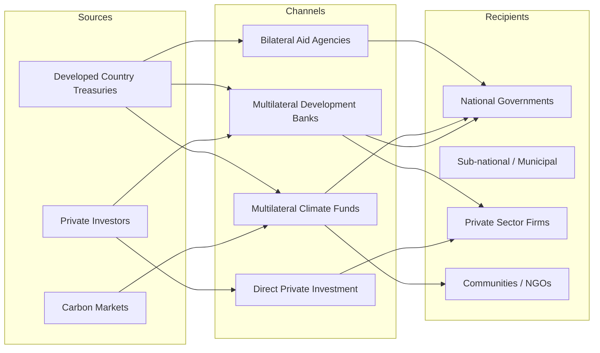

## Climate Finance Mechanisms and International Transfers

### Definition and Scope

Climate finance refers to the local, national, or transnational financing drawn from public, private, and alternative sources that seeks to support mitigation and adaptation actions addressing climate change. International transfers within this system move capital from high-income, historically high-emitting countries to developing countries, reflecting both the economic logic of externality compensation and the legal principle of common but differentiated responsibilities (CBDR) embedded in the UNFCCC framework.

**Key Points**

- Climate finance encompasses grants, concessional loans, equity, guarantees, and results-based payments.
- It is distinct from general development finance in that it must have a "climate rationale" — a demonstrable link to mitigation (reducing greenhouse gas emissions) or adaptation (reducing vulnerability to climate impacts).
- International transfers are the operationalization of the "polluter pays" and "ability to pay" principles at a global scale.

---

### Theoretical Foundations

#### Externalities and the Case for Transfers

Greenhouse gas emissions are a classic global public bad: the atmosphere's capacity to absorb $CO_2$ without triggering dangerous warming is a global commons. Because emissions mix globally, the marginal damage from a tonne of $CO_2$ is the same regardless of where it is emitted, but the marginal cost of abatement varies enormously by country and technology. This divergence between where abatement is cheapest and where the willingness (and historical responsibility) to pay is highest creates the economic rationale for cross-border transfers.

If $MAC_i$ denotes the marginal abatement cost in country $i$, efficient global mitigation requires equalizing marginal costs across countries:

$$MAC_1 = MAC_2 = \dots = MAC_n$$

Since developing countries frequently have lower $MAC_i$ (due to less efficient existing capital stock, greater low-hanging fruit in renewables and forestry), financing their abatement is often cheaper than equivalent abatement in developed economies. Climate finance transfers are, in principle, a mechanism to exploit this cost differential while ensuring developed countries meet their aggregate mitigation and burden-sharing obligations.

#### Burden-Sharing Principles

Three principles recur in climate finance negotiations:

- **CBDR-RC (Common But Differentiated Responsibilities and Respective Capabilities)**: enshrined in Article 4 of the UNFCCC; developed countries ("Annex II" parties) bear primary responsibility for providing finance.
- **Polluter Pays Principle**: responsibility scaled to cumulative historical emissions.
- **Ability to Pay**: responsibility scaled to current GDP per capita or fiscal capacity.

[Inference] The tension between these principles — historical responsibility versus current capacity — is a persistent source of disagreement in negotiations such as the New Collective Quantified Goal (NCQG), since they can generate very different burden-sharing formulas depending on which is weighted more heavily.

---

### Institutional Architecture

#### The UNFCCC Financial Mechanism

**Key Institutions**

| Institution | Established | Primary Focus | Funding Model |
| --- | --- | --- | --- |
| Global Environment Facility (GEF) | 1991 | Multi-focal (climate, biodiversity, land degradation) | Donor replenishment cycles |
| Green Climate Fund (GCF) | 2010 (Cancún) | Mitigation and adaptation, 50/50 allocation target | Donor pledges, capital markets |
| Adaptation Fund | 2001 (Kyoto Protocol) | Adaptation only, for developing countries vulnerable to climate change | Share of proceeds from CDM, donor contributions |
| Loss and Damage Fund | 2022 (COP27), operationalized 2023–2024 | Compensating unavoidable climate impacts | Voluntary donor contributions |
| Multilateral Development Banks (MDBs) | Various (World Bank 1944, ADB 1966, etc.) | Blended climate and development lending | Capital markets, callable capital |

[Unverified] Exact disbursement figures and replenishment totals for these funds change with each pledging cycle and should be checked against current GCF/GEF annual reports rather than treated as fixed figures.

#### The $100 Billion Goal and the NCQG

At COP15 (2009, Copenhagen), developed countries committed to mobilizing $100 billion per year by 2020 for developing country climate action, formalized at COP16 (Cancún). This target was widely criticized by economists and recipient countries as arbitrary (not derived from a needs assessment) and was reportedly met only in 2022, two years late, based on OECD accounting.

At COP29 (2024, Baku), parties adopted the **New Collective Quantified Goal (NCQG)**, setting a floor of $300 billion per year by 2035 from developed countries, nested within a broader aspirational goal of $1.3 trillion per year from all sources (public, private, bilateral, multilateral) — the so-called "Baku to Belém Roadmap to 1.3T." [Unverified] Given that these are recently negotiated figures, exact accounting rules, baselines, and compliance tracking mechanisms were still being elaborated at the time of writing and should be verified against the latest UNFCCC decision text.

---

### Classification of Financial Instruments

#### By Instrument Type

**Grants**

- Non-repayable transfers, typically used for adaptation, capacity-building, and least-developed-country (LDC) support.
- Highest "concessionality" (grant equivalent = 100% of face value).
- Preferred by recipients since they carry no debt-service burden, but constrained by donor budget cycles.

**Concessional Loans**

- Below-market interest rates and/or extended grace periods.
- Grant element calculated as:

$$GE = 1 - \frac{PV(\text{loan repayments at market rate})}{\text{Face value of loan}}$$

- The OECD DAC classifies Official Development Assistance (ODA) as requiring a minimum grant element (historically 25% discounted at 10%, revised in 2014 to differentiated discount rates by country income group).

**Equity and Guarantees**

- Used mainly to de-risk private investment in renewable energy or resilient infrastructure in emerging markets.
- Guarantees (e.g., partial risk guarantees from MIGA, the World Bank's political risk insurer) absorb specific risk categories (currency inconvertibility, expropriation, breach of contract) to crowd in private capital that would otherwise price in prohibitive risk premia.

**Results-Based Payments (RBP)**

- Disbursement conditional on verified outcomes, exemplified by REDD+ (Reducing Emissions from Deforestation and Forest Degradation) payments, which pay per verified tonne of $CO_2$ emissions avoided.

#### By Delivery Channel

---

### Carbon Market-Based Transfer Mechanisms

#### Clean Development Mechanism (CDM) — Kyoto Protocol Era

The CDM (1997–2020) allowed Annex I (developed) countries to fund emission-reduction projects in non-Annex I (developing) countries and claim Certified Emission Reductions (CERs) toward their own targets. This is a textbook application of the equimarginal principle described above: since $MAC$ differed across countries, offsetting allowed cheaper abatement to substitute for costlier domestic abatement, in theory achieving the same global reduction at lower total cost.

[Inference] In practice, the CDM's efficiency gains were substantially eroded by well-documented additionality problems — many registered projects would plausibly have occurred without CDM revenue — which undermined the environmental integrity of the transferred credits.

#### Article 6 of the Paris Agreement

Article 6 replaces the CDM with three mechanisms:

- **Article 6.2**: Cooperative approaches allowing bilateral/multilateral trading of Internationally Transferred Mitigation Outcomes (ITMOs), with corresponding adjustments to prevent double-counting.
- **Article 6.4**: A centralized crediting mechanism (the "Paris Agreement Crediting Mechanism," successor to the CDM), supervised by a UN body.
- **Article 6.8**: Non-market cooperative approaches (e.g., direct technical/financial cooperation without credit generation).

**Corresponding Adjustment Logic**

If country A sells a mitigation outcome to country B, country A must add the transferred tonnes back to its own emissions ledger and country B subtracts them, preventing both countries from claiming the same reduction:

$$NDC_A^{adjusted} = NDC_A^{initial} + ITMO_{transferred}$$

$$NDC_B^{adjusted} = NDC_B^{initial} - ITMO_{purchased}$$

[Unverified] Operational guidance on Article 6.4 methodologies, baseline-setting, and the share of proceeds for adaptation was still being finalized through supervisory body decisions in the 2024–2026 period; current rules should be checked against the latest CMA (Conference of the Parties serving as the Meeting of the Parties to the Paris Agreement) decisions.

---

### Adaptation Finance vs. Mitigation Finance

#### The Allocation Imbalance

Mitigation projects (renewable energy, energy efficiency) typically generate revenue streams (electricity sales, carbon credits), making them attractive to private co-financiers and MDB loan instruments. Adaptation projects (flood defenses, drought-resistant agriculture, early warning systems) often generate public-good benefits with no direct revenue stream, making them harder to finance through loans and more reliant on grants.

This creates a structural skew: historically, the majority of tracked climate finance has flowed to mitigation, with adaptation persistently underfunded relative to assessed needs. The Paris Agreement's Article 9.4 and subsequent COP decisions have repeatedly called for a doubling of adaptation finance, and the GCF's 50/50 mitigation-adaptation allocation target is a direct policy response to this imbalance.

**Key Points**

- Adaptation finance needs in developing countries are estimated by UNEP's Adaptation Gap Report series to be many multiples of current flows.
- [Unverified] Precise multiples (e.g., "10-18 times current flows") shift with each annual UNEP Adaptation Gap Report and should be sourced from the latest edition rather than cited as a fixed constant.

---

### Loss and Damage: A Distinct Category

Loss and damage (L&D) finance is conceptually distinct from mitigation and adaptation finance: it addresses residual climate impacts that occur *despite* mitigation and adaptation — e.g., permanent loss of land to sea-level rise, or catastrophic losses from an extreme event exceeding adaptive capacity.

Economically, L&D finance functions closer to an ex-post compensation or insurance payout than an ex-ante investment, which raises distinct questions:

- **Attribution**: linking specific damages to anthropogenic climate change requires climate attribution science, which assigns probabilistic responsibility (e.g., "climate change made this event $X$ times more likely").
- **Liability vs. Solidarity Framing**: developed countries have historically resisted framing L&D payments as legal liability/compensation (fearing open-ended litigation exposure) and prefer a "solidarity" or "humanitarian" framing; developing countries and vulnerable-nation blocs (e.g., AOSIS, the Alliance of Small Island States) have pushed for liability-based framing.

The Loss and Damage Fund agreed at COP27 (2022) and operationalized at COP28 (2023) represents a political compromise: a dedicated fund exists, but without an explicit liability admission.

---

### Measurement, Reporting, and Verification (MRV) Challenges

#### The Double-Counting Problem

Because climate finance is reported voluntarily by donor countries under UNFCCC biennial reporting requirements, and recipient countries independently track inflows, discrepancies are common. Common sources of divergence include:

- **Grant-equivalent vs. face-value accounting**: donors may report the full face value of a loan rather than its grant-equivalent, inflating headline figures.
- **Climate-relevance coefficients**: OECD DAC "Rio Markers" classify aid as having climate change as a "principal" or "significant" objective; assigning "significant" status to projects with only marginal climate relevance is a recognized source of over-counting.
- **Double-counting across channels**: the same underlying capital may be counted by both a bilateral donor and a multilateral fund it capitalizes.

[Inference] Academic and NGO analyses (e.g., by Oxfam's "Climate Finance Shadow Reports") have repeatedly argued that using grant-equivalent accounting substantially reduces headline climate finance totals relative to face-value reporting, though the exact magnitude of adjustment is contested and methodology-dependent.

#### Additionality

A recurring MRV and economic question: is climate finance "new and additional" to pre-existing development aid, or is it repurposed/relabeled ODA? This matters because:

1. If climate finance simply displaces general development aid, it does not represent a net increase in resource transfers.
2. Developing countries negotiated for additionality specifically because they feared climate obligations would be met by relabeling existing aid commitments.

---

### Blended Finance and Private Capital Mobilization

#### Rationale

Public climate finance alone is insufficient to meet estimated investment needs (often cited in the trillions of dollars annually for the energy transition). Blended finance uses concessional public/philanthropic capital to alter the risk-return profile of a project, "crowding in" commercial investors who would not otherwise participate.

#### Typical Capital Stack Structure

- **First-loss tranche**: absorbs initial losses, typically funded by donor governments, philanthropies, or MDB concessional windows.
- **Mezzanine layer**: subordinated but senior to first-loss capital, often funded by Development Finance Institutions (DFIs).
- **Senior tranches**: commercial capital, protected by the buffer of subordinate tranches, enabling market-rate or near-market-rate returns despite underlying project risk.

**Mobilization Ratio**: a commonly cited (and debated) metric is the ratio of private capital mobilized per dollar of public concessional finance:

$$\text{Mobilization Ratio} = \frac{\text{Private Capital Mobilized}}{\text{Public/Concessional Capital Committed}}$$

[Unverified] Reported mobilization ratios vary widely by sector, instrument, and study methodology (OECD/MDB joint reports commonly cite ratios below 1:1 on average, with significant sectoral variation); country and sector-specific figures should be checked against current OECD DAC blended finance statistics.

---

### Debt-for-Climate and Debt-for-Nature Swaps

A financial innovation directly relevant to heavily indebted developing countries facing simultaneous fiscal and climate crises. Structure:

1. A creditor (bilateral government or, increasingly, a commercial bank via a specialized conservation NGO) agrees to forgive or discount a portion of a developing country's sovereign debt.
2. In exchange, the debtor government commits to spend an agreed amount (often less than the face value of forgiven debt, generating fiscal savings) on domestic climate mitigation, adaptation, or conservation programs.
3. Often structured with a "blue bond" or "green bond" refinancing mechanism, sometimes credit-enhanced by MDB or DFI guarantees to lower the debtor's borrowing cost.

**Example**: Belize's 2021 debt-for-nature swap, structured with The Nature Conservancy and credit-enhanced by the U.S. International Development Finance Corporation, refinanced a portion of Belize's sovereign debt at a lower cost in exchange for marine conservation commitments. [Unverified] Specific savings percentages and conservation fund sizes for individual swap transactions should be verified against original transaction documentation, as terms vary by deal.

**Key Points**

- Addresses the intersection of the sovereign debt crisis and climate finance gap in many vulnerable middle-income countries.
- Criticized by some economists as offering limited fiscal relief relative to transaction complexity, and as no substitute for larger-scale debt restructuring or new (non-debt) climate finance.

---

### National-Level Transfer Mechanisms

#### Nationally Determined Contributions (NDCs) and Finance Needs

Each Paris Agreement signatory submits NDCs specifying mitigation targets; many developing country NDCs include explicit conditional and unconditional components:

- **Unconditional targets**: pledged regardless of international support.
- **Conditional targets**: contingent on receipt of finance, technology transfer, or capacity-building support.

This structure directly embeds international transfers into the architecture of national climate commitments and creates a quantifiable link between finance flows and mitigation ambition.

#### Nationally Appropriate Mitigation Actions (NAMAs) and NDC Finance Plans

Precursor and complementary instruments to NDCs, NAMAs are country-specific mitigation program proposals submitted for international financial/technical support, often used as the basis for GCF or GEF project pipelines.

---

### Worked Numerical Example

**Scenario**: A developed country (Country A) and a developing country (Country B) both face a target of reducing emissions by 10 million tonnes $CO_2e$.

- Country A's marginal abatement cost: $MAC_A = 5 + 2Q_A$ ($/tonne)
- Country B's marginal abatement cost: $MAC_B = 1 + 0.5Q_B$ ($/tonne)

If each country abates independently to meet a 10 Mt target domestically:

- Country A's cost at $Q_A = 10$: $MAC_A = 5 + 20 = 25$, and total cost (integrating) $= 5(10) + (10)^2 = 150$ million.
- Country B's cost at $Q_B = 10$: $MAC_B = 1 + 5 = 6$, and total cost $= 1(10) + 0.25(10)^2 = 35$ million.
- **Combined independent cost**: $185 million for 20 Mt total abatement.

**With efficient international transfer** (equalizing marginal costs, total abatement fixed at 20 Mt):

Set $MAC_A = MAC_B$: $5 + 2Q_A = 1 + 0.5(20 - Q_A)$

$5 + 2Q_A = 1 + 10 - 0.5Q_A$

$2.5Q_A = 6$

$Q_A = 2.4$, so $Q_B = 17.6$

- Cost in A: $5(2.4) + (2.4)^2 = 17.76$ million
- Cost in B: $1(17.6) + 0.25(17.6)^2 = 95.04$ million
- **Combined efficient cost**: $112.8 million

**Efficiency gain**: $185M − $112.8M = **$72.2 million saved** globally by shifting abatement toward the lower-cost country, with Country A compensating Country B for taking on the additional abatement burden (a transfer somewhere between $17.76M and the value Country A would have spent domestically, with the exact split subject to negotiation).

This stylized example [Inference] illustrates the core efficiency argument for climate finance transfers and offset mechanisms, though real-world transaction costs, MRV costs, and additionality risk reduce the realized efficiency gain relative to this frictionless model.

---

### Illustrative Diagram: Climate Finance Flow Architecture (svg_diagram)

<svg xmlns="http://www.w3.org/2000/svg" viewBox="0 0 800 480" font-family="Arial, sans-serif">
<text x="400" y="30" text-anchor="middle" font-size="18" font-weight="bold">Climate Finance Transfer Architecture (svg_diagram)</text>
<rect x="30" y="60" width="200" height="70" rx="8" fill="#dbeafe" stroke="#1e3a8a" stroke-width="1.5" />
<text x="130" y="88" text-anchor="middle" font-size="13" font-weight="bold">Developed Country</text>
<text x="130" y="106" text-anchor="middle" font-size="11">Public Treasury Pledges</text>
<text x="130" y="120" text-anchor="middle" font-size="11">(UNFCCC / NCQG)</text>
<rect x="30" y="180" width="200" height="60" rx="8" fill="#dcfce7" stroke="#166534" stroke-width="1.5" />
<text x="130" y="205" text-anchor="middle" font-size="13" font-weight="bold">Private Investors</text>
<text x="130" y="223" text-anchor="middle" font-size="11">Institutional / Commercial</text>
<rect x="300" y="60" width="200" height="70" rx="8" fill="#fef9c3" stroke="#92400e" stroke-width="1.5" />
<text x="400" y="88" text-anchor="middle" font-size="13" font-weight="bold">Multilateral Funds</text>
<text x="400" y="106" text-anchor="middle" font-size="11">GCF / GEF / Adaptation Fund</text>
<text x="400" y="120" text-anchor="middle" font-size="11">Loss and Damage Fund</text>
<rect x="300" y="180" width="200" height="60" rx="8" fill="#fde68a" stroke="#92400e" stroke-width="1.5" />
<text x="400" y="205" text-anchor="middle" font-size="13" font-weight="bold">Bilateral Agencies / MDBs</text>
<text x="400" y="223" text-anchor="middle" font-size="11">World Bank, ADB, KfW, USAID</text>
<rect x="300" y="270" width="200" height="60" rx="8" fill="#fbcfe8" stroke="#831843" stroke-width="1.5" />
<text x="400" y="295" text-anchor="middle" font-size="13" font-weight="bold">Blended Finance Vehicles</text>
<text x="400" y="313" text-anchor="middle" font-size="11">First-loss / Mezzanine / Senior</text>
<rect x="570" y="130" width="200" height="70" rx="8" fill="#e0e7ff" stroke="#3730a3" stroke-width="1.5" />
<text x="670" y="158" text-anchor="middle" font-size="13" font-weight="bold">Recipient Government</text>
<text x="670" y="176" text-anchor="middle" font-size="11">National Climate Fund /</text>
<text x="670" y="190" text-anchor="middle" font-size="11">Ministry of Finance</text>
<rect x="570" y="240" width="200" height="70" rx="8" fill="#fee2e2" stroke="#991b1b" stroke-width="1.5" />
<text x="670" y="268" text-anchor="middle" font-size="13" font-weight="bold">Project Implementation</text>
<text x="670" y="286" text-anchor="middle" font-size="11">Mitigation / Adaptation /</text>
<text x="670" y="300" text-anchor="middle" font-size="11">Loss and Damage Response</text>
<line x1="230" y1="95" x2="300" y2="95" stroke="#334155" stroke-width="1.5" marker-end="url(#arrow)" />
<line x1="230" y1="210" x2="300" y2="210" stroke="#334155" stroke-width="1.5" marker-end="url(#arrow)" />
<line x1="130" y1="130" x2="130" y2="180" stroke="#334155" stroke-width="1.5" stroke-dasharray="4,2" marker-end="url(#arrow)" />
<line x1="400" y1="130" x2="400" y2="180" stroke="#334155" stroke-width="1.5" marker-end="url(#arrow)" />
<line x1="400" y1="240" x2="400" y2="270" stroke="#334155" stroke-width="1.5" marker-end="url(#arrow)" />
<line x1="500" y1="95" x2="670" y2="130" stroke="#334155" stroke-width="1.5" marker-end="url(#arrow)" />
<line x1="500" y1="210" x2="670" y2="165" stroke="#334155" stroke-width="1.5" marker-end="url(#arrow)" />
<line x1="500" y1="300" x2="600" y2="300" stroke="#334155" stroke-width="1.5" marker-end="url(#arrow)" />
<line x1="670" y1="200" x2="670" y2="240" stroke="#334155" stroke-width="1.5" marker-end="url(#arrow)" />
<text x="400" y="450" text-anchor="middle" font-size="10" font-style="italic" fill="`#475569`">Solid arrows: direct capital flow. Dashed arrow: indirect/catalytic mobilization via blended structures.</text>

</svg>

---

### Common Critiques and Policy Debates

**Key Points**

- **Fair share disputes**: contribution formulas based on GDP, cumulative historical emissions, or per-capita emissions produce materially different burden allocations across developed countries.
- **Debt vs. grant composition**: recipient countries and civil society groups have criticized the high proportion of climate finance delivered as loans rather than grants, arguing this exacerbates sovereign debt burdens in already highly indebted nations.
- **Access barriers**: smaller and least-developed countries often lack the technical capacity to prepare "bankable" project proposals meeting GCF/GEF fiduciary standards, creating an access gap that disproportionately affects the most vulnerable nations.
- **Fragmentation**: the proliferation of bilateral, multilateral, and market-based channels increases transaction costs and reporting burden on recipient governments (sometimes termed "aid fragmentation").
- **Political economy of ratification**: because major pledges (e.g., NCQG) are not always legally binding treaty obligations enforceable through international courts, compliance depends substantially on domestic political will in donor countries. [Inference] This structural feature is often cited as a reason climate finance pledges have historically underperformed relative to headline commitments, though enforcement design varies by instrument.

---

### Related Topics

- Carbon pricing mechanisms and international carbon markets (Article 6 deep dive)
- Just Energy Transition Partnerships (JETPs) as country-specific bilateral finance packages
- Sovereign green and blue bonds
- The economics of stranded assets and transition risk in fossil-fuel-dependent economies
- UNEP Adaptation Gap Report methodology
- OECD DAC Rio Markers and climate-related development finance statistics
- Debt sustainability analysis in climate-vulnerable economies
- Insurance-based risk transfer mechanisms (parametric insurance, sovereign risk pools such as African Risk Capacity)
- Technology transfer mechanisms under UNFCCC Article 4.5 and the Paris Agreement