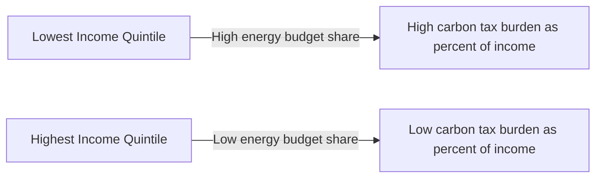
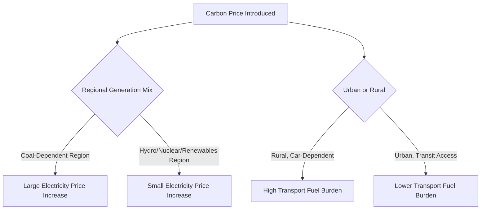

## Distributional Impacts of Climate and Energy Policy

### Definition and Scope

Distributional impacts refer to how the costs and benefits of climate and energy policies are allocated across different groups in society — households by income level, workers by sector, regions by economic structure, and generations across time. Unlike aggregate efficiency analysis, which asks whether a policy maximizes net social welfare, distributional analysis asks *who* bears the costs and *who* captures the benefits, and whether that pattern is equitable.

**Key Points**

- Distributional analysis is central to climate policy design because efficient policies (e.g., carbon pricing) are frequently regressive in their raw incidence, creating a tension between efficiency and equity.
- Political economy research consistently finds that perceived distributional unfairness is one of the strongest predictors of public opposition to carbon pricing and energy policy reform.
- Distributional impacts operate across at least four dimensions: income (vertical equity), group/identity (horizontal equity), geography (regional equity), and time (intergenerational equity).

---

### Analytical Framework

#### Vertical vs. Horizontal Equity

- **Vertical equity**: concerns how a policy's burden varies across the income distribution. A policy is **regressive** if the burden (as a share of income) falls more heavily on lower-income households, **progressive** if it falls more heavily on higher-income households, and **proportional** if the burden share is constant across income.
- **Horizontal equity**: concerns whether households with similar income face similar burdens. Even a policy that is progressive on average can be horizontally inequitable if, for example, two households with identical income face very different costs because one relies on a car-dependent commute and the other has access to public transit.

#### Incidence Decomposition

The total distributional effect of a policy can be decomposed into three channels:

$$\Delta W_i = \Delta W_i^{cost-side} + \Delta W_i^{revenue-side} + \Delta W_i^{factor-market}$$

Where for household or group $i$:

- $\Delta W_i^{cost-side}$: the direct and indirect increase in the cost of living from higher energy/carbon prices (uses-side incidence).
- $\Delta W_i^{revenue-side}$: the value of the policy's revenue recycling or rebate mechanism (dividends, tax cuts, transfers).
- $\Delta W_i^{factor-market}$: changes in wages, capital returns, or employment resulting from the policy's effect on factor markets (sources-side incidence).

**Key Points**

- Most public debate focuses only on the cost-side channel, but a full welfare analysis requires netting out revenue recycling and factor-market effects.
- A carbon tax can be regressive on the cost side yet progressive overall once revenue recycling is accounted for — the *net* incidence, not the *gross* incidence, determines the true distributional outcome.

---

### Uses-Side Incidence: Why Carbon Pricing Tends to Be Regressive

#### Energy Expenditure Shares

Lower-income households typically spend a larger share of their budget on energy (electricity, heating fuel, gasoline) than higher-income households, even though absolute energy consumption is often lower. This is a direct application of Engel's Law extended to energy goods: energy has a relatively low income elasticity of demand compared to overall consumption.

If $s_i^E$ denotes the energy budget share of household $i$, and $\tau$ is a carbon tax passed fully into energy prices, the first-order welfare loss as a share of income is approximately:

$$\frac{\Delta W_i}{Y_i} \approx s_i^E \cdot \frac{\Delta P^E}{P^E}$$

Since $s_i^E$ tends to fall as income $Y_i$ rises, the uses-side burden (before any rebate) is regressive: $\frac{\Delta W_i}{Y_i}$ declines as $Y_i$ increases.

#### Illustrative Regressivity Pattern

[Inference] This regressive pattern is a robust empirical finding across most OECD carbon pricing studies, though the magnitude varies by country depending on the underlying energy mix, climate (heating/cooling needs), and existing energy subsidy structures — some emerging-market studies find carbon pricing to be roughly proportional or even progressive where poorer households rely on non-priced traditional biomass rather than marketed fossil fuels.

#### Heterogeneity Within Income Groups

Regressivity estimates based on income alone can mask substantial within-quintile variation driven by:

- **Housing tenure**: renters cannot easily undertake efficiency retrofits; owners can invest in insulation, heat pumps, or solar.
- **Geographic/climate factors**: rural and cold-climate households face higher unavoidable heating/transport energy needs.
- **Vehicle dependency**: households without access to public transit face inelastic gasoline demand.
- **Housing vintage**: older, poorly insulated housing stock increases energy needs independent of income.

---

### Revenue Recycling and Its Distributional Consequences

The choice of what to do with carbon tax or cap-and-trade auction revenue is often the single largest determinant of a policy's net distributional profile.

#### Recycling Options Compared

| Recycling Mechanism | Distributional Effect | Efficiency Property | Political Economy Notes |
| --- | --- | --- | --- |
| Equal per-capita dividend (lump-sum rebate) | Strongly progressive (flat dollar amount is a larger share of income for poorer households) | No efficiency gain from revenue use | High salience/transparency ("carbon dividend"); easy to communicate |
| Reduction in labor income tax | Regressive to proportional (benefits scale with pre-existing tax liability) | Can offset "tax interaction effect," raising overall efficiency | Preferred by economists for efficiency ("double dividend" potential) |
| Reduction in capital/corporate tax | Regressive (capital income concentrated among higher-income households) | Can spur investment | Least favored on equity grounds |
| Targeted transfers to vulnerable households | Highly progressive, can be tailored | Requires accurate targeting; administrative cost | Effective but complex to implement |
| Public investment (infrastructure, clean energy) | Diffuse, hard to attribute; may be progressive if targeted at underserved areas | Can generate long-run efficiency and co-benefits | Delayed benefits reduce political salience |
| Deficit reduction | Diffuse, benefits accrue to future taxpayers broadly | Reduces future tax burden | Least visible, least popular |

#### The "Double Dividend" Hypothesis

The double dividend hypothesis proposes that recycling carbon tax revenue to cut distortionary taxes (e.g., payroll or income tax) yields two benefits simultaneously: environmental improvement (first dividend) and efficiency gains from reduced pre-existing tax distortions (second dividend).

$$\text{Double Dividend: } \Delta W^{environmental} > 0 \text{ AND } \Delta W^{non-environmental} > 0$$

[Inference] The theoretical and empirical literature on the double dividend remains genuinely contested: the "weak" form (revenue-neutral recycling is better than lump-sum rebating for efficiency) is broadly accepted, but the "strong" form (a revenue-neutral green tax swap improves welfare *even ignoring* environmental benefits) is disputed, since the *tax interaction effect* — carbon taxes narrow the base of pre-existing distortionary taxes by raising the price of taxed goods relative to leisure — can offset the *revenue-recycling effect** depending on model calibration.

---

### Sources-Side Incidence: Labor Markets and Regional Effects

#### Displaced Workers and "Stranded" Regions

Energy transition policy creates concentrated, visible costs for workers and regions dependent on fossil fuel extraction, processing, and fossil-fuel-intensive manufacturing, even when aggregate national employment effects are small or positive. This asymmetry — diffuse aggregate benefits versus concentrated losses — is a standard political economy driver of opposition.

**Key Points**

- Coal mining regions, oil and gas extraction regions, and heavy industry clusters (steel, cement, aluminum smelting) face disproportionate transition risk.
- Job losses in these sectors are often concentrated geographically, meaning local labor markets may lack the diversified job opportunities needed for smooth worker reallocation.
- Skill specificity matters: highly specialized fossil-fuel-sector skills (e.g., coal mining engineering) do not always transfer directly to renewable energy sector jobs, requiring retraining investment.

#### Just Transition Policy Instruments

| Instrument | Function |
| --- | --- |
| Transition/adjustment assistance funds | Direct income support and retraining subsidies for displaced workers |
| Place-based investment | Targeted infrastructure/industrial investment in transition-affected regions |
| Pension bridge programs | Early retirement support for older workers close to retirement age |
| Community transition funds | Support for local government revenue lost from declining fossil fuel tax bases |
| Guaranteed job programs / hiring preferences | Preferential hiring for displaced workers in new clean-energy projects |

[Unverified] The scale and design of "just transition" funding mechanisms vary significantly by jurisdiction and are subject to frequent legislative revision; specific national program parameters should be checked against current legislation rather than treated as fixed.

#### Capital Owners and Shareholders

Sources-side incidence also falls on capital: firms with stranded fossil fuel assets (unextractable reserves, prematurely retired power plants) experience asset devaluation. Since equity ownership is concentrated among higher-income households and institutional investors (pension funds), this channel is generally progressive relative to labor-market effects, though pension fund exposure means some of this cost is indirectly borne by broader worker populations through retirement savings.

---

### Regional and Geographic Distributional Effects

#### Electricity Price Pass-Through Heterogeneity

Regional electricity generation mix strongly determines how carbon pricing or clean energy mandates affect local electricity prices:

- Regions reliant on coal-fired generation see larger price increases under carbon pricing than regions with existing hydro, nuclear, or renewable-heavy generation mixes.
- This creates a specific form of horizontal inequity: households in different regions face different burdens for policies applied at a national or federal level.

#### Rural vs. Urban Disparities

- Rural households often face longer required driving distances, higher per-capita vehicle ownership, and less access to public transit, increasing exposure to transport fuel price increases.
- Urban households more often have access to substitution options (public transit, shorter commutes, higher housing density enabling district heating), which softens the effective burden of carbon pricing on transport and heating fuels.

---

### International and Global Distributional Dimensions

#### North-South Distributional Asymmetry

- Historical cumulative emissions are heavily concentrated among industrialized economies, while climate damages (sea-level rise, extreme heat, agricultural disruption) disproportionately affect lower-income, lower-emitting countries in tropical and coastal regions — a mismatch between responsibility and vulnerability that underlies the climate finance transfer architecture discussed separately in this chapter.
- Carbon border adjustment mechanisms (CBAMs), while addressing carbon leakage and competitiveness concerns for domestic industry, raise distinct distributional questions for exporting developing countries whose industries may lack access to low-carbon production technology, effectively imposing a cost burden without a corresponding domestic revenue-recycling mechanism.

#### Intergenerational Equity

Climate policy inherently redistributes across time: mitigation imposes costs on current generations to avoid damages that would otherwise fall on future generations. The **social discount rate** used in climate cost-benefit analysis directly encodes a distributional judgment about how to weigh present costs against future benefits:

$$PV = \sum_{t=0}^{T} \frac{B_t - C_t}{(1+r)^t}$$

A higher discount rate $r$ places less weight on far-future climate damages, effectively favoring current generations; a lower discount rate favors future generations by weighting their welfare more heavily in present-value terms. [Inference] This is one of the most consequential and contested modeling choices in climate economics (evident in the long-running Stern Review versus Nordhaus DICE-model discount rate debate), since plausible ranges for $r$ can shift the present-value cost-benefit conclusion of a given mitigation pathway substantially.

---

### Empirical Measurement Approaches

#### Microsimulation Models

Distributional analysis is typically conducted using household-level microsimulation, combining:

1. **Household expenditure survey data** (to establish energy budget shares by income decile).
2. **Input-output tables** (to trace indirect carbon content embedded in non-energy goods, since a carbon tax raises costs throughout supply chains, not just at the point of fossil fuel combustion).
3. **Behavioral response parameters** (price elasticities of demand for energy goods, to model how households adjust consumption).

#### Direct vs. Indirect Carbon Tax Incidence

$$\text{Total Burden}_i = \underbrace{\sum_{j \in Energy} \tau \cdot e_j \cdot q_{ij}}_{\text{Direct incidence}} + \underbrace{\sum_{k \notin Energy} \Delta p_k \cdot q_{ik}}_{\text{Indirect incidence via supply chains}}$$

Where $e_j$ is the emissions factor of energy good $j$, $q_{ij}$ is household $i$'s consumption of good $j$, and $\Delta p_k$ is the carbon-tax-induced price increase in non-energy good $k$ passed through from its embedded carbon content.

[Inference] Indirect incidence is frequently underestimated in simplified analyses that only examine household energy bills directly, since a substantial share of total household carbon tax burden in many economies flows through higher prices for food, manufactured goods, and services with embedded energy costs.

---

### Worked Example: Distributional Effect of a Carbon Tax with Dividend Recycling

**Setup**: A carbon tax of $50/tonne $CO_2$ is levied, generating average energy-related cost increases as a share of income by quintile:

| Income Quintile | Energy Budget Share | Gross Burden (% of income) | Equal Per-Capita Dividend (% of income) | Net Burden (% of income) |
| --- | --- | --- | --- | --- |
| Q1 (lowest) | 12% | 2.4% | 4.0% | −1.6% (net gain) |
| Q2 | 9% | 1.8% | 2.2% | −0.4% (net gain) |
| Q3 | 7% | 1.4% | 1.4% | 0.0% (breakeven) |
| Q4 | 5% | 1.0% | 0.9% | +0.1% |
| Q5 (highest) | 3% | 0.6% | 0.4% | +0.2% |

*(Illustrative figures constructed to demonstrate the mechanism; actual empirical estimates vary by country, tax level, and baseline energy mix.)*

This pattern — reflecting empirical findings from a range of carbon-dividend studies including modeling of U.S. federal carbon tax-and-dividend proposals — illustrates the core mechanism: **gross incidence is regressive, but equal per-capita dividend recycling flips the *net* incidence to progressive**, because a flat dollar rebate represents a much larger percentage of income for lower-income households than for higher-income households.

[Inference] The specific breakeven point (which quintile nets to approximately zero) depends on the exact tax rate, dividend size, and baseline consumption patterns modeled; the qualitative pattern of net progressivity under equal-dividend recycling is well-supported across the literature, but exact numerical breakeven points shift by study and jurisdiction.

---

### Policy Design Levers to Address Distributional Concerns

**Key Points**

- **Targeted rebates/dividends**: equal per-capita or income-targeted cash transfers, the most direct tool for reversing regressivity.
- **Exemptions and reduced rates**: e.g., lower rates on heating fuel or lifeline electricity blocks — administratively simpler but blunt, since exemptions benefit all consumers of the exempted good regardless of income, reducing both progressivity precision and overall price signal strength.
- **In-kind support**: energy efficiency retrofit subsidies targeted at low-income housing, direct utility bill assistance programs (e.g., U.S. LIHEAP-style models), and weatherization programs that reduce underlying energy needs rather than just offsetting price increases.
- **Phased/gradual implementation**: tax rate ramps allow time for behavioral and capital-stock adjustment (e.g., replacing an inefficient furnace) before full price signal takes effect.
- **Complementary labor market policy**: retraining, relocation assistance, and regional investment funds targeted at fossil-fuel-dependent labor markets.

---

### Diagram: Full Incidence and Recycling Pathway (svg_diagram)

<svg xmlns="http://www.w3.org/2000/svg" viewBox="0 0 800 380" font-family="Arial, sans-serif">
<text x="400" y="28" text-anchor="middle" font-size="17" font-weight="bold">Carbon Tax Incidence and Recycling Pathway (svg_diagram)</text>
<rect x="30" y="60" width="180" height="60" rx="8" fill="#fee2e2" stroke="#991b1b" stroke-width="1.5" />
<text x="120" y="85" text-anchor="middle" font-size="12" font-weight="bold">Carbon Tax Imposed</text>
<text x="120" y="102" text-anchor="middle" font-size="10">on fossil fuel producers</text>
<rect x="270" y="20" width="200" height="60" rx="8" fill="#fef3c7" stroke="#92400e" stroke-width="1.5" />
<text x="370" y="45" text-anchor="middle" font-size="12" font-weight="bold">Direct Cost-Side Incidence</text>
<text x="370" y="62" text-anchor="middle" font-size="10">Higher energy bills</text>
<rect x="270" y="100" width="200" height="60" rx="8" fill="#fef3c7" stroke="#92400e" stroke-width="1.5" />
<text x="370" y="125" text-anchor="middle" font-size="12" font-weight="bold">Indirect Cost-Side Incidence</text>
<text x="370" y="142" text-anchor="middle" font-size="10">Higher goods/services prices</text>
<rect x="270" y="180" width="200" height="60" rx="8" fill="#fecaca" stroke="#7f1d1d" stroke-width="1.5" />
<text x="370" y="205" text-anchor="middle" font-size="12" font-weight="bold">Sources-Side Incidence</text>
<text x="370" y="222" text-anchor="middle" font-size="10">Wages / capital returns in FF sectors</text>
<rect x="30" y="260" width="180" height="60" rx="8" fill="#dbeafe" stroke="#1e3a8a" stroke-width="1.5" />
<text x="120" y="285" text-anchor="middle" font-size="12" font-weight="bold">Government Revenue</text>
<text x="120" y="302" text-anchor="middle" font-size="10">from carbon tax</text>
<rect x="570" y="60" width="200" height="60" rx="8" fill="#dcfce7" stroke="#166534" stroke-width="1.5" />
<text x="670" y="85" text-anchor="middle" font-size="12" font-weight="bold">Recycling: Dividend</text>
<text x="670" y="102" text-anchor="middle" font-size="10">Progressive impact</text>
<rect x="570" y="140" width="200" height="60" rx="8" fill="#e0e7ff" stroke="#3730a3" stroke-width="1.5" />
<text x="670" y="165" text-anchor="middle" font-size="12" font-weight="bold">Recycling: Tax Cuts</text>
<text x="670" y="182" text-anchor="middle" font-size="10">Efficiency-focused</text>
<rect x="570" y="220" width="200" height="60" rx="8" fill="#fce7f3" stroke="#831843" stroke-width="1.5" />
<text x="670" y="245" text-anchor="middle" font-size="12" font-weight="bold">Recycling: Targeted Transfers</text>
<text x="670" y="262" text-anchor="middle" font-size="10">Just transition programs</text>

<text x="400" y="355" text-anchor="middle" font-size="11" font-style="italic" fill="`#475569`">Net distributional outcome = Gross incidence (cost-side + sources-side) minus value of revenue recycling received</text>

<line x1="210" y1="90" x2="270" y2="50" stroke="#334155" stroke-width="1.3" marker-end="url(#arrow2)" />
<line x1="210" y1="90" x2="270" y2="130" stroke="#334155" stroke-width="1.3" marker-end="url(#arrow2)" />
<line x1="210" y1="90" x2="270" y2="210" stroke="#334155" stroke-width="1.3" marker-end="url(#arrow2)" />
<line x1="120" y1="120" x2="120" y2="260" stroke="#334155" stroke-width="1.3" marker-end="url(#arrow2)" />
<line x1="210" y1="285" x2="570" y2="90" stroke="#334155" stroke-width="1.3" marker-end="url(#arrow2)" />
<line x1="210" y1="290" x2="570" y2="170" stroke="#334155" stroke-width="1.3" marker-end="url(#arrow2)" />
<line x1="210" y1="295" x2="570" y2="250" stroke="#334155" stroke-width="1.3" marker-end="url(#arrow2)" />
</svg>

---

### Political Economy Implications

**Key Points**

- Perceived (rather than actual) distributional fairness strongly predicts public support: policies with visible, salient compensation mechanisms (e.g., a labeled "carbon dividend" check) tend to face less opposition than policies with diffuse or delayed recycling (e.g., general deficit reduction).
- The "concentrated costs, diffuse benefits" structure of energy transition creates asymmetric political mobilization: affected fossil-fuel workers and regions organize more intensely against a policy than the broader, diffusely benefiting public organizes in favor.
- Trust in government plays a mediating role: even well-designed progressive recycling mechanisms may generate opposition if the public does not trust that promised rebates will be delivered or will remain politically durable across election cycles.
- [Inference] Historical episodes such as France's 2018 "gilets jaunes" (yellow vests) protests are frequently cited in the political economy literature as illustrating how a nominally environmentally justified fuel tax increase, perceived as regionally and distributionally unfair (falling heavily on rural, car-dependent, lower-income households without adequate compensating measures), can generate severe political backlash regardless of the policy's aggregate efficiency case.

---

### Related Topics

- Carbon tax and cap-and-trade design (revenue recycling mechanisms in depth)
- Energy poverty and fuel poverty measurement frameworks
- Just transition policy and labor market adjustment programs
- Carbon border adjustment mechanisms (CBAM) and trade-distributional effects
- Social discount rate debates in climate cost-benefit analysis (Stern Review vs. Nordhaus DICE model)
- Political economy of environmental policy and public opinion formation
- Energy subsidy reform and distributional impact of subsidy removal
- Input-output modeling for indirect carbon incidence estimation