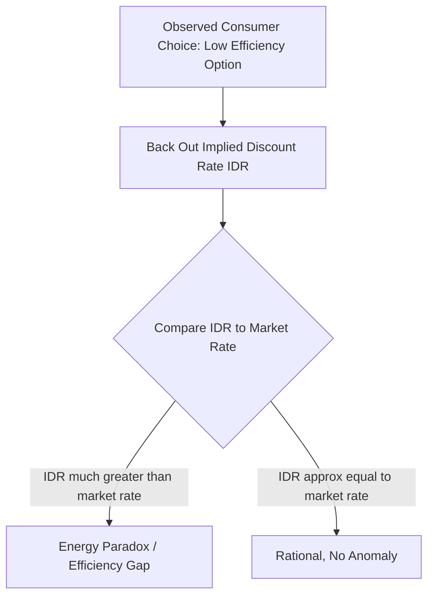
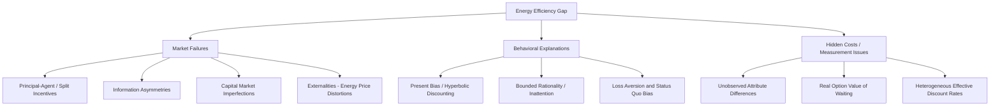

## Theoretical Foundations of the Energy Efficiency Gap

### Definition and Scope

The energy efficiency gap refers to the persistent empirical observation that households and firms appear not to adopt energy-efficient technologies and practices that would be cost-minimizing (or profit-maximizing) based on engineering-economic calculations of lifecycle costs. Despite apparently attractive returns — often exceeding typical market rates of return — investments such as insulation, efficient appliances, and industrial process upgrades diffuse more slowly than a frictionless cost-minimization model would predict.

**Key Points**

- The gap was first systematically articulated in the energy economics literature in the early 1990s, distinguishing between the "economic potential" (efficiency investments that pass a standard net-present-value test) and observed adoption rates.
- The gap is measured in two related but distinct ways: as an implied discount rate anomaly (the "energy paradox") and as a technical/economic potential shortfall (the volume of cost-effective efficiency investment left unrealized).
- Explanations fall into two broad theoretical camps: market failures/barriers (which imply welfare-improving policy intervention) and behavioral/non-market explanations or hidden costs (which imply the "gap" may be partly illusory once uncounted costs are included).

---

### The Core Puzzle: Implied Discount Rates

#### Formal Statement

Consumers and firms choosing between an efficient technology with higher upfront cost $I_H$ and lower operating cost, versus an inefficient technology with lower upfront cost $I_L$ and higher operating cost, should adopt the efficient option whenever the net present value of the switch is positive:

$$NPV = -(I_H - I_L) + \sum_{t=1}^{T} \frac{\Delta OC_t}{(1+r)^t} > 0$$

Where $\Delta OC_t$ is the annual operating cost savings (e.g., reduced electricity or fuel expenditure) and $r$ is the discount rate. Solving for the discount rate that equates the two options' costs — the **implied discount rate (IDR)** — reveals how consumers are implicitly valuing future energy savings relative to upfront cost:

$$I_H - I_L = \sum_{t=1}^{T} \frac{\Delta OC_t}{(1+IDR)^t}$$

#### The Empirical Anomaly

Studies estimating IDRs from observed consumer choices (e.g., refrigerator or air conditioner purchases, following methodologies pioneered by Hausman's 1979 analysis of air conditioner purchase decisions) have historically found implied discount rates far exceeding conventional market interest rates or firms' cost of capital — sometimes in the range of 20% to over 100%, compared to market borrowing rates typically in the single digits to low teens.

[Inference] This wide range reflects substantial heterogeneity across studies, technologies, and time periods, and later methodological work has argued that a portion of the originally estimated gap reflects omitted variables (such as unobserved product quality differences or genuine uncertainty about future energy prices) rather than pure behavioral anomaly; the qualitative existence of elevated implied discount rates relative to market rates is nonetheless a robust and widely replicated finding.

---

### Theoretical Taxonomy of Explanations

The literature (most comprehensively synthesized in Gillingham and Palmer's 2014 and related surveys) organizes explanations into two broad categories: market failures (which justify policy correction on efficiency grounds) and behavioral anomalies/private barriers (which may or may not justify policy correction depending on welfare interpretation).

---

### Market Failure Explanations

#### Principal-Agent Problems (Split Incentives)

The classic "landlord-tenant problem": a landlord who purchases appliances or building envelope improvements bears the capital cost, but a tenant who pays the utility bill captures the operating savings. Neither party has full incentive to invest optimally.

$$NPV_{landlord} = -(I_H - I_L) + 0 < 0 \quad \text{(if tenant pays energy bill)}$$

$$NPV_{tenant} = 0 + \sum_{t=1}^{T} \frac{\Delta OC_t}{(1+r)^t} \quad \text{(but tenant lacks authority to invest in structure)}$$

- **Landlord-tenant split**: most severe in rental housing markets, particularly where utilities are separately metered and paid directly by tenants.
- **Builder-buyer split**: developers building for immediate sale often minimize upfront construction cost since they do not bear the buyer's future operating costs, unless building codes, disclosure requirements, or buyer willingness-to-pay for efficiency internalize this.
- **Manager-shareholder split**: in commercial contexts, facility managers evaluated on capital budget performance rather than total lifecycle operating cost may systematically underinvest in efficiency.

[Inference] Empirical estimates of the magnitude of the split-incentive problem vary substantially by housing market structure and metering arrangement (e.g., whether utilities are master-metered or individually metered), and the specific share of the aggregate efficiency gap attributable to this channel remains actively debated in the literature.

#### Information Asymmetries and Imperfect Information

- **Asymmetric information at point of sale**: sellers of buildings or appliances often know more about true energy performance than buyers, and absent credible disclosure (energy labels, certification), a "market for lemons" dynamic (Akerlof-style adverse selection) can suppress prices for genuinely efficient products or fail to reward efficiency investment.
- **Search and information costs**: gathering reliable information on lifecycle energy costs, comparing technology options, and identifying qualified contractors imposes real transaction costs that can rationally lead to underinvestment when those costs exceed expected benefits for a given household.
- **Bounded salience of energy costs**: operating costs are incurred gradually over time (monthly utility bills) while purchase price is salient and immediate at the point of decision, potentially causing consumers to systematically underweight the present value of future energy savings even without full behavioral irrationality.

#### Capital Market Imperfections

- **Credit constraints**: households or small firms lacking access to affordable financing cannot smooth the upfront cost of efficiency investment even when the investment's NPV is positive, effectively facing an implicit "shadow" discount rate above the market rate due to liquidity constraints rather than pure impatience.
- **Higher cost of capital for efficiency-specific financing**: on-bill financing and energy efficiency loan products have historically carried higher effective interest rates or stricter underwriting than general consumer credit, partly reflecting genuine credit risk and partly reflecting underdeveloped secondary markets for this asset class.

#### Externalities and Energy Price Distortions

- Where energy prices are subsidized or fail to reflect full social marginal cost (including unpriced carbon and local pollution externalities), the private return to efficiency investment is understated relative to the socially optimal return, creating a **wedge between private and social NPV** that is a genuine market failure (distinct from behavioral explanations) and independently justifies policy intervention such as carbon pricing or efficiency standards.

$$NPV_{private} = -(I_H - I_L) + \sum \frac{\Delta OC_t^{private price}}{(1+r)^t}$$

$$NPV_{social} = -(I_H - I_L) + \sum \frac{\Delta OC_t^{social price}}{(1+r)^t} > NPV_{private} \text{ when } P^{social} > P^{private}$$

---

### Behavioral Explanations

#### Present Bias and Hyperbolic Discounting

Standard exponential discounting assumes a constant discount rate applied consistently across all future periods. Behavioral economics proposes **quasi-hyperbolic (β-δ) discounting**, where individuals apply an additional discount factor $\beta < 1$ to all future periods relative to the present, but discount consistently ($\delta$) among future periods themselves:

$$U = u_0 + \beta \sum_{t=1}^{T} \delta^t u_t$$

This generates **present bias**: the upfront cost of an efficiency investment is experienced immediately (undiscounted), while the stream of energy savings is discounted not only by $\delta$ but by the extra factor $\beta$, producing systematically lower valuation of future savings than a standard exponential model would predict — consistent with the abnormally high implied discount rates observed empirically.

[Inference] This is one of the most cited behavioral mechanisms in the efficiency gap literature, though direct empirical identification of $\beta$ specifically in energy efficiency contexts (as opposed to inferring it from the general behavioral economics literature on intertemporal choice) remains a smaller and more contested body of work than the general discount-rate anomaly finding itself.

#### Bounded Rationality and Inattention

- **Inattention to operating costs**: rational inattention models suggest that when energy costs constitute a small share of total household budget or total product cost, it may be rational (given cognitive processing costs) to allocate limited attention elsewhere, leading to systematic underweighting of energy costs relative to purchase price in the decision process.
- **Complexity and choice overload**: efficiency decisions often require processing complex, probabilistic information (uncertain future energy prices, uncertain usage patterns, technical specifications), and bounded-rationality models suggest consumers may resort to simplifying heuristics (e.g., focusing on purchase price alone, or "satisficing" rather than optimizing) rather than full lifecycle-cost optimization.

#### Loss Aversion and Status Quo Bias

- **Endowment effects and status quo bias**: consumers may exhibit an asymmetric reluctance to give up a familiar, currently-owned technology or default option even when a switch is expected-value-positive, consistent with prospect-theory loss aversion where losses (giving up the status quo) loom larger than equivalent gains (expected future savings).
- **Reference-dependent preferences**: framing efficiency investment as a "loss" of upfront capital versus a "gain" of future uncertain savings can itself suppress adoption independent of the underlying expected value calculation.

---

### Hidden Costs and Measurement-Based Explanations

A distinct strand of the literature argues that at least part of the apparent "gap" is an artifact of engineering-economic models that omit real costs and genuine option value, meaning some portion of observed underinvestment is not irrational at all.

#### Unobserved Product Attributes

Engineering-based efficiency estimates typically compare only energy cost and purchase price, holding all else equal — but efficient models may differ in genuinely valued dimensions:

- Aesthetic or performance characteristics (e.g., some efficient lighting technologies historically had different color rendering, dimmability, or aesthetic qualities than incandescent alternatives).
- Reliability and maintenance cost differences not captured in simple energy-cost comparisons.
- Comfort and convenience attributes (e.g., differences in start-up time, noise levels, or control functionality across HVAC technology options).

[Inference] The magnitude of this "hidden cost" or "hidden benefit" explanation is difficult to estimate directly and is typically inferred residually — i.e., as whatever portion of the implied-discount-rate anomaly remains unexplained after accounting for known market failures and behavioral factors — which makes it inherently harder to independently verify than mechanisms with direct empirical identification strategies.

#### Real Option Value of Waiting

Under uncertainty about future energy prices, technology improvement rates, and policy (e.g., future efficiency mandates or subsidies), delaying an irreversible efficiency investment has genuine option value — analogous to the standard real-options framework in investment theory:

$$V_{wait} = E\left[\max(NPV_{invest\ now}, NPV_{invest\ later} \cdot \text{discount factor})\right]$$

If waiting preserves flexibility to adopt an even better (cheaper or more efficient) future technology, or to avoid being locked into a suboptimal choice given price/policy uncertainty, some rational delay is expected even when a static NPV calculation (which ignores the option value of flexibility) shows current adoption as marginally positive.

#### Heterogeneous "True" Discount Rates

Not all elevated implied discount rates reflect irrationality or market failure — some genuinely reflect legitimate heterogeneity in household circumstances:

- Very short expected tenure in a home or vehicle reduces the effective payback horizon over which savings can be captured by the current owner.
- Genuinely high individual-specific costs of capital (e.g., households with poor credit access facing real market borrowing rates well above prime rates).
- Legitimate uncertainty about future occupancy, usage intensity, or resale value recapture of the investment.

---

### Empirical Identification Strategies

#### Field Experiments and Randomized Interventions

Researchers have used randomized controlled trials providing information, subsidies, or behavioral "nudges" (e.g., social comparison feedback on energy use) to distinguish which theoretical mechanisms best explain observed underinvestment in specific contexts — for example, testing whether an information-only intervention changes adoption rates (consistent with an information-failure explanation) versus whether adoption remains low even with full information provided (consistent with behavioral or hidden-cost explanations).

#### Hedonic and Structural Estimation

Structural models estimate implied discount rates while explicitly controlling for observable product attributes, usage heterogeneity, and household characteristics, aiming to isolate the "residual" anomaly not explained by observable factors — narrowing (but rarely fully eliminating) the originally estimated gap relative to naive engineering-economic comparisons.

#### Natural Experiments from Policy Variation

Efficiency standard implementations, utility rebate program rollouts, and regional variation in energy prices have been used as natural experiments to estimate realized adoption responses and back out revealed-preference discount rates under real-world conditions rather than stated-preference survey responses.

---

### Worked Numerical Example: Implied Discount Rate Calculation

**Scenario**: A consumer chooses between two refrigerator models:

- **Standard model**: purchase price $800, annual electricity cost $120
- **Efficient model**: purchase price $1,000, annual electricity cost $70

Assume a 10-year expected lifespan for both.

**Incremental cost**: $I_H - I_L = 1000 - 800 = \$200$

**Annual savings**: $\Delta OC = 120 - 70 = \$50$/year for 10 years

Solving for the discount rate $r$ that sets NPV of the switch to exactly zero (i.e., the breakeven implied discount rate) using the present value of an annuity formula:

$$200 = 50 \times \frac{1 - (1+r)^{-10}}{r}$$

This requires the annuity factor to equal $200/50 = 4.0$. Checking standard annuity tables for $n=10$:

- At $r = 21\%$: annuity factor $\approx 3.92$
- At $r = 20\%$: annuity factor $\approx 4.19$

Interpolating, the breakeven implied discount rate is approximately **$r \approx 20.5\%$**.

If the consumer's actual cost of capital (e.g., a typical consumer credit card or personal loan rate) is, say, 12–15%, and they nonetheless choose the standard (less efficient) model, this reveals a behavior consistent with an implied discount rate of roughly 20.5%, well above their market financing cost — precisely the type of gap the efficiency-gap literature documents and seeks to explain via the mechanisms outlined above.

[Inference] This example is illustrative and stylized; real-world implied discount rate estimation from market data requires controlling for the confounding factors described above (product attributes, usage heterogeneity, tenure expectations) rather than relying on a single hypothetical purchase comparison.

---

### Diagram: Decomposing the Efficiency Gap (svg_diagram)

<svg xmlns="http://www.w3.org/2000/svg" viewBox="0 0 800 420" font-family="Arial, sans-serif">
<text x="400" y="28" text-anchor="middle" font-size="17" font-weight="bold">Decomposing the Energy Efficiency Gap (svg_diagram)</text>
<rect x="60" y="60" width="680" height="50" rx="6" fill="#f1f5f9" stroke="#334155" stroke-width="1.5" />
<text x="400" y="90" text-anchor="middle" font-size="13" font-weight="bold">Observed "Gap": Elevated Implied Discount Rate vs. Market Rate</text>
<rect x="60" y="140" width="210" height="220" rx="8" fill="#dbeafe" stroke="#1e3a8a" stroke-width="1.5" />
<text x="165" y="165" text-anchor="middle" font-size="13" font-weight="bold">Market Failures</text>
<text x="80" y="190" font-size="11">- Split incentives</text>
<text x="80" y="212" font-size="11">- Information asymmetry</text>
<text x="80" y="234" font-size="11">- Credit constraints</text>
<text x="80" y="256" font-size="11">- Unpriced externalities</text>
<text x="80" y="290" font-size="10" font-style="italic">Policy-correctable</text>
<rect x="295" y="140" width="210" height="220" rx="8" fill="#fef3c7" stroke="#92400e" stroke-width="1.5" />
<text x="400" y="165" text-anchor="middle" font-size="13" font-weight="bold">Behavioral Factors</text>
<text x="315" y="190" font-size="11">- Present bias</text>
<text x="315" y="212" font-size="11">- Inattention</text>
<text x="315" y="234" font-size="11">- Loss aversion</text>
<text x="315" y="256" font-size="11">- Status quo bias</text>
<text x="315" y="290" font-size="10" font-style="italic">Nudge / disclosure-correctable</text>
<rect x="530" y="140" width="210" height="220" rx="8" fill="#dcfce7" stroke="#166534" stroke-width="1.5" />
<text x="635" y="165" text-anchor="middle" font-size="13" font-weight="bold">Hidden Costs / Measurement</text>
<text x="550" y="190" font-size="11">- Unobserved attributes</text>
<text x="550" y="212" font-size="11">- Real option value of waiting</text>
<text x="550" y="234" font-size="11">- Legitimate rate heterogeneity</text>
<text x="550" y="290" font-size="10" font-style="italic">Not necessarily a "gap"</text>
<line x1="165" y1="110" x2="165" y2="140" stroke="#334155" stroke-width="1.5" marker-end="url(#arrow3)" />
<line x1="400" y1="110" x2="400" y2="140" stroke="#334155" stroke-width="1.5" marker-end="url(#arrow3)" />
<line x1="635" y1="110" x2="635" y2="140" stroke="#334155" stroke-width="1.5" marker-end="url(#arrow3)" />
<text x="400" y="400" text-anchor="middle" font-size="11" font-style="italic" fill="`#475569`">Only the "Market Failures" category unambiguously justifies corrective policy on efficiency grounds alone.</text>

</svg>

---

### Policy Implications of the Theoretical Framework

**Key Points**

- The theoretical explanation matters directly for policy design: if the gap stems primarily from split incentives, disclosure mandates and building codes targeting landlords/builders are the appropriate instrument; if it stems from behavioral inattention, default-option redesign and simplified information ("nudges") are more appropriate; if it stems substantially from legitimate hidden costs, the "gap" may be smaller than engineering estimates suggest and aggressive mandates risk imposing genuine welfare losses on households with legitimately high effective discount rates.
- Minimum efficiency standards (appliance/building codes) are most directly justified by the split-incentive and information-asymmetry market failures, since standards bypass the need for the disadvantaged party (tenant, buyer) to individually overcome the market failure.
- Upfront rebates and point-of-sale price reductions (rather than rebates delivered later or tax-credit mechanisms requiring filing) are more consistent with behavioral models emphasizing present bias and salience, since they reduce the immediate/high-salience cost rather than only affecting the discounted future value.
- Research attempting to quantify the *relative* contribution of each theoretical channel to the aggregate observed gap remains an active and unsettled area, meaning policy design in practice often layers multiple instruments (standards, information disclosure, financing programs, and targeted subsidies) rather than relying on a single "correct" diagnosed mechanism.

---

### Related Topics

- Empirical estimation methods for implied discount rates and technology adoption models
- Split-incentive problems and building energy disclosure/labeling policy
- Behavioral economics applications in energy policy (defaults, nudges, social comparison feedback)
- Minimum energy performance standards and appliance efficiency regulation design
- Rebound effect and its interaction with efficiency gap corrections
- On-bill financing and Property Assessed Clean Energy (PACE) program design
- Real options theory applied to irreversible energy investment decisions
- Cost-effectiveness testing frameworks for utility-run energy efficiency programs (e.g., Total Resource Cost test)