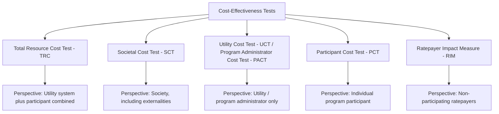
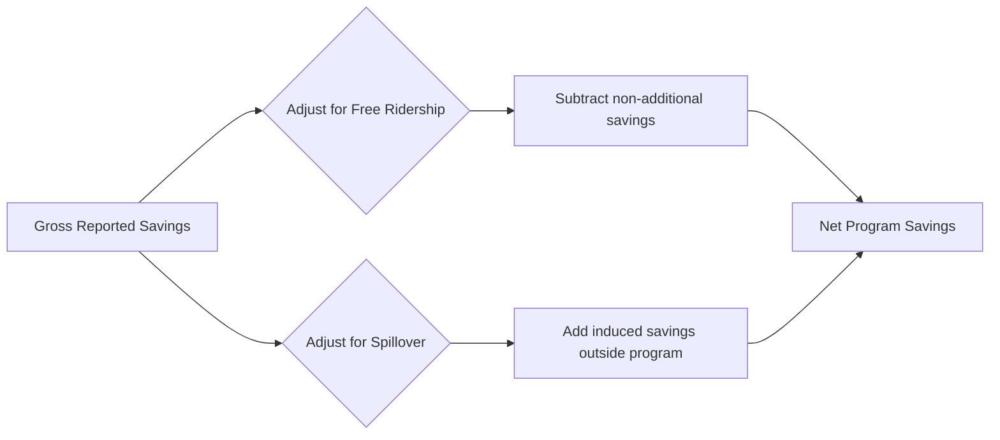

## Cost-Effectiveness Analysis of Efficiency Programs

### Definition and Scope

Cost-effectiveness analysis (CEA) of energy efficiency programs is the framework used to determine whether a utility, government, or third-party administered efficiency program delivers energy and non-energy benefits that justify its costs, and to compare competing program designs on a consistent basis. Unlike simple payback analysis at the individual investment level, program-level CEA must account for the perspective of multiple stakeholders (participants, non-participants, the utility, and society as a whole), each of whom bears different costs and captures different benefits.

**Key Points**

- CEA is distinct from cost-benefit analysis (CBA) in scope: CEA typically compares programs against a defined cost-effectiveness threshold or ranks alternatives by a benefit-cost ratio, while broader CBA may also incorporate non-monetized welfare considerations more explicitly.
- The choice of "cost-effectiveness test" (there are several standardized tests, discussed below) can produce materially different conclusions about whether the *same* program is worth pursuing, because each test defines costs and benefits from a different stakeholder perspective.
- Most jurisdictions with utility-run efficiency portfolios (common in North American regulatory practice) require formal application of one or more standardized tests as a condition of cost recovery or regulatory approval.

---

### The Standard Cost-Effectiveness Tests

The California Standard Practice Manual (originally developed in the 1980s and revised over time) formalized a set of tests that remain the dominant framework used internationally, sometimes under different names, for evaluating efficiency program cost-effectiveness. Each test answers a different question by defining the relevant costs and benefits from a specific perspective.

#### Total Resource Cost (TRC) Test

The most widely used test in North American regulatory practice. It measures net benefits to the utility system and its customers as a whole, combining the utility's avoided supply costs with the participant's own incremental investment.

$$TRC = \frac{\text{Avoided Supply Costs} + \text{Avoided T\&D Costs}}{\text{Program Administrator Costs} + \text{Participant Incremental Costs}}$$

A benefit-cost ratio $TRC \geq 1$ indicates the program is cost-effective from a total-resource perspective — i.e., the efficiency resource costs less than the equivalent supply-side resource it displaces.

**Key Points**

- Numerator: value of energy and demand savings valued at avoided cost (the cost the utility would otherwise have incurred to generate, purchase, or deliver that energy).
- Denominator: full incremental cost of the efficient technology over baseline, *regardless of who pays it* (program administrator rebate plus participant's own out-of-pocket contribution).
- Does not include the participant's own bill savings as a benefit, since those bill savings are a *transfer* from the utility system to the participant, not a net resource cost saving to the system as a whole (transfers cancel out in TRC accounting since they appear as a cost reduction to the participant and a revenue reduction to the utility simultaneously).

#### Societal Cost Test (SCT)

A variant of the TRC that additionally incorporates externalities (e.g., the social cost of carbon and other unpriced environmental damages) into the avoided-cost calculation, and typically uses a social discount rate rather than the utility's private cost of capital.

$$SCT = \frac{\text{Avoided Supply Costs} + \text{Avoided T\&D Costs} + \text{Monetized Externality Benefits}}{\text{Program Administrator Costs} + \text{Participant Incremental Costs}}$$

[Inference] Because the SCT internalizes externalities that the TRC excludes, a program can plausibly fail the TRC test (private/utility-system perspective) while passing the SCT (full social perspective) whenever the omitted externality value is large relative to the private cost-effectiveness shortfall — this is a structurally expected divergence rather than a calculation error, and is one of the main arguments cited by advocates for adopting SCT as the primary regulatory screening test in jurisdictions that have historically relied on TRC alone.

#### Utility Cost Test / Program Administrator Cost Test (UCT/PACT)

Measures cost-effectiveness purely from the utility's or program administrator's own financial perspective, excluding any costs borne directly by the participant.

$$UCT = \frac{\text{Avoided Supply Costs} + \text{Avoided T\&D Costs}}{\text{Program Administrator Costs (rebates, incentives, admin) only}}$$

- Since the denominator excludes participant co-payment, UCT ratios are typically higher (more favorable) than TRC ratios for the same program.
- Most relevant to utility shareholders and regulators focused narrowly on rate-recovery justification for administrator-incurred costs, rather than total societal resource allocation.

#### Participant Cost Test (PCT)

Evaluates the program strictly from the perspective of the individual household or firm deciding whether to participate.

$$PCT = \frac{\text{Bill Savings} + \text{Incentives/Rebates Received} + \text{Tax Credits}}{\text{Participant's Net Incremental Investment Cost}}$$

A PCT below 1 signals that even with the program's financial incentive, the participant may not find the investment individually attractive — a useful diagnostic for programs experiencing low uptake even where the incentive appears generous on a societal or utility-cost basis, potentially indicating the persistence of some of the market-failure or behavioral barriers to adoption.

#### Ratepayer Impact Measure (RIM) Test

Also called the "non-participant" test. Measures the effect of the program on the rates paid by customers who do *not* participate, capturing the concern that efficiency programs can shift fixed utility cost recovery onto a smaller base of remaining (non-participating) energy sales.

$$RIM = \frac{\text{Avoided Supply Costs} + \text{Avoided T\&D Costs}}{\text{Program Administrator Costs} + \text{Utility Revenue Losses from Reduced Sales}}$$

**Key Points**

- RIM is the most stringent test of the group, because its denominator includes lost utility revenue from reduced kWh sales (a real cost from the perspective of remaining ratepayers who must cover fixed costs over a smaller sales base) — a cost that does not appear in TRC, SCT, UCT, or PCT.
- Programs frequently pass TRC/SCT but fail RIM, reflecting the well-documented tension between overall resource efficiency and short-run rate impacts on non-participants (related to the "utility death spiral" concern in electricity ratemaking literature, where declining per-customer sales from efficiency and distributed generation raise average rates for remaining customers).
- [Inference] Reliance on RIM as a binding screening test has been widely critiized by efficiency program advocates and increasingly de-emphasized or eliminated in several jurisdictions' regulatory frameworks in favor of TRC or SCT, on the argument that RIM effectively penalizes any cost-effective demand-reduction resource for reducing utility sales revenue — though the degree of de-emphasis and specific test hierarchies vary by jurisdiction and should be checked against current state/regional regulatory orders.

---

### Comparative Summary Table

| Test | Perspective | Includes Participant Cost? | Includes Lost Utility Revenue? | Includes Externalities? | Typical Stringency |
| --- | --- | --- | --- | --- | --- |
| TRC | Utility system + participant | Yes (as a cost) | No | No | Moderate |
| SCT | Society | Yes (as a cost) | No | Yes | Moderate to favorable (if externalities large) |
| UCT/PACT | Utility/administrator only | No | No | No | Most favorable |
| PCT | Individual participant | Yes (net of incentive) | N/A | No | Varies by incentive design |
| RIM | Non-participating ratepayers | No | Yes | No | Most stringent |

---

### Core Components of the Cost-Effectiveness Calculation

#### Avoided Cost Estimation

The benefit side of every test (except PCT) depends critically on the **avoided cost** — what it would have cost the utility system to serve the load that efficiency instead eliminated. Avoided costs are typically decomposed into:

$$AC = AC_{energy} + AC_{capacity} + AC_{T\&D} + AC_{environmental\ compliance} + AC_{externality\ (SCT\ only)}$$

- **Avoided energy cost**: the wholesale market price or marginal generation cost avoided per kWh not consumed, often modeled hour-by-hour or by time-of-use period since efficiency measures with different load shapes avoid different-value hours of generation.
- **Avoided capacity cost**: the avoided cost of generation or purchased capacity needed to meet peak demand, particularly valuable for efficiency measures (e.g., efficient air conditioning) that reduce load coincident with system peak.
- **Avoided transmission and distribution (T&D) cost**: deferred or avoided need for grid infrastructure upgrades, which can be substantial in constrained distribution areas ("non-wires alternatives" framing).
- **Avoided environmental compliance cost**: costs the utility would have incurred to comply with emissions regulations on the marginal generation avoided.

[Inference] Avoided cost estimation is one of the most methodologically consequential and contested inputs to the entire framework, since small changes in assumed future wholesale energy prices, capacity value, or the specific hours/seasons in which savings occur can substantially shift a program's calculated cost-effectiveness ratio; utilities and regulators typically rely on detailed avoided cost studies updated periodically rather than static assumptions.

#### Net-to-Gross Adjustment

Not all reported energy savings from program participation represent savings genuinely attributable to the program. The **net-to-gross ratio (NTGR)** adjusts gross savings for two offsetting factors:

$$Net\ Savings = Gross\ Savings \times (1 - Free\ Ridership + Spillover)$$

- **Free ridership**: the share of participants who would have adopted the efficient measure even without the program's incentive (they are "free riding" on the rebate for a decision they would have made anyway). Higher free ridership reduces net program-attributable savings.
- **Spillover**: additional energy savings attributable to program influence but occurring outside the formal program (e.g., a customer who saw a neighbor's rebate-funded upgrade and independently purchased a similar efficient product without claiming the rebate themselves, or a retailer that stocks more efficient models market-wide due to a program's influence on supply chains). Spillover increases net program-attributable savings beyond directly measured participant impacts.

[Unverified] Free ridership and spillover rates vary substantially by measure type, program design, and evaluation methodology, and are typically estimated through participant/non-participant surveys or econometric methods rather than assumed as fixed constants; specific published rates for a given program type should be sourced from the relevant jurisdiction's Evaluation, Measurement, and Verification (EM&V) reports rather than treated as universal figures.

#### Evaluation, Measurement, and Verification (EM&V)

The broader discipline of independently verifying claimed program savings, encompassing:

- **Deemed savings approaches**: using pre-established, regulator-approved per-unit savings values (a "technical reference manual" or "TRM") for standardized, well-understood measures, reducing evaluation cost for high-volume, predictable measures (e.g., LED bulb replacement).
- **Measured/billing analysis approaches**: statistically comparing participant energy consumption before and after program participation (or against a matched comparison group of non-participants) to directly estimate realized savings, typically necessary for custom or complex measures where deemed values are unreliable (e.g., industrial process retrofits).
- **Engineering-based calculation**: bottom-up estimation of expected savings from equipment specifications and expected usage patterns, often used for program planning and reconciled against measured results ex-post.

---

### Cost-Effectiveness in the Levelized Cost Framework

Efficiency program cost-effectiveness is frequently expressed in terms comparable to supply-side resources using a **levelized cost of saved energy (LCSE)** metric, allowing direct comparison against the levelized cost of electricity (LCOE) from generation alternatives.

$$LCSE = \frac{\sum_{t=0}^{T} \frac{C_t}{(1+r)^t}}{\sum_{t=0}^{T} \frac{S_t}{(1+r)^t}}$$

Where $C_t$ is program cost in year $t$, $S_t$ is energy savings (kWh) achieved in year $t$, and $r$ is the discount rate applied. A program is cost-effective relative to supply-side alternatives when:

$$LCSE < LCOE_{marginal\ generation\ resource}$$

**Key Points**

- LCSE calculations for efficiency programs have frequently found efficiency to be a lower-cost resource than new marginal generation capacity across a wide range of North American utility service territories, which has been a central empirical argument for treating efficiency as a "first resource" in integrated resource planning.
- [Unverified] The specific numerical comparison between LCSE and LCOE shifts with fuel price assumptions, capital cost trends for generation technologies, and measure mix within a given efficiency portfolio, and should be evaluated against current published avoided cost and program cost data rather than treated as a fixed historical ratio.

---

### Worked Numerical Example: TRC and RIM Comparison

**Scenario**: A utility efficiency program subsidizes efficient heat pump water heaters.

- Program administrator rebate per unit: $400
- Participant's own incremental cost (device cost above standard electric resistance water heater, net of rebate): $300
- Total incremental cost (rebate + participant contribution) = $700
- Present value of avoided energy costs over measure life: $900
- Present value of avoided T&D costs: $100
- Utility revenue loss from reduced kWh sales (present value): $250

**TRC Test**:

$$TRC = \frac{900 + 100}{700} = \frac{1000}{700} \approx 1.43$$

A TRC ratio of 1.43 indicates the program is cost-effective from a total-resource perspective — the resource costs about 70 cents per dollar of avoided cost delivered.

**RIM Test**:

$$RIM = \frac{900 + 100}{400 + 250} = \frac{1000}{650} \approx 1.54$$

[Inference] In this stylized example, the RIM ratio happens to exceed 1 as well, but this outcome is sensitive to the specific magnitude of lost revenue relative to administrator cost; many real-world efficiency programs with strong TRC ratios fail RIM specifically because utility revenue losses (a cost only RIM counts) are large relative to the administrator-only cost RIM uses in its denominator. This example illustrates the mechanics of test divergence rather than a generalizable numerical relationship between TRC and RIM outcomes.

---

### Portfolio-Level vs. Measure-Level Cost-Effectiveness

Regulatory frameworks vary in whether cost-effectiveness is required to be demonstrated for each individual measure, each program, or the overall portfolio of programs administered by a utility.

- **Measure-level screening**: strictest approach; every individual efficiency measure (e.g., a specific model of LED bulb) must independently pass the relevant test.
- **Program-level screening**: measures are bundled within a program (e.g., a "residential lighting program" containing multiple bulb types), and cost-effectiveness is assessed for the program as a whole, allowing cross-subsidization between highly cost-effective and marginally cost-effective measures within the bundle.
- **Portfolio-level screening**: the broadest approach; the entire suite of programs administered by a utility must pass in aggregate, allowing even individual programs that might not independently pass a given test to be retained if the overall portfolio remains cost-effective.

[Inference] Broader (portfolio-level) screening generally allows greater program design flexibility and enables continued support for programs serving hard-to-reach or low-income populations (which may have higher per-unit delivery costs) by pooling them with highly cost-effective programs, but the specific screening level required is a matter of jurisdiction-specific regulatory policy and varies considerably.

---

### Diagram: Cost-Effectiveness Test Perspectives Compared (svg_diagram)

<svg xmlns="http://www.w3.org/2000/svg" viewBox="0 0 800 400" font-family="Arial, sans-serif">
<text x="400" y="28" text-anchor="middle" font-size="16" font-weight="bold">Stakeholder Perspectives in Cost-Effectiveness Testing (svg_diagram)</text>
<line x1="60" y1="200" x2="740" y2="200" stroke="#334155" stroke-width="2" />
<text x="60" y="220" font-size="11" text-anchor="middle">Narrowest</text>
<text x="740" y="220" font-size="11" text-anchor="middle">Broadest</text>
<text x="400" y="245" font-size="11" text-anchor="middle" font-style="italic">Scope of Costs and Benefits Considered</text>
<circle cx="120" cy="200" r="8" fill="#3730a3" />
<text x="120" y="170" text-anchor="middle" font-size="12" font-weight="bold">UCT/PACT</text>
<text x="120" y="185" text-anchor="middle" font-size="10">Utility only</text>
<circle cx="290" cy="200" r="8" fill="#166534" />
<text x="290" y="170" text-anchor="middle" font-size="12" font-weight="bold">TRC</text>
<text x="290" y="185" text-anchor="middle" font-size="10">Utility + Participant</text>
<circle cx="460" cy="200" r="8" fill="#92400e" />
<text x="460" y="170" text-anchor="middle" font-size="12" font-weight="bold">SCT</text>
<text x="460" y="185" text-anchor="middle" font-size="10">+ Externalities</text>
<circle cx="630" cy="200" r="8" fill="#991b1b" />
<text x="630" y="170" text-anchor="middle" font-size="12" font-weight="bold">RIM</text>
<text x="630" y="185" text-anchor="middle" font-size="10">+ Non-participant rate impact</text>
<circle cx="200" cy="290" r="8" fill="#831843" />
<text x="200" y="315" text-anchor="middle" font-size="12" font-weight="bold">PCT</text>
<text x="200" y="330" text-anchor="middle" font-size="10">Individual participant only</text>
<text x="200" y="345" text-anchor="middle" font-size="10" font-style="italic">(off main spectrum - private decision lens)</text>
<line x1="120" y1="200" x2="200" y2="282" stroke="#94a3b8" stroke-width="1" stroke-dasharray="3,2" />
</svg>

---

### Common Critiques and Methodological Debates

**Key Points**

- **Test selection as policy lever**: because different tests can yield different pass/fail outcomes for the same program, the choice of which test(s) a regulator designates as binding is itself a consequential and sometimes contested policy decision, not a purely technical one.
- **Non-energy benefits (NEBs)**: efficiency programs often generate benefits beyond energy savings alone — improved health outcomes from weatherization (reduced mold, better ventilation), water savings from efficient fixtures, comfort improvements, and reduced arrears/collections costs for utilities. These are inconsistently monetized and included across jurisdictions, and their inclusion or exclusion can materially affect calculated cost-effectiveness ratios, particularly for low-income and health-focused program designs.
- **Attribution uncertainty**: net-to-gross adjustments rely on counterfactual estimation (what would have happened without the program), which is inherently uncertain and methodology-dependent, introducing a persistent source of disagreement between program administrators (often incentivized to report higher net savings) and skeptical regulatory reviewers.
- **Discount rate selection**: as with broader climate-economic modeling, the choice of discount rate for valuing long-lived efficiency measures (e.g., insulation with a 20+ year expected life) materially affects calculated cost-effectiveness, and the appropriate rate (utility weighted average cost of capital vs. a social discount rate) differs depending on which test is being applied.

---

### Related Topics

- Theoretical foundations of the energy efficiency gap (market failure and behavioral drivers of underinvestment)
- Avoided cost methodology and integrated resource planning
- Utility decoupling and performance-based ratemaking as responses to the RIM/throughput incentive problem
- Low-income and hard-to-reach efficiency program design
- Non-wires alternatives and distribution system planning
- Evaluation, measurement, and verification (EM&V) protocols and technical reference manuals
- Social cost of carbon integration in utility resource planning
- Behavioral demand-side management programs and randomized control trial evaluation methods