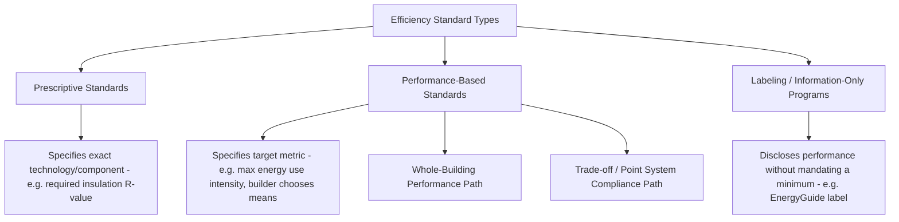
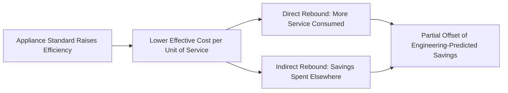

## Building Codes and Appliance Standards Economics

### Definition and Scope

Building codes and appliance standards are mandatory minimum performance requirements imposed on new construction, renovations, and manufactured products, designed to correct market failures that cause underinvestment in energy efficiency (as detailed in the theoretical foundations of the energy efficiency gap). Economically, these instruments function as **command-and-control regulation** — setting a technical floor rather than relying purely on price signals — and their welfare analysis requires weighing the efficiency gains from corrected market failures against the costs of restricting consumer and producer choice.

**Key Points**

- Appliance and equipment standards set minimum efficiency levels for specific product categories (refrigerators, air conditioners, water heaters, lighting); building codes set requirements for the structure and systems of buildings (insulation, window performance, HVAC sizing, airtightness).
- These instruments are the most widely deployed efficiency policy tools globally, often preceding and complementing market-based instruments like carbon pricing or utility efficiency programs.
- Standards are best understood economically as addressing the split-incentive and information-asymmetry market failures directly, since they eliminate the need for a disadvantaged party (tenant, buyer, or inattentive consumer) to individually overcome those failures through negotiation or search.

---

### Economic Rationale for Standards vs. Price Instruments

#### When Standards Dominate Price-Based Instruments

Standard environmental economics generally favors price instruments (taxes, tradable permits) over quantity/technology standards on efficiency grounds, because prices allow heterogeneous agents to equalize marginal abatement cost. However, appliance and building standards are a case where several specific market failures make standards a more direct remedy than pricing:

$$\text{Standards preferred when: } MC_{information} + MC_{split-incentive} > MC_{standard-induced\ inefficiency}$$

- **Split-incentive correction**: a building code requiring minimum insulation levels bypasses the landlord-tenant or builder-buyer principal-agent problem entirely, since the requirement applies regardless of who ultimately pays the utility bill.
- **Information/search cost correction**: mandatory minimum standards remove the need for every individual consumer to research and correctly evaluate lifecycle energy costs before purchase, particularly valuable given evidence of bounded rationality and inattention to embedded operating costs.
- **Correcting for present bias**: since standards act at the point of manufacture or construction rather than requiring an active, salient consumer choice, they bypass present-bias-driven underweighting of future energy savings relative to upfront cost.

[Inference] This "standards as market-failure correction" framing is the dominant justification in the academic and regulatory literature, though a competing view holds that if consumers are fully rational and well-informed, standards that raise upfront costs beyond what free-market equilibrium would produce impose a net welfare loss by removing valid heterogeneous consumer preferences (e.g., some consumers may rationally prefer a lower-cost, less efficient product given their specific discount rate or expected usage pattern) — the empirical debate over which view better describes reality is central to the ongoing efficiency-gap literature.

#### The Case Against Standards: Restricting the Choice Set

$$DWL_{standard} = \int_{Q_{standard}}^{Q_{market}} [MB(Q) - MC(Q)]\, dQ$$

If a subset of consumers has genuinely low valuation of energy savings (due to legitimately short expected tenure, low usage, or a high individual cost of capital as discussed in the efficiency-gap chapter), a standard that removes the low-cost/low-efficiency option from the market imposes a deadweight loss on those consumers, who are forced to pay for efficiency improvements they would not have voluntarily chosen.

**Key Points**

- This is the standard "one-size-fits-all" critique of minimum standards: heterogeneous households are pooled into a single mandated efficiency level, which is necessarily suboptimal for households at the tails of the usage/tenure/discount-rate distribution.
- Regulatory impact analyses conducted for standards (e.g., U.S. Department of Energy technical support documents) formally attempt to quantify this trade-off, estimating the share of households for whom a standard produces a net cost versus net benefit under specific assumed discount rates and usage patterns.

---

### Regulatory Design Architecture

#### Prescriptive vs. Performance-Based Codes

- **Prescriptive standards**: specify exact technical requirements component-by-component (e.g., "walls must achieve R-20 insulation," "windows must not exceed a specified U-factor"). Simple to verify and enforce, but constrain design flexibility and may not achieve the lowest-cost path to a given overall performance level, since they do not allow trade-offs between components (e.g., extra-efficient windows compensating for standard-grade insulation).
- **Performance-based standards**: specify an aggregate outcome metric (e.g., maximum allowed energy use intensity in kWh/m²/year, or a maximum "energy cost budget") and allow builders/manufacturers to choose the least-cost combination of measures to achieve it. Economically more efficient (analogous to the efficiency gain of price instruments over rigid technology mandates) but requires more sophisticated modeling and verification infrastructure (e.g., whole-building energy simulation software) to confirm compliance.

[Unverified] The specific compliance software, simulation protocols, and reference-building methodologies used to verify performance-path compliance vary by jurisdiction and are periodically updated; current requirements should be checked against the applicable code cycle (e.g., a specific edition of the International Energy Conservation Code, ASHRAE 90.1, or national equivalents) rather than assumed static.

#### Appliance and Equipment Standard-Setting Process

For appliance standards specifically (as distinct from building codes), the standard regulatory economic process typically involves:

1. **Engineering analysis**: identifying technically feasible efficiency levels and their incremental manufacturing cost.
2. **Life-cycle cost (LCC) analysis**: for each candidate efficiency level, estimating the net present value impact on a representative sample of households/firms, incorporating purchase price increase, expected operating savings, and financing assumptions.
3. **National impact analysis**: aggregating individual LCC results to estimate national energy savings, emissions reductions, and net consumer costs/benefits from adopting a given standard level.
4. **Trial standard level selection**: regulators typically select from a discrete set of candidate efficiency levels (rather than optimizing continuously) representing different technology packages, then choose the level that maximizes net national benefit subject to a "economic justification" or similar statutory test (specific legal tests vary by jurisdiction).

$$NPV_{national} = \sum_{i} w_i \cdot NPV_i(\text{standard level})$$

Where $w_i$ represents the weight (population share, sales-weighted) of household/firm type $i$ in the national impact aggregation, and $NPV_i$ is estimated using the specific candidate standard's incremental cost and expected operating savings for that household type.

---

### The "Rebound Effect" in Standards Analysis

A critical adjustment to naive engineering-savings estimates for both appliance standards and building codes is the **rebound effect**: as the effective cost of energy service (e.g., cooling, lighting, driving) falls due to efficiency improvement, consumption of that service tends to increase, partially offsetting the expected energy savings.

$$\text{Rebound} = -\frac{\%\Delta(\text{Energy Service Consumption})}{\%\Delta(\text{Effective Price of Service})}$$

- **Direct rebound**: increased consumption of the specific service made cheaper (e.g., setting a more efficient air conditioner to a cooler temperature, or a household with efficient lighting leaving more lights on longer).
- **Indirect rebound**: the money saved from lower energy bills is spent on other goods and services, some of which have their own embedded energy/carbon content, offsetting savings elsewhere in the economy.
- **Economy-wide/macroeconomic rebound**: efficiency improvements that lower the effective price of energy services economy-wide can stimulate broader economic activity and energy demand, a channel most relevant at large scale (e.g., aggregate national efficiency standard programs) rather than individual appliance-level analysis.

[Inference] Direct rebound estimates in the literature for residential appliances and space conditioning are generally found to be modest (commonly cited in a range well below 100%, meaning efficiency gains are only partially offset rather than fully negated) though estimated magnitudes vary meaningfully by end use, country, and study methodology, and rebound remains an area of active empirical research rather than a single settled parameter.

---

### Codes, Standards, and Market Transformation Dynamics

#### Ratchet Effects and Learning Curves

Standards are typically tightened periodically (e.g., successive code cycles), and a well-documented dynamic effect is that manufacturer compliance with an initial standard often reduces the cost of achieving that efficiency level over time through learning-by-doing and economies of scale, making subsequent tightening less costly than initially projected.

$$C_t = C_0 \cdot \left(\frac{Cumulative\ Production_t}{Cumulative\ Production_0}\right)^{-b}$$

This is a standard experience-curve (learning curve) formulation where $b$ is the learning rate parameter; as cumulative production of a compliant technology increases, per-unit manufacturing cost falls, a dynamic that ex-ante regulatory impact analyses may not fully anticipate when the technology is new to the required efficiency level.

#### Market Transformation and "Codes Follow Programs"

A well-established pattern in efficiency policy sequencing:

1. Utility rebate programs and voluntary labeling initiatives (e.g., ENERGY STAR-style programs) first promote above-baseline efficient products, building manufacturing scale and consumer familiarity.
2. As the promoted technology achieves significant market share and manufacturing cost falls, it becomes a candidate for incorporation into mandatory minimum standards, since the incremental cost of requiring it economy-wide has fallen.
3. Voluntary programs then shift focus to the next tier of above-baseline technology, restarting the cycle — a phenomenon sometimes described as the "market transformation" or "technology forcing then absorption" pattern.

[Inference] This sequential relationship between voluntary programs and mandatory standards is a widely observed pattern in the efficiency policy literature and is often cited as a rationale for maintaining both instrument types simultaneously (utility programs push the technology frontier; standards lock in gains once cost-effective for the mass market), though the specific pace of this transition varies substantially by technology and jurisdiction.

---

### Compliance, Enforcement, and Split-Incentive Interaction

#### Verification Costs and Enforcement Gaps

Unlike price instruments (which are self-enforcing through the market transaction), standards require active compliance verification:

- **Appliance standards**: typically enforced through pre-market certification testing and post-market surveillance/testing by regulatory agencies, with penalties for non-compliant products found in the marketplace.
- **Building codes**: enforced through local permitting and inspection processes, which introduces a well-documented "compliance gap" — actual as-built energy performance frequently diverges from code-specified performance due to inconsistent inspection rigor, contractor practices, and the difficulty of verifying performance-path compliance without detailed post-construction testing (e.g., blower-door tests for airtightness).

[Unverified] The magnitude of the building-code compliance gap (the difference between as-designed and as-built energy performance) varies substantially across jurisdictions depending on inspection resources and enforcement practices, and specific compliance rate studies should be checked against jurisdiction-specific field studies rather than assumed universal.

#### Standards as a Solution to (but Not Elimination of) Split Incentives

Building codes directly address the builder-buyer split incentive by mandating the efficiency level regardless of the builder's own incentive to minimize construction cost. However, codes do not fully resolve the **landlord-tenant split incentive** for existing rental housing stock, since building codes typically apply only at time of new construction or major renovation, leaving a large existing housing stock unaffected until a triggering renovation event occurs — a gap often addressed through complementary policy instruments such as mandatory disclosure of energy performance at time of lease/sale, minimum efficiency requirements for the rental sector specifically, or retrofit-triggering requirements at point of sale.

---

### Worked Numerical Example: National Impact Analysis for an Appliance Standard

**Scenario**: A regulator is evaluating a proposed minimum efficiency standard for residential clothes washers, comparing the current baseline efficiency level against a proposed higher-efficiency trial standard level (TSL).

Assumptions:

- Annual unit sales affected by the standard: 8 million units
- Incremental manufacturing cost per unit at proposed standard: $60
- Average annual energy savings per unit: 40 kWh/year (electricity) plus water heating energy savings
- Average electricity price: $0.15/kWh
- Expected product lifetime: 12 years
- Discount rate for national impact analysis: 5%

**Per-unit lifecycle calculation**:

Annual bill savings $= 40 \times 0.15 = \$6.00$/year

Present value of savings over 12 years at $r = 5\%$:

$$PV = 6.00 \times \frac{1 - (1.05)^{-12}}{0.05} = 6.00 \times 8.86 \approx \$53.16$$

**Per-unit net present value**:

$$NPV_{unit} = 53.16 - 60 = -\$6.84$$

At the assumed 5% social discount rate and given energy price, this specific efficiency level shows a small *negative* per-unit NPV using bill savings from electricity alone — illustrating why regulatory analyses typically also incorporate water and water-heating energy savings (clothes washers reduce hot water use directly), non-energy benefits (reduced water utility costs, which are often substantial for washer standards specifically), and the national aggregate impact (which can justify a standard even where a simplified single-benefit calculation appears marginal) before reaching a final "economically justified" determination.

**National aggregate energy savings** (accounting only for the illustrated electricity component):

$$\text{National Annual Savings} = 8{,}000{,}000 \times 40\ \text{kWh} = 320{,}000{,}000\ \text{kWh/year} = 320\ \text{GWh/year}$$

[Inference] This example is deliberately simplified to isolate the electricity-savings component and illustrate the NPV mechanics; real appliance standard rulemakings incorporate multiple energy and water savings streams, a distribution of household usage patterns (not a single average), and formal statutory economic justification tests, so the negative single-component NPV shown here should not be read as representative of how an actual rulemaking's overall determination would come out.

---

### Diagram: Standards Policy Design Trade-off Space (svg_diagram)

<svg xmlns="http://www.w3.org/2000/svg" viewBox="0 0 800 420" font-family="Arial, sans-serif">
<text x="400" y="28" text-anchor="middle" font-size="16" font-weight="bold">Standards Design Trade-off Space (svg_diagram)</text>
<line x1="80" y1="350" x2="720" y2="350" stroke="#334155" stroke-width="1.5" />
<line x1="80" y1="350" x2="80" y2="60" stroke="#334155" stroke-width="1.5" />
<text x="400" y="390" text-anchor="middle" font-size="12">Design Flexibility (Prescriptive to Performance-Based)</text>
<text x="35" y="200" text-anchor="middle" font-size="12" transform="rotate(-90 35 200)">Verification Complexity</text>
<rect x="120" y="290" width="140" height="50" rx="6" fill="#dbeafe" stroke="#1e3a8a" stroke-width="1.5" />
<text x="190" y="320" text-anchor="middle" font-size="11" font-weight="bold">Prescriptive Standards</text>
<rect x="330" y="200" width="140" height="50" rx="6" fill="#fef3c7" stroke="#92400e" stroke-width="1.5" />
<text x="400" y="230" text-anchor="middle" font-size="11" font-weight="bold">Trade-off / Point System</text>
<rect x="540" y="100" width="140" height="50" rx="6" fill="#dcfce7" stroke="#166534" stroke-width="1.5" />
<text x="610" y="130" text-anchor="middle" font-size="11" font-weight="bold">Whole-Building Performance Path</text>
<line x1="260" y1="315" x2="330" y2="225" stroke="#94a3b8" stroke-width="1" stroke-dasharray="4,2" />
<line x1="470" y1="225" x2="540" y2="125" stroke="#94a3b8" stroke-width="1" stroke-dasharray="4,2" />

<text x="400" y="410" text-anchor="middle" font-size="10" font-style="italic" fill="`#475569`">Moving right increases achievable cost-effectiveness but raises modeling/verification burden</text>

</svg>

---

### Comparative Policy Design Table

| Dimension | Appliance/Equipment Standards | Building Codes |
| --- | --- | --- |
| Point of application | Manufacturing / point of sale | Design and construction phase |
| Compliance verification | Certification testing, market surveillance | Permitting, plan review, field inspection |
| Update cycle | Periodic rulemaking (often multi-year) | Periodic code cycle adoption (jurisdiction-dependent) |
| Primary market failure addressed | Information asymmetry, inattention, present bias | Split incentive (builder-buyer), information asymmetry |
| Key implementation challenge | Ensuring accurate lab testing reflects real-world use | Field compliance gap between as-designed and as-built performance |
| Retrofit applicability | N/A (applies to new units at point of manufacture) | Typically only new construction / major renovation triggers |

---

### Related Topics

- Theoretical foundations of the energy efficiency gap (market failure and behavioral rationale underlying standards)
- Cost-effectiveness analysis of efficiency programs (life-cycle cost methodology shared with standard-setting)
- Rebound effect measurement and its policy implications
- Market transformation theory and voluntary labeling programs (ENERGY STAR-style initiatives)
- Building energy disclosure and benchmarking policy (existing building stock coverage gap)
- Learning curves and experience-curve cost modeling in technology-forcing regulation
- Utility decoupling and its interaction with codes/standards-driven sales reduction
- Split-incentive problems in rental housing markets