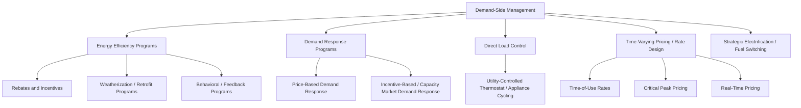
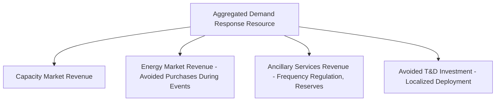

## Utility-Run Demand-Side Management Programs

### Definition and Scope

Demand-side management (DSM) refers to the set of utility-administered programs and activities designed to influence customer energy consumption patterns — whether by reducing total energy use (energy efficiency), shifting the timing of use (demand response, load shifting), or modifying the shape of aggregate load (load management) — as an alternative or complement to expanding supply-side generation and delivery infrastructure. DSM sits at the intersection of regulatory economics, utility business-model design, and the market-failure and behavioral rationales developed elsewhere in this chapter.

**Key Points**

- DSM is broader than energy efficiency alone: it encompasses energy efficiency, demand response, direct load control, time-varying pricing, and strategic conservation/electrification programs.
- The economic case for utility-run (rather than purely market-driven) DSM rests on the same market failures discussed under the efficiency gap — split incentives, information asymmetries, and capital constraints — combined with the utility's unique position as an information aggregator and low-transaction-cost delivery channel to its full customer base.
- DSM program design is inseparable from utility regulatory and ratemaking structure, since a utility's core revenue model can create either strong incentives or active disincentives to promote reduced customer energy consumption.

---

### Taxonomy of DSM Program Types

#### Energy Efficiency Programs

Rebate/incentive programs, direct-install weatherization for income-qualified customers, upstream manufacturer/retailer incentive programs, and behavioral programs (e.g., comparative home energy usage reports) that reduce total energy consumption without necessarily changing the timing of use. These programs are the primary subject of the cost-effectiveness testing framework covered elsewhere in this chapter.

#### Demand Response (DR)

Programs that reduce or shift load in response to a price signal or a direct utility dispatch request, typically targeting system peak periods when the marginal cost of supply (and grid stress) is highest.

- **Price-based DR**: customers respond voluntarily to time-varying prices (see rate design below) without a direct dispatch instruction.
- **Incentive-based DR**: customers enroll in a program that pays them (often through a capacity payment or per-event incentive) for a contractual commitment to reduce load when called upon, frequently aggregated and bid into wholesale capacity or ancillary service markets.

$$\text{DR Value} = \sum_{peak\ hours} (P_{wholesale,t} - P_{retail}) \times \Delta Q_t + \text{Avoided Capacity Cost}$$

Where the value of demand response derives both from avoiding high marginal wholesale energy costs during peak hours and from reducing the system's required generation/capacity margin.

#### Direct Load Control (DLC)

The utility retains direct dispatch authority over specific customer end-uses (most commonly central air conditioning compressors or water heaters) via a control device, cycling the equipment off for short intervals during system peak events in exchange for a bill credit or reduced rate. Economically, DLC substitutes for peaking generation capacity by directly managing load rather than relying on customer price response.

#### Time-Varying Pricing

Covered in depth as a rate-design tool, but functions as a DSM instrument insofar as it induces voluntary load shifting:

- **Time-of-use (TOU) rates**: fixed, pre-announced price blocks by time of day/season.
- **Critical peak pricing (CPP)**: a much higher price triggered on a limited number of pre-identified high-stress days per year, layered on top of a standard rate.
- **Real-time pricing (RTP)**: prices that track wholesale market conditions on an hourly or sub-hourly basis, providing the most economically efficient price signal but requiring more sophisticated metering and customer engagement infrastructure.

#### Strategic Electrification / Fuel Switching

A more recent DSM category (particularly relevant to jurisdictions pursuing decarbonization) promoting the switch from fossil-fuel end-uses (gas heating, gas water heating, internal combustion vehicles) to efficient electric alternatives (heat pumps, electric water heaters, EVs), which increases electricity sales even as it may reduce total primary energy consumption and emissions — creating a distinct DSM category that does not fit the traditional "reduce or shift electricity load" framing of legacy DSM programs.

---

### The Core Regulatory Economics Problem: The Throughput Incentive

#### Traditional Cost-of-Service Regulation and the Conflict with DSM

Under traditional cost-of-service, volumetric-rate regulation, a utility's revenue is largely a function of the volume of energy sold:

$$Revenue = P \times Q + Fixed\ Charges$$

Since most utility costs (particularly capital costs of generation, transmission, and distribution infrastructure) are largely fixed and recovered through volumetric rates, a reduction in $Q$ from a successful efficiency program directly reduces the utility's revenue and profit *between rate cases*, even though it may reduce the utility's total costs by even less (since fixed costs remain largely unchanged in the short run). This creates the well-documented **"throughput incentive"**: a structural financial disincentive for a utility to aggressively promote programs that reduce its own energy sales, regardless of whether those programs pass cost-effectiveness tests from a societal or ratepayer perspective.

[Inference] The throughput incentive is one of the most widely cited structural barriers in the utility regulatory economics literature explaining historically uneven DSM program aggressiveness across jurisdictions, and is the primary motivation for the regulatory reforms discussed below; the magnitude of the disincentive in any specific case depends on the utility's cost structure (fixed vs. variable cost share) and the length of time between rate cases, which vary by jurisdiction.

#### Regulatory Solutions: Decoupling

**Revenue decoupling** breaks the link between a utility's realized revenue and the volume of energy sold, typically through a periodic "true-up" mechanism that adjusts rates to reconcile actual revenue collected against a regulator-approved revenue target, independent of realized sales volume.

$$Revenue_{target} = f(\text{approved cost of service}), \text{ independent of realized } Q$$

$$\text{True-up adjustment} = Revenue_{target} - Revenue_{actual}$$

- If actual sales fall below the level assumed when rates were set (e.g., due to a successful DSM program or mild weather), the utility recovers the shortfall from customers in a subsequent period (or through a surcharge).
- If actual sales exceed the assumed level, the utility refunds the excess to customers.
- This removes the direct financial penalty a utility faces for promoting sales-reducing DSM, since utility profit becomes independent of realized volume.

**Key Points**

- Decoupling addresses the *disincentive* to promote DSM but does not by itself create a positive incentive to actively pursue it — additional mechanisms are typically layered on top.
- Decoupling design varies (full revenue decoupling vs. partial mechanisms limited to specific customer classes or a capped annual adjustment) and is subject to ongoing debate regarding whether it fully insulates utilities from normal business risk in a way that may reduce cost-control incentives.

#### Regulatory Solutions: Performance Incentive Mechanisms (Shareholder Incentives)

Beyond removing the disincentive, many jurisdictions layer an explicit **performance incentive mechanism (PIM)** allowing utility shareholders to earn additional return for achieving (or exceeding) approved DSM savings targets, converting DSM from a cost-recovery-neutral activity into an active profit opportunity aligned with policy goals.

$$Shareholder\ Incentive = \alpha \times (Net\ Benefits\ Achieved) \quad \text{or} \quad \beta \times (Savings_{actual} - Savings_{target})$$

Common structural approaches include:

- **Shared savings mechanisms**: shareholders earn a percentage of the net societal benefits (using one of the standardized cost-effectiveness tests) generated by the DSM portfolio.
- **Rate-of-return adders**: an incremental basis-point addition to the utility's authorized return on equity, contingent on meeting DSM performance metrics.
- **Fixed dollar incentives per unit of verified savings**: a defined incentive payment per kWh or per unit of demand reduction achieved, verified through the EM&V process.

---

### Alternative Approach: Explicit DSM Cost Recovery Mechanisms

Where full decoupling is not adopted, jurisdictions frequently use narrower, DSM-specific cost recovery mechanisms:

- **DSM cost recovery riders/adjustment clauses**: a separate line-item charge on customer bills that recovers DSM program costs directly and automatically, outside the standard rate case cycle, ensuring the utility is not required to under-recover approved program costs even without full decoupling.
- **Lost revenue adjustment mechanisms (LRAM)**: a narrower tool that specifically compensates the utility for revenue lost due to *verified* DSM program savings (as distinct from full decoupling, which addresses revenue variation from all causes including weather), calculated as:

$$LRAM = Verified\ Savings_{kWh} \times Retail\ Rate_{marginal}$$

[Inference] LRAM mechanisms are generally viewed as a narrower, more targeted (and sometimes more politically feasible) alternative to full decoupling, since they isolate compensation specifically to DSM-attributable sales reduction rather than addressing the utility's full revenue-volatility exposure, though this narrower scope means they do not address disincentives arising from other sources of sales variation (e.g., weather, economic conditions).

---

### Program Delivery Models

#### Utility Direct Delivery vs. Third-Party Administration

| Model | Description | Trade-offs |
| --- | --- | --- |
| Utility-administered | Utility designs, markets, and delivers programs directly using internal staff | Direct control and accountability; may lack specialized marketing/delivery expertise; utility retains full compliance risk |
| Third-party administered | An independent entity (sometimes a dedicated non-utility "efficiency utility") designs and delivers programs on behalf of, or instead of, the incumbent utility | Can bring specialized program design expertise and reduce potential conflict of interest with a utility's core sales-based business model; requires clear contractual performance accountability |
| Hybrid/contracted implementation | Utility retains program ownership and regulatory accountability but contracts implementation (marketing, installation, evaluation) to specialized vendors | Common middle-ground approach balancing utility accountability with delivery expertise |

[Unverified] The prevalence of each delivery model varies substantially by jurisdiction and has evolved over time; some jurisdictions have moved toward independent or quasi-independent efficiency administrators specifically to reduce the conflict-of-interest concern inherent in a sales-incentivized utility also being responsible for reducing its own sales, but the specific institutional landscape should be checked against current jurisdiction-specific regulatory structures.

#### Upstream, Midstream, and Downstream Program Design

DSM programs can intervene at different points in the supply chain:

- **Downstream**: incentives paid directly to the end-use customer at time of purchase or installation.
- **Midstream**: incentives paid to distributors or contractors, who pass savings through to customers via reduced shelf/quoted prices, reducing customer-facing transaction friction (no rebate paperwork required) at the cost of relying on the intermediary to pass through the full incentive value.
- **Upstream**: incentives paid to manufacturers to influence product design and market-wide stocking decisions (e.g., paying a manufacturer per efficient unit produced/shipped into a service territory), which can achieve broad market transformation with lower per-unit administrative cost but less direct visibility into which specific end-customer ultimately benefits.

---

### Integrated Resource Planning (IRP) and DSM as a "Resource"

A foundational economic principle in DSM regulatory policy is that verified, cost-effective demand-side savings should be evaluated on a comparable basis to supply-side resources (new generation, transmission) within a utility's long-term integrated resource plan, following the "efficiency as a resource" or "least-cost planning" doctrine.

$$\text{Resource Selection Rule: choose the portfolio minimizing} \sum_{r} PV(Cost_r) \text{ subject to reliability constraints}$$

Where the choice set of resources $r$ includes both supply options (new generation capacity, power purchase agreements) and demand-side options (efficiency programs valued at their levelized cost of saved energy, and demand response valued at its capacity/energy displacement value), selected using a consistent discounting and risk framework across both categories.

**Key Points**

- Levelized cost of saved energy (LCSE), introduced under the cost-effectiveness analysis discussion, is the direct analytical bridge that allows DSM resources to be compared against supply-side levelized cost of electricity (LCOE) within an IRP framework.
- Regulatory frameworks requiring utilities to demonstrate that they have exhausted cost-effective DSM potential before approving new supply-side capital investment are often referred to as "least-cost" or "all-source" competitive procurement requirements.

---

### Demand Response Value Stack and Market Participation

#### Capacity Market and Ancillary Service Integration

In restructured electricity markets with organized wholesale capacity and ancillary service markets, aggregated demand response resources can bid directly into these markets alongside conventional generation, monetizing multiple value streams:

$$\text{Total DR Value} = V_{capacity} + V_{energy} + V_{ancillary} + V_{T\&D\ deferral}$$

[Inference] The relative magnitude of each value stream varies substantially by market structure and region; in some organized wholesale markets capacity revenue has historically represented the largest single component of aggregated DR value, but this composition is market- and time-period-specific and should not be treated as a fixed universal proportion.

#### Baseline Methodology Challenges

A persistent technical and economic challenge in DR program design is establishing a credible **customer baseline load (CBL)** — the counterfactual load the customer would have consumed absent the DR event — against which actual reduced consumption during an event is measured and compensated.

$$Verified\ Reduction = CBL_{estimated} - Actual\ Load_{during\ event}$$

Common baseline methodologies include average-of-similar-days approaches (e.g., average of the highest load days in a recent lookback window, adjusted for weather) and regression-based approaches controlling for weather and calendar effects. [Inference] Baseline estimation error is a widely recognized source of both over- and under-compensation risk in DR program economics, since an inflated baseline overstates apparent load reduction (and thus payment) while a deflated baseline understates the customer's true contribution — the specific accuracy of any given methodology is an active area of program design refinement rather than a fully solved problem.

---

### Worked Numerical Example: Decoupling Mechanism Mechanics

**Scenario**: A utility's rate case sets an approved annual revenue requirement of $500 million, based on a forecast sales volume of 10,000 GWh (implying an approved average rate of $50/MWh).

During the year, a combination of a successful DSM program and mild weather reduces actual sales to 9,400 GWh.

**Without decoupling**:

$$Revenue_{actual} = 9{,}400 \times 50 = \$470\ \text{million}$$

The utility falls $30 million short of its approved revenue requirement purely due to the volume shortfall, creating a direct financial penalty for the reduced sales — regardless of whether that reduction came from DSM programs the utility itself is required to administer.

**With full revenue decoupling**:

$$True\text{-}up = 500 - 470 = \$30\ \text{million (recovered from customers via subsequent rate adjustment)}$$

The utility recovers its full approved $500 million revenue requirement regardless of the sales shortfall, and the $30 million shortfall is instead spread across customers in a subsequent billing period true-up — removing the direct financial disincentive to promote sales-reducing DSM programs, though the true-up itself raises separate distributional and rate-stability considerations for customers, since it introduces a degree of rate volatility tied to prior-period sales variance.

[Inference] This example isolates the pure mechanical effect of decoupling; real-world decoupling mechanisms often include caps on the annual true-up adjustment, differentiated treatment by customer class, and other design refinements intended to balance the removal of the throughput disincentive against customer rate-stability concerns, and specific mechanism parameters vary considerably by jurisdiction.

---

### Diagram: DSM Regulatory Incentive Alignment Framework (svg_diagram)

<svg xmlns="http://www.w3.org/2000/svg" viewBox="0 0 800 400" font-family="Arial, sans-serif">
<text x="400" y="28" text-anchor="middle" font-size="16" font-weight="bold">DSM Regulatory Incentive Alignment (svg_diagram)</text>
<rect x="40" y="70" width="220" height="80" rx="8" fill="#fee2e2" stroke="#991b1b" stroke-width="1.5" />
<text x="150" y="100" text-anchor="middle" font-size="12" font-weight="bold">Problem</text>
<text x="150" y="120" text-anchor="middle" font-size="11">Throughput Incentive</text>
<text x="150" y="136" text-anchor="middle" font-size="10">Volumetric revenue penalizes DSM</text>
<rect x="300" y="70" width="220" height="80" rx="8" fill="#fef3c7" stroke="#92400e" stroke-width="1.5" />
<text x="410" y="100" text-anchor="middle" font-size="12" font-weight="bold">Fix Disincentive</text>
<text x="410" y="120" text-anchor="middle" font-size="11">Revenue Decoupling</text>
<text x="410" y="136" text-anchor="middle" font-size="10">Removes profit penalty for lower sales</text>
<rect x="560" y="70" width="200" height="80" rx="8" fill="#dcfce7" stroke="#166534" stroke-width="1.5" />
<text x="660" y="100" text-anchor="middle" font-size="12" font-weight="bold">Add Positive Incentive</text>
<text x="660" y="120" text-anchor="middle" font-size="11">Performance Incentive Mechanism</text>
<text x="660" y="136" text-anchor="middle" font-size="10">Shareholder earnings tied to savings</text>
<line x1="260" y1="110" x2="300" y2="110" stroke="#334155" stroke-width="1.5" marker-end="url(#arrow4)" />
<line x1="520" y1="110" x2="560" y2="110" stroke="#334155" stroke-width="1.5" marker-end="url(#arrow4)" />
<rect x="180" y="220" width="440" height="90" rx="8" fill="#e0e7ff" stroke="#3730a3" stroke-width="1.5" />
<text x="400" y="248" text-anchor="middle" font-size="12" font-weight="bold">Outcome: Utility Business Model Aligned with DSM Goals</text>
<text x="400" y="268" text-anchor="middle" font-size="10">Utility neither penalized nor merely neutral toward reduced sales;</text>
<text x="400" y="284" text-anchor="middle" font-size="10">shareholders benefit from achieving verified, cost-effective savings</text>
<line x1="150" y1="150" x2="300" y2="220" stroke="#94a3b8" stroke-width="1" stroke-dasharray="4,2" />
<line x1="660" y1="150" x2="500" y2="220" stroke="#94a3b8" stroke-width="1" stroke-dasharray="4,2" />
</svg>

---

### Common Critiques and Policy Debates

**Key Points**

- **Conflict of interest concern**: even with decoupling and PIMs, critics argue a vertically integrated, sales-incentivized utility retains an inherent institutional conflict of interest in aggressively promoting demand reduction, motivating some jurisdictions to shift DSM delivery to independent third-party administrators.
- **Cost allocation and cross-subsidization**: DSM program costs recovered through rates are paid by all customers in a rate class, while direct program benefits (rebates, retrofits) typically accrue only to participants, raising the same non-participant/RIM-test equity concerns discussed under cost-effectiveness analysis.
- **PIM design risk**: poorly calibrated performance incentive mechanisms can create incentives for utilities to prioritize easily achieved, low-cost savings (or even inflate claimed savings) over harder-to-reach but potentially higher-value efficiency opportunities (e.g., low-income and hard-to-reach customer segments), requiring careful EM&V oversight to align incentive payments with genuinely verified net benefits.
- **Interaction with electrification goals**: strategic electrification programs that increase electricity sales while reducing overall primary energy and emissions sit awkwardly within a DSM framework historically built around reducing electricity throughput, requiring evolving program design and potentially revised utility incentive structures as electrification becomes a more prominent policy objective.

---

### Related Topics

- Cost-effectiveness analysis of efficiency programs (shared testing framework for DSM program evaluation)
- Theoretical foundations of the energy efficiency gap (market failures DSM programs are designed to correct)
- Time-of-use and dynamic electricity pricing design
- Utility revenue decoupling mechanisms and performance-based regulation
- Integrated resource planning and least-cost utility procurement
- Wholesale capacity market design and demand response aggregation rules
- Building codes and appliance standards economics (complementary mandatory-minimum instrument)
- Electrification policy and utility business model transformation