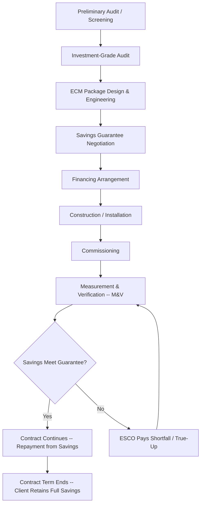

## Energy Service Companies and Performance Contracting

### Definition and Core Concept

An energy service company (ESCO) is a business entity that designs, finances, installs, and often operates energy efficiency, distributed generation, or energy management projects for a client (the "host"), with compensation structured around the resulting energy or cost savings rather than the equipment or labor alone. The defining institutional feature of the ESCO industry is not the technology it deploys but the contractual mechanism it uses: performance contracting, in which payment is explicitly tied to measured or guaranteed performance outcomes.

Performance contracting shifts risk that would otherwise sit with the building owner — technical risk (will the measure work as designed), performance risk (will savings materialize as projected), and often financing risk — onto the ESCO. This risk transfer is the economic reason the model exists: it solves an information and capability asymmetry in which building owners lack the technical expertise, upfront capital, or risk tolerance to undertake efficiency retrofits on their own.

### The Underlying Market Failure

Energy efficiency investment is chronically underprovided relative to its apparent net present value, a phenomenon documented extensively in the energy economics literature as the "energy efficiency gap" or "energy paradox." ESCOs and performance contracting are a market-based institutional response to several components of this gap:

- **Capital constraints**: Public agencies, schools, and many private firms face budget or debt limitations that prevent large upfront capital outlays even when the efficiency investment has a favorable payback.
- **Split incentives (principal-agent problem)**: In leased buildings, the party paying for capital improvements (landlord) often differs from the party capturing the utility bill savings (tenant), suppressing investment.
- **Information asymmetry and technical risk**: Building owners often cannot independently verify engineering claims about expected savings, creating adverse selection risk that deters investment absent a credible guarantee mechanism.
- **High transaction costs**: Identifying, engineering, procuring, and commissioning multiple efficiency measures has fixed costs that are prohibitive for a single building owner acting alone, but that an ESCO can amortize across many projects.
- **Discount rate mismatches**: Public sector and household decision-makers frequently apply implicit discount rates far above their true cost of capital when evaluating efficiency investments, a behavioral/institutional friction that performance guarantees can partially offset by converting an investment decision into a budget-neutral cash-flow decision.

### The Energy Performance Contract (EPC) Structure

**Key Points**

- The ESCO conducts an **investment-grade audit (IGA)** to identify and engineer a package of energy conservation measures (ECMs).
- The ESCO **guarantees** a level of energy or cost savings, typically over a contract term of 10–20 years.
- Savings are used to repay the capital cost of the project, which may be financed by the client, a third-party lender, or the ESCO itself.
- If actual savings fall short of the guarantee, the ESCO typically pays the shortfall to the client (a "true-up" payment); if savings exceed the guarantee, terms vary by contract (shared savings, client retains excess, or ESCO retains a share).

The canonical project lifecycle:

### Two Dominant Contract Models

#### Guaranteed Savings Contract

The ESCO guarantees a minimum level of savings sufficient to cover debt service on client- or third-party-arranged financing. The client (or the client's lender) bears the credit/repayment obligation, but the ESCO bears the performance risk: if savings underperform, the ESCO compensates the client for the shortfall, generally in cash.

- Financing typically appears on the client's balance sheet.
- Preferred by clients with strong credit access (municipalities, universities, large institutions) who want lower financing costs than an ESCO could obtain.
- Performance risk is transferred to the ESCO; credit risk stays with the client.

#### Shared Savings Contract

The ESCO arranges and often provides the financing itself, and the client and ESCO share the realized energy cost savings according to a pre-agreed formula for the contract duration.

- Financing (and thus credit risk) sits with the ESCO or its financiers, which is attractive to clients with weak balance sheets or limited debt capacity.
- The ESCO's compensation is directly a function of measured savings, so both performance risk and (in many structures) volume/weather risk fall more heavily on the ESCO.
- Historically less common in mature markets because it is more capital-intensive for the ESCO and complicates off-balance-sheet accounting objectives; guaranteed savings models have become more prevalent in the U.S. and much of Europe as ESCO markets matured.

**Example**

A public school district lacks capital budget authority to replace an aging chiller plant and lighting system. Under a guaranteed savings contract, the ESCO conducts an IGA finding $2.4 million in ECMs (chiller replacement, LED retrofit, building automation system upgrade) with a guaranteed annual savings of $260,000. The district issues a 15-year tax-exempt lease-purchase to fund the $2.4 million capital cost at, say, 4.5% interest, with annual debt service of roughly $220,000. The ESCO's guarantee ($260,000) exceeds annual debt service, generating a small positive cash flow cushion for the district from year one, with no new net operating expenditure — the project is "budget neutral," which is the core marketing proposition of most public-sector EPCs.

### Financing Structures

| Structure | Balance Sheet Impact | Typical Users | Notes |
| --- | --- | --- | --- |
| Tax-exempt lease-purchase / municipal lease | On client balance sheet | Municipalities, school districts, public agencies | Lower interest cost due to tax-exempt status; widely used in U.S. public-sector EPCs |
| Third-party financing (bank, ESCO-affiliated lender) | On client or off, depending on structure | Private firms, some public entities | ESCO arranges but does not hold the debt |
| ESCO self-financing / shared savings | Often off client balance sheet | Credit-constrained clients | Higher effective cost of capital; ESCO bears more risk |
| Power purchase agreement (PPA)-style structures for on-site generation | Off balance sheet | Commercial, industrial, institutional hosts | Used when ECMs include on-site solar, CHP, or other generation assets bundled into the EPC |
| Green bonds / on-bill financing / PACE | Varies | Various | Increasingly used to fund EPC-adjacent projects, particularly in jurisdictions with enabling legislation |

[Inference] The precise mix of financing vehicles used in a given jurisdiction depends heavily on local public finance law, tax status, and utility regulatory structures, so the table above reflects common practice rather than a universal rule.

### Measurement and Verification (M&V)

M&V is the technical and contractual backbone that makes the "guarantee" in performance contracting credible and enforceable. Without a rigorous, agreed-upon method for calculating savings, a performance guarantee is unenforceable, since "savings" is inherently a counterfactual (a comparison to what energy use *would have been* absent the ECMs) rather than a directly observed quantity.

The industry-standard framework is the **International Performance Measurement and Verification Protocol (IPMVP)**, which defines four M&V options:

- **Option A – Retrofit Isolation, Key Parameter Measurement**: Measures only the parameters expected to vary post-retrofit (e.g., lighting fixture wattage), with other parameters stipulated. Lower cost, higher estimation uncertainty.
- **Option B – Retrofit Isolation, All Parameter Measurement**: All relevant parameters for the affected system are measured before and after. More accurate, more expensive.
- **Option C – Whole Facility**: Uses utility meter data for the entire facility, with statistical regression models (often controlling for weather via degree-days and occupancy/production variables) to establish a baseline and compare post-retrofit consumption. Well-suited to comprehensive, multi-ECM projects where interactive effects between measures make isolation difficult.
- **Option D – Calibrated Simulation**: Uses engineering simulation models (e.g., DOE-2, EnergyPlus) calibrated against actual utility data, used when no pre-retrofit baseline exists (new construction) or isolation is impractical.

**Key Points**

- The core baseline-adjustment equation underlying most M&V approaches is:

$$\text{Savings} = (\text{Baseline Energy Use} \pm \text{Adjustments}) - \text{Post-Retrofit Energy Use}$$

- Adjustments (routine and non-routine) normalize for factors outside the ESCO's control, such as weather (via heating/cooling degree-days), occupancy changes, production volume in industrial settings, or building additions.
- Option C regression baselines commonly take a form such as:

$$E_{base} = \beta_0 + \beta_1 \cdot HDD + \beta_2 \cdot CDD + \beta_3 \cdot X + \varepsilon$$

where $HDD$ and $CDD$ are heating and cooling degree-days, $X$ represents other explanatory variables (occupancy, production), and $\varepsilon$ is the residual error term.

M&V is not free: it consumes a portion of total project savings (commonly cited industry rule-of-thumb ranges are roughly 3–10% of realized savings depending on option chosen and project complexity), creating an explicit economic trade-off between measurement rigor and net savings retained by the client. [Inference] Exact M&V cost fractions vary considerably by project scale, complexity, and jurisdiction, so this range should be treated as indicative rather than a fixed industry parameter.

### Risk Allocation Framework

Performance contracting is best understood in energy economics as a risk-reallocation mechanism. The table below summarizes how major risk categories are typically distributed:

| Risk Category | Guaranteed Savings Model | Shared Savings Model |
| --- | --- | --- |
| Technical/engineering risk (measure works as designed) | ESCO | ESCO |
| Performance risk (savings materialize as projected) | ESCO | ESCO |
| Credit/financing risk | Client | ESCO |
| Energy price risk | Typically client (savings often expressed in energy units, converted to $ at prevailing rates) | Varies by contract; can be shared |
| Baseline/usage risk (occupancy, weather, production changes) | Shared via M&V adjustment mechanisms | Shared via M&V adjustment mechanisms |
| Construction/completion risk | ESCO | ESCO |

### Economic Rationale from a Contract Theory Perspective

Performance contracting can be modeled as a solution to a principal-agent problem with moral hazard and adverse selection. The building owner (principal) cannot costlessly verify the ESCO's (agent's) effort or the quality of ECM engineering. A pure fee-for-service contract would give the ESCO no incentive to optimize actual performance once paid. By tying compensation (or a penalty/true-up) to measured outcomes, the EPC realigns the ESCO's incentives with the client's, at the cost of the M&V overhead described above.

This can be represented in simplified form. If $S$ is realized savings, $\hat{S}$ is the guaranteed savings level, and $p$ is the penalty rate per unit shortfall, the ESCO's payoff function under a guaranteed savings contract approximates:

$$\pi_{ESCO} = F - p \cdot \max(0, \hat{S} - S)$$

where $F$ is the fixed fee/financing-linked payment. This structure gives the ESCO a direct financial stake in $S \geq \hat{S}$, which [Inference] is the standard theoretical justification cited in energy economics literature for why EPCs outperform simple fee-for-service efficiency contracting in inducing genuine effort and conservative (rather than optimistic) engineering estimates, though empirical measurement of this incentive effect in practice is limited by data availability.

### Barriers and Criticisms

- **Transaction costs and deal size threshold**: The fixed costs of IGA, legal structuring, and M&V design mean EPCs are typically only economical above a minimum project size (commonly cited institutional threshold in U.S. public-sector practice is roughly $1 million+, though this varies by market), limiting applicability for small buildings or single-measure projects.
- **Split-incentive persistence**: EPCs address capital constraints but do not fully resolve landlord-tenant split incentives unless carefully structured (e.g., tenant improvement pass-throughs).
- **Guarantee gaming and conservative baselining**: ESCOs have an incentive to set conservative baselines or add contingency margins to guarantees, which can reduce the apparent (and contractible) savings below the true achievable savings — a documented tension in the EPC literature. [Inference] The magnitude of this effect is difficult to observe directly since true achievable savings are themselves counterfactual and unobserved.
- **Complexity and procurement burden**: Public procurement rules, the need for specialized legal/technical expertise to evaluate ESCO proposals, and long contract terms (10–20 years) impose administrative burdens that can deter smaller public entities.
- **Persistence of savings**: Savings guarantees typically apply during the contract term; post-contract, without ongoing M&V or a renewed service agreement, savings persistence (continued proper operation and maintenance of installed equipment) is not contractually assured. [Unverified/Speculation] Anecdotal industry claims about post-contract savings persistence rates vary widely and are not consistently benchmarked across the sector.

### Market Structure and Policy Context

ESCO markets developed initially in the U.S. in the 1970s–1980s following the oil price shocks, expanded significantly through public-sector EPC programs in the 1990s–2000s, and have since spread internationally, with notable growth in China (supported by government-backed ESCO financing mechanisms), the EU (driven by the Energy Efficiency Directive's Article 18 provisions encouraging EPC markets), and other regions. Government policy commonly supports ESCO market development through:

- Enabling legislation explicitly authorizing public entities to enter multi-year EPCs without full upfront appropriation (addressing legal/budgetary barriers to long-term contracting).
- Standardized model contracts and procurement templates to reduce transaction costs and legal risk.
- ESCO accreditation or qualification lists to reduce information asymmetry for public buyers.
- Dedicated financing facilities or credit guarantees (particularly in emerging markets) to reduce the cost of capital for ESCO-financed projects.

### Illustrative Payback and Cash Flow Diagram

The following SVG illustrates the budget-neutral cash flow logic that underpins most guaranteed savings EPCs, showing debt service versus guaranteed savings over a contract term.

<svg xmlns="http://www.w3.org/2000/svg" viewBox="0 0 760 420" font-family="Helvetica, Arial, sans-serif">
<text x="380" y="28" text-anchor="middle" font-size="18" font-weight="bold" fill="#1a1a1a">Guaranteed Savings vs. Debt Service Over Contract Term (svg_diagram)</text>
<line x1="70" y1="360" x2="720" y2="360" stroke="#333" stroke-width="2" />
<line x1="70" y1="360" x2="70" y2="60" stroke="#333" stroke-width="2" />

<text x="40" y="365" font-size="12" fill="#333">0</text>

<text x="20" y="80" font-size="12" fill="#333">$300k</text>

<text x="20" y="215" font-size="12" fill="#333">$150k</text>

<text x="380" y="400" text-anchor="middle" font-size="13" fill="#333">Contract Year (1–15)</text>

<text x="30" y="215" font-size="13" fill="#333" transform="rotate(-90 30 215)">Annual Value ($)</text>

<line x1="70" y1="230" x2="700" y2="230" stroke="#c0392b" stroke-width="3" />
<text x="705" y="234" font-size="12" fill="#c0392b" font-weight="bold">Debt Service (\$220k/yr)</text>
<line x1="70" y1="196" x2="700" y2="196" stroke="#27ae60" stroke-width="3" />
<text x="705" y="200" font-size="12" fill="#27ae60" font-weight="bold">Guaranteed Savings (\$260k/yr)</text>
<rect x="710" y="188" width="18" height="52" fill="#f1c40f" opacity="0.5" />
<text x="620" y="180" font-size="12" fill="#7d6608">Positive Cash Flow Cushion (~\$40k/yr)</text>
<line x1="440" y1="230" x2="440" y2="196" stroke="#7d6608" stroke-width="2" stroke-dasharray="4,3" />
<line x1="70" y1="360" x2="70" y2="60" stroke="#999" stroke-width="1" stroke-dasharray="2,2" />
<line x1="700" y1="360" x2="700" y2="60" stroke="#999" stroke-width="1" stroke-dasharray="2,2" />
<text x="700" y="378" text-anchor="middle" font-size="11" fill="#666">Yr 15: Contract Ends</text>
<text x="700" y="392" text-anchor="middle" font-size="11" fill="#666">Client Retains Full \$260k/yr</text>
</svg>

### Related Topics

- **Investment-grade energy audits**: methodology, scope, and engineering economics
- **IPMVP options in depth**: statistical baseline modeling and regression diagnostics for Option C
- **Split-incentive problem in commercial leasing**: green leases and energy-aligned lease clauses
- **Energy efficiency gap and behavioral economics of underinvestment**
- **On-bill financing and Property Assessed Clean Energy (PACE) programs**
- **Public procurement law for multi-year performance-based contracts**
- **Combined heat and power (CHP) and on-site generation bundled with EPCs**
- **International EPC market comparison**: U.S., EU Energy Efficiency Directive, China ESCO market
- **Building automation systems and their role in sustaining post-EPC savings**
- **Discount rates and the "energy paradox" in efficiency investment appraisal**