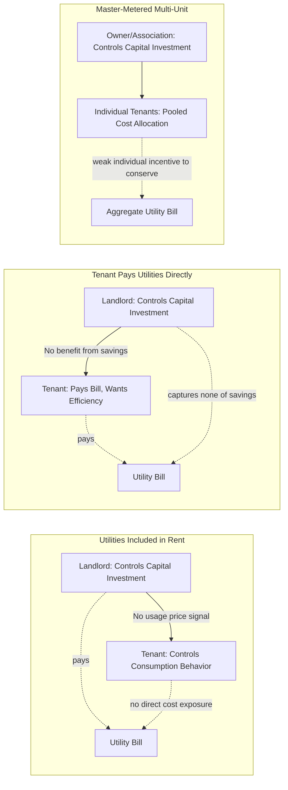

## Split Incentive Problems in Efficiency Investment

### Definition and Core Concept

The split incentive problem (also called the "principal-agent problem in energy efficiency" or "landlord-tenant problem") occurs when the party responsible for making an energy efficiency investment decision does not receive the corresponding benefit, while the party who would receive the benefit lacks the authority or means to make the investment. This misalignment between decision rights and cash-flow rights suppresses efficiency investment below its socially and privately efficient level, even when the investment has a positive net present value from the perspective of the building or system as a whole.

The problem is a specific instance of the classical principal-agent problem from contract theory, distinguished by the fact that the misalignment is structural and recurring — rooted in standard lease, rental, and ownership arrangements — rather than arising from asymmetric information about a single transaction.

### Canonical Forms of Split Incentives

**Key Points**

- **Landlord-tenant, utilities included in rent**: The landlord pays utility bills and controls capital investment decisions (insulation, HVAC, windows), but has no direct financial exposure to consumption levels since costs are embedded in rent; the tenant, who controls day-to-day usage behavior, faces no marginal price signal at all.
- **Landlord-tenant, tenant pays utilities directly**: The landlord controls capital investment decisions (building envelope, heating system, appliances) but does not pay utility bills and therefore does not capture the savings from efficiency upgrades; the tenant pays the bills and would benefit from upgrades but typically lacks legal authority to alter the building's fixed capital stock.
- **Short tenure / short lease term**: Even when a tenant *could* invest (e.g., owner-occupants with short expected holding periods, or tenants with renewal-uncertain leases), a short expected occupancy horizon relative to the efficiency measure's payback period discourages investment because the investor may not remain in place long enough to recoup the capital outlay.
- **Multi-tenant/multi-unit buildings with master-metering**: Costs are pooled and allocated by formula (e.g., square footage) rather than actual consumption, eliminating each tenant's marginal incentive to conserve, and simultaneously weakening any single tenant's incentive to pay for or advocate for a building-wide efficiency upgrade.
- **Owner-occupied but resource-constrained**: A milder variant where a single party holds both decision rights and benefit rights but faces a capital constraint or high discount rate that functions analogously to a split incentive in suppressing investment (sometimes classified separately as a capital market failure rather than a true agency problem, but often discussed alongside split incentives in the literature because the resulting underinvestment pattern is similar).

### Formal Structure as a Principal-Agent Problem

In the standard economic framing, let the efficiency investment cost $C$ be borne by party $A$ (investor, typically landlord/owner) and produce an energy savings stream with present value $PV(S)$ that accrues, in whole or in part, to party $B$ (occupant/tenant). Define $\alpha \in [0,1]$ as the share of the savings benefit actually captured by the investing party $A$ (through higher achievable rent, tenant retention, or explicit cost pass-through).

The investment occurs only if:

$$\alpha \cdot PV(S) \geq C$$

When $\alpha < 1$ — the defining condition of a split incentive — a project with positive total surplus, i.e. $PV(S) \geq C$, can still fail to be undertaken whenever:

$$\alpha \cdot PV(S) < C \leq PV(S)$$

This inequality captures the core inefficiency: socially/jointly beneficial investments are foregone purely because of how costs and benefits are contractually distributed, not because the underlying economics are unfavorable. The gap $(1-\alpha) \cdot PV(S)$ represents the surplus that is technically available but unrealized due to the agency friction.

[Inference] The parameter $\alpha$ is a stylized simplification; in practice the effective share of captured benefit depends on complex, often unobservable factors such as rent-setting dynamics, tenant bargaining power, and market thickness for energy-efficient space, so this formalization should be read as an illustrative model rather than a directly estimable structural parameter.

### Diagram: Incentive Misalignment Map

### Sectoral Prevalence and Empirical Evidence

The split incentive problem has been documented most extensively in:

- **Commercial office and retail leasing**, particularly under "gross" or "modified gross" leases where landlords bear utility costs, versus "triple net" (NNN) leases where tenants bear operating costs including utilities directly — the latter shifting (but not eliminating) the problem, since landlords under NNN leases still control most capital-intensive efficiency measures (HVAC systems, building envelope) while tenants capture the resulting savings.
- **Residential rental housing**, where landlords typically have weak incentives to invest in appliance efficiency, insulation, or heating system upgrades when tenants pay utility bills directly, a pattern documented across the U.S. rental housing stock and in international rental markets.
- **Multifamily buildings**, especially those with master metering or submetering limitations, where the technical infeasibility or cost of individual metering compounds the contractual split incentive.

[Inference] Precise quantitative estimates of the aggregate efficiency gap attributable specifically to split incentives (as opposed to other market failures such as information asymmetry or capital constraints) vary substantially across studies and are sensitive to methodology, since isolating the split-incentive channel from other coincident frictions is empirically difficult; figures cited in policy literature should therefore be treated as illustrative ranges rather than precise, universally agreed parameters.

### Mitigation Mechanisms

#### Green Leases (Energy-Aligned Leases)

Green leases are contractual innovations that explicitly reallocate costs, benefits, and decision rights to correct the split incentive. Common clauses include:

- **Cost recovery clauses**: Allow landlords to recoup capital costs of efficiency upgrades through operating expense pass-throughs, provided the improvements meet a defined efficiency or payback threshold, subject to negotiated caps.
- **Utility data-sharing / benchmarking cooperation clauses**: Require tenants to share sub-metered consumption data with landlords (or vice versa), reducing information asymmetry and enabling accurate M&V of any efficiency measures.
- **"Energy-aligned" or "warm vanilla shell" rent structures**: Base rent is adjusted based on space energy performance, more closely aligning what the tenant pays with actual consumption while preserving the landlord's incentive to invest.
- **Sustainability/collaboration clauses**: Establish joint landlord-tenant committees or agreed protocols for evaluating and cost-sharing efficiency retrofits during the lease term.

#### Submetering and Direct Metering

Installing individual meters (rather than relying on master metering with pooled allocation) restores a marginal price signal to tenants, directly addressing the consumption-side split incentive, though it does not by itself resolve the capital-investment-side split incentive (landlords still may not capture savings from envelope or system upgrades).

#### On-Bill Financing and On-Bill Repayment

Efficiency upgrade costs are financed and repaid through charges on the utility bill itself, structured so that repayment obligations transfer with occupancy (i.e., attach to the meter/property rather than the individual person). This allows a tenant or short-tenure occupant to benefit from an efficiency upgrade without the risk of paying for a measure they will not stay long enough to benefit from, and allows landlords to install upgrades without the capital risk of not recouping the outlay if benefits accrue mainly to the tenant.

#### Regulatory and Disclosure Mandates

- **Building energy benchmarking and disclosure ordinances** (e.g., requiring disclosure of ENERGY STAR scores or similar metrics at time of sale or lease) aim to capitalize efficiency performance into market rents and sale prices, increasing $\alpha$ (the investor's captured benefit share) by making efficiency a priced, visible attribute rather than a hidden one.
- **Minimum efficiency standards for rental housing** (e.g., minimum energy performance certificate ratings required before a unit can be legally let) bypass the incentive problem directly by mandating the investment rather than relying on price signals to induce it.
- **Split-incentive-specific utility or government incentive programs**: Direct rebates or tax credits targeted at landlords for tenant-occupied space, explicitly designed to lower $C$ (the landlord's net cost) to compensate for the fact that $\alpha < 1$.

#### Energy Performance Contracting (ESCO Model)

Where feasible, the ESCO model (discussed separately as a related mechanism) can partially bypass split incentives in some structures by having the ESCO, rather than the landlord, bear the capital cost, and by structuring payment such that the ESCO is compensated from realized bill savings — though this still requires resolving who (landlord or tenant) enters into and guarantees the underlying EPC, and does not eliminate the split-incentive problem when the primary beneficiary is a tenant with a short remaining lease term.

### Comparative Summary of Mitigation Approaches

| Mechanism | Primarily Addresses | Limitation |
| --- | --- | --- |
| Green lease clauses | Capital investment split incentive | Requires negotiation power and lease renewal to implement; not retroactive to existing leases |
| Submetering | Consumption-behavior split incentive | Does not address landlord capital investment incentive |
| On-bill financing/repayment | Short-tenure / benefit-capture mismatch | Requires utility program infrastructure and enabling regulation |
| Benchmarking/disclosure mandates | Market capitalization of efficiency ($\alpha$) | Effectiveness depends on market awareness and appraisal practice catching up to disclosed data |
| Minimum performance standards | Bypasses incentive problem entirely | Politically contentious; can raise compliance costs and reduce rental housing supply at the margin [Inference] |
| ESCO/EPC financing | Capital constraint component | Does not resolve underlying benefit misallocation between landlord and tenant |

### Interaction with Other Efficiency Gap Explanations

Split incentives are one of several documented contributors to the broader "energy efficiency gap," alongside information asymmetries, high implicit discount rates, capital market imperfections, and behavioral biases (e.g., inattention, present bias). In empirical and policy work, these explanations are not mutually exclusive and frequently co-occur within the same building or transaction — for example, a landlord facing a split incentive may also lack accurate information about achievable savings, compounding underinvestment. [Inference] Disentangling the marginal contribution of the split-incentive channel specifically, separate from these co-occurring frictions, remains a methodologically difficult empirical exercise, and reported magnitudes in the literature should be interpreted with this caveat in mind.

### Related Topics

- **Green leases**: standardized clause libraries (e.g., those developed by industry green-lease coalitions) and negotiation practice
- **Building energy benchmarking and disclosure policy** (ENERGY STAR Portfolio Manager, local disclosure ordinances)
- **On-bill financing and on-bill repayment program design**
- **Energy service companies and performance contracting** (as a partial mitigation mechanism)
- **The broader energy efficiency gap**: behavioral, informational, and capital-market explanations
- **Minimum energy efficiency standards for rental housing** (comparative policy across jurisdictions)
- **Submetering technology and cost-benefit analysis for multifamily retrofits**
- **Hedonic pricing studies of energy efficiency capitalization into rents and sale prices**
- **Principal-agent theory and contract design in applied microeconomics**