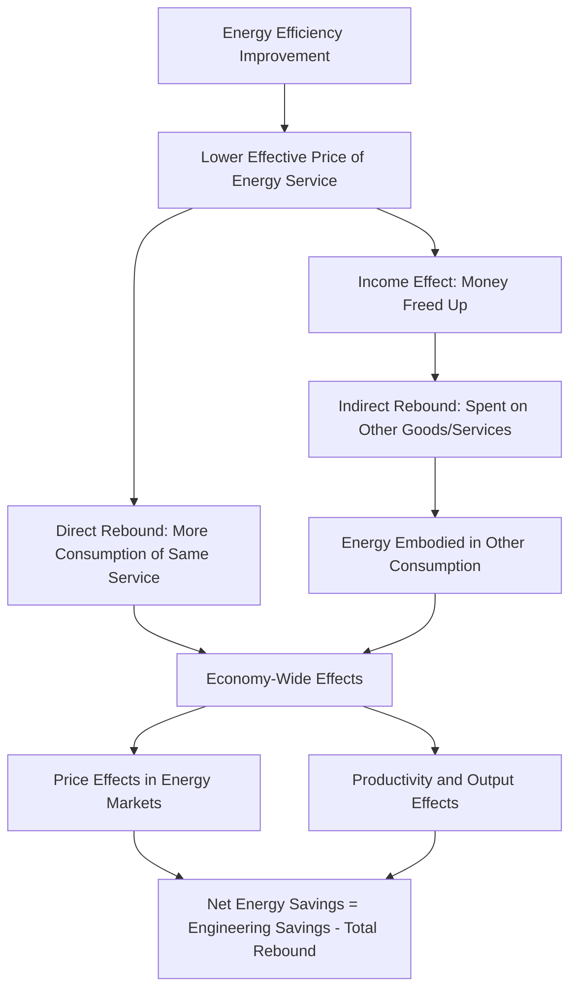

## Rebound Effects and Net Energy Savings Estimation

### Definition and Core Concept

The rebound effect refers to the phenomenon whereby improvements in energy efficiency lead to increased consumption of the energy service (or related goods), partially or fully offsetting the energy savings that would otherwise result from a purely engineering-based calculation. When a technology becomes more energy-efficient, the effective price of the energy *service* it delivers (e.g., a mile driven, a room heated to a given temperature, a lumen of light) falls, and consumers respond to this lower effective price by consuming more of the service — a standard price-response behavior rooted in microeconomic theory rather than an anomaly.

The practical significance for energy economics is that **engineering estimates of energy savings systematically overstate actual (net) savings** unless behavioral and macroeconomic responses are accounted for. This has direct implications for the credibility of energy efficiency program evaluations, the design of energy efficiency obligation schemes, and the calibration of climate policy models that rely on efficiency improvements to deliver projected emissions reductions.

### Taxonomy of Rebound Effects

**Key Points**

- **Direct rebound effect**: Increased consumption of the specific energy service whose efficiency improved (e.g., a household with a more fuel-efficient car drives more miles because the cost per mile has fallen).
- **Indirect rebound effect**: Money saved on the now-cheaper energy service is spent on other goods and services, which themselves require energy to produce and consume, generating additional energy use elsewhere in the economy.
- **Economy-wide (macroeconomic) rebound effect**: Aggregate, general-equilibrium effects operating through price changes in energy markets, structural shifts in production, and productivity gains that stimulate broader economic output and thus energy demand — sometimes decomposed further into embodied-energy effects (energy used to produce the efficient technology itself) and productivity/output effects.
- **Backfire (or "Jevons paradox" case)**: The extreme case where rebound effects exceed 100%, such that the efficiency improvement leads to *greater* total energy consumption than before, named after William Stanley Jevons's 19th-century observation regarding coal-fired steam engines.
- **Transformational (or "structural") rebound**: Longer-run effects where efficiency-driven cost reductions enable entirely new patterns of consumption, technology adoption, or economic structure not captured by simple own-price elasticity estimates.

### Formal Economic Definition

The direct rebound effect is formally defined using the price elasticity of demand for the energy service. If efficiency improves by a factor that reduces the effective price of the energy service $p_s$ by percentage $\Delta p_s / p_s$, and this induces a percentage change in consumption of the service $\Delta q_s / q_s$, the direct rebound effect $RB_{direct}$ is expressed as:

$$RB_{direct} = -\eta_{p_s} \times 100\%$$

where $\eta_{p_s} = \frac{\Delta q_s / q_s}{\Delta p_s / p_s}$ is the own-price elasticity of demand for the energy service. Since demand curves are typically downward-sloping, $\eta_{p_s}$ is negative, making $RB_{direct}$ positive under standard assumptions.

Net (actual) energy savings are then related to engineering (potential) savings as:

$$S_{net} = S_{engineering} \times (1 - RB_{total})$$

where $RB_{total}$ is the total rebound fraction (direct + indirect + economy-wide, expressed as a decimal share of engineering savings). A $RB_{total}$ of 0 implies no rebound (full engineering savings realized); $RB_{total} = 1$ implies complete offset (zero net savings); $RB_{total} > 1$ implies backfire.

**Example**

A household upgrades to a heat pump that is 40% more efficient at delivering heating than its old furnace, implying an engineering-calculated savings of 40% on heating energy use, holding indoor temperature and hours of use constant. If the household responds to the now-lower cost of heating by raising the thermostat setpoint and heating more rooms, and analysis finds this behavioral response consumes back 20% of the projected engineering savings ($RB_{direct} = 0.20$), then:

$$S_{net} = 0.40 \times (1 - 0.20) = 0.32$$

Actual net savings are 32%, not the naively projected 40% — a 20% shortfall relative to the engineering estimate.

### Empirical Magnitude Estimates by Sector

[Inference] Rebound magnitudes are among the most contested empirical parameters in energy economics, with substantial variation across studies due to differences in methodology (econometric identification strategy, time horizon, data quality), geography, income level, and the specific energy service studied. The ranges below reflect commonly cited findings in the literature but should not be treated as precise, universally applicable constants.

| Sector / Energy Service | Typical Direct Rebound Range (Cited in Literature) | Notes |
| --- | --- | --- |
| Household space heating | ~10–30% | Higher in colder climates and lower-income households where pre-improvement comfort was suppressed |
| Personal vehicle travel (fuel economy) | ~10–30% (higher in some developing-country contexts) | Long-run estimates tend to exceed short-run estimates due to adjustment lags (e.g., vehicle-miles-traveled response) |
| Residential lighting | Wide range, sometimes cited above 30% in specific studies | Lighting has historically shown some of the largest rebound estimates due to very low pre-existing service saturation in some contexts |
| Household appliances (refrigeration, water heating) | Generally lower, often cited below 10-15% | Service consumption (e.g., refrigerator volume, hot water use) is less elastic to marginal price signals |
| Industrial/commercial processes | Highly variable; can include significant indirect and economy-wide effects | Productivity gains from efficiency can drive output expansion, a distinct channel from household behavioral rebound |

[Unverified] Point estimates from any single study should not be treated as sector-wide constants; meta-analyses in this literature commonly report wide confidence intervals and note substantial cross-study heterogeneity.

### Methodological Approaches to Estimating Rebound

#### Econometric Demand Estimation

The dominant empirical approach estimates price and/or efficiency elasticities of demand for energy services using panel or cross-sectional data, typically via a demand function of the form:

$$\ln(q_s) = \beta_0 + \beta_1 \ln(p_s) + \beta_2 \ln(Y) + \beta_3 X + \varepsilon$$

where $q_s$ is the quantity of energy service consumed, $p_s$ is the effective price of the service (adjusted for efficiency), $Y$ is income, $X$ is a vector of controls (climate, household characteristics, vehicle characteristics), and $\beta_1$ is interpreted as the elasticity used to compute direct rebound.

Key identification challenges include:

- **Endogeneity of efficiency adoption**: Households or firms that adopt efficient technology may differ systematically (in preferences, income, or usage patterns) from those that do not, biasing naive comparisons — addressed via instrumental variables, natural experiments (e.g., policy-driven mandates), or panel fixed-effects designs exploiting within-household changes over time.
- **Distinguishing the direct rebound effect from a pure income effect**: Not all increased consumption following an efficiency upgrade is attributable to the price-of-service change; some may reflect unrelated income growth, requiring careful separation of price and income elasticities.
- **Pre-existing engineering savings estimates as a baseline**: Rebound is measured as a deviation from an assumed engineering/technical potential, so the credibility of rebound estimates is partly contingent on the credibility of the underlying engineering baseline (linking this topic closely to M&V methodology in performance contracting).

#### Bottom-Up Behavioral/Metering Studies

Field experiments and smart-meter-based studies compare actual post-retrofit consumption against modeled (engineering) predictions for matched samples, with the residual gap attributed (at least in part) to rebound, net of other explanatory factors such as measurement error in baseline modeling or non-routine adjustments (occupancy changes, weather).

#### Computable General Equilibrium (CGE) and Macroeconomic Modeling

Economy-wide rebound (including productivity and output effects) is typically estimated using CGE models that simulate how an efficiency shock propagates through relative prices, sectoral output, and aggregate energy demand across the whole economy, rather than partial-equilibrium household or firm-level analysis alone. These models are also used to assess the "Jevons paradox" / backfire hypothesis at a macro scale, though results are highly sensitive to model structure, elasticity assumptions, and the specific efficiency shock modeled. [Inference] CGE-based backfire findings remain a live area of disagreement in the literature and are sensitive to modeling choices in ways that are difficult to independently verify without replicating the underlying model.

### Implications for Energy Efficiency Program Design and Evaluation

**Key Points**

- Utility-run energy efficiency obligation programs and demand-side management (DSM) portfolios commonly apply a **"net-to-gross" (NTG) ratio** in their savings accounting, which adjusts gross (engineering/metered) savings for free-ridership, spillover, and (in some jurisdictions) explicit rebound adjustments, to arrive at claimed net savings used for cost-effectiveness testing and regulatory compliance.
- Rebound-adjusted savings estimates matter directly for the credibility of cost-effectiveness tests (e.g., Total Resource Cost test, Societal Cost test) used in utility regulatory proceedings, since overstated engineering savings inflate calculated benefit-cost ratios.
- Climate and energy policy models that project emissions reductions from efficiency standards (e.g., vehicle fuel economy standards, appliance standards) that ignore rebound will systematically overstate the emissions benefit, though because direct rebound estimates for most services are well below 100% in most published literature, this is generally understood as a *moderating* factor on projected savings rather than one that negates the case for efficiency policy entirely. [Inference] Whether backfire (rebound > 100%) is empirically relevant at the sector or economy-wide level, as opposed to only in specific historical episodes such as Jevons's original coal example, remains contested rather than settled in the literature.

### Distinguishing Rebound from Related Concepts

| Concept | Distinction from Rebound |
| --- | --- |
| Free-ridership | Refers to program participants who would have adopted the efficient technology anyway absent the program/incentive; a savings-attribution issue, not a behavioral-response issue |
| Spillover | Refers to additional adoption induced by a program among non-participants (e.g., market transformation effects); generally increases, not decreases, net program savings |
| Prebound effect | The empirically observed tendency for *pre-retrofit* actual energy consumption to fall short of engineering-modeled consumption (particularly noted in European residential energy performance certificate studies), a distinct baseline-measurement issue that can be conflated with rebound if not properly separated in M&V |
| Comfort-taking | A specific, often-cited mechanism underlying direct rebound in space heating/cooling, where efficiency gains are partly "spent" on improved thermal comfort (higher setpoints, more rooms heated) rather than pure energy reduction |

### Related Topics

- **Energy service companies and performance contracting**: implications of rebound for M&V-based savings guarantees
- **Net-to-gross ratio methodology in utility DSM program evaluation**
- **Price elasticity of energy demand**: estimation methods and cross-country comparisons
- **Computable general equilibrium modeling of energy and climate policy**
- **The prebound effect and its implications for building energy performance certificates**
- **Jevons paradox**: historical origins and modern applications to renewable and efficient technologies
- **Vehicle fuel economy standards (CAFE) and induced travel demand**
- **Behavioral economics of energy consumption**: comfort-taking, inattention, and habit formation