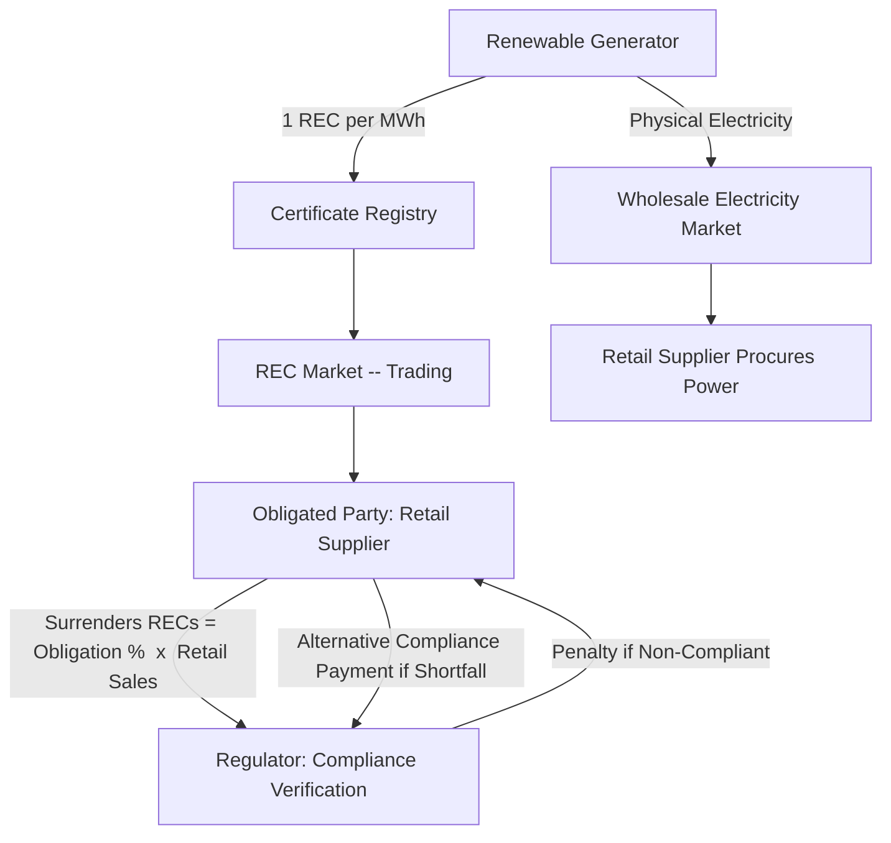

## Renewable Portfolio Standards and Tradable Certificates

### Definition and Core Concept

A renewable portfolio standard (RPS) — termed a "renewable obligation" (RO) in the UK and some other jurisdictions — is a quantity-based regulatory mechanism requiring electricity retailers, distribution utilities, or other designated "obligated parties" to supply a specified minimum percentage (or absolute quantity) of the electricity they sell from qualifying renewable energy sources. Unlike feed-in tariffs and feed-in premiums, which fix a price and allow quantity to respond, an RPS fixes a quantity target and allows the market to discover the price required to meet it — a defining structural distinction in the economics of renewable support policy.

Compliance is typically demonstrated not through physical delivery tracking but through **tradable certificates** — commonly called Renewable Energy Certificates (RECs) in the United States, Renewables Obligation Certificates (ROCs) in the UK, or Guarantees of Origin (GOs) in the EU — each representing proof that one unit of energy (typically 1 MWh) was generated from a qualifying renewable source. This certificate-based tracking separates the *environmental attribute* of renewable generation from the underlying physical electricity commodity, allowing the two to be traded independently.

### Core Mechanics

**Key Points**

- A regulator or legislature sets a target trajectory, typically expressed as a rising percentage of total retail electricity sales that must be sourced from qualifying renewables by specified future dates (e.g., "30% by 2030").
- Each MWh of qualifying renewable generation produces one certificate, issued to the generator (or, in some designs, to the certificate-holding entity depending on ownership transfer terms in the underlying power purchase agreement).
- Obligated parties (typically retail electricity suppliers) must surrender a quantity of certificates each compliance period equal to their obligation, calculated as their total retail sales multiplied by the mandated RPS percentage.
- Certificates can be bought and sold independently of the underlying electricity, allowing obligated parties to meet their obligation either by owning/contracting renewable generation directly or by purchasing certificates on the open market from unrelated generators.
- A generator's total revenue combines two separate revenue streams: sale of the physical electricity at the wholesale market price, and sale of the certificate at the prevailing certificate market price.

$$R_{generator} = (P_{wholesale} \times Q) + (P_{REC} \times Q)$$

where $Q$ is metered renewable output (in MWh), $P_{wholesale}$ is the wholesale electricity price, and $P_{REC}$ is the market-clearing certificate price.

### Certificate Market Price Determination

Certificate prices are determined by the interaction of supply (qualifying renewable generation available) and demand (the aggregate compliance obligation), functioning as a classic tradable-permit market analogous in structure to cap-and-trade emissions markets, but with the "cap" here operating as a *floor* requirement on renewable share rather than a ceiling on emissions.

The equilibrium REC price clears where aggregate qualifying supply meets the obligation quantity:

$$Q_{obligation} = \text{Retail Sales} \times \text{RPS}\%$$

If actual qualifying renewable generation $Q_{supply}$ falls short of $Q_{obligation}$ at a given price, REC prices rise until either (a) sufficient additional renewable capacity is incentivized to enter, or (b) the price reaches the **alternative compliance payment (ACP)** level — a regulator-set penalty price that obligated parties can pay in lieu of surrendering a certificate — which functions as a price ceiling (safety valve) on the certificate market, since no rational obligated party would pay more for a REC than the ACP.

$$P_{REC} \leq ACP$$

This ACP mechanism is structurally significant: it converts what would otherwise be a hard, non-negotiable quantity mandate into a mechanism with a de facto price cap, trading off certainty of quantity achievement (which weakens as REC prices approach the ACP and obligated parties opt to pay the penalty instead of procuring more renewables) against certainty of maximum compliance cost (which the ACP directly bounds).

### RPS/REC Design Variants

| Design Feature | Description | Economic Implication |
| --- | --- | --- |
| **Technology-specific set-asides (carve-outs)** | A sub-target requiring a minimum share of compliance from a specific technology (e.g., solar carve-outs within a broader RPS), often with a separate certificate type (e.g., Solar RECs, SRECs) and separate ACP | Creates a segmented certificate market with its own price dynamics, typically used to support higher-cost or strategically favored technologies that would otherwise be crowded out by lower-cost qualifying resources in a single undifferentiated certificate market |
| **Vintage/banking rules** | Rules governing whether certificates can be "banked" (saved for use in future compliance periods) or must be used within the period generated | Banking smooths price volatility across periods and allows generators/traders to arbitrage intertemporal price differences; restrictive banking rules increase short-run price volatility |
| **Geographic/regional eligibility restrictions** | Limits on whether certificates from generation outside the obligated jurisdiction qualify for compliance | Reduces the effective supply pool, tends to raise in-region REC prices and can support local economic development objectives, at the cost of static allocative efficiency relative to an unrestricted (interconnected) certificate market |
| **Resource eligibility definitions** | Determines which technologies/vintages qualify (e.g., treatment of existing large hydro, biomass sustainability criteria, minimum in-service date requirements for "new" renewables) | Directly determines effective supply-side flexibility of the market; narrower eligibility raises compliance costs, all else equal |
| **Long-term contracting requirements** | Some RPS designs mandate that obligated parties procure a portion of compliance via long-term (e.g., 10–20 year) power purchase agreements rather than spot REC purchases | Reduces REC price volatility exposure for generators and can lower financing costs by providing bankable long-term revenue certainty, partially replicating a FIT-like risk profile within an RPS/REC framework |

### RPS/REC vs. Feed-in Tariff/Premium: Comparative Economics

| Dimension | RPS + Tradable Certificates | Feed-in Tariff / Feed-in Premium |
| --- | --- | --- |
| Fixed variable | Quantity (renewable share target) | Price (tariff or premium level) |
| Price discovery | Market-determined (REC market clears) | Administratively set (or auction-determined in hybrid designs) |
| Quantity certainty | High in principle, but weakens if obligated parties opt to pay ACP rather than procure | Low (deployment volume is not directly targeted; responds endogenously to the tariff level) |
| Investor revenue certainty | Lower — REC prices are volatile and policy-dependent, raising risk premium and cost of capital | Higher (especially under pure FIT) — this is frequently cited as a key reason FITs have achieved lower per-unit deployment costs in some comparative studies |
| Least-cost technology selection | In principle efficient — obligated parties/market select lowest-cost qualifying resources first, absent carve-outs | Requires the regulator to correctly differentiate tariffs by technology to avoid over/under-support; less inherently allocatively efficient without careful design |
| Administrative burden | High — requires certificate registry, tracking, verification, and market oversight infrastructure | Lower for simple FIT designs; higher for auction-based or sliding-premium FIP variants |

[Inference] Cross-country comparative studies of realized deployment cost-effectiveness (cost per MWh of renewable energy delivered) under RPS/REC versus FIT regimes have generally found FITs achieved deployment at lower cost in several documented European cases during the 2000s–2010s, an effect largely attributed to the financing-cost (WACC) channel discussed above; however, these comparative findings are sensitive to the specific time period, technology mix, and countries studied, and should not be read as a universal conclusion that one instrument class strictly dominates the other across all contexts.

### The Compliance Obligation Formally

For an obligated retail supplier $j$ with retail sales $S_j$ in a compliance period, facing RPS requirement $\rho_t$ in year $t$, the compliance condition is:

$$REC_j^{surrendered} \geq \rho_t \times S_j$$

Total system-wide REC demand aggregates across all obligated parties:

$$Q_{obligation,t} = \rho_t \times \sum_j S_j$$

Non-compliance typically triggers either the alternative compliance payment (a per-MWh-shortfall penalty remitted to the regulator, sometimes recycled into renewable energy funds) or, in stricter designs, direct regulatory penalties, license conditions, or reputational/public disclosure consequences.

### Interaction with REC "Unbundling" and Double-Counting Risk

A significant design and integrity issue in REC-based systems is ensuring that the environmental attribute represented by a certificate is retired (permanently removed from circulation) once used for compliance or voluntary green claims, to prevent the same unit of renewable generation from being counted toward more than one obligation or claim simultaneously (a phenomenon sometimes called "double-counting" or, in voluntary market contexts, concerns around "additionality" and claim integrity). This is managed through certificate registries with unique serial numbers, retirement tracking, and — in interconnected regional markets — coordination protocols to prevent the same physical generation from generating eligible certificates in more than one jurisdiction's separate registry.

**Key Points**

- Certificates can, in most designs, be "unbundled" from the physical electricity they represent and sold separately — meaning a retail supplier can purchase ordinary (non-renewable-attributed) wholesale electricity while separately purchasing RECs to meet its compliance obligation, rather than necessarily contracting for bundled renewable power.
- This unbundling is economically efficient (it allows electricity and environmental attribute markets to clear independently, maximizing liquidity and minimizing transaction costs) but has drawn criticism in some policy and consumer-advocacy contexts regarding whether unbundled REC purchases represent a sufficiently strong "additionality" signal — i.e., whether the REC purchase genuinely caused incremental renewable deployment that would not otherwise have occurred, as opposed to simply reallocating credit for pre-existing generation. [Speculation] The additionality debate involves normative judgments about causal attribution that are not resolvable through market price data alone, and views on this question vary considerably among policy analysts and stakeholders.

### Interaction with Voluntary Markets

Beyond compliance-driven RPS obligations, RECs also underpin **voluntary renewable energy markets**, in which corporations, institutions, or individuals purchase RECs (often unbundled) to support renewable energy claims (e.g., corporate "100% renewable" commitments) independent of any regulatory compliance obligation. Voluntary market REC prices are typically lower than compliance-market REC prices (since voluntary buyers are not constrained by a binding regulatory mandate and unbundled voluntary RECs draw on a much broader eligible supply pool, including generation outside any specific RPS jurisdiction), and the two market segments — compliance and voluntary — generally operate with distinct certificate types, eligibility rules, and price dynamics, though both rely on the same underlying registry and tracking infrastructure concept.

### Known Design Challenges

- **REC price volatility**: Because REC markets clear based on the gap between supply and a regulatory target, prices can swing sharply in response to changes in renewable capacity additions, retail sales forecasts, or regulatory target revisions, creating a less certain revenue stream for project financing than fixed-price mechanisms — a widely cited driver of higher required returns (and thus higher system cost) for RPS/REC-financed projects relative to FIT-financed projects, all else equal.
- **Carve-out proliferation and market fragmentation**: Extensive use of technology-specific carve-outs can fragment liquidity across multiple certificate sub-markets, each potentially thin and price-volatile, undermining some of the cost-efficiency benefits that a single undifferentiated, broadly liquid certificate market would otherwise provide.
- **Target-setting risk**: Because deployment volume is the policy's primary lever, poorly calibrated RPS trajectories (targets set too low relative to achievable renewable cost-competitiveness) can result in REC prices collapsing toward zero once the target is easily over-met by economics alone, undermining the incremental incentive value of the RPS relative to a counterfactual with no policy at all — a dynamic observed in some regional U.S. and EU tradable certificate schemes as renewable costs fell faster than anticipated. [Inference] The specific magnitude and prevalence of this "non-binding target" outcome varies by jurisdiction and period and is best assessed empirically for a given scheme rather than assumed as a general rule.
- **Interstate/interregional leakage and coordination**: In federated systems with multiple sub-national RPS schemes (e.g., U.S. state-level RPS programs), inconsistent eligibility rules and geographic restrictions across jurisdictions can create administrative complexity, arbitrage opportunities, and disputes over double-counting when generation and certificate registries span jurisdictional boundaries.

### Related Topics

- **Feed-in tariffs and feed-in premium design** (comparative price-based vs. quantity-based instrument analysis)
- **Cap-and-trade emissions markets**: structural parallels to tradable REC markets
- **Voluntary renewable energy markets and corporate procurement (PPAs, unbundled RECs)**
- **Additionality and environmental claim integrity in carbon and renewable certificate markets**
- **Alternative compliance payment design as a price-ceiling safety valve mechanism**
- **Renewable energy auctions as a complementary or alternative procurement mechanism within RPS frameworks**
- **Cost of capital (WACC) effects of revenue certainty across different renewable support instruments**
- **Certificate registry design, double-counting prevention, and cross-border tracking (Guarantees of Origin in the EU)**