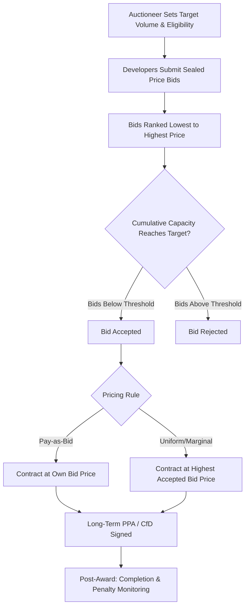

## Auction and Competitive Bidding Mechanisms for Renewables

### Definition and Core Concept

A renewable energy auction is a procurement mechanism in which a regulator, government agency, or utility solicits competitive price (and sometimes non-price) bids from renewable energy developers for the right to sell electricity or capacity under a long-term contract, with winning bids selected according to a predefined ranking rule — typically lowest offered price first — up to a target capacity or quantity. Auctions represent a hybrid position in the taxonomy of renewable support instruments: like feed-in tariffs and premiums, they typically result in a fixed, long-term contracted price for the winning generator; but like renewable portfolio standards, the *quantity* to be procured is fixed in advance by the auctioneer, with price discovered through competitive bidding rather than set administratively.

The central economic rationale for auctions is **price discovery under asymmetric information**: regulators generally lack precise knowledge of developers' true underlying costs (capital cost, resource quality, financing terms), while developers possess this information privately. A well-designed competitive auction induces bidders to reveal their true minimum acceptable price through the competitive process itself, addressing the core weakness of administratively set FITs — the risk of significant over- or under-pricing due to the regulator's information disadvantage.

### Basic Auction Mechanics

**Key Points**

- The auctioneer specifies a target procurement volume (MW of capacity or MWh of expected annual output), eligible technologies, and eligibility/prequalification criteria (technical, financial, siting).
- Developers submit sealed or open bids specifying the price at which they are willing to supply electricity, typically structured as a fixed price per MWh under a long-term power purchase agreement (PPA) or Contract for Difference (CfD).
- Bids are ranked from lowest to highest price and accepted in that order until the target volume is met (a "merit-order" clearing process), though some designs incorporate additional weighting for non-price criteria.
- Winning developers sign long-term contracts (commonly 15–25 years) at either their own bid price (**pay-as-bid**) or a single uniform clearing price equal to the highest accepted bid (**uniform/marginal pricing**), a distinction with significant strategic bidding implications discussed below.

### Pricing Rules: Pay-as-Bid vs. Uniform Price

Under **pay-as-bid**, each winning developer receives exactly the price it bid, creating price differentiation across winners according to their individual cost structures. Under **uniform (marginal) pricing**, all winning developers receive the same price — equal to the highest accepted (marginal) bid — regardless of their individual bid level.

The theoretical prediction from auction theory is that these two rules induce different bidding behavior:

$$\text{Pay-as-bid: } P_{bid,i} = C_i + \text{markup}_i(\text{expected competition})$$

$$\text{Uniform price: } P_{bid,i} \to C_i \text{ (approaches true marginal cost under standard assumptions)}$$

Under pay-as-bid, rational bidders shade their bids above true cost $C_i$ to capture margin, with the degree of shading depending on beliefs about competitors' costs and the number of bidders — introducing a strategic bidding cost that can, in thin or predictable markets, result in higher realized clearing prices than uniform pricing would produce. Under uniform pricing, standard auction theory (drawing on second-price/Vickrey-auction logic) predicts bidders have a dominant strategy incentive to bid closer to their true marginal cost, since their own bid does not directly determine their own payment once accepted — though in practice, real-world renewable auctions depart from these idealized assumptions due to repeated interaction, information leakage across auction rounds, and the divisibility/multi-unit nature of most renewable auctions (unlike a simple single-unit Vickrey auction). [Inference] Empirical evidence on which pricing rule actually delivers lower realized system cost in renewable auctions specifically is mixed and context-dependent, and theoretical predictions from simplified auction models do not always hold precisely once the complexities of multi-unit, repeated, sequential real-world auction design are introduced.

### Key Design Parameters

| Design Parameter | Description | Economic Trade-off |
| --- | --- | --- |
| **Volume/target setting** | Quantity to be procured per auction round | Setting volume too low relative to available low-cost supply raises clearing price unnecessarily (insufficient competition below the marginal accepted bid); too high relative to feasible supply raises risk of under-subscription |
| **Technology-neutral vs. technology-specific auctions** | Whether solar, wind, and other technologies compete in a single auction or separate auctions | Technology-neutral auctions maximize static cost-efficiency (lowest-cost technology wins) but can crowd out higher-cost, potentially strategically valuable technologies (e.g., dispatchable renewables, technology diversification, grid-balancing value); technology-specific auctions preserve diversification at higher average cost |
| **Prequalification requirements** | Financial guarantees (bid bonds), site control evidence, permitting status required to bid | Stricter prequalification reduces non-completion risk but raises barriers to entry, potentially reducing competitive intensity and bidder pool size |
| **Penalties for non-delivery** | Financial penalties (forfeiture of bid bonds) for winning bidders who fail to reach commercial operation | Deters speculative/non-serious bidding ("low-balling" to win without genuine intent or capability to build) but excessively harsh penalties can deter legitimate bidders facing genuine project risk, narrowing the bidder pool |
| **Price ceilings (reserve/ceiling prices)** | Maximum acceptable bid price, often confidential, above which bids are rejected even if volume target is unmet | Protects against excessive prices in low-competition auctions but risks under-subscription (target volume not met) if set too aggressively low relative to actual market costs |
| **Multi-criteria (non-price) scoring** | Weighting of factors beyond price — local content requirements, grid connection readiness, environmental/social criteria — in bid ranking | Can advance secondary policy objectives (domestic industry development, grid integration) but reduces pure cost-minimization efficiency and adds design/administrative complexity |
| **Sequencing and frequency** | Single large auction vs. multiple smaller, regularly scheduled auction rounds | Regular smaller auctions provide market signal continuity and allow bidders to adjust strategy over time based on observed clearing prices, supporting steadier industry development, at some cost to per-round competitive intensity relative to a single large-volume auction |

### Auction Outcome as Contract Structure

The contract awarded through the auction is typically structured as either a fixed-price PPA (functionally similar to a feed-in tariff for the winning generator) or a Contract for Difference, under which the generator sells into the wholesale market and receives (or pays back) the difference between the wholesale price and the auction-cleared strike price:

$$\text{CfD Settlement} = (P_{strike} - P_{wholesale}(t)) \times Q(t)$$

If $P_{wholesale}(t) < P_{strike}$, the generator receives a top-up payment; if $P_{wholesale}(t) > P_{strike}$, the generator pays back the difference to the counterparty (typically a government-backed settlement body), giving this structure two-sided risk allocation distinct from a one-sided FIT or feed-in premium — the generator is protected against low prices but does not retain upside from high prices, a design intended to control the fiscal cost exposure of the support scheme even during periods of elevated wholesale prices.

### Comparative Positioning Among Renewable Support Instruments

| Dimension | Auctions (PPA/CfD-based) | Administratively Set FIT | RPS + Tradable Certificates |
| --- | --- | --- | --- |
| Price discovery mechanism | Competitive bidding | Regulatory estimation | Certificate market clearing |
| Quantity certainty | High (target volume directly procured) | Low (responds endogenously to tariff level) | Moderate (obligated parties can pay penalty instead of procuring) |
| Risk of regulatory mispricing | Low — market reveals price | High — regulator lacks perfect cost information | Moderate — REC price volatility reflects market-based discovery, but overall system cost still depends on target-setting accuracy |
| Investor revenue certainty (post-award) | High — long-term fixed-price contract | High | Low — spot REC market exposure unless long-term contracting mandated |
| Barriers to entry / administrative burden for bidders | Can be significant (prequalification, bid bonds, legal/advisory costs) | Low (often simple application-based interconnection) | Low to moderate |
| Risk of non-completion (winning bids that don't get built) | Documented concern in several auction programs, addressed via completion penalties | Lower — no competitive incentive to lowball costs | Not directly applicable in the same way |

### Documented Design Failures and Corrective Responses

- **Aggressive/unrealistic bidding and non-completion**: In several documented international auction programs, developers have submitted bids at prices later found to be commercially unviable (sometimes attributed to overly optimistic cost assumptions, strategic option-value bidding, or in some cases speculative behavior), resulting in a meaningful share of awarded capacity failing to reach commercial operation or requiring subsequent renegotiation — a risk that has driven wider adoption of financial completion guarantees (bid bonds) and stricter prequalification in later program iterations. [Inference] The prevalence and causes of non-completion vary substantially by country program and time period and are actively studied in the auction design literature rather than settled with a single universal explanation.
- **Insufficient competition in thin markets**: Auctions require a sufficiently large and diverse pool of credible bidders to function as effective price discovery mechanisms; in markets with limited developer capacity, land/siting constraints, or grid connection bottlenecks, low bidder participation can result in clearing prices well above competitive levels, or under-subscription relative to the target volume, undermining the core efficiency rationale for using an auction over administrative pricing.
- **Boom-bust deployment cycles from infrequent or poorly sequenced auctions**: Irregular auction scheduling, or large gaps between rounds, can create feast-or-famine dynamics in the domestic supply chain and developer pipeline, motivating a shift in many mature auction programs toward predictable, regularly scheduled, smaller-volume rounds rather than infrequent large tenders.
- **Local content requirement trade-offs**: Auctions incorporating domestic industry development criteria (local content requirements, minimum domestic manufacturing shares) have in some documented cases raised realized clearing prices relative to technology-neutral, criteria-free auctions, reflecting the standard economic trade-off between industrial policy objectives and static cost-minimization — this trade-off is a matter of policy preference regarding which objective to prioritize rather than a straightforward efficiency failure. [Inference] The magnitude of the price premium attributable specifically to local content requirements is program-specific and not well summarized by a single universal figure.

### Interaction with Financing and Bankability

Because auction-awarded contracts typically provide long-term, fixed (or CfD-smoothed) revenue streams comparable in certainty to feed-in tariffs, well-designed auction programs can achieve financing costs (WACC) similar to FIT-supported projects — provided the contract counterparty is creditworthy (often government-backed) and contract terms are perceived as durable and not subject to retroactive renegotiation risk. This "bankability" consideration is a key reason many jurisdictions transitioning away from administratively set FITs toward auctions have retained a PPA- or CfD-style long-term contract as the auction's underlying instrument, rather than adopting a purely short-term or spot-market-based procurement structure — preserving the financing-cost benefits associated with revenue certainty while gaining the price-discovery benefits of competitive bidding.

### Related Topics

- **Feed-in tariffs and feed-in premium design** (auctions as a price-discovery alternative to administrative tariff-setting)
- **Renewable portfolio standards and tradable certificates** (quantity-based instrument comparison)
- **Contracts for Difference (CfD)**: settlement mechanics and two-sided risk allocation
- **Auction theory fundamentals**: first-price, second-price/Vickrey, and multi-unit auction formats
- **Project finance and bankability criteria for renewable energy assets**
- **Local content requirements and industrial policy trade-offs in energy procurement**
- **Grid connection queue management and its interaction with auction timing/sequencing**
- **Levelized cost of electricity (LCOE) as a benchmark for evaluating auction clearing prices**