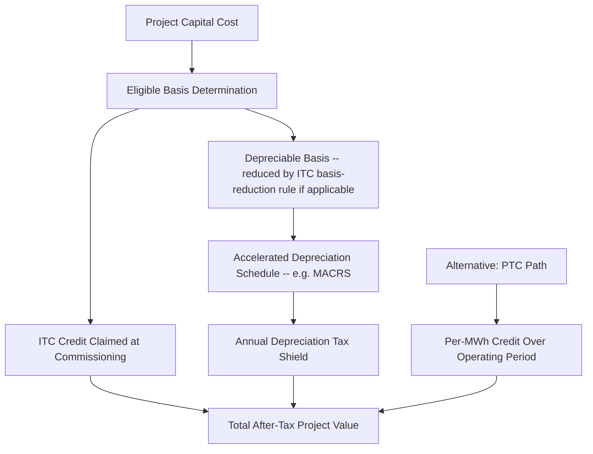

## Tax Credits and Accelerated Depreciation Incentives

### Definition and Core Concept

Tax-based incentives are a class of renewable energy support mechanisms that operate through the tax code rather than through direct payments, price guarantees, or quantity mandates. Instead of a utility or grid operator paying a generator a fixed price per unit of output, the government reduces the generator's (or its investors') tax liability, either through a **tax credit** (a direct, dollar-for-dollar reduction in taxes owed) or through **accelerated depreciation** (a timing benefit that front-loads the tax deductibility of capital costs, reducing the present value of the project's tax burden without changing its total nominal amount).

These mechanisms are economically distinct from the price- and quantity-based instruments discussed elsewhere in this chapter (FITs, FIPs, RPS/RECs, auctions) in that their value is realized through the tax system and is therefore contingent on the recipient having sufficient tax liability (or access to structures that monetize the benefit despite insufficient liability) — a structural feature that has significant implications for financing structure, market accessibility, and the emergence of specialized intermediary industries (tax equity markets) discussed below.

### Investment Tax Credit (ITC)

**Key Points**

- The ITC provides a credit equal to a specified percentage of eligible capital expenditure (basis) in a qualifying renewable energy project, claimed in the year the project is placed in service.
- The credit directly reduces the investor's tax liability dollar-for-dollar, up to the calculated credit amount, distinguishing it from a tax *deduction* (which only reduces taxable income, providing a smaller after-tax benefit equal to the deduction times the marginal tax rate).

$$\text{ITC Value} = \tau_{ITC} \times \text{Eligible Basis}$$

where $\tau_{ITC}$ is the statutory credit rate (historically commonly around 30% in several well-known national programs, though rates vary by jurisdiction, technology, vintage, and eligibility conditions such as domestic content or labor standards in some designs) and Eligible Basis is the qualifying capitalized cost of the project.

- ITC-type structures are particularly well-suited to technologies with high upfront capital cost and relatively low ongoing operating cost (a cost structure characteristic of solar PV in particular), since the incentive value is realized immediately at commissioning rather than accruing gradually with output over the project's operating life.

### Production Tax Credit (PTC)

**Key Points**

- The PTC provides a credit calculated per unit of energy actually generated and sold, over a specified initial period of a project's operating life (commonly the first 10 years of operation in well-known national program designs), rather than a one-time credit tied to capital cost.

$$\text{PTC Value in Year } t = \tau_{PTC} \times Q_t \quad \text{for } t = 1, \ldots, T_{PTC}$$

where $\tau_{PTC}$ is the credit rate per unit of output (e.g., $/MWh) and $Q_t$ is metered generation in year $t$, up to the credit's eligibility window $T_{PTC}$.

- Because the PTC is contingent on actual output, it preserves a stronger ongoing incentive for operational performance (maximizing actual generation) relative to the ITC, which is realized regardless of subsequent operating performance once the project is placed in service — a distinction with direct implications for asset management incentives over the project's early operating life.
- PTC-type structures have historically been closely associated with wind energy in particular, reflecting wind's cost structure (comparatively higher share of costs tied to ongoing performance-sensitive value relative to solar) and historical policy design choices in major national programs.

### ITC vs. PTC: Structural Comparison

| Dimension | Investment Tax Credit (ITC) | Production Tax Credit (PTC) |
| --- | --- | --- |
| Basis of calculation | Capital expenditure (basis) | Actual metered output |
| Timing of benefit realization | Front-loaded (claimed at/near commissioning) | Spread over operating period (e.g., first 10 years) |
| Incentive alignment | Weaker link to post-commissioning operational performance | Stronger link — credit value scales directly with actual generation |
| Revenue risk exposure for investor | Lower — credit value fixed at commissioning regardless of subsequent output | Higher — credit value fluctuates with actual output (resource variability, curtailment, downtime all reduce credit realized) |
| Historical technology association | Solar PV, storage (in many program designs) | Wind (in many program designs); technology-neutral variants have also emerged in some jurisdictions |
| Interaction with low-output or underperforming projects | Credit unaffected by underperformance post-commissioning | Credit value directly reduced by any output shortfall, compounding financial impact of operational underperformance |

### Accelerated Depreciation

Accelerated depreciation allows a project owner to deduct the capital cost of qualifying assets from taxable income faster than the asset's actual useful economic life would suggest under standard straight-line depreciation, which increases the present value of the depreciation tax shield even though total lifetime deductions are ultimately similar (depreciation is fundamentally a timing mechanism, not a permanent reduction in total taxable income, in contrast to a tax credit which is a permanent, non-reversing benefit).

The value of accelerated depreciation to an investor derives from the time value of money: receiving a given tax deduction sooner is worth more in present-value terms than receiving the same nominal deduction later.

$$PV(\text{Depreciation Tax Shield}) = \sum_{t=1}^{n} \frac{D_t \times \tau_{corp}}{(1+r)^t}$$

where $D_t$ is the depreciation deduction claimed in year $t$, $\tau_{corp}$ is the investor's marginal corporate tax rate, and $r$ is the discount rate. Front-loading $D_t$ (higher deductions in early years, as under accelerated schedules such as the Modified Accelerated Cost Recovery System, MACRS, used in some national tax codes for qualifying renewable assets) increases this present value relative to a straight-line schedule with the same total nominal deductions, because early-year deductions are discounted less heavily.

**Example**

Consider a $10 million solar project with a 30% corporate tax rate and a 7% discount rate. Under straight-line depreciation over 20 years, the annual deduction is $500,000, generating an annual tax shield of $150,000. Under an accelerated schedule that front-loads roughly half the depreciable basis into the first 5 years, the tax shield in those early years is proportionally larger, and because those larger early deductions are discounted less (being received sooner), the total present value of the tax shield across the depreciation schedule exceeds that of the straight-line alternative, even though both schedules sum to the same $10 million in total nominal deductions over the asset's life.

### Combined ITC/PTC and Depreciation Stacking

In many national program designs, ITC or PTC benefits and accelerated depreciation are available simultaneously on the same project (subject to basis-reduction rules in some jurisdictions, where claiming an ITC reduces the depreciable basis eligible for subsequent depreciation deductions, to prevent double-counting the same capital cost as both a credit and a full depreciation deduction). The combined effect of stacking these incentives can substantially reduce a project's effective after-tax cost of capital relative to an unsubsidized project, which is a central mechanism by which tax-based incentive regimes influence renewable deployment economics — operating on the cost-of-capital and total-project-cost side of the investment decision, in contrast to price-based mechanisms (FIT/FIP) which operate primarily on the revenue side.

### The Tax Equity Market: Monetization of Credits by Non-Taxpaying Developers

**Key Points**

- A structural challenge with tax credit mechanisms is that many renewable project developers — particularly smaller or younger companies — do not generate sufficient taxable income to fully utilize the credits and depreciation deductions a project generates, since these benefits can only offset actual tax liability (subject to any carryforward/carryback provisions allowed under the relevant tax code).
- This has given rise to specialized **tax equity** financing structures, in which large taxpaying institutions (historically often banks, insurers, and other financial institutions with substantial tax liability) invest capital into a project specifically to receive an allocated share of the tax benefits (credits and depreciation) in exchange for providing project financing, typically alongside a modest allocation of cash distributions.
- Common tax equity structures include the **partnership flip** (in which the tax equity investor receives a disproportionately large share of tax benefits and cash flow in early years, with allocations "flipping" to favor the developer/sponsor after the tax investor achieves a target return) and **sale-leaseback** arrangements (in which the developer sells the project to a tax equity investor and leases it back, with the investor claiming the tax benefits as owner).
- Tax equity markets have historically been characterized by high transaction costs, complexity, and a relatively concentrated pool of investors (reflecting the specialized underwriting expertise and large tax liability required to participate), which has been documented as a friction limiting the number of institutions able to efficiently monetize renewable tax credits and, by extension, a factor increasing the effective cost of capital for tax-credit-dependent projects relative to a hypothetical direct-payment equivalent of the same nominal subsidy value. [Inference] The precise magnitude of this "tax equity discount" (the efficiency loss from routing subsidy value through a specialized, concentrated financing market rather than direct payment) is estimated variously across studies and is sensitive to prevailing tax equity market conditions, which have themselves fluctuated over time with changes in the pool of active tax equity investors.
- Some jurisdictions have introduced **direct pay** or **transferability** provisions allowing certain entities (particularly tax-exempt entities such as municipalities, cooperatives, and nonprofits that have no tax liability to offset) to receive the cash-equivalent value of a credit directly from the tax authority, or allowing credits to be sold/transferred more simply to third-party taxpayers without the full complexity of a traditional tax equity partnership structure — reforms explicitly designed to address the tax equity market's access and efficiency limitations.

### Comparative Positioning Among Renewable Support Instruments

| Dimension | Tax Credits (ITC/PTC) + Accelerated Depreciation | Feed-in Tariff/Premium | RPS + Tradable Certificates | Auctions |
| --- | --- | --- | --- | --- |
| Point of intervention in project economics | Cost/financing side (reduces effective capital cost or provides output-linked tax offset) | Revenue side (guarantees output price) | Revenue side (certificate price supplements market price) | Revenue side (competitively determined contract price) |
| Value contingent on recipient's tax position | Yes — a defining structural feature | No | No | No |
| Administrative locus | Tax authority / tax code | Utility/grid operator, energy regulator | Energy regulator, certificate registry | Energy regulator/auctioneer |
| Market accessibility friction | Tax equity market complexity for entities with insufficient tax liability (mitigated in some jurisdictions by direct pay/transferability reforms) | Generally low — most designs pay generators directly regardless of tax position | Generally low | Generally low, though prequalification/bid bond requirements can be a barrier |
| Typical technology/project-type fit | Broadly applicable, with ITC/PTC choice often technology- and cost-structure-dependent | Broadly applicable | Broadly applicable | Broadly applicable |

### Interaction with Other Policy Instruments

Tax credits are frequently used in combination with, rather than as a strict alternative to, other renewable support mechanisms discussed in this chapter. For example, a project may simultaneously benefit from an ITC or PTC (reducing effective capital cost or providing output-linked tax offset) while also selling its output under a long-term PPA secured through a competitive auction, or while generating and selling RECs under an RPS obligation in jurisdictions where the two mechanisms are not mutually exclusive. This stacking is a standard feature of renewable project finance in jurisdictions offering multiple concurrent incentive layers, and financial modeling for such projects typically must integrate the tax benefit value stream alongside contracted or market electricity/certificate revenue to arrive at a project's full expected after-tax return. [Inference] The specific combinability rules (whether a given jurisdiction permits stacking a tax credit with, say, RPS/REC revenue on the same project) are program- and jurisdiction-specific and should be verified against the applicable current tax code and program rules rather than assumed.

### Policy Design Considerations and Criticisms

- **Cyclicality and expiration risk**: In jurisdictions where tax credits are subject to periodic legislative renewal (rather than being established on a long, predictable statutory schedule), uncertainty around expiration and renewal timing has historically been documented as a driver of boom-bust investment cycles, as developers accelerate project completion ahead of anticipated credit expiration and pause activity during periods of renewal uncertainty. Longer, more predictable statutory phase-down schedules (rather than cliff-edge expirations) are a commonly cited design improvement intended to smooth this cyclicality.
- **Regressivity and fiscal cost transparency**: Because tax credits reduce government tax revenue rather than appearing as an explicit on-bill or budget line-item expenditure, their fiscal cost can be less transparent to the public than an equivalent ratepayer surcharge under a FIT/FIP scheme, a distinction sometimes raised in comparative policy discussions of instrument transparency, though [Speculation] views on the practical significance of this transparency difference for policy accountability outcomes vary among analysts and are not resolved by economic analysis alone.
- **Value capture efficiency**: As noted above, the tax equity market friction means that a portion of the nominal subsidy value embedded in a tax credit may be captured by tax equity intermediaries (compensation for structuring, underwriting, and providing scarce tax capacity) rather than flowing entirely through to project economics, a structural efficiency consideration distinguishing tax-based instruments from direct-payment mechanisms of equivalent nominal value.

### Related Topics

- **Tax equity partnership structures**: partnership flip and sale-leaseback mechanics in project finance
- **Direct pay and tax credit transferability reforms for tax-exempt and low-tax-liability entities**
- **Feed-in tariffs and feed-in premium design** (revenue-side vs. cost-side instrument comparison)
- **Renewable portfolio standards and tradable certificates**
- **Auction and competitive bidding mechanisms for renewables**
- **Weighted average cost of capital (WACC) determinants in renewable project finance**
- **MACRS and accelerated depreciation schedules in capital budgeting**
- **Project finance structuring for capital-intensive, low-marginal-cost energy assets**