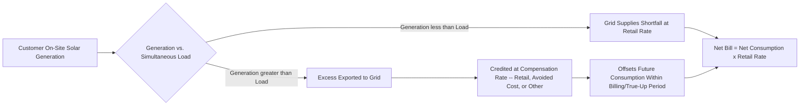

## Net Metering and Distributed Generation Compensation

### Definition and Core Concept

Net metering is a billing and compensation mechanism for distributed energy resources (DERs) — most commonly rooftop or small-scale on-site solar PV — under which a customer's electricity meter tracks the *net* difference between electricity consumed from the grid and electricity exported to the grid over a billing period, with the customer billed (or credited) only for that net quantity. When on-site generation exceeds simultaneous consumption, excess electricity flows onto the grid and offsets consumption at other times within the billing/settlement period, effectively allowing the customer to "bank" self-generated electricity against future grid draws.

Net metering is one specific point on a broader spectrum of distributed generation (DG) compensation designs, ranging from full retail-rate netting (the traditional net metering model) through various intermediate structures to pure wholesale/avoided-cost compensation for exported energy. The choice of compensation design has first-order implications for DG adoption economics, utility cost recovery, and the distribution of costs and benefits among participating and non-participating ratepayers — making it one of the most economically and politically contested topics in distributed energy policy.

### Basic Net Metering Mechanics

**Key Points**

- The customer's meter (traditionally a bidirectional meter, though modern smart meters track import and export separately even under a net billing framework) records net energy flow over the billing cycle.
- Under **full retail-rate net metering**, exported electricity is credited at the same $/kWh rate the customer would otherwise pay for consumption, meaning a kWh exported to the grid at 2pm offsets a kWh consumed from the grid at 8pm at an identical rate, with no distinction for the time or locational value of either.

$$\text{Net Bill} = P_{retail} \times \max(0, Q_{consumed} - Q_{exported}) - \text{Credit}(Q_{exported} > Q_{consumed})$$

- If exports exceed consumption within a billing period, the surplus is typically carried forward as a credit to future bills (kWh-denominated or dollar-denominated, depending on program design), with rules varying on whether unused annual credits are compensated at a lower rate, forfeited, or paid out in cash at year-end ("true-up").

### The Economic Critique of Retail-Rate Net Metering: Cost-Shifting

The central economic controversy surrounding full retail-rate net metering concerns the composition of the retail electricity rate itself. Retail rates in most jurisdictions bundle together several distinct cost components:

$$P_{retail} = C_{energy} + C_{capacity} + C_{T\&D} + C_{other,fixed}$$

where $C_{energy}$ reflects the variable cost of generating or procuring the energy itself, $C_{capacity}$ reflects generation capacity adequacy costs, $C_{T\&D}$ reflects transmission and distribution infrastructure costs (largely fixed, sunk, and only weakly related to any individual customer's net energy consumption), and $C_{other,fixed}$ captures other fixed system costs (customer service, low-income assistance programs, public purpose programs) often recovered volumetrically through the per-kWh rate for administrative simplicity even though the underlying costs do not vary with usage.

Under full retail-rate net metering, a net-metered customer avoids paying *all* of these bundled cost components on every exported kWh, even though the exported kWh's actual avoided cost to the utility system — from the utility's perspective — typically reflects only the wholesale energy value (and, at certain times/locations, some capacity or distribution deferral value), not the full bundled retail rate including fixed infrastructure costs.

**Key Points**

- If a net-metered customer avoids paying the fixed T&D and other fixed-cost components on their net-zero (or near-zero) net consumption, but the utility's actual fixed costs of maintaining grid infrastructure serving that customer do not correspondingly fall, those fixed costs do not disappear — they are typically reallocated across the remaining, non-net-metered customer base through subsequent rate cases.
- This dynamic is commonly termed the **"cost-shift" critique** of retail-rate net metering: non-participating customers (who, on average and in aggregate across many studies, have been documented to skew toward lower-income households relative to net-metering adopters, who tend to be homeowners with sufficient capital or financing access to install rooftop solar) bear a disproportionate share of fixed grid costs, raising a documented equity and cross-subsidization concern in the regulatory economics literature.
- [Inference] The *magnitude* of the cost shift is one of the most contested empirical questions in distributed energy policy, with utility-commissioned studies and solar-industry-commissioned studies frequently reaching substantially different conclusions depending on methodology (particularly regarding how avoided distribution costs, avoided capacity costs, and non-energy societal benefits such as emissions reductions are valued and included or excluded). This is a genuinely disputed empirical question in the literature rather than one with an established consensus figure, and any specific quantitative cost-shift estimate should be treated as methodology-dependent rather than a settled fact.

### Value-of-Solar and Alternative Compensation Structures

In response to the cost-shift critique, numerous jurisdictions have developed, or transitioned toward, alternative DG compensation frameworks intended to more precisely align compensation with the actual, time- and location-differentiated value that exported distributed generation provides to the grid system.

| Compensation Model | Mechanism | Key Distinction from Full Retail Net Metering |
| --- | --- | --- |
| **Net metering 2.0 / modified net metering** | Retains net-metering structure but adds fixed monthly charges, minimum bills, or reduced (non-1:1) export credit rates for net-metered customers | Preserves simplicity of netting but partially addresses fixed-cost recovery and cost-shift concerns |
| **Net billing** | Consumption and export are metered and valued *separately* rather than netted; exports are compensated at a rate distinct from (typically lower than) the retail consumption rate | Directly severs the link between export compensation and retail rate, allowing export value to be set closer to avoided cost |
| **Value-of-solar tariff (VOST)** | Compensation for exported energy calculated from an explicit avoided-cost stack: avoided energy cost, avoided generation capacity cost, avoided T&D capacity cost (where deferral value exists), avoided environmental compliance cost, and sometimes additional societal benefit adjustments | Most granular, cost-causation-based approach; requires detailed utility-specific avoided-cost studies to calculate, raising administrative complexity |
| **Buy-all/sell-all** | All on-site generation is sold to the utility at a specified rate (often similar to a PPA or feed-in-tariff-style price), while all consumption is separately purchased from the utility at the standard retail rate; no netting occurs | Fully separates the two transactions; commonly used for larger DG installations rather than typical residential rooftop solar |
| **Time-varying / locational export rates** | Export compensation rate varies by time of day (reflecting time-differentiated wholesale/avoided-cost value) and, in more advanced designs, by grid location (reflecting locational hosting capacity and distribution deferral value) | Most economically precise design in principle, since solar export value genuinely varies substantially by time (peak solar generation often does not coincide with peak system demand in some circumstances) and by location (grid capacity constraints vary by feeder); highest metering, billing system, and administrative complexity |

### Formal Value-of-Solar Calculation Structure

A representative value-of-solar avoided-cost stack can be expressed as:

$$VOS = V_{energy} + V_{gen.capacity} + V_{T\&D.capacity} + V_{losses} + V_{environmental} + V_{other} - C_{integration}$$

where each $V$ term represents an avoided cost component the utility system genuinely avoids as a result of the exported distributed generation, and $C_{integration}$ represents any incremental integration costs (e.g., voltage management, additional grid infrastructure needed to accommodate two-way power flow) attributable to the DG resource. [Inference] The relative magnitude of each component is highly system- and time-specific — for example, avoided distribution capacity value depends heavily on whether the specific circuit/feeder in question is capacity-constrained, and avoided generation capacity value depends on whether solar output coincides with the utility's system peak — so generic numerical benchmarks for this decomposition should not be applied across different utility systems without system-specific study.

### Duck Curve Dynamics and Time-Value Considerations

**Key Points**

- High penetration of behind-the-meter solar generation, combined with typical residential and commercial demand patterns, has been widely documented to produce a net-load profile (total system demand minus DG output) exhibiting a pronounced midday trough followed by a steep evening ramp as solar output declines while demand remains elevated or rises — commonly termed the "duck curve" in utility system planning discussions, first popularized in analysis of California's net-load profile.
- This dynamic has direct relevance to DG compensation design: under flat, non-time-varying retail-rate net metering, solar exports during the midday trough (when system-wide value of additional generation is often lowest, and in some systems even negative during periods of oversupply/curtailment risk) are compensated identically to exports or offset consumption during evening peak hours (when system value is typically highest) — a mismatch that time-varying export compensation designs are specifically intended to correct.
- This has motivated growing interest in pairing DG compensation reform with behind-the-meter storage incentives, since storage allows a DG owner to shift self-generated (or exported/re-imported) energy from low-value midday hours to high-value evening hours, potentially preserving strong project economics under time-varying compensation designs that would otherwise reduce the value of unshifted midday solar export.

### Interconnection and Technical/Administrative Considerations

Beyond the compensation rate itself, DG economics are also shaped by:

- **Interconnection standards and study requirements**: Technical review processes (screening studies, impact studies) required before a DG system can connect to the grid, with cost and timeline implications that scale with system size and local grid hosting capacity constraints.
- **System size caps and aggregate program caps**: Many net metering programs impose caps on individual system size (often calibrated to expected on-site load) and/or aggregate caps on total net-metered capacity within a utility's service territory, with policy debates frequently arising once aggregate caps approach their limits, triggering compensation structure transitions (e.g., moving new enrollees from legacy full retail net metering to a successor tariff).
- **Grandfathering provisions**: As with feed-in tariff reforms, most jurisdictions transitioning from one DG compensation structure to another grandfather existing net-metered customers under their original compensation terms for a specified period (or the life of their system), to preserve the financial assumptions underlying their original investment decision, while applying revised terms only to new enrollees going forward.

### Comparative Positioning Relative to Other Renewable Support Instruments

| Dimension | Net Metering / DG Compensation | Feed-in Tariff | RPS + Tradable Certificates | Utility-Scale Auctions |
| --- | --- | --- | --- | --- |
| Typical project scale | Small, behind-the-meter (residential, small commercial) | Historically used across scales, though DG/rooftop was a common early application | Utility-scale, though some jurisdictions include DG-eligible carve-outs | Utility-scale |
| Customer relationship to utility | Retail customer with self-generation, not a standalone independent power producer | Independent generator selling output under contract | Independent generator or obligated retail supplier | Independent generator selling under competitively awarded contract |
| Primary economic controversy | Cost-shift/cross-subsidization between participating and non-participating customers | Risk of administrative mispricing (over/under-compensation) | REC price volatility and target-setting risk | Non-completion risk, competitive intensity in thin markets |
| Compensation basis | Historically retail rate; increasingly avoided-cost/value-of-solar based | Administratively set price | Market-determined certificate price plus wholesale energy price | Competitively bid price |

### Related Topics

- **Feed-in tariffs and feed-in premium design** (structural comparison to DG compensation mechanisms)
- **Time-of-use and dynamic electricity pricing design**
- **Behind-the-meter energy storage economics and pairing with distributed solar**
- **Duck curve dynamics and net-load system planning implications**
- **Distribution system hosting capacity analysis and locational value of DERs**
- **Utility fixed-cost recovery mechanisms and rate design (demand charges, minimum bills, fixed customer charges)**
- **Distributional/equity analysis of distributed energy policy (participant vs. non-participant cost allocation)**
- **Interconnection standards and technical screening processes for distributed generation**