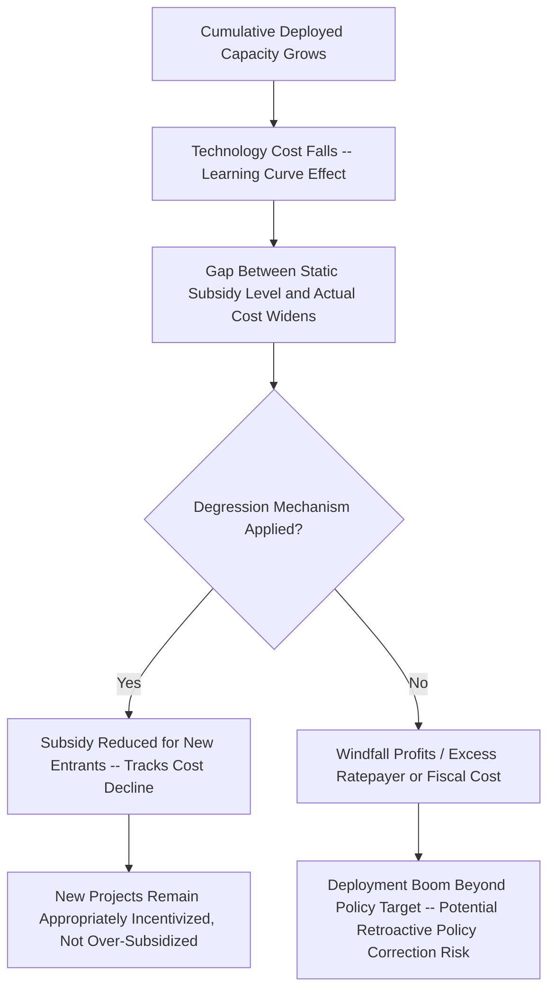

## Policy Support Degression and Market Maturation

### Definition and Core Concept

Policy support degression refers to the systematic, typically scheduled reduction of renewable energy subsidy levels over time, designed to track and respond to the declining cost of renewable technologies as they move along their learning curves and achieve greater market maturity. Degression is not a standalone policy instrument but rather a *design feature* applied across multiple support mechanisms discussed elsewhere in this chapter — feed-in tariffs, tax credits, and auction target-setting can all incorporate degression logic — reflecting a shared economic rationale: subsidy levels calibrated to a technology's cost structure at one point in time become excessive, and fiscally and allocatively inefficient, if left static as underlying technology costs fall.

The concept sits at the intersection of learning-curve economics, dynamic policy design, and the broader question of how support mechanisms should be structured to withdraw appropriately as an industry matures, avoiding both premature withdrawal (which risks stalling deployment before a technology reaches self-sustaining competitiveness) and prolonged over-support (which imposes unnecessary fiscal or ratepayer cost and can generate windfall profits for developers).

### The Learning Curve Foundation

**Key Points**

- Degression policy design is grounded empirically in the observed **experience curve** (or "learning curve") relationship, under which the unit cost of a technology falls by a roughly consistent percentage for each doubling of cumulative deployed capacity — a pattern extensively documented for solar PV modules and, to varying degrees, other renewable technologies.

$$C(Q) = C_0 \times \left(\frac{Q}{Q_0}\right)^{-b}$$

where $C(Q)$ is unit cost at cumulative deployment $Q$, $C_0$ is unit cost at reference cumulative deployment $Q_0$, and $b$ is the learning elasticity parameter, commonly re-expressed as a "learning rate" $LR = 1 - 2^{-b}$, representing the percentage cost reduction per doubling of cumulative capacity.

- [Inference] Empirically estimated learning rates vary considerably by technology, time period, and study methodology (a widely cited range for solar PV modules specifically has historically been in the broad vicinity of 20%, though estimates differ across studies and the applicable rate for balance-of-system and installation costs, as distinct from module costs specifically, has generally been found to be lower and more variable). These figures should be treated as illustrative of the general learning-curve phenomenon rather than precise, universally applicable constants for current policy calibration, since actual observed rates are sensitive to the specific dataset, time window, and cost component analyzed.
- The learning-curve relationship provides the underlying empirical justification for scheduling tariff or credit reductions in line with anticipated cumulative deployment growth, rather than leaving support levels fixed indefinitely at a level calibrated to early-stage, higher-cost technology.

### Degression Mechanism Design Types

| Degression Type | Mechanism | Trade-offs |
| --- | --- | --- |
| **Fixed calendar (scheduled) degression** | Subsidy level automatically reduces by a predetermined percentage at fixed intervals (e.g., quarterly or annually), regardless of actual deployment volume observed | Simple, highly predictable for investors and administrators; risk of poor calibration if actual cost decline diverges from the assumed schedule (either falling faster, leaving support excessive, or falling slower, under-supporting new entrants) |
| **Responsive (deployment-linked) degression** | Degression rate adjusts dynamically based on observed deployment volume relative to a target corridor — faster-than-target deployment triggers steeper degression for subsequent cohorts; slower-than-target deployment triggers smaller or paused degression | More adaptive to actual market conditions and cost trajectories than fixed calendar degression; more complex to administer and can introduce short-term volatility/uncertainty in the exact tariff a near-term project will receive, potentially triggering rushed deployment ahead of anticipated tariff cuts ("rush to install") |
| **Auction-embedded degression** | Rather than administratively scheduled reductions, each successive auction round's competitively discovered clearing price implicitly reflects updated technology costs, with no separate degression schedule needed | Price discovery is market-based rather than administratively estimated, addressing the core calibration risk of scheduled degression directly; requires sufficiently frequent, well-designed auction rounds to track cost declines responsively |
| **Sunset/phase-out provisions** | A defined end date or cumulative-deployment threshold beyond which the support mechanism ceases entirely for new entrants, sometimes with an explicit "glide path" of declining support in the years immediately preceding full phase-out | Provides long-run policy certainty regarding the ultimate withdrawal of support; risk of cliff-edge deployment disruption if phase-out is not preceded by a sufficiently gradual glide path, and risk that phase-out timing is politically difficult to sustain if industry lobbying resists scheduled withdrawal |

### Formal Representation of a Responsive Degression Rule

A stylized responsive degression rule commonly used in national feed-in tariff programs (notably in the design of Germany's later-generation EEG solar tariff corridor) can be expressed as:

$$\text{Degression}_{t+1} = \begin{cases} \delta_{high} & \text{if } Q_{deployed,t} > Q_{target,t} + \Delta_{upper} \\ \delta_{base} & \text{if } Q_{target,t} - \Delta_{lower} \leq Q_{deployed,t} \leq Q_{target,t} + \Delta_{upper} \\ \delta_{low} \text{ or } 0 & \text{if } Q_{deployed,t} < Q_{target,t} - \Delta_{lower} \end{cases}$$

where $Q_{deployed,t}$ is observed deployment in period $t$, $Q_{target,t}$ is the policy's deployment target/corridor for that period, and $\delta_{high} > \delta_{base} > \delta_{low}$ are progressively steeper or shallower tariff reduction percentages applied to the tariff offered to subsequently interconnecting projects. This structure is explicitly designed as a corrective feedback mechanism: it uses observed deployment as a real-time proxy signal for whether the current tariff level is over- or under-calibrated relative to actual achievable project economics, adjusting the tariff trajectory accordingly without requiring the regulator to directly re-estimate underlying technology costs from scratch at each interval.

### Degression Across Different Support Instrument Types

**Key Points**

- **Under feed-in tariffs**: Degression directly reduces the guaranteed tariff level offered to newly interconnecting projects, while existing contracted generators are typically grandfathered at their original (higher, pre-degression) tariff for the remaining contract term — meaning degression governs the terms offered to the *marginal new entrant*, not a retroactive adjustment to existing project economics (retroactive adjustment being a documented and generally strongly criticized departure from standard practice, associated with the investor-confidence damage discussed in the feed-in tariff topic).
- **Under tax credits**: Degression manifests as a scheduled step-down in the statutory credit percentage or rate over a multi-year legislative phase-down schedule (as opposed to an automatic, deployment-responsive mechanism, since most tax code changes require legislative action rather than administrative rule-adjustment) — a structural difference that has been associated in some documented cases with sharper "cliff-edge" deployment timing effects around scheduled step-down or expiration dates, compared to more continuously adjusting administrative degression mechanisms.
- **Under RPS/REC schemes**: Degression does not apply directly to a fixed subsidy rate (since REC prices are market-determined rather than administratively set), but an analogous dynamic occurs through **target trajectory design** — a well-calibrated RPS target trajectory should, in principle, become progressively less binding (generating a lower incremental REC price signal) as renewable costs fall and a rising baseline share of electricity supply would be renewable even absent the policy, though as noted in the RPS/REC topic, poorly calibrated targets can result in the incentive value collapsing toward zero if targets are set too conservatively relative to underlying cost trends.
- **Under auctions**: Explicit degression scheduling is largely unnecessary in principle, since competitive bidding in each successive round should organically reflect then-current technology costs; however, some auction program designs incorporate declining *ceiling prices* (maximum acceptable bid levels) across successive rounds as a complementary mechanism, reflecting anticipated cost declines and providing a backstop against insufficiently competitive early rounds locking in excessive prices.

### Market Maturation Stages and the Corresponding Support Trajectory

A widely referenced conceptual framework in renewable policy economics characterizes technology and market maturation in stages, each associated with a different appropriate policy support intensity and instrument choice:

1. **Early-stage/pre-commercial**: Technology has high cost, limited deployment track record, and significant technical/market uncertainty; support (where used at all) tends toward research, development, and demonstration (RD&D) funding and/or high per-unit subsidies (high FIT levels, high ITC/PTC rates) justified by the goal of establishing initial deployment, cost data, and supply chain development.
2. **Emerging/rapid-growth stage**: Technology cost is falling but remains above conventional generation cost; this is typically the stage at which degression mechanisms become most economically important, since costs are changing rapidly enough that a static subsidy level risks becoming significantly mis-calibrated within a short period, and deployment volumes are large enough that mis-calibration has material fiscal/ratepayer consequences.
3. **Maturing/cost-competitive stage**: Technology cost approaches or reaches parity with conventional alternatives in at least some market segments or geographies; policy focus often shifts from output-price subsidies toward market-integration-oriented instruments (auctions, feed-in premiums, direct market participation requirements) and eventually toward "grid parity"-oriented deregulation or reliance on general market mechanisms (carbon pricing, wholesale market participation) rather than technology-specific subsidy.
4. **Mature/self-sustaining stage**: Technology and its cost structure are established, without a documented need for dedicated technology-specific price support, though market design considerations specific to variable renewable generation (system integration, capacity adequacy mechanisms, curtailment management) typically remain policy-relevant even after direct price-support subsidies are phased out.

[Inference] The boundaries between these stages are not precisely defined thresholds but rather a heuristic framework used in the policy economics literature to organize thinking about appropriate instrument choice over a technology's deployment lifecycle; real-world technologies do not move through these stages on a single universal timeline, and different renewable technologies (solar PV, onshore wind, offshore wind, and emerging technologies such as green hydrogen or long-duration storage) have been documented to be at markedly different maturation stages simultaneously, requiring differentiated policy treatment rather than a single degression schedule applied uniformly across all renewable technologies.

### Fiscal and System Cost Implications of Degression Design Quality

**Key Points**

- Well-calibrated degression, by keeping subsidy levels closely tracking actual achievable costs, minimizes the "windfall" component of subsidy expenditure — the portion of subsidy payment that exceeds what was actually necessary to induce the marginal investment decision — thereby improving the cost-effectiveness (deployment achieved per unit of fiscal or ratepayer expenditure) of the overall support program.
- Poorly calibrated degression carries risk in both directions: **excessive degression** (reducing support faster than actual cost declines) risks stalling deployment growth or causing investment cliffs as projects become unviable under the reduced tariff; **insufficient degression** (reducing support more slowly than actual cost declines) risks the boom-bust dynamics and excess ratepayer/fiscal cost documented in several historical national FIT program episodes (discussed in the feed-in tariff topic), where technology costs fell faster than anticipated and tariffs were not adjusted with sufficient speed or magnitude.
- This creates a core design tension: **degression predictability** (which supports investor planning and financing certainty) trades off against **degression responsiveness/accuracy** (which requires the mechanism to adjust, sometimes on short notice, in response to observed market conditions) — a tension that has motivated hybrid designs (such as responsive degression with capped maximum adjustment per period, bounding both the predictability loss and the calibration-error risk).

### Interaction with Auction-Based Transition

As discussed in the auction topic, a substantial documented policy trend — particularly across EU member states following state-aid guideline reforms, and in numerous other jurisdictions — has been the transition from administratively degressed feed-in tariffs toward competitive auctions specifically as a response to the calibration difficulty inherent in *any* administrative degression schedule, since auctions replace the regulator's need to estimate and continuously re-estimate the appropriate degression path with a market-based price discovery process that, in principle, self-adjusts to current cost conditions each round without requiring an explicit degression formula at all. This transition can be understood as addressing the degression calibration problem at a structural level, rather than attempting to solve it through progressively more sophisticated administrative degression formulas.

### Related Topics

- **Feed-in tariffs and feed-in premium design** (degression as applied to administratively set tariff levels)
- **Tax credits and accelerated depreciation incentives** (legislative phase-down schedules and cliff-edge expiration effects)
- **Auction and competitive bidding mechanisms for renewables** (market-based price discovery as an alternative to administrative degression)
- **Renewable portfolio standards and tradable certificates** (target trajectory calibration as an analogous dynamic)
- **Experience curves and learning-rate estimation methodology in energy technology economics**
- **Technology readiness levels and the RD&D-to-deployment policy continuum**
- **Grid parity analysis and its role in signaling appropriate subsidy phase-out timing**
- **Comparative international case studies of degression design (Germany's EEG corridor mechanism, and others)**