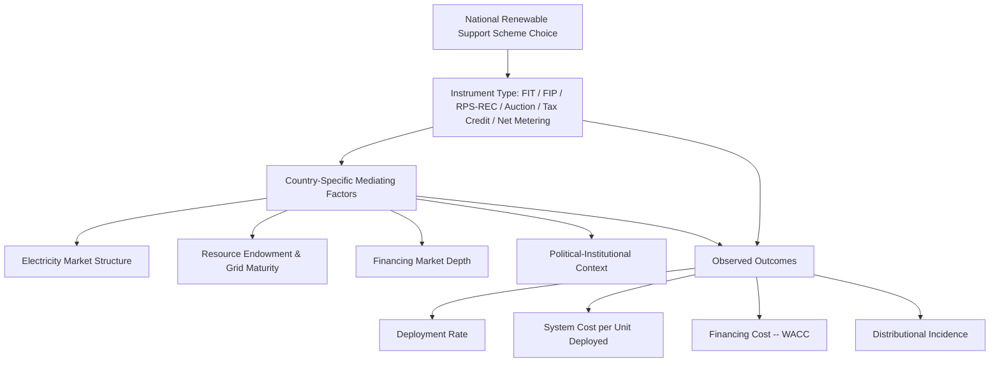

## Cross-Country Comparison of Renewable Support Schemes

### Definition and Core Concept

Cross-country comparison of renewable support schemes is the comparative economic analysis of how different national and sub-national jurisdictions have designed, implemented, and evolved their renewable energy policy instruments — synthesizing the individual mechanisms covered elsewhere in this chapter (feed-in tariffs, feed-in premiums, renewable portfolio standards, auctions, tax credits, net metering) into a comparative framework for evaluating relative deployment effectiveness, cost-efficiency, and design lessons transferable across jurisdictions. This comparative lens is analytically distinct from studying any single instrument in isolation, because real-world outcomes depend not only on the nominal instrument chosen but on jurisdiction-specific factors — electricity market structure, resource endowment, grid infrastructure maturity, financing market depth, and political-institutional context — that mediate how a given instrument performs in practice.

### Analytical Framework for Cross-Country Comparison

**Key Points**

- **Deployment effectiveness**: The rate and magnitude of renewable capacity/generation growth achieved under a given policy regime, typically normalized by market size (e.g., installed capacity per capita or per unit of GDP) to enable meaningful comparison across differently sized economies.
- **Cost-effectiveness (system cost per unit deployed)**: The total support expenditure (ratepayer surcharge, fiscal cost, or implicit cost embedded in contracted prices) divided by the quantity of renewable capacity or generation induced, often the primary metric of interest in comparative policy evaluation since it isolates whether a given deployment outcome was achieved efficiently.
- **Dynamic efficiency**: Whether the support scheme appropriately adapts over time to falling technology costs (linking directly to the degression concept discussed separately in this chapter) rather than either over- or under-supporting mature technology.
- **Investment/financing cost impact**: The degree to which the support mechanism's revenue-certainty profile reduces the cost of capital (WACC) available to developers, a channel repeatedly identified in the comparative literature as economically significant given the capital-intensive, low-operating-cost structure of most renewable generation technologies.
- **Distributional/equity outcomes**: How the costs of the support scheme (ratepayer surcharges, general taxation, or fiscal opportunity cost) are distributed across different income groups and participant/non-participant populations.

### Germany: Feed-in Tariff Pioneer and Reform Trajectory

Germany's Renewable Energy Sources Act (Erneuerbare-Energien-Gesetz, EEG), first enacted in 2000 and substantially revised in multiple subsequent iterations, is among the most extensively studied national renewable support schemes in the comparative policy literature, credited in numerous studies with driving a substantial share of early-2000s to mid-2010s global solar PV and onshore wind cost declines through the sustained, price-certain deployment volume it generated. Key documented features and their evolution:

- **Original design**: Technology-differentiated fixed feed-in tariffs financed through the EEG-Umlage, a per-kWh surcharge on retail electricity consumption (with substantial exemptions for energy-intensive industry, a documented distributional feature that shifted a larger relative surcharge burden onto residential and smaller commercial ratepayers).
- **Degression mechanism**: Germany's solar PV tariff introduced one of the most closely studied responsive degression corridor mechanisms internationally, adjusting the tariff reduction rate for newly interconnecting systems based on observed deployment relative to a target corridor, a design later referenced and adapted in other jurisdictions' scheme reforms.
- **Reform trajectory**: Successive EEG amendments progressively shifted the scheme from pure administratively set FITs toward mandatory direct marketing (requiring larger projects to sell into the wholesale market and receive a sliding market premium rather than a pure FIT) and, for larger installations, toward competitive auctions — reflecting the broader EU-wide policy trend, driven partly by European Commission state-aid guideline requirements, toward greater market integration of renewable support instruments as deployment volumes scaled.
- [Inference] Comparative cost-effectiveness assessments of the German EEG relative to other national schemes vary by study period and methodology; the scheme is broadly credited in the literature with substantial deployment achievement and meaningful contribution to global technology cost declines, though specific quantitative cost-per-unit-deployed comparisons against other national schemes should be sourced to current comparative studies rather than treated as fixed, uncontested figures given the scheme's substantial evolution over more than two decades.

### United States: Federated, Multi-Instrument Structure

The U.S. renewable support landscape is comparatively distinctive for its **federated structure**, combining federal-level tax credit instruments (the Investment Tax Credit and Production Tax Credit, discussed in the tax credit topic) with state-level renewable portfolio standards and REC markets, alongside state-level net metering policy for distributed generation — resulting in a support regime that varies substantially by state even though the federal tax credit component is nationally uniform.

**Key Points**

- The federal ITC/PTC has historically been subject to periodic legislative renewal, with documented deployment cyclicality (installation timing clustering around anticipated credit step-downs or expirations) associated with this renewal uncertainty, a pattern discussed generally in the degression topic.
- State-level RPS programs vary substantially in target stringency, technology eligibility, and carve-out design across states, producing a fragmented national REC market landscape (in contrast to the more centralized, EU-wide Guarantee of Origin framework, though EU member state RPS-equivalent mechanisms and support schemes have historically also varied at the national level within the broader EU policy framework).
- The reliance on tax credits as a primary federal instrument (rather than direct payment mechanisms more typical of European FIT/FIP schemes) has been associated in the comparative literature with the tax equity market friction discussed in the tax credit topic — a distinctly American institutional feature (given the centrality of the U.S. federal tax code as the delivery mechanism) not closely paralleled in most European direct-payment-based schemes, and one that some analysts have argued raises the effective cost of capital for U.S. renewable projects relative to equivalent nominal subsidy value delivered via direct payment. [Inference] The magnitude of this comparative cost-of-capital difference is estimated variously across studies and is sensitive to prevailing tax equity market conditions at any given time.
- More recent U.S. federal policy reforms have introduced direct pay and transferability options intended to address the tax equity access limitation, a design shift that — as discussed in the tax credit topic — moves the U.S. system somewhat closer in structure to direct-payment-style European mechanisms for the specific subset of entities eligible to use these options.

### United Kingdom: Renewables Obligation to Contracts for Difference

The UK's policy trajectory illustrates a documented **within-country instrument transition** directly relevant to the comparative literature: an initial Renewables Obligation (RO) scheme — a UK-specific implementation of the RPS/tradable certificate model, using Renewables Obligation Certificates (ROCs) — was substantially phased out in favor of Contracts for Difference (CfDs) awarded through competitive auctions (discussed in the auction topic), a shift explicitly motivated by policy assessments that the RO's certificate-price volatility was raising financing costs relative to the price certainty a CfD structure could provide, while auctions addressed the price-discovery concerns associated with purely administrative tariff-setting.

- The UK CfD design incorporates technology-differentiated auction "pots" (separate competitive rounds for established versus emerging technologies), a technology-specific design choice paralleling the technology-neutral-versus-specific auction trade-off discussed in the auction topic.
- [Inference] Comparative assessments generally credit the UK's transition to CfD auctions with achieving substantial and well-documented offshore wind cost declines in subsequent auction rounds, though attributing this decline precisely between the auction mechanism itself versus broader global offshore wind technology cost trends occurring concurrently is methodologically difficult and is treated with appropriate caution in the comparative academic literature.

### China: Scale, State-Directed Deployment, and Auction Transition

China's renewable deployment scale — the largest in absolute installed capacity terms globally across multiple recent years — has been supported through an evolving mix of instruments, including an earlier feed-in tariff regime (differentiated by resource region reflecting China's varying wind and solar resource quality across provinces) transitioning toward competitive auction-based allocation for utility-scale projects, alongside continued state-directed industrial policy support for domestic renewable manufacturing capacity.

[Inference] China's renewable policy landscape involves a distinctive combination of price-support mechanisms with broader state industrial policy and financing-system characteristics (including the role of state-owned enterprises and policy banks in project financing) that differs structurally from the market-based utility/ratepayer or tax-code-based mechanisms more typical of the European and U.S. cases discussed above, making direct like-for-like cost-effectiveness comparison across these systems methodologically complex; current, jurisdiction-specific sources should be consulted for up-to-date details given the pace of policy evolution in this market.

### Comparative Summary Table

| Jurisdiction | Primary Historical Instrument(s) | Notable Evolution | Distinctive Structural Feature |
| --- | --- | --- | --- |
| Germany | Feed-in tariff (EEG) | FIT to direct marketing (sliding premium) to competitive auctions for larger projects | Widely referenced responsive degression corridor mechanism |
| United States | Federal ITC/PTC + state RPS/REC + state net metering | Growing adoption of direct pay/transferability for tax credits; state-level auction and RPS reform | Federated, multi-instrument structure; tax-code-based delivery creating tax equity market dependency |
| United Kingdom | Renewables Obligation (RO/ROC) | RO phased out in favor of CfD competitive auctions | Technology-differentiated auction "pots" |
| China | Feed-in tariff (regionally differentiated) | Transition toward competitive auctions for utility-scale projects | Integration with broader state industrial policy and state-directed financing |
| Spain | Feed-in tariff (notable 2000s solar boom) | High-profile retroactive tariff reduction following deployment boom and fiscal strain | Frequently cited cautionary case study on degression/calibration failure and retroactive policy change risk |

### Key Comparative Lessons Documented in the Policy Literature

**Key Points**

- **Revenue certainty consistently correlates with lower financing cost**: Across the comparative literature, mechanisms providing higher revenue certainty (pure FITs, well-structured CfDs) are associated with lower realized project financing costs relative to mechanisms with greater price/revenue exposure (spot REC markets, fixed feed-in premiums without a sliding/reference-price mechanism), a channel considered economically significant given renewable generation's capital-intensive cost structure.
- **Calibration risk is a near-universal challenge for administratively set instruments**: Multiple national case studies (Germany's early solar tariff overcalibration, Spain's more severe boom-bust episode) illustrate the persistent difficulty regulators face in accurately estimating appropriate administrative price levels ex ante, a factor that has driven the broadly observed cross-jurisdictional trend toward auction-based price discovery as deployment volumes and fiscal/ratepayer stakes have grown.
- **Retroactive policy change is consistently associated with documented investor confidence and financing cost consequences**: Cases involving retroactive reduction of previously committed support levels (most prominently Spain's) are widely cited in the comparative literature as cautionary examples, generally understood to have elevated risk perceptions (and consequently financing costs) for renewable investment in the affected jurisdiction for a period following the change. [Inference] The precise duration and magnitude of this elevated risk-perception effect is difficult to measure directly and is typically inferred from subsequent financing terms and investor survey data rather than a single definitive metric.
- **No single instrument dominates across all contexts**: The comparative literature does not identify a single universally superior instrument; rather, relative performance depends on jurisdiction-specific factors including market size (affecting auction competitive intensity), institutional capacity (affecting administrative mechanism calibration accuracy and auction design sophistication), financing market depth (affecting the practical importance of revenue-certainty differences across instruments), and the specific stage of technology/market maturation being addressed (linking to the market maturation framework discussed in the degression topic).
- **Convergence toward hybrid, auction-integrated designs**: A broadly documented cross-jurisdictional trend, particularly since the mid-2010s, has been convergence toward instrument designs that combine competitive price discovery (auctions) with long-term contract structures that preserve revenue certainty (CfDs, PPAs) — reflecting an emerging consensus, evident across the German, UK, and other jurisdictions' reform trajectories, that this combination captures much of the cost-efficiency benefit of market-based price discovery while retaining the financing-cost benefits historically associated with revenue-certain instruments like FITs. [Speculation] Whether this represents a genuinely converged "best practice" or simply a currently fashionable design approach subject to future reassessment as market conditions evolve is a matter of ongoing debate among policy analysts rather than a settled conclusion.

### Methodological Caveats in Cross-Country Comparison

[Inference] Direct quantitative cross-country cost-effectiveness comparisons (e.g., ranking countries by $/MWh support cost achieved) require careful normalization for differences in resource quality (a country with superior wind or solar resources will achieve lower LCOE at a given support level independent of policy design quality), electricity market structure (wholesale market price levels affect the required top-up or premium magnitude under FIP/CfD structures), currency and purchasing power differences, and the specific time period examined (given how substantially the relevant technology cost baseline has shifted over the past two decades). Cross-country comparative studies that do not carefully control for these factors risk attributing outcome differences to policy instrument choice when they may substantially reflect underlying structural or resource differences instead; this methodological caveat should inform how any specific comparative cost figures encountered in the literature are interpreted.

### Related Topics

- **Feed-in tariffs and feed-in premium design**
- **Renewable portfolio standards and tradable certificates**
- **Auction and competitive bidding mechanisms for renewables**
- **Tax credits and accelerated depreciation incentives**
- **Policy support degression and market maturation**
- **EU state-aid guidelines and their role in driving cross-national policy convergence**
- **Learning curves and international technology cost transfer effects**
- **Political economy of energy policy retroactivity and regulatory risk premiums**