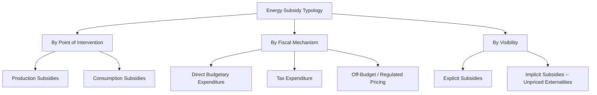

## Typology of Energy Subsidies: Production, Consumption, Tax Expenditure

### Definition and Core Concept

An energy subsidy, in the standard economic definition used by major international institutions (including the IMF, IEA, and OECD in their respective subsidy tracking frameworks), is any government action that lowers the cost of energy production below its market-determined level, raises the price received by energy producers above the market-determined level, or lowers the price paid by energy consumers below the market-determined level — encompassing a substantially broader set of policy instruments than direct cash payments alone. Developing a clear typology of energy subsidies matters economically because different subsidy types operate through different transmission channels (affecting production decisions versus consumption decisions), have different distributional incidence, and require different accounting methodologies to accurately measure their fiscal cost and market-distorting magnitude.

This topic provides the foundational classification framework for the broader chapter on energy subsidies and market distortions; the categories established here — production subsidies, consumption subsidies, and tax expenditures — recur as organizing concepts throughout subsequent analysis of subsidy reform, fossil fuel subsidy magnitude estimation, and the interaction between subsidies and externality pricing.

### Primary Typological Dimensions

**Key Points**

- **By point of intervention in the supply chain**: production-side subsidies (affecting the economics of extracting, generating, or supplying energy) versus consumption-side subsidies (affecting the price paid by end users).
- **By fiscal mechanism**: direct budgetary expenditure (on-budget cash transfers, direct payments) versus tax expenditure (revenue foregone through preferential tax treatment) versus off-budget mechanisms (regulated below-market pricing, credit guarantees, or implicit liabilities not captured in conventional government accounts).
- **By visibility/measurement difficulty**: explicit subsidies (directly observable in budgetary accounts or regulated price schedules) versus implicit subsidies (the failure to price negative externalities such as environmental or health damages at their full social cost, a category emphasized particularly in IMF subsidy estimation methodology, discussed further below).

### Production Subsidies

Production subsidies lower the cost of producing or supplying energy, or raise the effective price received by producers, thereby affecting investment and output decisions on the supply side of the energy market.

**Common forms:**

- **Direct capital grants and cash transfers**: Government payments to energy producers to offset capital costs (e.g., grants for exploration, extraction infrastructure, or generation capacity construction).
- **Below-market access to inputs**: Provision of land, water, or other production inputs to energy producers (particularly common in fossil fuel extraction and some large-scale generation projects) at prices below the input's market or opportunity cost.
- **Preferential financing**: Government-backed loans, loan guarantees, or below-market-rate credit extended specifically to energy production activities, which lowers the producer's effective cost of capital relative to what private financing markets would otherwise charge given the project's underlying risk profile.
- **Production tax credits and accelerated depreciation for fossil fuel production**: A production-side parallel to the renewable production tax credit and accelerated depreciation mechanisms discussed elsewhere in this text, historically applied in various jurisdictions to oil, gas, and coal extraction (e.g., depletion allowances, intangible drilling cost deductions in some national tax codes) — illustrating that the production tax credit and accelerated depreciation *mechanisms* themselves are technology-neutral fiscal tools whose subsidy classification depends on which energy source they are applied to, not on any exclusive association with renewable energy.
- **State-owned enterprise capital provision below commercial return requirements**: In jurisdictions with significant state ownership of energy production assets, capital provided to state-owned enterprises at a required rate of return below what a private capital provider would demand for equivalent risk constitutes an implicit production subsidy, though this form is particularly difficult to measure precisely given the absence of a directly observable market benchmark transaction. [Inference] Quantification of this specific subsidy form is one of the more methodologically contested areas of subsidy estimation, since it requires estimating a counterfactual private-sector required return that is not directly observed.

### Consumption Subsidies

Consumption subsidies lower the price paid by end users for energy below the price that would prevail under standard market pricing (or, in regulated markets, below the actual full cost of supply), thereby affecting the quantity of energy demanded.

**Common forms:**

- **Direct price controls / regulated below-cost pricing**: Government mandate that energy be sold to consumers (often specifically to households, agricultural users, or particular industrial sectors) at a price below the supplier's cost of supply, with the resulting shortfall typically covered either by direct government payment to the supplier or absorbed as a loss by a state-owned utility or fuel supplier.
- **Direct cash transfers or vouchers tied to energy consumption**: Payments made directly to consumers (or via subsidized vouchers) to offset their energy expenditure, common in some social protection program designs targeting low-income households' energy affordability.
- **Universal untargeted price subsidies**: Broad-based subsidies applied to all consumers of a given fuel or electricity, regardless of income or need — a design frequently critiqued in the subsidy reform literature (discussed further in later topics in this chapter) for poor distributional targeting, since higher-income households, who typically consume more energy in absolute terms, often capture a disproportionately large *absolute* share of the subsidy's fiscal cost even when the subsidy is nominally intended to support lower-income affordability.
- **Cross-subsidization within regulated tariff structures**: Internal tariff design in which one customer class (e.g., industrial or higher-consumption residential customers) pays rates above cost-of-service to fund below-cost rates for another customer class (e.g., low-income residential "lifeline" tariffs) — a form of consumption subsidy that may not appear as an explicit government budgetary line item at all, since the cross-subsidy flows entirely within the regulated utility's rate structure.

### Tax Expenditures

**Key Points**

- A tax expenditure is government revenue foregone as a result of a preferential tax provision — a reduced tax rate, exemption, deduction, credit, or deferral — applied to a specific activity or sector, relative to a defined "benchmark" tax treatment that would otherwise apply.
- Tax expenditures are economically equivalent, in most respects, to an equivalent-sized direct budgetary expenditure, since both reduce the government's net fiscal position by the same amount and both alter the relevant economic actor's incentives in the same direction — a point emphasized in public finance literature to argue against treating tax expenditures as categorically different from, or less significant than, on-budget spending simply because they do not appear as an explicit appropriation.
- Common energy-sector tax expenditure forms include reduced excise or value-added tax (VAT) rates on specific fuels, accelerated depreciation schedules (as discussed above and in the renewable tax credit topic), exemptions from otherwise-applicable royalty or resource extraction taxes, and preferential capital gains or income tax treatment for specific energy investment activities.
- Measuring tax expenditures requires specifying a **benchmark tax system** against which the preferential treatment is compared — a methodological choice that is not always straightforward or uncontested, since reasonable analysts can differ on what the "normal" or benchmark tax treatment of a given activity should be, introducing an element of judgment into tax expenditure estimation that is less present in direct budgetary expenditure accounting (where the cash transfer amount is generally unambiguous and directly observable).

$$\text{Tax Expenditure} = \left(\tau_{benchmark} - \tau_{preferential}\right) \times \text{Tax Base}$$

where $\tau_{benchmark}$ is the tax rate (or equivalent burden) that would apply under the specified benchmark system, and $\tau_{preferential}$ is the actual, reduced rate or burden applied to the qualifying activity.

### Explicit vs. Implicit Subsidies: The IMF Framework

A particularly influential distinction in the contemporary energy subsidy literature, developed extensively in IMF fossil fuel subsidy estimation methodology, separates:

- **Explicit (pre-tax) subsidies**: The gap between the actual price paid by consumers (or received by producers) and the supply cost of energy (extraction/generation cost plus transport, distribution, and a normal profit margin) — corresponding closely to the direct budgetary and regulated-pricing categories discussed above, and representing what would traditionally be recognized as a "subsidy" in conventional public finance terms.
- **Implicit (post-tax) subsidies**: Additionally includes the gap between the actual consumer price and the price that would fully reflect the energy's environmental and health externality costs (including, in various IMF and related studies, local air pollution health costs, global climate damage costs, and in some analyses broader costs such as congestion and accident externalities for transport fuels specifically) plus any foregone consumption tax revenue relative to a benchmark VAT/consumption tax rate applied to other goods.

$$\text{Post-tax Subsidy} = \text{Pre-tax (Explicit) Subsidy} + \text{Unpriced Externality Cost} + \text{Foregone Consumption Tax}$$

**Key Points**

- This "post-tax" framework substantially expands the measured scope of global energy subsidies relative to explicit-subsidy-only accounting, since it captures fossil fuel consumption in jurisdictions where prices are not directly government-controlled or budget-subsidized at all, but where prices nonetheless fail to internalize environmental and health externalities — treating the absence of adequate externality pricing (e.g., inadequate carbon pricing or air pollution charges) itself as an implicit subsidy relative to an efficient-pricing benchmark.
- [Inference] The post-tax/implicit subsidy framework is analytically influential and widely cited in international policy discussions, but it rests on externality valuation methodologies (e.g., the social cost of carbon, air pollution health cost estimates) that are themselves subject to substantial estimation uncertainty and, in the case of the social cost of carbon specifically, sensitivity to discount rate and damage function assumptions that vary meaningfully across studies — meaning post-tax subsidy estimates should be understood as dependent on these underlying valuation choices rather than as objectively fixed figures independent of methodology.
- This distinction matters for policy interpretation: an "explicit subsidy" framing implies primarily a fiscal/budgetary reform question, while an "implicit/post-tax subsidy" framing reframes the same issue substantially as an externality-pricing and environmental policy question (closely connected to carbon pricing and Pigouvian tax design, covered as related topics), and the two framings can lead to different conclusions about which policy instrument (subsidy removal versus new externality-correcting taxation) is the more directly appropriate corrective response.

### Comparative Summary Table

| Category | Point of Intervention | Fiscal Mechanism | Typical Visibility | Illustrative Example |
| --- | --- | --- | --- | --- |
| Direct production grant | Production | On-budget expenditure | Explicit | Capital grant for extraction infrastructure |
| Production tax credit | Production | Tax expenditure | Explicit | Depletion allowance; PTC-equivalent for fossil output |
| Preferential production financing | Production | Off-budget (implicit, via below-market credit terms) | Often less visible | Government-guaranteed below-market loan to a producer |
| Regulated below-cost consumer pricing | Consumption | Off-budget (utility/supplier loss) or on-budget (if government covers the gap) | Explicit, though fiscal cost may not appear directly in budget if absorbed by a state-owned supplier | Government-mandated below-cost retail fuel or electricity pricing |
| Consumption tax exemption/reduced rate | Consumption | Tax expenditure | Explicit | Reduced VAT or excise rate on household energy bills |
| Unpriced externality cost | Consumption (economy-wide) | Implicit — no direct fiscal transaction | Implicit | Absence of adequate carbon pricing on fossil fuel combustion |

### Measurement Challenges Across the Typology

**Key Points**

- **Direct budgetary subsidies** are generally the most straightforwardly measurable category, since they correspond to an identifiable cash transfer recorded (at least in principle) in government fiscal accounts, though cross-country comparability can still be complicated by differing budgetary classification conventions.
- **Tax expenditures** require specifying a contestable benchmark tax treatment, introducing a documented source of measurement variation across different studies and institutions that may adopt different benchmark assumptions for the same underlying tax provision.
- **Off-budget and regulated-pricing subsidies** (e.g., losses absorbed by a state-owned energy enterprise, cross-subsidies embedded in utility tariff structures) are often the most difficult to measure comprehensively, since they may not appear in conventional government fiscal accounts at all, requiring supplementary data (e.g., state-owned enterprise financial statements, detailed tariff structure analysis) to estimate.
- **Implicit/externality-based subsidies** depend entirely on the analyst's chosen externality valuation methodology and are, as noted above, the category most subject to legitimate methodological disagreement and resulting variation in published estimates across different studies and institutions.

### Related Topics

- **Fossil fuel subsidy magnitude estimation and international reporting frameworks (IMF, IEA, OECD methodologies)**
- **Subsidy reform political economy and distributional/targeting considerations**
- **Pigouvian taxation and the social cost of carbon**
- **Carbon pricing design: taxes versus cap-and-trade**
- **State-owned enterprise financing and implicit government guarantees in the energy sector**
- **Renewable production tax credit and accelerated depreciation** (as a structurally parallel mechanism applied to a different set of energy sources)
- **Utility rate design and cross-subsidization between customer classes**
- **Energy affordability and targeted versus universal consumer support program design**