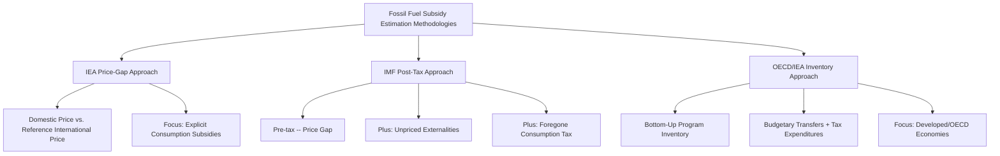

## Fossil Fuel Subsidy Estimation Methodologies

### Definition and Core Concept

Fossil fuel subsidy estimation methodologies are the analytical frameworks used by international institutions, national governments, and researchers to quantify the magnitude of government support provided to fossil fuel production and consumption. Because subsidies take heterogeneous forms — direct transfers, tax expenditures, regulated below-cost pricing, preferential financing, and unpriced externalities, as established in the typology topic — no single, uncontroversial measurement approach exists. Different institutions have developed distinct methodologies reflecting different definitional starting points, and headline global subsidy estimates can vary by an order of magnitude or more depending on which methodology is applied, making methodological literacy essential for interpreting and comparing published subsidy figures.

### The Three Dominant International Methodologies

**Key Points**

- **IEA (International Energy Agency) "price-gap" approach**: Focuses primarily on explicit consumption subsidies, measured as the gap between domestic end-user prices and a reference international market price (adjusted for supply costs), covering a defined set of fossil fuels across tracked economies, primarily emerging and developing economies where subsidized pricing is more prevalent.
- **IMF "price-gap plus externalities" (post-tax) approach**: Extends the price-gap logic (termed "pre-tax" or explicit subsidies in IMF terminology) to additionally incorporate unpriced negative externalities (climate damage, local air pollution health costs, and other social costs) plus foregone standard consumption taxation, producing the substantially larger "post-tax subsidy" estimates discussed in the typology topic.
- **OECD/IEA fossil fuel support inventory approach**: A bottom-up, program-by-program inventory methodology that catalogs individual identified government support measures (budgetary transfers and tax expenditures) across OECD and partner economies, aggregating from itemized program-level data rather than top-down price-gap calculation, primarily capturing explicit production- and consumption-side support in relatively higher-income/developed economies where the price-gap method (calibrated more toward developing-economy administered pricing contexts) is less applicable.

### The IEA Price-Gap Methodology in Detail

The core price-gap calculation for a given fuel in a given country and period is:

$$\text{Subsidy}_{unit} = P_{reference} - P_{end-user}$$

$$\text{Total Subsidy} = \text{Subsidy}_{unit} \times Q_{consumed}$$

where $P_{reference}$ is a benchmark price constructed from the relevant international market price (e.g., a crude oil or refined product benchmark for oil products, an international LNG or pipeline reference price for natural gas) adjusted for the cost of transport, refining/processing margins, and distribution appropriate to the country in question, and $P_{end-user}$ is the actual regulated or market domestic retail price. When $P_{end-user} < P_{reference}$, a positive per-unit subsidy is calculated; the method can, in principle, also identify negative subsidies (implicit taxation) when domestic prices exceed the reference benchmark, which occurs in some jurisdictions with high fuel excise taxation.

**Key Points**

- This methodology's central practical strength is that it relies primarily on observable price data (international benchmark prices, domestic retail prices, consumption volumes) rather than requiring the more contestable externality valuation inputs the IMF post-tax method requires — making IEA-style price-gap estimates comparatively more replicable and less methodology-dependent across different analysts.
- Its central limitation is scope: it captures only *explicit* subsidies arising from below-reference-price consumer pricing, entirely excluding production-side subsidies, tax expenditures not reflected in the retail price itself, and all forms of unpriced externality cost — meaning price-gap estimates should not be interpreted as comprehensive measures of total government support to fossil fuels, only of this specific consumption-price-gap component.
- Reference price and cost-adjustment methodology choices (which international benchmark to use, how to estimate country-specific transport and distribution cost adders) introduce a documented source of estimate variation even within this comparatively more standardized approach. [Inference] Precise year-specific reference price adjustment methodologies are periodically revised by the tracking institution, so current published methodology notes should be consulted for the specific benchmark construction used in any given year's estimate rather than assuming a fixed, unchanging calculation procedure.

### The IMF Post-Tax Methodology in Detail

Building on the price-gap logic, the IMF's widely cited post-tax framework (extensively documented in the IMF's periodic global fossil fuel subsidy working papers) decomposes total subsidy into explicit and implicit components:

$$\text{Post-tax Subsidy} = \underbrace{(P_{efficient,supply} - P_{end-user})}_{\text{Explicit (pre-tax)}} + \underbrace{(P_{efficient,full} - P_{efficient,supply})}_{\text{Implicit (externality + foregone tax)}}$$

where $P_{efficient,supply}$ reflects supply cost (extraction/generation, transport, distribution, normal profit margin) and $P_{efficient,full}$ additionally incorporates a standard consumption tax component and full internalization of externality costs (climate damage, typically valued via an estimated social cost of carbon; local air pollution health damage, typically valued via epidemiological damage-function estimates specific to each fuel's combustion characteristics and the population exposure context; and, in some more comprehensive analyses, additional externalities such as road congestion and accident costs specifically for transport fuel consumption).

**Key Points**

- The externality valuation inputs required by this methodology — particularly the social cost of carbon and local air pollution health cost estimates — are themselves subject to substantial documented estimation uncertainty and methodological sensitivity (discount rate assumptions, damage function specification, valuation of statistical life used in health cost monetization), meaning the resulting post-tax subsidy estimate inherits this underlying uncertainty. [Inference] Because social cost of carbon estimates specifically have varied considerably across different studies, institutions, and time periods depending on discount rate and damage function assumptions, any single post-tax subsidy figure should be understood as conditional on the specific externality valuation assumptions used in that particular estimate, not as an objectively settled number independent of methodology.
- The inclusion of foregone standard consumption taxation (treating any energy-specific reduced VAT or excise rate, relative to the standard rate applied to other consumption goods, as an implicit subsidy) is a further methodological choice that some analysts have characterized as conflating general tax policy design questions with subsidy measurement specifically, since jurisdictions may have varied consumption tax rates across different goods for reasons unrelated to energy policy. [Speculation] Whether this component should properly be characterized as a "subsidy" in the conventional sense, as opposed to a general feature of a jurisdiction's broader tax structure, is a matter on which reasonable analysts and institutions differ, and is not resolved by the estimation methodology itself.
- This methodology's headline global aggregate figures have, in various published IMF analyses, been substantially larger than IEA price-gap-only or OECD/IEA inventory-only aggregates for the same general time period, precisely because the post-tax framework captures the (typically much larger in aggregate) unpriced externality component in addition to explicit price gaps — a difference that reflects definitional scope rather than one methodology being simply "more accurate" than another; the appropriate comparison depends on which policy question (fiscal reform versus externality-pricing reform) the estimate is intended to inform.

### The OECD/IEA Inventory Methodology in Detail

Rather than calculating an implied subsidy from aggregate price and consumption data, the inventory approach identifies and catalogs individual government support measures directly, drawing on national budget documents, tax expenditure reports, and other official government sources, then aggregates the identified measures' estimated fiscal cost.

**Key Points**

- This bottom-up approach has a comparative advantage in **traceability and specificity**: each identified subsidy measure can, in principle, be traced to a specific government program, statute, or budget line, supporting more granular analysis of which particular policy instruments (e.g., a specific tax credit, a specific direct grant program) contribute to the aggregate total, and supporting more direct policy reform recommendations targeted at specific identified measures.
- Its central limitation is **completeness**: the method can only capture measures that are identifiable and quantifiable from available official documentation, meaning it likely undercounts subsidies that are embedded in less transparent mechanisms (e.g., implicit subsidies through below-market state-owned enterprise capital costs, or subsidies embedded in regulatory decisions rather than explicit budget/tax provisions) — a limitation the method's documentation itself typically acknowledges.
- Because this approach is oriented toward explicit budgetary and tax expenditure measures, it does not capture the unpriced externality component central to the IMF post-tax framework, positioning it methodologically closer to (though structurally distinct in approach from) the IEA's explicit-subsidy scope, while extending explicit-subsidy coverage to production-side measures and OECD/developed-economy contexts that the IEA price-gap method (oriented more toward developing-economy administered consumer pricing) does not primarily address.

### Comparative Summary of Methodologies

| Dimension | IEA Price-Gap | IMF Post-Tax | OECD/IEA Inventory |
| --- | --- | --- | --- |
| Primary scope | Explicit consumption subsidies | Explicit + implicit (externality) subsidies | Explicit production + consumption subsidies (budgetary/tax) |
| Calculation approach | Top-down (price differential x volume) | Top-down (price differential x volume, extended with externality valuation) | Bottom-up (itemized program inventory) |
| Key data inputs | International reference prices, domestic retail prices, consumption volumes | Same as price-gap, plus social cost of carbon and air pollution health cost estimates | National budget documents, tax expenditure reports, program-level data |
| Primary geographic focus | Primarily developing/emerging economies with administered pricing | Global | Primarily OECD and partner/developed economies |
| Relative estimate magnitude (for comparable scope/period) | Smaller — captures only explicit consumption price gap | Substantially larger — dominated by the externality component in most published applications | Smaller — captures only identifiable explicit budgetary/tax measures |
| Key methodological vulnerability | Reference price and cost-adjustment assumptions | Externality valuation assumptions (social cost of carbon, health damage functions) | Completeness/traceability limitations; may undercount non-transparent implicit measures |

### Reconciling Divergent Headline Figures

**Key Points**

- A recurring point of public and policy confusion is those headlines citing "trillions" in global fossil fuel subsidies (typically drawing on IMF post-tax figures, where the externality component dominates the total) alongside other reporting citing substantially smaller figures (typically drawing on IEA price-gap or OECD/IEA inventory explicit-subsidy-only figures) — both can be simultaneously accurate representations of their respective, differently scoped, underlying methodologies, and the apparent inconsistency dissolves once the differing definitional scope is made explicit.
- When comparing or citing any specific fossil fuel subsidy estimate, the methodologically important step is identifying which of the three (or another) frameworks was used, what geographic and fuel coverage was included, what specific externality valuation assumptions (if any) were applied, and what time period the estimate covers — since headline aggregate figures without this methodological context are of limited analytical value and can be, and frequently are, misinterpreted or misapplied in public discussion when compared across sources using different underlying definitions.
- [Inference] Given the sensitivity of post-tax estimates specifically to externality valuation assumptions that are periodically revised as underlying scientific and economic estimates (e.g., updated social cost of carbon research) evolve, any post-tax subsidy figure should be treated as reflecting the specific valuation assumptions current at the time of that estimate's publication, and current primary-source methodology documentation should be consulted for the most up-to-date valuation inputs used in recent estimates.

### Common Additional Estimation Challenges Across All Methodologies

- **Double-counting risk**: Care is required to avoid double-counting when a subsidy operates through multiple simultaneously observable channels (e.g., a production tax credit that also indirectly lowers the retail price captured in a price-gap calculation), requiring careful methodological delineation between production-side and consumption-side subsidy accounting to avoid summing the same underlying support twice.
- **Data availability and transparency limitations**: Estimation quality is directly constrained by the transparency of the jurisdiction being studied — countries with less transparent budget documentation, significant off-budget state-owned enterprise activity, or non-public administered pricing formulas are inherently more difficult to estimate accurately under any of the three methodologies, introducing a documented pattern where subsidy estimates for less fiscally transparent jurisdictions carry greater uncertainty than those for more transparent ones.
- **Treatment of state-owned enterprise losses**: Whether and how to attribute state-owned energy enterprise operating losses (arising from mandated below-cost pricing) to government subsidy accounting varies across methodologies and has been a documented source of estimate divergence in country-specific case studies, particularly for major state-owned fossil fuel producers and suppliers.
- **Currency and purchasing power comparability**: Cross-country aggregation and comparison of subsidy estimates denominated in different national currencies raises standard methodological questions (market exchange rate versus purchasing power parity conversion) with potentially significant implications for relative country rankings in aggregate global subsidy tables.

### Related Topics

- **Typology of energy subsidies: production, consumption, tax expenditure** (foundational categories underlying all estimation methodologies)
- **Social cost of carbon: estimation approaches and policy application**
- **Air pollution health damage valuation methodology**
- **Subsidy reform political economy and distributional/targeting considerations**
- **Carbon pricing design: taxes versus cap-and-trade** (as the direct policy corollary to the implicit/externality subsidy framework)
- **State-owned enterprise financing and fiscal transparency in the energy sector**
- **International institutional subsidy tracking and reporting (IEA, IMF, OECD comparative publication programs)**