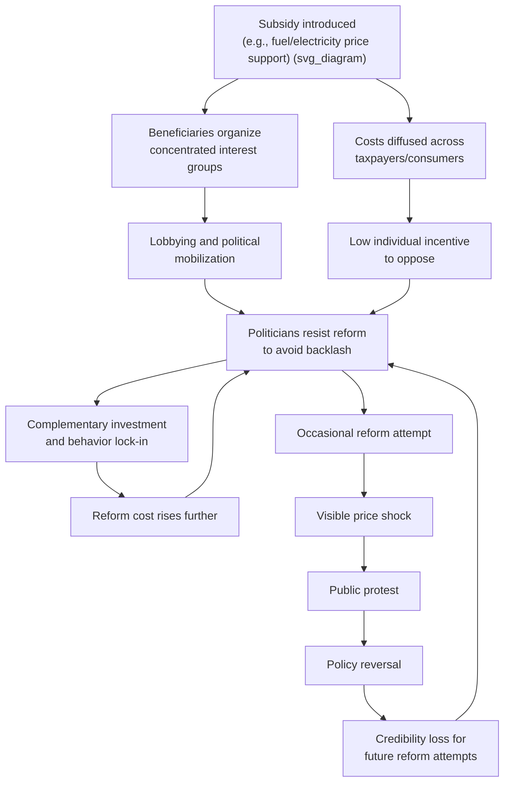

## Political Economy of Subsidy Persistence and Reform Resistance

### Overview

Energy subsidies—whether for fossil fuels, electricity, or renewables—frequently persist long after their original economic rationale has weakened or disappeared. The political economy literature explains this persistence not as a failure of economic analysis but as a rational outcome of concentrated benefits, diffuse costs, institutional lock-in, and the strategic behavior of organized interest groups. Understanding these dynamics is essential for designing reforms that survive political implementation rather than collapsing under backlash.

**Key Points**

- Subsidy persistence is a collective-action problem: beneficiaries are concentrated and well-organized; costs are diffuse and borne by unorganized taxpayers or consumers.
- Reform resistance is driven by loss aversion, distributional conflict, information asymmetries, and credible commitment problems.
- Successful reforms typically combine compensation mechanisms, sequencing strategies, and transparency measures rather than relying on price correction alone.

### The Core Analytical Framework

#### Concentrated Benefits, Diffuse Costs

The foundational logic, drawn from Mancur Olson's theory of collective action, is that a subsidy's beneficiaries (a specific industry, a group of consumers, a regional bloc) capture large per-capita gains and therefore have strong incentives to organize, lobby, and monitor politicians. The costs are spread across millions of taxpayers or consumers, each bearing a small individual burden too small to justify the cost of organizing opposition.

This asymmetry can be represented with a simple welfare comparison. If a subsidy $S$ transfers benefit $B_i$ to each of $n$ concentrated beneficiaries and imposes cost $C_j$ on each of $m$ diffuse payers, political mobilization intensity $M$ is proportional to per-capita stakes:

$$M_{beneficiaries} \propto \frac{B}{n}, \quad M_{payers} \propto \frac{C}{m}$$

Since $n \ll m$ typically holds, $B/n \gg C/m$ even when total cost $C$ exceeds total benefit $B$, producing sustained political support for inefficient subsidies.

#### Path Dependence and Policy Lock-In

Once a subsidy is enacted, complementary investments occur around it: firms build capacity assuming subsidized input prices, households adjust consumption patterns (e.g., vehicle choice under fuel subsidies), and administrative infrastructure (ration systems, price boards) becomes entrenched. This creates increasing returns to the status quo—a self-reinforcing equilibrium described in the path-dependence literature (David, North). Reform now requires not just reversing a price signal but unwinding embedded capital and behavioral commitments, raising the political cost of change over time.

#### Rent-Seeking and Regulatory Capture

Where subsidies flow through state-owned enterprises or licensed intermediaries (fuel distributors, utility monopolies), the recipient organizations develop institutional interests in preserving the transfer. This aligns with the Stigler-Peltzman theory of regulatory capture: agencies ostensibly designed to regulate an industry become instruments serving that industry's interests, partly because industry actors possess superior information and sustained lobbying capacity relative to rotating political overseers.

### Why Reform Attempts Fail: A Taxonomy

#### 1. The Compensation Problem

Efficient reform requires that winners (the treasury, future generations, environment) could in principle compensate losers (subsidy-dependent households and firms) and still be better off—the Kaldor-Hicks criterion. In practice, credible compensation rarely materializes because:

- Compensation packages are fiscally costly and politically vulnerable to future budget cuts.
- Losers cannot verify a government's commitment to sustained compensation (a time-inconsistency problem).
- Compensation is often broad-based (e.g., cash transfers) while losses are concentrated (e.g., specific industries or regions), making the trade unattractive to the most vocal opponents.

#### 2. Loss Aversion and Status Quo Bias

Behavioral political economy shows that the perceived pain of losing an existing subsidy outweighs the perceived gain of an equivalent future benefit (prospect theory). Even when reform is welfare-improving in aggregate, the visible, immediate price increase generates far more political salience than the diffuse, delayed benefits of fiscal savings or reduced emissions.

#### 3. Information Asymmetry and Reversal Risk

Governments proposing reform face a credibility deficit: past reform attempts that were reversed under public pressure (a common pattern, documented across many fuel-subsidy episodes) teach citizens that protest can force policy reversal. This creates a rational expectation among the public that resisting reform is a viable and low-risk strategy, reinforcing a repeated-game equilibrium of proposal-protest-reversal.

#### 4. Fiscal Illusion

Subsidies delivered through suppressed prices (rather than an explicit budget line) obscure their true fiscal cost from voters, who may underestimate what they are "receiving" in real terms. Removing the subsidy makes an implicit transfer suddenly visible and salient, generating backlash disproportionate to the actual welfare loss involved—since much of the visible price increase merely reveals a cost that was already being paid indirectly through taxes or foregone public investment.

#### 5. Political Business Cycles

Subsidy reform is frequently timed opportunistically: governments raise administered energy prices shortly after elections and resist adjustments as elections approach. This pattern is consistent with political business cycle theory and has been observed repeatedly in electricity and fuel pricing across many middle-income economies. [Inference] The empirical strength of this pattern varies by country and period, but the qualitative timing effect is widely documented in case-study literature.

### Diagram: The Subsidy Persistence Feedback Loop

### Stakeholder Mapping

The following SVG illustrates the typical stakeholder configuration around a fossil-fuel subsidy, showing asymmetric organization and stakes.

<svg xmlns="http://www.w3.org/2000/svg" viewBox="0 0 760 420" font-family="Helvetica, Arial, sans-serif">
<text x="380" y="30" text-anchor="middle" font-size="18" font-weight="bold" fill="#1a1a1a">Stakeholder Map: Fuel Subsidy Political Economy (svg_diagram)</text>

<rect x="40" y="70" width="300" height="150" rx="10" fill="#e8f4ea" stroke="#2e7d32" stroke-width="2" />
<text x="190" y="95" text-anchor="middle" font-size="14" font-weight="bold" fill="#2e7d32">Concentrated Beneficiaries</text>
<text x="60" y="120" font-size="12" fill="#1a1a1a">• Fuel-intensive industries</text>
<text x="60" y="142" font-size="12" fill="#1a1a1a">• Transport &amp; logistics sector</text>
<text x="60" y="164" font-size="12" fill="#1a1a1a">• State-linked distributors</text>
<text x="60" y="186" font-size="12" fill="#1a1a1a">• High-consumption households</text>
<text x="60" y="208" font-size="11" font-style="italic" fill="#555">High per-capita stake → strong lobbying</text>

<rect x="420" y="70" width="300" height="150" rx="10" fill="#fdeaea" stroke="#c62828" stroke-width="2" />
<text x="570" y="95" text-anchor="middle" font-size="14" font-weight="bold" fill="#c62828">Diffuse Cost Bearers</text>
<text x="440" y="120" font-size="12" fill="#1a1a1a">• General taxpayers</text>
<text x="440" y="142" font-size="12" fill="#1a1a1a">• Future generations (fiscal debt)</text>
<text x="440" y="164" font-size="12" fill="#1a1a1a">• Under-funded public services</text>
<text x="440" y="186" font-size="12" fill="#1a1a1a">• Non-users of subsidized fuel</text>
<text x="440" y="208" font-size="11" font-style="italic" fill="#555">Low per-capita stake → weak organization</text>

<rect x="230" y="270" width="300" height="110" rx="10" fill="#fff3e0" stroke="#ef6c00" stroke-width="2" />
<text x="380" y="295" text-anchor="middle" font-size="14" font-weight="bold" fill="#ef6c00">Political Decision-Makers</text>
<text x="250" y="320" font-size="12" fill="#1a1a1a">Weigh: visible protest risk</text>
<text x="250" y="340" font-size="12" fill="#1a1a1a">vs. diffuse fiscal/efficiency gains</text>
<text x="250" y="360" font-size="12" fill="#1a1a1a">Outcome: status-quo bias</text>

<line x1="190" y1="220" x2="330" y2="270" stroke="#2e7d32" stroke-width="2" marker-end="url(#arrow1)" />
<line x1="570" y1="220" x2="430" y2="270" stroke="#c62828" stroke-width="2" marker-end="url(#arrow2)" />
</svg>

### Theoretical Models of Reform Timing

#### The War of Attrition Model

Alesina and Drazen's "war of attrition" model formalizes reform delay as a bargaining problem between groups who disagree over how the burden of stabilization (including subsidy removal) should be distributed. Each group prefers the other to concede first and absorb a disproportionate share of adjustment costs. Reform occurs only when one side's cost of continued delay (economic deterioration, fiscal crisis) exceeds its expected gain from holding out. This explains why subsidy reform often occurs abruptly during fiscal crises (e.g., IMF program conditions, balance-of-payments emergencies) rather than through gradual, planned adjustment.

#### Veto Player Theory

Tsebelis's veto player framework predicts that the number and ideological distance of actors with the power to block reform (legislature chambers, coalition partners, sub-national governments, judiciary) determines the range of feasible policy change. Energy subsidy reform is harder to enact in politically fragmented systems with many veto points, even where technocratic consensus on the need for reform is strong.

#### Resource Curse and Rentier State Dynamics

In hydrocarbon-exporting states, fuel subsidies often function as an implicit social contract substituting for broader political accountability or taxation ("no representation without taxation" in reverse). This rentier bargain—cheap energy in exchange for political quiescence—makes subsidy removal politically fraught because it is perceived as unilateral abrogation of the social contract, not merely a price adjustment. [Inference] The strength of this dynamic varies significantly by regime type and the extent to which subsidies are seen as a citizen's entitlement versus an ordinary transfer program.

### Case Patterns Observed Across Reform Episodes

**Example**

| Country/Region | Subsidy Type | Reform Approach | Outcome Pattern |
| --- | --- | --- | --- |
| Indonesia (multiple episodes since 1998) | Fuel subsidies | Phased price increases, cash transfer compensation (BLT/BLSM programs) | Partial success; repeated partial reversals under protest, later more durable reform when paired with targeted transfers |
| Nigeria (2012, 2023) | Petrol subsidy | Sudden removal ("subsidy shock") | Significant public backlash; 2012 reform partly reversed; 2023 removal sustained amid inflation pressure |
| Iran | Energy subsidies | Cash transfer program preceding price reform (2010) | Initial success in maintaining reform via broad-based compensation; later eroded by inflation reducing real transfer value |
| Egypt | Fuel and electricity subsidies | IMF-supported multi-year phased removal | Sustained due to fiscal crisis pressure and gradual sequencing |
| EU member states | Fossil fuel subsidies (various) | Gradual phase-out tied to carbon pricing and green transition funds | Slower but more politically durable due to compensation and long timelines |

[Unverified] Specific fiscal figures, transfer amounts, and precise reversal dates vary by source and reporting period; the table reflects general documented patterns rather than a single authoritative dataset.

### Design Principles for Durable Reform

#### 1. Sequencing and Gradualism

Phased price adjustments (rather than one-off shocks) reduce the salience of any single price change and allow households to adjust consumption and budgeting incrementally. However, gradualism also extends the window during which opposition can organize, so optimal sequencing balances shock minimization against prolonged vulnerability to reversal.

#### 2. Compensatory Cash Transfers

Replacing price subsidies with direct, targeted cash transfers preserves the price signal (correcting the market distortion) while addressing the equity rationale often used to justify subsidies. Design considerations include:

- Transfer value should track inflation to avoid erosion of political support over time.
- Targeting must be credible and transparent to avoid perceptions of elite capture.
- Transfers should ideally be delivered before or simultaneously with price increases, not after, to build trust.

#### 3. Transparency and Fiscal Framing

Explicitly quantifying subsidy costs in the national budget (rather than leaving them as quasi-fiscal deficits in state utilities or oil companies) increases public awareness of the true opportunity cost, potentially shifting the political calculus toward reform. This connects to fiscal transparency initiatives promoted by institutions such as the IMF and the Extractive Industries Transparency Initiative.

#### 4. Coalition-Building and Framing

Building broad reform coalitions—linking subsidy savings explicitly to popular spending priorities (health, education, targeted social protection)—can offset narrow producer-group opposition. Framing reform as reallocation rather than austerity affects public reception, an insight drawn from framing effects literature in political psychology.

#### 5. Timing Relative to Global Prices

Reforms initiated during periods of falling global fuel prices generate smaller visible price increases (or even decreases) for consumers, reducing political risk. Several successful subsidy reforms (e.g., Indonesia and India around 2014–2015, coinciding with the oil price collapse) have exploited this window. [Inference] This suggests opportunistic timing is a significant, though not singularly determinative, success factor.

### Formal Political Economy Model Sketch

A simplified median-voter-style model of reform can be represented with a political support function $\Pi$ that a government seeks to maximize:

$$\Pi(\theta) = \sum_{i \in G} w_i \cdot u_i(\theta)$$

where $\theta$ is the subsidy reform intensity (0 = no reform, 1 = full removal), $G$ is the set of relevant groups, $u_i(\theta)$ is group $i$'s utility as a function of reform intensity, and $w_i$ is the government's political weight on group $i$ (a function of organization, electoral importance, and lobbying capacity). Because $w_i$ is disproportionately high for concentrated beneficiaries relative to their population share, the government's optimal $\theta^*$ that maximizes $\Pi$ will generally be below the socially efficient reform level $\theta^{social}$ that maximizes aggregate welfare $W(\theta)$:

$$\theta^* < \theta^{social} \quad \text{whenever} \quad w_{beneficiaries} \gg w_{diffuse payers}$$

This formalizes why democratically elected governments systematically under-reform relative to the welfare-maximizing benchmark, even absent corruption—purely as a function of differential political weighting.

### Common Reform Reversal Triggers

- Sudden, unannounced large price jumps rather than pre-announced gradual schedules
- Absence of visible compensation for the poorest households at the moment of the price change
- Coincidence of subsidy removal with other economic stress (currency depreciation, inflation spikes, unrelated crises)
- Perceived elite exemption (e.g., large industrial users retaining preferential rates while household prices rise)
- Weak communication strategy failing to link removal to concrete public benefits

### Related Topics

- Fiscal incidence analysis of energy subsidies
- Targeted cash transfer program design (e.g., proxy means testing)
- Political business cycle theory in commodity-exporting economies
- Rentier state theory and the resource curse
- Carbon pricing political feasibility and revenue recycling
- Quasi-fiscal deficits in state-owned energy enterprises
- IMF conditionality and energy subsidy reform programs
- Behavioral political economy: loss aversion in public policy
- Veto player theory and comparative policy reform
- Just energy transition and compensatory transition funds