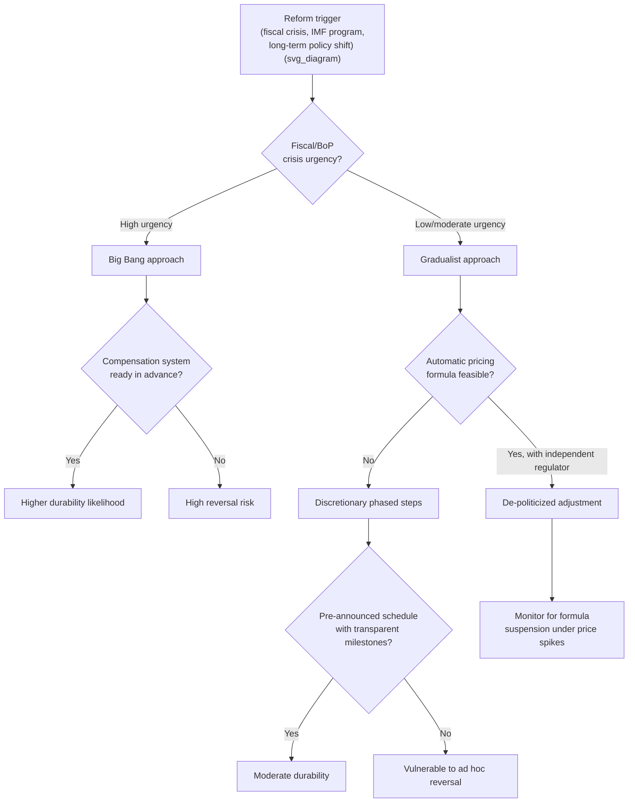

## Subsidy Reform Case Studies and Sequencing Strategies

### Overview

Energy subsidy reform outcomes vary widely depending on how price adjustments are sequenced, communicated, and compensated. Comparative case analysis across fuel and electricity subsidy reforms reveals recurring design choices that separate durable reforms from reversed ones: the pace of price adjustment, the timing and credibility of compensatory transfers, macroeconomic conditions at the moment of reform, and the political framing used to justify removal. This topic synthesizes major documented episodes and extracts generalizable sequencing principles for policymakers.

**Key Points**

- No single sequencing strategy is universally optimal; the right approach depends on fiscal urgency, administrative capacity, and social protection infrastructure.
- The two dominant strategies are "big bang" (rapid, often full removal) and "gradualist" (phased, multi-year) reform, each with distinct risk profiles.
- Compensation mechanisms (cash transfers, targeted subsidies) are the single most consistent predictor of reform durability across cases.
- Macroeconomic timing (global oil price cycles, inflation, currency stability) strongly conditions political feasibility independent of domestic design quality.

### Sequencing Strategy Typology

#### 1. Big Bang (Rapid/Full Removal)

Prices are moved to market levels in a single step or a very short window (weeks to months).

**Advantages**

- Minimizes prolonged uncertainty and speculative hoarding/smuggling incentives that arise when future price increases are anticipated.
- Removes the distortion quickly, generating immediate fiscal relief.
- Harder for opposition to organize a sustained multi-year campaign against a single event.

**Disadvantages**

- Maximizes short-term price shock and inflationary pass-through, concentrating political backlash into a narrow window.
- Requires compensation mechanisms to be fully operational before implementation, which is administratively demanding.
- Higher risk of social unrest if timed poorly relative to other economic stress.

#### 2. Gradualist (Phased Multi-Year Removal)

Prices are increased incrementally according to a pre-announced schedule, often linked to a formula or automatic adjustment mechanism.

**Advantages**

- Smaller per-adjustment price shocks reduce single-event political salience.
- Allows households and firms time to adjust consumption, fuel-switch, or invest in efficiency.
- Compensation systems can be built and tested incrementally.

**Disadvantages**

- Extended timelines give opposition groups more time to organize and lobby for delay or reversal.
- Vulnerable to being paused or reversed at any intermediate step, especially around elections.
- Cumulative fiscal savings are delayed relative to big-bang approaches.

#### 3. Automatic Price Formulas (De-Politicization Strategy)

Rather than a discrete sequence, some reforms replace administered pricing with a formula that mechanically links domestic prices to international benchmarks (e.g., import parity pricing) on a monthly or fortnightly basis.

**Advantages**

- Removes discretionary political decision-making from each price change, reducing the "blame" attributable to any single government action.
- Creates predictability for markets and reduces speculative distortions.

**Disadvantages**

- Formulas are politically fragile; governments frequently suspend or override them when global prices spike (as seen repeatedly in various fuel-pricing formula suspensions).
- Requires strong institutional independence (e.g., an independent regulator) to resist political interference, which many implementing countries lack.

### Diagram: Sequencing Strategy Decision Logic

### Case Study 1: Indonesia (1998–2015, Multiple Episodes)

Indonesia's fuel subsidy reform history spans nearly two decades of repeated attempts, providing a longitudinal view of sequencing evolution.

**Timeline of Key Episodes**

- **1998 (Asian Financial Crisis):** IMF-linked subsidy cuts triggered widespread riots, contributing to the fall of the Suharto government. This episode is frequently cited as the canonical example of reform failure due to absent compensation and poor political timing.
- **2005:** Substantial price increases (over 100% for some fuels) accompanied by introduction of an unconditional cash transfer program (Bantuan Langsung Tunai, BLT) reaching roughly 19 million poor households. [Unverified: exact beneficiary counts vary by source and year.] This paired approach achieved more durable reform than 1998.
- **2013–2015:** Further price adjustments combined with a shift toward more targeted transfers and, by 2015, a move to a managed floating price formula for some fuels, aided by the concurrent global oil price collapse which minimized the visible burden on consumers.

**Sequencing Lesson**: Reforms paired with simultaneous or preceding cash compensation, and timed during periods of low global oil prices, proved substantially more durable than reforms attempted without compensation or during price spikes.

### Case Study 2: Iran (2010 Targeted Subsidies Reform Law)

Iran undertook one of the most comprehensive subsidy reforms attempted, converting energy (and bread) subsidies into direct cash transfers for nearly the entire population.

**Design Features**

- Nearly universal cash transfers deposited into household bank accounts *before* price increases took effect, addressing the compensation credibility problem directly.
- Price increases for fuel and electricity were substantial and implemented relatively quickly once transfers were operational.

**Outcome**

- Initial phase (2010–2012) maintained public acceptance due to the visible, tangible transfer preceding the pain of price increases.
- Subsequent high inflation (partly driven by external sanctions and macroeconomic mismanagement) eroded the real value of fixed transfers over time, reducing public support for the reform's continuation and complicating later phases. [Inference] The erosion illustrates that compensation design must include an inflation-indexation mechanism to remain politically durable over multi-year horizons.

### Case Study 3: Nigeria (2012 and 2023 Episodes)

**2012 Episode**: The government removed petrol subsidies with limited advance preparation or compensation infrastructure. This triggered the "Occupy Nigeria" protests, a nationwide strike, and ultimately a partial reversal that reinstated a lower, but still subsidized, price.

**2023 Episode**: Subsidy removal was announced abruptly upon a change in administration, framed as a fiscally unavoidable measure. Unlike 2012, macroeconomic pressure (severe fiscal deficits, currency crisis) and international financial institution engagement created conditions where reversal was less feasible despite public hardship, though this came with substantial inflationary and welfare costs. [Unverified] The precise long-term durability of the 2023 reform, and the adequacy of accompanying palliative measures, remained contested and evolving in public discourse at the time of the change.

**Sequencing Lesson**: Absent credible ex-ante compensation, reform survival becomes more a function of the government's fiscal desperation (removing the option to reverse) than of design quality—an outcome consistent with the "war of attrition" model of reform timing.

### Case Study 4: Egypt (2014–2019 IMF-Supported Program)

Egypt pursued a multi-year phased removal of fuel and electricity subsidies under an IMF-supported program, with pre-announced annual price adjustment schedules for electricity tariffs extending over roughly five years.

**Design Features**

- Explicit multi-year tariff roadmaps published in advance, reducing uncertainty for households and firms about the trajectory of prices.
- Adjustments bundled with broader macroeconomic stabilization (currency flotation, fiscal consolidation), diffusing the political attribution of any single price change.
- Targeted social protection expansions (e.g., expansion of the Takaful and Karama cash transfer programs) implemented alongside price reforms.

**Sequencing Lesson**: Publishing a credible, multi-year adjustment path can reduce speculative behavior and manage expectations, but requires sustained political commitment across multiple budget cycles and government terms to remain credible.

### Case Study 5: India (Liquefied Petroleum Gas "Give It Up" and Direct Benefit Transfer, 2013–2016)

India's approach to LPG subsidy reform illustrates a targeting-based rather than purely price-based sequencing strategy.

**Design Features**

- Introduction of Direct Benefit Transfer (DBT) for LPG (PAHAL scheme), moving subsidy payments directly to beneficiaries' bank accounts rather than suppressing the retail price, using Aadhaar (biometric ID) linkage for targeting.
- A voluntary "Give It Up" campaign encouraged higher-income consumers to relinquish their subsidy entitlement, using social framing and moral suasion rather than compulsion.
- Diesel price deregulation (2014) was timed to coincide with the global oil price collapse, minimizing consumer-facing impact.

**Sequencing Lesson**: Combining administrative reform (direct transfer of the subsidy rather than price suppression) with voluntary relinquishment mechanisms can reduce political resistance by preserving the appearance of consumer choice, and timing deregulation to falling global prices substantially reduces backlash risk.

### Comparative Summary Table

**Example**

| Case | Sequencing Approach | Compensation Timing | Macro Timing | Outcome |
| --- | --- | --- | --- | --- |
| Indonesia 1998 | Rapid, IMF-driven | None | Financial crisis (adverse) | Reversed; contributed to regime change |
| Indonesia 2005 | Rapid with concurrent transfer | Concurrent | Moderate | Held, with adjustments |
| Indonesia 2015 | Formula-based | Targeted, refined | Oil price collapse (favorable) | More durable |
| Iran 2010 | Rapid, near-universal transfer | Ex-ante (before price change) | Sanctions pressure (adverse, later) | Initially durable, eroded by inflation |
| Nigeria 2012 | Rapid, no preparation | None | Neutral | Reversed |
| Nigeria 2023 | Rapid, crisis-driven | Limited/delayed | Severe fiscal crisis | Sustained under duress; high social cost |
| Egypt 2014–2019 | Gradual, pre-announced multi-year | Concurrent expansion | IMF program, currency flotation | Largely sustained |
| India 2013–2016 | Administrative/targeting shift | Direct transfer + voluntary relinquishment | Oil price collapse (favorable) | Sustained |

[Unverified] This table synthesizes commonly documented patterns; specific dates, transfer values, and beneficiary figures vary across sources and should be verified against primary government or IMF/World Bank program documentation for precise figures.

### Cross-Case Sequencing Principles

#### Principle 1: Compensation Must Precede or Coincide With, Not Follow, Price Pain

Cases where cash transfers were operational and visible *before* or *simultaneous with* price increases (Iran 2010, Indonesia 2005) show materially better initial acceptance than cases where compensation was promised but not delivered in time (Nigeria 2012).

#### Principle 2: Exploit Favorable Global Price Cycles

Reforms initiated during periods of falling international oil prices (Indonesia 2015, India 2014) generate smaller or even negative net price changes for consumers, dramatically reducing political risk relative to reforms attempted during price spikes.

#### Principle 3: Bundle Reform With Broader Macroeconomic Narratives

Egypt's approach of embedding subsidy reform within a comprehensive IMF-supported stabilization program allowed the government to attribute price increases to a broader, externally validated necessity rather than a discretionary domestic political choice.

#### Principle 4: Index Compensation to Inflation

The Iranian case demonstrates that fixed nominal transfers lose political value over time in inflationary environments; durable reform designs should build in automatic adjustment mechanisms for compensation payments.

#### Principle 5: Fiscal Crisis Can Substitute for Design Quality, at a Welfare Cost

Nigeria's 2023 experience suggests that severe fiscal constraint can force reform durability even without ideal compensation design, but typically at a higher realized welfare cost to vulnerable households than would occur under a well-sequenced, compensated approach—an efficiency-equity trade-off policymakers should weigh explicitly.

#### Principle 6: Administrative Targeting Can Substitute for Price Adjustment

India's approach shows that redirecting the *subsidy delivery mechanism* (from price suppression to direct transfer) can achieve much of the efficiency gain of price liberalization while reducing the visible "loss" experienced by consumers, particularly when paired with voluntary relinquishment framing for higher-income beneficiaries.

### Formal Sequencing Trade-Off

The choice between rapid and gradual reform can be represented as a trade-off between cumulative political risk exposure and cumulative fiscal savings. Let $r(t)$ be the political risk (probability of reversal) at time $t$ and $s(t)$ be cumulative fiscal savings. A gradualist path extends the time horizon $T$ over which reform completes, such that:

$$\text{Total Risk Exposure} = \int_0^T r(t)\, dt$$

Big-bang approaches minimize $T$ but raise instantaneous $r(t)$ at the moment of adjustment; gradualist approaches lower instantaneous risk but extend exposure duration. The optimal strategy minimizes total exposure:

$$\min_{T} \int_0^T r(t, T)\, dt \quad \text{subject to} \quad s(T) \geq S_{target}$$

where $S_{target}$ is the minimum fiscal savings required to justify the reform program. [Inference] This is a stylized heuristic rather than an estimated structural model; actual optimal sequencing depends on country-specific elasticities of political risk to price-change magnitude, which are not well-identified empirically across the literature.

### Practical Sequencing Checklist

**Next Steps**

- Establish beneficiary identification and payment infrastructure (digital ID, bank/mobile money rails) *before* announcing price changes.
- Publish a multi-year price adjustment roadmap with clear, verifiable milestones to build credibility and reduce speculative hoarding.
- Time major price steps to coincide with periods of low or falling global energy prices where possible.
- Index compensation transfers to inflation or a cost-of-living metric to preserve real value over the reform horizon.
- Bundle subsidy reform communication with visible, earmarked reallocation of savings toward popular public services.
- Build institutional independence (e.g., an independent tariff regulator) to insulate automatic pricing formulas from ad hoc political override.
- Conduct distributional (incidence) analysis in advance to correctly size and target compensation to the poorest deciles, who are typically the least able to absorb price shocks.

### Related Topics

- Political economy of subsidy persistence and reform resistance
- Fiscal incidence and distributional analysis of energy subsidies
- Direct benefit transfer systems and digital identity infrastructure
- Import parity pricing and automatic fuel pricing formulas
- IMF program design and conditionality for energy subsidy reform
- Inflation indexation mechanisms in social transfer programs
- Just energy transition compensation frameworks
- Comparative political business cycle theory in commodity economies