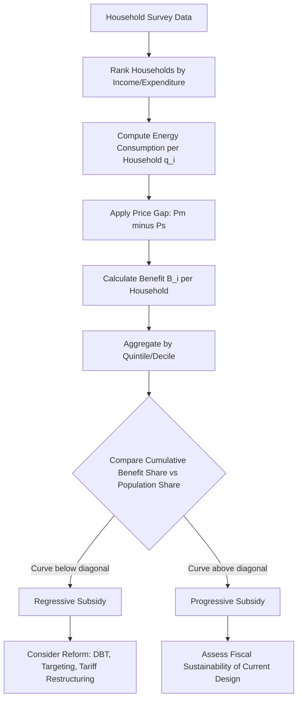

## Distributional Incidence of Energy Subsidies

### Conceptual Foundations

**Definition**

Distributional incidence analysis measures how the benefits and costs of energy subsidies are shared across different segments of a population, typically stratified by income level, geography (urban/rural), or household characteristics. The central question is: who actually captures the value of a subsidy, and does that pattern match the policy's stated distributional goals?

Energy subsidies commonly analyzed for incidence include:

- Fuel subsidies (gasoline, diesel, kerosene, LPG)
- Electricity tariff subsidies (below-cost pricing)
- Natural gas subsidies
- Renewable energy subsidies (feed-in tariffs, tax credits)
- Agricultural energy subsidies (irrigation electricity/diesel)

**Why Incidence Diverges from Intent**

Many energy subsidies are introduced under a welfare rationale — to protect low-income households from energy poverty — but consumption-based (quantity-linked) subsidies are regressive in absolute terms whenever richer households consume more of the subsidized good in absolute volume, even if they consume less as a share of income.

### Core Analytical Framework

**Benefit Incidence Equation**

The subsidy benefit captured by household $i$ is generally modeled as:

$$B_i = q_i \times (P_m - P_s)$$

Where:

- $B_i$ = subsidy benefit to household $i$
- $q_i$ = quantity of the energy good consumed by household $i$
- $P_m$ = market (unsubsidized/opportunity cost) price
- $P_s$ = subsidized price paid by the household

Aggregate subsidy cost is:

$$C = \sum_{i=1}^{n} q_i (P_m - P_s)$$

**Share of Total Benefits Captured by Decile/Quintile**

To assess distributional incidence, households are typically ranked by per-capita income or consumption expenditure and divided into quintiles (5 groups) or deciles (10 groups). The share captured by quintile $k$ is:

$$S_k = \frac{\sum_{i \in k} B_i}{\sum_{i=1}^{n} B_i} \times 100\%$$

**Key Points**

- A perfectly progressive subsidy would concentrate $S_k$ in the bottom quintiles.
- A perfectly regressive subsidy (in absolute terms) concentrates $S_k$ in the top quintiles.
- Empirically, most price-linked fossil fuel subsidies show $S_5$ (richest quintile) capturing several multiples of $S_1$ (poorest quintile), because richer households own more vehicles, larger homes, and higher-consuming appliances.

### Absolute vs. Relative Progressivity

Two distinct — and often conflated — dimensions of incidence must be separated:

1. **Absolute incidence**: How much of the total subsidy budget (in currency terms) goes to each group. Fossil fuel subsidies are almost universally regressive in this sense — the rich consume more liters of gasoline, more kWh of electricity, and more cubic meters of gas in absolute terms.
2. **Relative incidence**: The subsidy's value as a share of household income or total expenditure. Because energy is often a larger budget share for poor households (Engel curve effects for necessities like cooking fuel and basic electricity), some energy subsidies can be relatively progressive — i.e., proportionally more valuable to the poor — even while being absolutely regressive.

**Example**

Consider a diesel subsidy in a hypothetical economy:

| Quintile | Share of Total Diesel Subsidy Captured | Subsidy as % of Household Income |
| --- | --- | --- |
| Q1 (poorest) | 3% | 1.2% |
| Q2 | 6% | 1.0% |
| Q3 | 12% | 0.8% |
| Q4 | 24% | 0.6% |
| Q5 (richest) | 55% | 0.3% |

[Inference] The numeric pattern above is illustrative, constructed to demonstrate the typical qualitative shape found in real-world studies (e.g., IMF, World Bank fuel subsidy incidence analyses) rather than sourced from a specific dataset. Actual magnitudes vary substantially by country, fuel type, and vehicle ownership rates.

This table shows the diesel subsidy is absolutely regressive (Q5 captures 55% of total subsidy value) but relatively mildly progressive-to-neutral when scaled against income, since it is a larger share of Q1's income than Q5's.

### Diagrammatic Representation: The Subsidy Incidence Curve

The standard tool for visualizing incidence is analogous to a Lorenz curve, sometimes called a **concentration curve**, plotting cumulative population share (poorest to richest) against cumulative subsidy benefit share.

<svg xmlns="http://www.w3.org/2000/svg" viewBox="0 0 520 420" font-family="Arial, sans-serif">
<text x="260" y="24" text-anchor="middle" font-size="15" font-weight="bold">Subsidy Concentration Curve (svg_diagram)</text>

<line x1="70" y1="360" x2="470" y2="360" stroke="black" stroke-width="1.5" />
<line x1="70" y1="360" x2="70" y2="50" stroke="black" stroke-width="1.5" />

<text x="270" y="395" text-anchor="middle" font-size="12">Cumulative Population Share (Poorest → Richest)</text>

<text x="25" y="205" text-anchor="middle" font-size="12" transform="rotate(-90 25,205)">Cumulative Subsidy Benefit Share</text>

<text x="70" y="375" font-size="10" text-anchor="middle">0%</text>

<text x="470" y="375" font-size="10" text-anchor="middle">100%</text>

<text x="60" y="364" font-size="10" text-anchor="end">0%</text>

<text x="60" y="55" font-size="10" text-anchor="end">100%</text>

<line x1="70" y1="360" x2="470" y2="50" stroke="gray" stroke-width="1.5" stroke-dasharray="4,4" />
<text x="440" y="70" font-size="10" fill="gray">Line of Equality</text>

<path d="M70,360 C 200,350 300,320 470,50" fill="none" stroke="#c0392b" stroke-width="2.5" />
<text x="250" y="345" font-size="11" fill="#c0392b" font-weight="bold">Regressive (e.g., gasoline subsidy)</text>

<path d="M70,360 C 150,180 250,90 470,50" fill="none" stroke="#27ae60" stroke-width="2.5" />
<text x="150" y="150" font-size="11" fill="#27ae60" font-weight="bold">Progressive (e.g., targeted LPG subsidy)</text>

<circle cx="90" cy="360" r="3" fill="black" />
<circle cx="470" cy="50" r="3" fill="black" />
</svg>

**Interpretation**: A concentration curve lying below the 45-degree equality line indicates regressivity (the poorest $x\%$ of the population receives less than $x\%$ of subsidy benefits). A curve above the line indicates progressivity. The vertical distance between the curve and the diagonal, integrated across the distribution, yields a **concentration coefficient** analogous to the Gini coefficient, computed as:

$$CC = 1 - 2\int_0^1 L_B(p)\,dp$$

Where $L_B(p)$ is the concentration curve (cumulative benefit share as a function of cumulative population share $p$). $CC > 0$ indicates regressivity; $CC < 0$ indicates progressivity.

### Methodological Approaches

**1. Marginal Incidence vs. Average Incidence**

- **Average incidence**: Total benefit captured by a group relative to total subsidy spent — a static snapshot.
- **Marginal incidence**: How incidence changes if the subsidy program is expanded or contracted at the margin — relevant for reform sequencing decisions (e.g., would removing the last tier of a subsidized electricity block primarily affect rich or poor households?).

**2. Direct vs. Indirect Incidence**

- **Direct incidence**: Benefit from households' own direct consumption of the subsidized fuel/electricity.
- **Indirect incidence**: Benefit passed through via lower prices of goods and services that use the subsidized energy as an input (e.g., subsidized diesel lowering transport costs, which lowers food prices). Indirect incidence often has a different — sometimes more progressive — distributional profile than direct incidence, since poor households spend a larger income share on food and transport.

**3. Data and Estimation Methods**

- Household budget/expenditure surveys (e.g., Living Standards Measurement Study-type surveys) provide micro-level fuel and electricity consumption data used to compute $q_i$.
- Input-output tables are used to trace indirect incidence through production chains.
- Computable General Equilibrium (CGE) models capture second-round effects: price changes, wage adjustments, and behavioral responses to subsidy reform.
- Point-in-time incidence studies (like Benefit Incidence Analysis, BIA) are static; dynamic or CGE-based studies incorporate substitution effects.

### Why Consumption-Linked Subsidies Tend to Be Regressive

**Key Points**

- **Ownership effects**: Vehicle and appliance ownership (cars, air conditioners, generators) rises sharply with income, so fuel and electricity subsidies tied to purchase volume mechanically transfer more absolute value to wealthier households.
- **Block tariff design flaws**: Increasing Block Tariffs (IBTs) for electricity are meant to subsidize a low "lifeline" tier while pricing higher consumption near cost. In practice, incidence studies frequently find that even the lifeline block is not well-targeted because (a) multiple poor households sharing one connection lose the benefit of low first-tier rates, and (b) non-poor households with low individual consumption (e.g., small urban apartments) also capture the subsidized tier.
- **Access constraints**: In many developing economies, the poorest households lack grid electricity connections or LPG cylinders altogether, meaning they are entirely excluded from subsidies for goods they don't consume — a phenomenon sometimes called "the subsidy the poor never receive."
- **Kerosene as an exception**: Kerosene subsidies have historically shown relatively more progressive incidence in some contexts because kerosene is predominantly a poor-household fuel for lighting and cooking where electrification is incomplete — though diversion and adulteration (mixing with diesel for resale) commonly undermines even this targeting. [Unverified] The magnitude of diversion varies widely by country and enforcement regime and is difficult to measure precisely.

### Policy Instruments to Improve Distributional Incidence

**Targeting Mechanisms**

1. **Means-tested cash transfers**: Replace price subsidies with direct income transfers to identified poor households (e.g., Iran's 2010 subsidy reform, Indonesia's BLT/BLSM programs).
2. **Proxy-means testing**: Uses observable correlates of poverty (housing characteristics, asset ownership) to target transfers where full income data is unavailable.
3. **Self-targeting via product differentiation**: Subsidizing goods disproportionately consumed by the poor (e.g., small LPG cylinders vs. large ones, low-wattage appliances).
4. **Smart/biometric subsidy cards**: Direct Benefit Transfer (DBT) systems, such as India's PAHAL scheme for LPG, deposit subsidy value directly into beneficiary bank accounts rather than suppressing the retail price, which improves both fiscal transparency and targeting accuracy while also reducing black-market fuel diversion.
5. **Lifeline tariffs with connection caps**: Structuring the subsidized electricity block per connection with metering reform to prevent multi-household sharing that dilutes targeting.

**Reform Sequencing Considerations**

- Compensatory transfers should ideally be operational *before* price increases take effect, to avoid a welfare gap during transition.
- Communication and transparency about the fiscal savings redirected to compensation improves political acceptability.
- Gradual, pre-announced price adjustment paths reduce shock effects on both households and inflation expectations.

### Distributional Incidence and Cross-Subsidization in Electricity Tariffs

Electricity markets often use industrial and commercial tariffs priced above cost to cross-subsidize residential (especially lifeline) tariffs — a distinct incidence question from direct budgetary subsidies. Key considerations:

- **Incidence shifts to consumers of subsidizing sectors**: Cross-subsidy costs are typically passed through to industrial consumers, who in turn pass them to consumers of final goods, diffusing incidence across the broader economy rather than the state budget.
- **Competitiveness effects**: High industrial cross-subsidy burdens can reduce firm competitiveness, particularly in energy-intensive sectors, creating a trade-off between distributional and productive efficiency goals. [Inference] The magnitude of competitiveness impact depends heavily on the elasticity of energy intensity within the affected industries and the availability of alternative supply, making generalized quantification difficult without country/sector-specific data.

### Mermaid Diagram: Incidence Analysis Workflow

### Empirical Findings from Major Studies

**Key Points**

- IMF and World Bank cross-country incidence studies have repeatedly found that the top income quintile captures a disproportionately large share of total fossil fuel subsidy benefits relative to the bottom quintile across most surveyed low- and middle-income countries, driven primarily by transport fuel consumption patterns.
- Electricity subsidy incidence tends to be less regressive than transport fuel subsidy incidence in economies with high electrification rates, because electricity consumption is more evenly distributed across income groups than vehicle ownership.
- LPG subsidy incidence outcomes are highly design-dependent: universal price subsidies skew regressive, whereas well-implemented DBT-based cash transfer programs (conditional on LPG connection ownership) have shown improved targeting accuracy in some national contexts.

[Unverified] Specific percentage figures from named country studies are omitted here because incidence estimates are highly sensitive to survey year, methodology (BIA vs. CGE), and fuel type; readers requiring precise figures should consult the original IMF Working Papers, World Bank Poverty and Equity Global Practice reports, or national household expenditure survey-based studies for the specific country and year of interest.

### Common Pitfalls in Incidence Analysis

1. **Ignoring general equilibrium effects**: Static incidence analysis captures only the first-round direct benefit and misses price pass-through effects on non-energy goods.
2. **Conflating relative and absolute progressivity**: Policy debates frequently cite one measure while implying conclusions about the other.
3. **Using national averages that mask urban-rural disparities**: Rural populations often have different energy access profiles (e.g., no grid electricity, higher reliance on biomass or kerosene) that produce very different incidence patterns than urban populations.
4. **Static ownership assumptions**: Failing to model behavioral responses (e.g., how households might adjust fuel consumption or appliance purchases if subsidies were removed) can overstate the welfare loss from reform to poor households who may substitute toward alternatives.

### Related Topics

- Fossil fuel subsidy reform and fiscal sustainability
- Direct Benefit Transfer (DBT) systems: design and implementation
- Lorenz curves and Gini coefficient methodology
- Computable General Equilibrium (CGE) modeling for energy policy
- Energy poverty measurement and lifeline tariff design
- Carbon pricing and revenue recycling (as an alternative distributional tool)
- Political economy of subsidy reform and reform sequencing
- Benefit Incidence Analysis (BIA) methodology in public finance