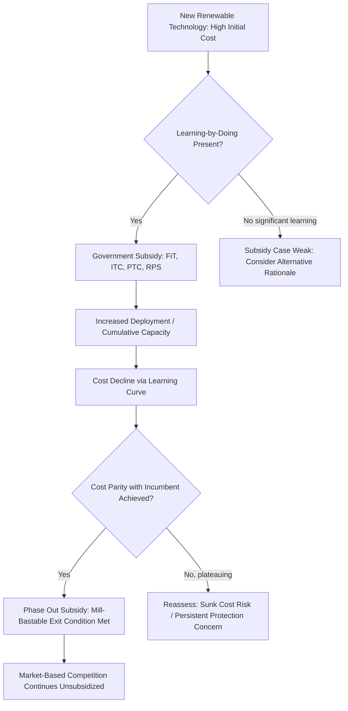

## Renewable Energy Subsidies and Infant Industry Arguments

### Conceptual Foundations

**The Infant Industry Argument: Classical Origins**

The infant industry argument, originally articulated by Alexander Hamilton and later formalized by Friedrich List, holds that new industries facing established competitors (domestic or foreign) may require temporary protection or support to achieve the scale, learning, and cost reductions necessary to become competitive. Applied to renewable energy, the argument holds that solar, wind, and other emerging technologies deserve temporary subsidization until they achieve cost parity with incumbent fossil fuel generation.

**Core Conditions for a Valid Infant Industry Case**

For the infant industry argument to hold as sound economic policy rather than permanent protectionism, several conditions are typically required:

1. **Learning-by-doing / dynamic economies of scale**: Costs must fall as cumulative production or installed capacity increases, not merely as static output increases.
2. **Externalities from learning that are not internalized by private firms**: If knowledge spillovers benefit competitors or future entrants who did not bear R&D costs, private firms will underinvest relative to the socially optimal level, justifying public support.
3. **Time-bound support with a credible exit**: The subsidy must plausibly become unnecessary once competitiveness is reached (the "Mill-Bastable test").
4. **Present value test**: The discounted future benefits (from reaching competitiveness) must exceed the discounted cost of the subsidy over the support period.

### The Mill-Bastable Test

Two economists formalized necessary conditions for legitimate infant industry protection:

- **Mill's test**: The industry must be able to demonstrate a genuine learning trajectory — evidence that costs will fall with experience.
- **Bastable's test**: The present value of future benefits (post-support competitiveness, spillovers, consumer surplus gains) must exceed the present value of the support costs.

$$PV(\text{Benefits}) = \sum_{t=1}^{T} \frac{B_t}{(1+r)^t} > \sum_{t=1}^{T} \frac{S_t}{(1+r)^t} = PV(\text{Subsidy Cost})$$

Where $B_t$ is the benefit stream after the industry matures, $S_t$ is the subsidy cost stream during the support period, $T$ is the support horizon, and $r$ is the discount rate.

**Key Points**

- Renewable energy is frequently cited as an unusually strong candidate for the infant industry argument because empirical cost declines have been large, well-documented, and driven substantially by manufacturing scale and learning rather than one-off innovations.
- Critics note that unlike classical infant industries (e.g., steel, automobiles) where protection often persisted indefinitely without competitiveness materializing, renewables have shown a comparatively clear cost trajectory that makes the exit condition more empirically testable.

### Learning Curves and Experience Effects

**The Learning Curve / Experience Curve Model**

The standard formalization of the learning-by-doing mechanism underlying the infant industry case is the power-law learning curve:

$$C_n = C_1 \cdot n^{-b}$$

Where:

- $C_n$ = cost of the $n$-th unit produced (or cost at cumulative capacity $n$)
- $C_1$ = cost of the first unit
- $n$ = cumulative production/installed capacity
- $b$ = learning elasticity, related to the **learning rate** $LR$ by $LR = 1 - 2^{-b}$

The learning rate $LR$ represents the percentage cost reduction for every doubling of cumulative production.

**Example**

Solar photovoltaic modules have historically exhibited a learning rate widely cited in the literature as being in the range of approximately 20–24% per doubling of cumulative installed capacity, meaning that module costs have fallen by roughly that percentage each time global cumulative deployment doubled. [Inference] Reported learning rates vary meaningfully depending on the study's time window, geographic scope, and whether module price or total system (balance-of-plant) cost is measured; treat any single point estimate as indicative rather than a fixed constant.

Applying the formula: if $C_1$ (relative unit cost at early cumulative capacity) $= 100$ and $b$ corresponds to a 20% learning rate ($LR = 0.20 \Rightarrow 2^{-b} = 0.80 \Rightarrow b \approx 0.322$), then at $n = 8$ (three doublings):

$$C_8 = 100 \times 8^{-0.322} \approx 100 \times 0.512 \approx 51.2$$

This confirms three successive 20% reductions: $100 \to 80 \to 64 \to 51.2$.

### Diagram: Learning Curve Cost Decline

<svg xmlns="http://www.w3.org/2000/svg" viewBox="0 0 520 380" font-family="Arial, sans-serif">
<text x="260" y="24" text-anchor="middle" font-size="15" font-weight="bold">Renewable Technology Learning Curve (svg_diagram)</text>
<line x1="70" y1="330" x2="470" y2="330" stroke="black" stroke-width="1.5" />
<line x1="70" y1="330" x2="70" y2="50" stroke="black" stroke-width="1.5" />

<text x="270" y="360" text-anchor="middle" font-size="12">Cumulative Installed Capacity (log scale)</text>

<text x="25" y="190" text-anchor="middle" font-size="12" transform="rotate(-90 25,190)">Unit Cost ($/W, log scale)</text>

<path d="M90,80 C 150,150 250,240 450,310" fill="none" stroke="#2980b9" stroke-width="2.5" />

<circle cx="150" cy="150" r="4" fill="#2980b9" />
<circle cx="230" cy="205" r="4" fill="#2980b9" />
<circle cx="310" cy="248" r="4" fill="#2980b9" />
<circle cx="390" cy="282" r="4" fill="#2980b9" />

<text x="150" y="140" font-size="10">n</text>

<text x="230" y="195" font-size="10">2n</text>

<text x="310" y="238" font-size="10">4n</text>

<text x="390" y="272" font-size="10">8n</text>

<text x="150" y="345" font-size="10" text-anchor="middle">n</text>

<text x="470" y="345" font-size="10" text-anchor="middle">8n</text>

<line x1="70" y1="260" x2="470" y2="260" stroke="#c0392b" stroke-width="1.5" stroke-dasharray="5,3" />
<text x="380" y="252" font-size="10" fill="#c0392b">Grid parity / cost floor threshold</text>
</svg>

### Rationale: Why Renewables Are Argued to Warrant Support

**Key Points**

1. **Positive externality of learning spillovers**: A firm or country that invests in early deployment generates cost reductions and technical knowledge that benefit later entrants globally, including competitors — a classic non-appropriable positive externality that justifies public subsidy to correct underinvestment.
2. **Correcting an existing distortion (fossil fuel externalities)**: Renewable subsidies are also frequently justified not purely as infant industry support but as a second-best correction for the failure to price carbon and other fossil fuel externalities (air pollution, climate damage) at their social cost. In this framing, the subsidy is a substitute instrument for a missing Pigouvian tax, distinct from the infant industry rationale.
3. **Network and grid-integration economies**: Early renewable deployment can catalyze complementary infrastructure (transmission upgrades, storage, smart grid technology, supply chains) whose costs also fall with experience, exhibiting economies of scale beyond the technology itself.
4. **Coordination and policy risk reduction**: Public support in early years can reduce investor risk perception in a nascent industry, mobilizing private capital that would otherwise be deterred by policy uncertainty or technology risk — an argument closer to a "de-risking" rationale than the traditional infant industry framework.

### Standard Policy Instruments

| Instrument | Mechanism | Distributional/Incidence Note |
| --- | --- | --- |
| Feed-in tariffs (FiT) | Guaranteed above-market price per kWh for a fixed contract period | Cost typically socialized via electricity bills; regressive if fixed charges dominate bills |
| Production Tax Credit (PTC) | Tax credit per kWh generated (e.g., US wind PTC) | Benefits accrue to project developers/investors; incidence depends on tax equity market structure |
| Investment Tax Credit (ITC) | Tax credit as a percentage of upfront capital cost | Favors capital-intensive technologies (solar) over ones with high ongoing costs |
| Renewable Portfolio Standards (RPS) with tradable certificates | Mandated minimum renewable share; compliance cost passed through | Cost incidence falls on ratepayers, potentially regressively depending on tariff design |
| Feed-in premiums | Fixed premium added to wholesale market price | Retains market price signal exposure, unlike fixed FiT |
| Contracts for Difference (CfD) | Government pays/receives difference between strike price and market price | Shifts price risk to government; incidence depends on strike price relative to market volatility |
| Direct capital grants/subsidized loans | Upfront cost reduction | Direct fiscal cost; incidence depends on funding source (general taxation vs. specific levy) |

### Mermaid Diagram: Infant Industry Support Logic Flow

### Critiques and Counterarguments

**Key Points**

1. **Governments cannot reliably pick winners**: Critics (following Baldwin's classic critique of infant industry protection) argue that policymakers lack the information to identify which technologies will actually achieve competitiveness, risking capture of subsidies by politically favored but economically unviable technologies.
2. **Subsidy persistence / political economy lock-in**: Once established, subsidies create constituencies (developers, manufacturers, landowners) with strong incentives to lobby for continuation even after the original learning-based justification has been satisfied — the central risk flagged by the "temporary means temporary" requirement of the Mill-Bastable test.
3. **First-mover vs. free-rider tension between countries**: Because learning spillovers are often global rather than national, a country funding early-stage deployment may subsidize learning that primarily benefits manufacturers in other countries (e.g., early European solar subsidies arguably accelerated cost declines captured disproportionately by manufacturers that scaled up production elsewhere). This creates an international coordination/free-rider problem distinct from the domestic learning rationale.
4. **Deadweight loss and superior alternative instruments**: Some economists argue that if the underlying justification is climate externality correction rather than infant industry learning, a technology-neutral carbon price is more efficient than technology-specific subsidies, since it lets relative costs — including any genuine learning advantages — determine the winning technologies without government selection risk.
5. **Measurement difficulty of "true" learning vs. exogenous input cost declines**: A portion of observed cost declines in solar and battery technology, for example, reflects declining input costs (polysilicon, lithium) driven by upstream commodity market dynamics rather than manufacturing learning per se, complicating attribution of cost declines specifically to the subsidized learning mechanism. [Inference] Disentangling learning-by-doing effects from input price declines, R&D spillovers, and economies of scale requires econometric decomposition that is sensitive to specification choice, so cited "learning rate" figures should be read as approximate, model-dependent estimates.

### Fiscal and Market Distortion Considerations

**Key Points**

- Subsidies funded through electricity bill surcharges (common for FiTs and RPS compliance costs) can be regressive, since electricity expenditure typically constitutes a larger income share for lower-income households — connecting this topic directly to the distributional incidence concerns covered under general energy subsidy analysis.
- Merit-order effects: Subsidized renewable generation with near-zero marginal cost can depress wholesale electricity prices when dispatched (the "merit order effect"), which benefits consumers but can undermine the economics of both subsidized and unsubsidized generators, complicating market design and requiring capacity mechanisms or contract structures to maintain investment incentives.
- Intermittency-related system costs (balancing, reserve capacity, transmission expansion) are frequently excluded from direct subsidy accounting but represent a real distributional and fiscal cost that shifts across the system as renewable penetration rises.

### Empirical Evidence on Cost Trajectories

Solar PV and onshore/offshore wind have both shown substantial and sustained levelized cost of electricity (LCOE) declines over the past two decades, commonly cited in reports from bodies such as IRENA and Lazard's Levelized Cost of Energy Analysis, with solar PV LCOE reductions being particularly steep relative to most conventional generation technologies over the same period. [Unverified] Precise LCOE percentage decline figures are omitted here because they vary by publication year, region, financing assumptions, and capacity factor inputs; consult the most recent IRENA Renewable Power Generation Costs report or Lazard LCOE report for current figures specific to a given year and technology.

This empirical trajectory is central to the policy debate: proponents argue it retroactively validates the infant industry case (learning occurred, competitiveness was reached in many markets, and some jurisdictions have indeed phased down direct subsidies as renewables reached or approached grid parity), while critics note that subsidy levels in many jurisdictions have not been correspondingly reduced in line with cost declines, raising the concern that support has outlived its original justification.

### Distinguishing Infant Industry Rationale from Externality Correction

A recurring conceptual confusion in policy debate is treating renewable subsidies as justified by a single rationale, when in practice two distinct economic justifications are often bundled:

$$\text{Total Justified Subsidy} = \underbrace{\tau_{\text{learning}}}_{\text{infant industry externality}} + \underbrace{\tau_{\text{carbon}}}_{\text{unpriced climate/pollution externality}}$$

Where $\tau_{\text{learning}}$ should theoretically phase toward zero as the technology matures (satisfying Mill-Bastable), while $\tau_{\text{carbon}}$ should persist as long as the fossil fuel externality remains unpriced elsewhere in the economy (e.g., via a carbon tax or emissions trading scheme). Conflating the two can lead to either premature subsidy withdrawal (ignoring the persistent externality correction need) or unjustified permanent protection (treating a temporary learning subsidy as though it addresses a permanent externality).

### Related Topics

- Distributional incidence of energy subsidies
- Carbon pricing: taxes vs. cap-and-trade as alternative/complementary instruments
- Merit-order effect and wholesale electricity market design
- Levelized Cost of Energy (LCOE) methodology
- Learning curves and technology diffusion theory
- Feed-in tariff design and cost-recovery mechanisms
- Political economy of subsidy capture and rent-seeking
- Fossil fuel subsidy reform and phase-out sequencing
- Renewable Portfolio Standards and tradable renewable energy certificates (RECs)