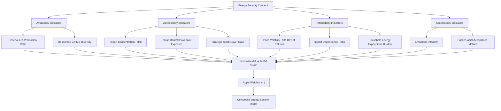

## Defining and Measuring Energy Security

### Conceptual Foundations

**Definition Challenges**

Energy security lacks a single universally accepted definition, largely because the concept spans multiple dimensions and stakeholder perspectives (consumer nations, producer nations, utilities, households). The most widely cited working definition, from the International Energy Agency (IEA), frames energy security as the uninterrupted availability of energy sources at an affordable price. This deceptively simple statement embeds two distinct core concerns:

1. **Availability** (physical/supply dimension): Adequate quantity of energy is physically accessible when needed.
2. **Affordability** (price dimension): Energy is accessible at prices that do not impose undue economic burden.

**Key Points**

- Energy security is typically decomposed further into **short-term security** (resilience to sudden supply disruptions, price spikes, or system failures) and **long-term security** (timely investment to meet future demand growth and sustainable resource/environmental needs).
- The concept is inherently multi-dimensional; no single indicator fully captures it, which is why measurement frameworks typically use composite indices rather than single metrics.

### The "Four A's" Framework

A widely used analytical decomposition, particularly in Asia-Pacific energy policy literature (e.g., APERC — Asia Pacific Energy Research Centre), breaks energy security into four dimensions:

| Dimension | Definition | Example Indicators |
| --- | --- | --- |
| **Availability** | Physical existence of energy resources/reserves | Reserves-to-production ratio, resource diversity |
| **Accessibility** | Geopolitical and infrastructural ability to obtain energy | Import route diversity, transit chokepoint exposure, infrastructure capacity |
| **Affordability** | Economic capacity to pay for energy without undue burden | Energy price volatility, energy expenditure as % of GDP/income |
| **Acceptability** | Environmental and social acceptability of energy sources/use | Emissions intensity, public acceptance of energy infrastructure |

**Key Points**

- The fourth "A" (Acceptability) reflects the growing integration of energy security analysis with climate and environmental policy, sometimes called the "energy trilemma" when Acceptability is merged with sustainability considerations alongside security and affordability.
- Some frameworks (notably the World Energy Council's Energy Trilemma Index) collapse this into three pillars: **Energy Security, Energy Equity (affordability/accessibility), and Environmental Sustainability**, explicitly treating them as a trilemma with inherent trade-offs.

### Dimensions of Vulnerability

**Supply-Side Vulnerability**

Concentration of supply sources creates vulnerability to disruption. The standard economic tool for measuring concentration, borrowed from industrial organization economics, is the **Herfindahl-Hirschman Index (HHI)**, adapted for energy import/supply diversification:

$$HHI = \sum_{i=1}^{n} s_i^2$$

Where $s_i$ is the market share (or import share) of supplier/source $i$, expressed as a decimal or percentage. Applied to energy security:

$$HHI_{energy} = \sum_{i=1}^{n} \left(\frac{Q_i}{Q_{total}}\right)^2$$

Where $Q_i$ is the quantity of energy (e.g., crude oil, natural gas) imported from source country $i$, and $Q_{total}$ is total imports.

**Example**

A country importing oil entirely from a single source has $HHI = 1.0$ (or 10,000 on the 0–10,000 scale), representing maximum concentration risk. A country importing equally from 10 sources has:

$$HHI = 10 \times (0.10)^2 = 10 \times 0.01 = 0.10$$

(or 1,000 on the 0–10,000 scale), representing much lower concentration risk. Generally, an $HHI$ below approximately 0.15 (1,500) is considered indicative of a reasonably diversified, lower-risk supply portfolio, while values above approximately 0.25 (2,500) are considered highly concentrated. [Inference] These threshold conventions are adapted from antitrust/market-concentration practice; there is no single formally agreed energy-security-specific HHI threshold, and different institutions apply somewhat different cutoffs.

**Diversification Beyond Source Countries**

A comprehensive supply security assessment also considers:

- **Fuel-type diversification** (diversity across coal, gas, oil, nuclear, renewables in the primary energy mix)
- **Route/transit diversification** (pipeline routes, shipping lanes, chokepoints such as the Strait of Hormuz or the Strait of Malacca)
- **Supplier diversification within the same country** (multiple firms/fields rather than a single dominant supplier)

### Diagram: Energy Security Dimensions Map

<svg xmlns="http://www.w3.org/2000/svg" viewBox="0 0 520 420" font-family="Arial, sans-serif">
<text x="260" y="24" text-anchor="middle" font-size="15" font-weight="bold">Energy Security: Four Dimensions (svg_diagram)</text>
<circle cx="260" cy="220" r="70" fill="#eef6fb" stroke="#2980b9" stroke-width="2" />
<text x="260" y="215" text-anchor="middle" font-size="12" font-weight="bold">Energy</text>
<text x="260" y="230" text-anchor="middle" font-size="12" font-weight="bold">Security</text>

<circle cx="130" cy="100" r="65" fill="none" stroke="#27ae60" stroke-width="2" />
<text x="130" y="95" text-anchor="middle" font-size="12" font-weight="bold" fill="#27ae60">Availability</text>
<text x="130" y="112" text-anchor="middle" font-size="9">Reserves, resource</text>
<text x="130" y="124" text-anchor="middle" font-size="9">diversity</text>

<circle cx="390" cy="100" r="65" fill="none" stroke="#e67e22" stroke-width="2" />
<text x="390" y="95" text-anchor="middle" font-size="12" font-weight="bold" fill="#e67e22">Accessibility</text>
<text x="390" y="112" text-anchor="middle" font-size="9">Import routes,</text>
<text x="390" y="124" text-anchor="middle" font-size="9">chokepoints</text>

<circle cx="130" cy="340" r="65" fill="none" stroke="#c0392b" stroke-width="2" />
<text x="130" y="335" text-anchor="middle" font-size="12" font-weight="bold" fill="#c0392b">Affordability</text>
<text x="130" y="352" text-anchor="middle" font-size="9">Price volatility,</text>
<text x="130" y="364" text-anchor="middle" font-size="9">expenditure share</text>

<circle cx="390" cy="340" r="65" fill="none" stroke="#8e44ad" stroke-width="2" />
<text x="390" y="335" text-anchor="middle" font-size="12" font-weight="bold" fill="#8e44ad">Acceptability</text>
<text x="390" y="352" text-anchor="middle" font-size="9">Emissions,</text>
<text x="390" y="364" text-anchor="middle" font-size="9">public acceptance</text>

<line x1="180" y1="150" x2="220" y2="180" stroke="#999" stroke-width="1" />
<line x1="340" y1="150" x2="300" y2="180" stroke="#999" stroke-width="1" />
<line x1="180" y1="290" x2="220" y2="260" stroke="#999" stroke-width="1" />
<line x1="340" y1="290" x2="300" y2="260" stroke="#999" stroke-width="1" />
</svg>

### Quantitative Measurement Approaches

**1. Composite Index Methods**

Because no single indicator suffices, most institutional measurement frameworks construct **composite indices** by normalizing and weighting multiple sub-indicators. General form:

$$ESI = \sum_{j=1}^{m} w_j \cdot I_j$$

Where $ESI$ is the composite Energy Security Index, $I_j$ is the normalized value of sub-indicator $j$ (e.g., import dependence, HHI, price volatility, stock cover days), and $w_j$ is the weight assigned to that sub-indicator, with $\sum w_j = 1$.

**Key Points**

- Weight selection is inherently normative and contested — different institutions (IEA, APERC, World Energy Council, individual national governments) apply different weighting schemes, making cross-index comparison difficult.
- Common practice normalizes each sub-indicator to a 0–1 or 0–100 scale using min-max normalization before weighting: $I_j^{norm} = \frac{x_j - x_{min}}{x_{max} - x_{min}}$.

**2. Import Dependence Ratio**

A simple and widely reported single-dimension metric:

$$ID = \frac{\text{Net Energy Imports}}{\text{Total Primary Energy Supply (TPES)}} \times 100\%$$

Higher values indicate greater reliance on external supply and, all else equal, greater exposure to external disruption or price shocks — though this metric alone does not capture route diversity, political stability of suppliers, or substitutability.

**3. Strategic Stock Cover (Days of Import Cover)**

Widely used for oil security specifically, following the framework established by the International Energy Agency's original mandate:

$$\text{Days of Cover} = \frac{\text{Strategic Petroleum Reserve Volume}}{\text{Average Daily Net Imports}}$$

IEA member countries are obligated to hold strategic reserves equivalent to at least 90 days of net oil imports, a benchmark that has functioned as the standard reference point for oil supply security assessment since the IEA's founding after the 1973 oil crisis.

**4. Price Volatility Measures**

Energy price volatility is typically measured using the standard deviation or coefficient of variation of returns over a rolling window:

$$\sigma = \sqrt{\frac{1}{T-1}\sum_{t=1}^{T}(r_t - \bar{r})^2}$$

Where $r_t = \ln(P_t / P_{t-1})$ is the log return of the energy price series at time $t$. Higher $\sigma$ indicates greater price instability, which is a key affordability/security risk factor even when physical supply is not disrupted.

**5. Energy Expenditure Burden**

$$EEB = \frac{\text{Household Energy Expenditure}}{\text{Household Income}} \times 100\%$$

Widely used at the household level to assess **energy poverty/vulnerability**, closely related to but conceptually distinct from national-level energy security. A commonly cited (though not universal) threshold classifies a household as being in "fuel poverty" when $EEB$ exceeds approximately 10%, originating from UK fuel poverty policy analysis. [Unverified] Threshold conventions vary substantially by country and have been revised over time (e.g., the UK shifted toward a "Low Income High Cost" and later "Low Income Low Energy Efficiency" metric); the 10% threshold should be treated as one specific national historical convention rather than a universal standard.

### Mermaid Diagram: Energy Security Measurement Architecture

### Institutional Frameworks in Practice

**Key Points**

- **IEA Model of Short-Term Energy Security (MOSES)**: Focuses on short-term supply disruption risk, distinguishing between risks external to the energy system (e.g., geopolitical, weather) and the resilience characteristics of the system itself (e.g., infrastructure redundancy, storage capacity).
- **APERC Four A's Framework**: As detailed above, widely used in Asia-Pacific regional policy analysis and benchmarking across member economies.
- **World Energy Council Energy Trilemma Index**: Ranks countries annually on a composite balancing energy security, energy equity, and environmental sustainability, explicitly acknowledging that improvements in one dimension may involve trade-offs in another.
- **US Chamber of Commerce Global Energy Institute International Index of Energy Security Risk**: A composite index tracking energy security risk trends over time for major energy-consuming and producing countries, incorporating indicators across supply risk, geopolitical risk, price/market risk, and environmental/economic risk categories.

[Unverified] Specific current-year rankings, index values, or country placements from these frameworks are not reproduced here, as they are updated annually/periodically and any cited figure would need verification against the most recent publication from the issuing institution.

### Trade-offs and Analytical Tensions

**Key Points**

- **Security vs. cost efficiency trade-off**: Diversifying suppliers, holding strategic reserves, and building redundant infrastructure all carry direct costs; pure market efficiency (least-cost sourcing) can conflict with resilience-maximizing diversification.
- **Security vs. sustainability trade-off**: Domestic fossil fuel resource development can improve short-term availability/accessibility scores while conflicting with the "Acceptability"/sustainability dimension, illustrating the trilemma structure.
- **Static vs. dynamic security**: A supply mix that appears secure today (e.g., low import dependence via aging domestic fields) may face long-term security deterioration if reserves are depleting without adequate reinvestment — highlighting why measurement frameworks distinguish short-term from long-term security.
- **National vs. household-level security**: A country can score well on national-level composite energy security indices while significant population segments experience energy poverty, since national aggregates can mask distributional variation — connecting this topic to household-level energy affordability and subsidy incidence analysis.

### Common Pitfalls in Energy Security Measurement

1. **Treating import dependence as a sufficient proxy alone**: High import dependence from stable, diversified, allied suppliers via redundant routes may pose less actual risk than lower import dependence concentrated in a single unstable source or chokepoint.
2. **Static indices in a dynamic geopolitical environment**: Composite indices calculated periodically (annually) can lag rapidly evolving geopolitical risk (e.g., sudden sanctions, conflict-driven route closures).
3. **Weighting subjectivity presented as objective scoring**: Composite index rankings are sometimes reported without adequate transparency about the normative weighting choices embedded in their construction, which can materially affect country rankings.
4. **Conflating energy security with energy independence**: Self-sufficiency (zero imports) is not equivalent to security; a country can be more secure with diversified imports than with concentrated but "independent" domestic supply subject to different risks (e.g., climate/production shocks).

### Related Topics

- Model of Short-Term Energy Security (MOSES) methodology
- Strategic Petroleum Reserves: economics and release mechanisms
- Energy trilemma: security, equity, and sustainability trade-offs
- Herfindahl-Hirschman Index applications in energy market concentration
- Energy poverty and household vulnerability measurement
- Geopolitics of energy transit chokepoints
- Oil price shocks and macroeconomic transmission channels
- Distributional incidence of energy subsidies