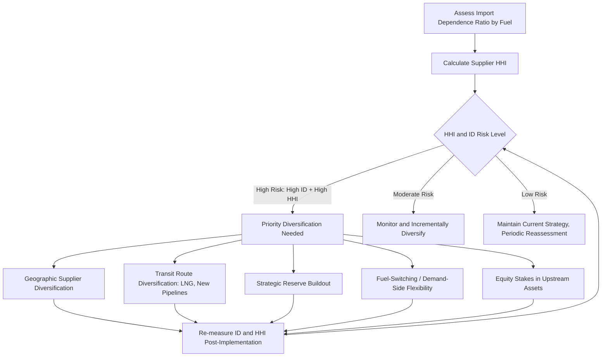

## Import Dependence and Diversification Strategies

### Conceptual Foundations

**Import Dependence Defined**

Import dependence measures the extent to which a country relies on external sources to meet its domestic energy consumption needs. It is the foundational vulnerability metric underlying most energy security frameworks, since reliance on foreign supply exposes a country to risks outside its direct policy control: geopolitical disruption, price manipulation by suppliers, transit interference, and supplier-country instability.

**Core Formula**

$$ID = \frac{M - X}{TPES} \times 100\%$$

Where:

- $ID$ = import dependence ratio
- $M$ = gross energy imports
- $X$ = gross energy exports (relevant for countries that both import and export the same energy carrier, e.g., re-exporting refined products while importing crude)
- $TPES$ = Total Primary Energy Supply (domestic production + net imports ± stock changes)

A value of $ID = 100\%$ indicates total reliance on imports for net consumption; $ID = 0\%$ indicates full self-sufficiency; negative values indicate net export status.

**Key Points**

- Import dependence can be calculated for total primary energy or disaggregated by fuel type (oil import dependence, gas import dependence, coal import dependence), which is analytically more useful since risk exposure differs substantially by fuel.
- A country can have low aggregate energy import dependence while having very high dependence in a single critical fuel (e.g., near-total oil import dependence despite domestic coal or renewable resources), so aggregate figures can mask concentrated vulnerability.

### Why Import Dependence Alone Is an Incomplete Risk Measure

**Key Points**

- **Source diversity matters more than the raw dependence ratio**: A country importing 80% of its gas from ten diverse, stable suppliers via multiple routes may face lower effective risk than a country importing 40% from a single unstable supplier via one pipeline.
- **Substitutability and storage buffer risk**: The ease of switching fuels or suppliers, and the availability of strategic reserves, both mediate how a given dependence ratio translates into actual disruption risk.
- **Contractual structure**: Long-term take-or-pay contracts with price indexation formulas behave differently under stress than spot-market-exposed purchases, affecting both price and volume risk profiles.

This is why import dependence is typically paired with concentration measures (see below) rather than used in isolation.

### Measuring Supply Concentration: The HHI Approach

As with the broader energy security measurement framework, import concentration is standardly measured with the **Herfindahl-Hirschman Index (HHI)** applied to supplier shares:

$$HHI = \sum_{i=1}^{n}\left(\frac{Q_i}{Q_{total}}\right)^2 \times 10{,}000$$

Where $Q_i$ is import volume from supplier country $i$ and $Q_{total}$ is total imports of that fuel. On the conventional 0–10,000 scale:

- $HHI < 1{,}500$: unconcentrated/diversified supply base
- $1{,}500 \le HHI \le 2{,}500$: moderately concentrated
- $HHI > 2{,}500$: highly concentrated

**Example**

Suppose Country A imports natural gas as follows: Supplier 1 = 45%, Supplier 2 = 30%, Supplier 3 = 15%, Supplier 4 = 10%.

$$HHI = (45^2 + 30^2 + 15^2 + 10^2) = 2{,}025 + 900 + 225 + 100 = 3{,}250$$

This falls in the "highly concentrated" range, indicating significant supplier concentration risk despite having four nominal suppliers — illustrating that supplier *count* alone is a poor proxy; the *distribution* of shares matters.

### The Import Dependence–Diversification Risk Matrix

<svg xmlns="http://www.w3.org/2000/svg" viewBox="0 0 520 420" font-family="Arial, sans-serif">
<text x="260" y="24" text-anchor="middle" font-size="15" font-weight="bold">Import Dependence vs. Supplier Concentration Risk (svg_diagram)</text>
<line x1="80" y1="360" x2="470" y2="360" stroke="black" stroke-width="1.5" />
<line x1="80" y1="360" x2="80" y2="50" stroke="black" stroke-width="1.5" />

<text x="275" y="392" text-anchor="middle" font-size="12">Import Dependence Ratio (ID) →</text>

<text x="30" y="205" text-anchor="middle" font-size="12" transform="rotate(-90 30,205)">Supplier Concentration (HHI) →</text>

<line x1="275" y1="50" x2="275" y2="360" stroke="#bbb" stroke-width="1" stroke-dasharray="4,3" />
<line x1="80" y1="205" x2="470" y2="205" stroke="#bbb" stroke-width="1" stroke-dasharray="4,3" />

<rect x="90" y="60" width="175" height="130" fill="#eafaf1" stroke="none" />
<text x="177" y="120" text-anchor="middle" font-size="11" font-weight="bold" fill="#27ae60">Low Risk</text>
<text x="177" y="136" text-anchor="middle" font-size="9">Low dependence,</text>
<text x="177" y="148" text-anchor="middle" font-size="9">diversified suppliers</text>
<rect x="285" y="60" width="175" height="130" fill="#fdf2e3" stroke="none" />
<text x="372" y="120" text-anchor="middle" font-size="11" font-weight="bold" fill="#e67e22">Moderate Risk</text>
<text x="372" y="136" text-anchor="middle" font-size="9">High dependence,</text>
<text x="372" y="148" text-anchor="middle" font-size="9">but diversified</text>
<rect x="90" y="215" width="175" height="130" fill="#fdf2e3" stroke="none" />
<text x="177" y="275" text-anchor="middle" font-size="11" font-weight="bold" fill="#e67e22">Moderate Risk</text>
<text x="177" y="291" text-anchor="middle" font-size="9">Low dependence,</text>
<text x="177" y="303" text-anchor="middle" font-size="9">but concentrated</text>
<rect x="285" y="215" width="175" height="130" fill="#fbe9e7" stroke="none" />
<text x="372" y="275" text-anchor="middle" font-size="11" font-weight="bold" fill="#c0392b">High Risk</text>
<text x="372" y="291" text-anchor="middle" font-size="9">High dependence,</text>
<text x="372" y="303" text-anchor="middle" font-size="9">concentrated suppliers</text>
</svg>

**Interpretation**: The upper-right quadrant (high import dependence combined with high supplier concentration) represents the most acute security exposure — this is the profile most commonly cited in analyses of countries heavily reliant on a single pipeline gas supplier, for instance.

### Diversification Strategies

**1. Geographic Supplier Diversification**

Actively contracting supply from multiple countries/regions to reduce $HHI$. Constraints include:

- Infrastructure lock-in (existing pipelines fix geography; new sources may require new infrastructure with long lead times and high capital costs)
- Political/trade relationship availability (diversification options are bounded by which supplier relationships are diplomatically and commercially viable)

**2. Fuel-Type Diversification (Energy Mix Diversification)**

Reducing dependence on any single fuel by broadening the primary energy mix — e.g., expanding nuclear, renewables, and domestic coal or gas alongside imported oil, so that a disruption in one fuel market does not cripple the entire energy system.

$$\text{Shannon-Wiener Diversity Index: } H = -\sum_{i=1}^{n} p_i \ln(p_i)$$

Where $p_i$ is the share of fuel type $i$ in TPES. This index, adapted from ecology, is sometimes used as an alternative or complement to HHI-based concentration measures because it is more sensitive to the presence of many small shares rather than dominated by the largest share alone. Higher $H$ indicates greater diversity.

**3. Transit Route Diversification**

Developing multiple physical pathways (pipelines, LNG terminals, shipping routes) so that disruption of any single route (e.g., chokepoint closure, pipeline sabotage, transit-country conflict) does not eliminate supply entirely. LNG import capacity is particularly significant here because it substitutes pipeline-route dependency with globally fungible seaborne supply, converting a fixed-geography risk into a more flexible, market-based one — at the cost of exposure to global LNG price volatility and liquefaction/regasification infrastructure requirements.

**4. Strategic Reserves and Storage**

Building buffer stocks (Strategic Petroleum Reserves, gas storage facilities) that can be drawn down during a supply disruption, providing a temporal diversification mechanism — buying time for demand response or alternative sourcing rather than reducing structural dependence itself.

**5. Demand-Side Diversification (Reducing Reliance via Substitution)**

Reducing the criticality of any specific imported fuel through:

- Fuel switching capability (dual-fuel power plants, flexible industrial processes)
- Energy efficiency improvements reducing absolute volume exposure
- Electrification paired with domestic generation diversity, shifting end-use demand away from directly imported fuels toward electricity that can be generated from a more diversified domestic mix

**6. Vertical Integration and Equity Stakes**

Consumer countries or their state-owned enterprises acquiring equity stakes in upstream production assets abroad, which can provide both a hedge against price volatility (netting back profits from ownership) and improved information/relationship access, though it does not eliminate physical supply risk during acute disruptions and introduces its own geopolitical and commercial exposure.

### Mermaid Diagram: Diversification Strategy Decision Framework

### Trade-offs in Diversification Policy

**Key Points**

1. **Cost of diversification vs. least-cost sourcing**: Diversification frequently means paying a premium over the cheapest available single source (e.g., contracting multiple LNG suppliers at varying prices rather than the lowest-cost pipeline gas alone), representing an explicit security-cost trade-off analogous to an insurance premium.
2. **Infrastructure lead times and lock-in**: Pipelines and LNG terminals involve multi-decade asset lives and long construction lead times, meaning diversification decisions taken today lock in supply architecture for a long horizon, creating risk if geopolitical alignments or resource availability shift within that period. [Inference] The specific economically optimal degree of diversification is not derivable from a general formula alone; it depends on country-specific risk aversion, fiscal capacity, and the shape of the disruption probability distribution, which is why diversification targets are typically set through political/administrative judgment rather than a single optimization rule in practice.
3. **Diversification vs. domestic production incentives**: Policies that heavily promote import diversification can sometimes compete for investment attention and capital against policies that would instead expand domestic production or renewable capacity, requiring coordination across energy policy instruments.
4. **Geopolitical diversification limits**: Diversification away from certain suppliers is sometimes politically motivated (sanctions compliance, reducing leverage of adversarial states) rather than purely risk-return optimized, which can raise the effective cost of diversification above what a pure commercial risk model would suggest.

### Historical and Structural Examples of Diversification Responses

**Key Points**

- Post-1973 oil crisis, IEA member countries collectively developed the strategic petroleum reserve system and coordinated demand restraint mechanisms specifically as a diversification-adjacent response to concentrated OPEC supplier leverage.
- European natural gas policy in the years following major pipeline-supply disruptions has emphasized LNG import terminal expansion, interconnector pipelines between member states, and reverse-flow capability as core diversification tools, illustrating the route-diversification and fuel-flexibility strategies described above in a real institutional context. [Unverified] Specific capacity figures, timelines, and country-level details of these initiatives are not included here as they are subject to frequent updates; consult current European Commission or national energy ministry publications for up-to-date figures.

### Common Pitfalls in Diversification Analysis

1. **Confusing supplier count with genuine diversification**: As shown in the HHI example above, a larger number of nominal suppliers does not guarantee low concentration risk if volumes remain skewed toward one or two dominant sources.
2. **Ignoring correlated supply risk**: Suppliers that appear geographically distinct may share correlated risk factors (e.g., reliance on the same transit chokepoint, exposure to the same regional conflict), reducing the effective diversification benefit below what a naive count or even HHI calculation might suggest.
3. **Static assessment of a dynamic geopolitical landscape**: Diversification adequacy assessed at one point in time can become outdated quickly if supplier relationships shift; periodic reassessment is necessary, as reflected in the feedback loop in the decision framework diagram above.
4. **Overlooking downstream/refining bottlenecks**: For refined products, upstream crude diversification does not address concentration risk in refining capacity or product-specific transport infrastructure, which can constitute an independent bottleneck.

### Related Topics

- Defining and measuring energy security
- Herfindahl-Hirschman Index applications in energy market concentration
- Strategic Petroleum Reserves: economics and release mechanisms
- LNG market structure and price formation
- Geopolitics of energy transit chokepoints
- Oil price shocks and macroeconomic transmission channels
- Energy trilemma: security, equity, and sustainability trade-offs
- Vertical integration and resource nationalism in energy markets