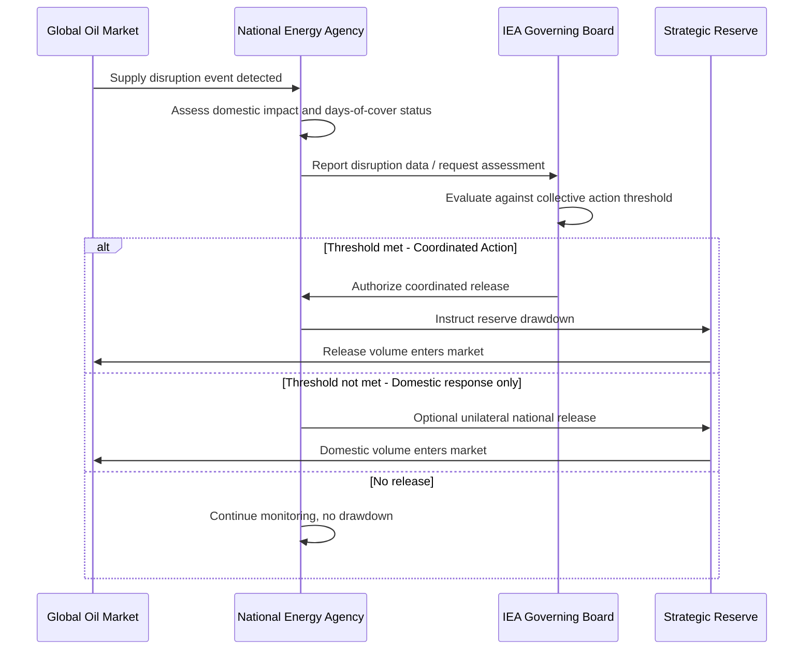

## Strategic Reserves and Emergency Response Mechanisms

### Conceptual Foundations

**Purpose and Economic Rationale**

Strategic reserves are government-mandated or government-held stockpiles of energy commodities — predominantly crude oil and refined petroleum products, though the concept extends to natural gas storage and, in some contexts, coal or critical minerals — held specifically to buffer against supply disruptions. The core economic rationale rests on the recognition that energy markets, left alone, may **underinvest in emergency storage** relative to the socially optimal level, because:

1. **Public good characteristics of supply security**: The stability benefit of reserves accrues broadly to the economy (avoided recession, price stability, national security), while the cost of holding reserves falls on whoever stores them — creating a free-rider problem if storage is left purely to private commercial incentives.
2. **Short-term private incentives diverge from long-term social value**: Private firms optimize storage for expected commercial arbitrage (storing when prices are low, selling when high), not for national security contingencies, which may require holding stock even when private economics would favor drawing it down.
3. **Information and coordination failures**: Individual firms lack the coordination and mandate to organize a market-wide response during a systemic disruption, which requires centralized or coordinated release mechanisms.

### Institutional Architecture

**The IEA System**

The International Energy Agency, established in 1974 in direct response to the 1973 oil crisis, created the foundational modern framework for strategic reserves among its member (and now broader "family" of associated) countries. The central obligation:

**Key Points**

- IEA member countries are required to hold oil stocks equivalent to at least 90 days of the prior year's net oil imports.
- Stocks can be held as government-controlled strategic reserves, mandated industry/commercial obligations, or a hybrid of both, depending on national implementation choice.
- The IEA can authorize a **coordinated stock release** among member countries during a recognized supply disruption, historically triggered by events such as the 1991 Gulf War, Hurricane Katrina in 2005, and the 2011 Libyan crisis-related disruption.

**National Reserve Systems**

Different countries implement the storage obligation through varying institutional structures:

| Model | Description | Example Approach |
| --- | --- | --- |
| Government-owned reserve | State directly owns and manages physical stockpile | US Strategic Petroleum Reserve (SPR) |
| Industry-mandated stockholding | Private companies required by law to hold minimum stock levels | Common across several European IEA members |
| Agency-based stockholding | A dedicated public/quasi-public agency holds stock on behalf of the state or industry | Used in some European stockholding-agency models |
| Hybrid | Combination of government-owned and industry-mandated stock | Common in practice across many IEA members |

[Inference] The precise institutional mix (government vs. industry-held share) varies by country and is periodically revised through national legislation; readers requiring the current specific obligation structure of a given country should consult that country's energy ministry or the IEA's country profile publications directly, since these details change over time.

### Formal Measurement: Days of Supply Cover

$$\text{Days of Cover} = \frac{\text{Reserve Volume (barrels or equivalent)}}{\text{Average Daily Net Imports (or Consumption)}}$$

This is the standard operational metric used both for compliance monitoring (verifying the 90-day IEA obligation) and for assessing how long a reserve could sustain the economy through a disruption before depletion, holding the drawdown rate constant.

**Example**

A country with net oil imports averaging 2 million barrels per day and a strategic reserve of 300 million barrels has:

$$\text{Days of Cover} = \frac{300{,}000{,}000}{2{,}000{,}000} = 150 \text{ days}$$

This exceeds the 90-day IEA minimum by a comfortable margin, providing additional buffer capacity for prolonged or compounding disruptions.

### Release Mechanisms and Triggers

**Types of Reserve Release**

1. **Coordinated IEA collective action**: Triggered when the IEA Governing Board determines a significant supply disruption exists (historically defined with reference to a threshold loss of net available oil supply). Member countries release stock in a pre-agreed coordinated fashion to supplement market supply and dampen price spikes.
2. **Unilateral national releases**: A single country's government authorizes a release from its own strategic reserve independent of IEA-coordinated action, often used for domestic price management or in response to a nationally specific disruption (e.g., a domestic refinery outage, hurricane damage to Gulf Coast infrastructure).
3. **Test/exchange releases**: Non-emergency releases conducted for periodic stock rotation, quality maintenance, or in exchange arrangements with private companies (loan-and-return mechanisms) — these are distinct from genuine emergency responses and generally do not require IEA collective action determination.

**Key Points**

- Release decisions involve a trade-off between depleting a limited buffer (reducing resilience to a subsequent or prolonged disruption) and providing near-term price/supply relief.
- The credibility and speed of release mechanisms matter as much as the reserve volume itself — a large reserve with slow or politically constrained release authority provides less effective market stabilization than a smaller reserve with rapid, credible release capability.

### Diagram: Strategic Reserve System Architecture

<svg xmlns="http://www.w3.org/2000/svg" viewBox="0 0 540 420" font-family="Arial, sans-serif">
<text x="270" y="24" text-anchor="middle" font-size="15" font-weight="bold">Strategic Reserve and Release Architecture (svg_diagram)</text>

<rect x="70" y="60" width="160" height="90" rx="8" fill="#eef6fb" stroke="#2980b9" stroke-width="2" />
<text x="150" y="95" text-anchor="middle" font-size="12" font-weight="bold">Strategic Reserve</text>
<text x="150" y="112" text-anchor="middle" font-size="10">Government-owned +</text>
<text x="150" y="126" text-anchor="middle" font-size="10">Industry-mandated stock</text>

<rect x="310" y="60" width="160" height="90" rx="8" fill="#fdf2e3" stroke="#e67e22" stroke-width="2" />
<text x="390" y="95" text-anchor="middle" font-size="12" font-weight="bold">Disruption Monitoring</text>
<text x="390" y="112" text-anchor="middle" font-size="10">Supply loss threshold</text>
<text x="390" y="126" text-anchor="middle" font-size="10">assessment (IEA/national)</text>

<line x1="230" y1="105" x2="308" y2="105" stroke="#333" stroke-width="1.5" marker-end="url(#arrow1)" />

<polygon points="390,180 460,220 390,260 320,220" fill="#fbe9e7" stroke="#c0392b" stroke-width="2" />
<text x="390" y="216" text-anchor="middle" font-size="10" font-weight="bold">Trigger</text>
<text x="390" y="230" text-anchor="middle" font-size="10" font-weight="bold">Met?</text>
<line x1="390" y1="150" x2="390" y2="178" stroke="#333" stroke-width="1.5" marker-end="url(#arrow1)" />

<rect x="60" y="300" width="140" height="70" rx="8" fill="#eafaf1" stroke="#27ae60" stroke-width="2" />
<text x="130" y="330" text-anchor="middle" font-size="10" font-weight="bold">Coordinated</text>
<text x="130" y="344" text-anchor="middle" font-size="10" font-weight="bold">IEA Release</text>
<text x="130" y="358" text-anchor="middle" font-size="9">Multi-country action</text>
<rect x="220" y="300" width="140" height="70" rx="8" fill="#eafaf1" stroke="#27ae60" stroke-width="2" />
<text x="290" y="330" text-anchor="middle" font-size="10" font-weight="bold">Unilateral</text>
<text x="290" y="344" text-anchor="middle" font-size="10" font-weight="bold">National Release</text>
<text x="290" y="358" text-anchor="middle" font-size="9">Single-country action</text>
<rect x="380" y="300" width="140" height="70" rx="8" fill="#f4f4f4" stroke="#888" stroke-width="2" />
<text x="450" y="330" text-anchor="middle" font-size="10" font-weight="bold">No Release</text>
<text x="450" y="344" text-anchor="middle" font-size="10" font-weight="bold">Continue Monitoring</text>
<line x1="350" y1="245" x2="150" y2="298" stroke="#333" stroke-width="1.5" marker-end="url(#arrow1)" />
<line x1="390" y1="260" x2="300" y2="298" stroke="#333" stroke-width="1.5" marker-end="url(#arrow1)" />
<line x1="420" y1="245" x2="450" y2="298" stroke="#333" stroke-width="1.5" marker-end="url(#arrow1)" />
</svg>

### Mermaid Diagram: Emergency Response Decision Sequence

### Economics of Reserve Management

**Cost Components**

$$TC_{reserve} = C_{acquisition} + C_{storage} + C_{opportunity} - V_{option}$$

Where:

- $C_{acquisition}$ = cost of purchasing the commodity to fill the reserve
- $C_{storage}$ = ongoing physical storage, maintenance, and security costs
- $C_{opportunity}$ = opportunity cost of capital tied up in stored commodity rather than alternative investment
- $V_{option}$ = the implicit "insurance value" of having reserve capacity available during a disruption (avoided GDP loss, avoided price spike costs), which offsets the holding costs in a full social cost-benefit accounting

**Key Points**

- Reserves function analogously to an insurance policy: the holding cost is a continuous "premium," while the payoff materializes only during disruption states, making cost-benefit justification dependent on the assumed probability and severity distribution of future disruptions.
- Fill/drawdown timing carries its own market impact: large-scale reserve filling can itself exert modest upward pressure on prices, while releases exert downward pressure — meaning reserve management decisions are not merely passive storage but active market participants at sufficient scale.
- Reserve replenishment following a release requires eventual repurchase, which — if conducted without price sensitivity — can itself be costly; well-designed reserve management programs typically aim to refill opportunistically rather than immediately, though this introduces a risk of reduced readiness if replenishment is delayed too long. [Inference] The specific optimal refill strategy depends on price forecasting assumptions and risk tolerance that vary by administration and are not reducible to a single formula.

### Natural Gas and Electricity: Extending the Reserve Concept

**Key Points**

- Natural gas storage (depleted reservoirs, salt caverns, aquifer storage) serves an analogous seasonal and emergency buffering function, though gas storage economics differ from oil due to the lack of globally fungible seaborne trade for pipeline-delivered gas (though LNG has increased fungibility) and strong seasonal demand patterns requiring summer injection/winter withdrawal cycles independent of emergency considerations.
- Electricity systems lack a direct storage-based reserve analog at scale (though battery storage and pumped hydro are growing), and instead rely on **capacity mechanisms**, **reserve margin requirements**, and **demand response programs** as the functional equivalent of strategic reserves — ensuring sufficient generation and flexibility capacity is available to meet peak or contingency demand without relying on stored fuel volumes alone.
- Critical mineral stockpiles (e.g., for battery/renewable supply chains) are an emerging extension of the strategic reserve concept, applying the same underinvestment/public-good logic to inputs required for the energy transition rather than to fuels themselves. [Speculation] Whether formal international coordination mechanisms analogous to the IEA oil-release system will develop for critical minerals remains an open policy question at the time of this material's preparation, and the material here should be understood as extrapolating established fuel-reserve logic rather than describing an established, mature system.

### Effectiveness and Critiques

**Key Points**

1. **Empirical price-dampening effectiveness is debated**: While coordinated releases are intended to reduce price spikes, the actual price impact of any given release depends heavily on market expectations, the credibility of the release signal, and underlying supply-demand fundamentals; releases perceived as small relative to the disruption or as one-off political signaling may have limited sustained price effect. [Inference] Quantifying the precise counterfactual price impact of any specific historical release requires econometric modeling with inherent uncertainty, since the "no release" counterfactual price path is not directly observable.
2. **Moral hazard concerns**: Some economists argue that reliable strategic reserve availability can reduce private-sector incentive to hold precautionary commercial stocks or to invest in supply diversification, since the government backstop substitutes for private risk management — a classic moral hazard dynamic in insurance-like public provision.
3. **Political economy of release timing**: Because reserve releases affect domestic fuel prices, there is an inherent risk that release decisions become influenced by short-term political considerations (e.g., ahead of elections or periods of public price sensitivity) rather than being triggered strictly by genuine supply disruption criteria, potentially undermining the reserve's intended emergency-response function and its available buffer for a genuine future disruption.
4. **Reserve adequacy in a changing energy mix**: As economies transition toward electrification and renewables, the traditional oil-centric reserve framework may require rethinking to address the different disruption risk profile of electricity and critical mineral supply chains, which do not map directly onto the days-of-cover model developed for liquid fuel stockpiles.

### Common Pitfalls in Analyzing Strategic Reserves

1. **Treating days-of-cover as a static safety guarantee**: The metric assumes constant drawdown at the current import rate; actual disruption severity and duration are uncertain, so days-of-cover is a planning benchmark rather than a guaranteed resilience period.
2. **Ignoring release mechanism speed and political constraints**: A large nominal reserve is only as effective as the institutional capacity to authorize and execute a release quickly during an actual crisis.
3. **Conflating commercial/private stocks with strategic emergency reserves**: Not all reported "stock" figures represent readily releasable emergency supply; some may be operationally committed inventory not realistically available for rapid release.
4. **Assuming reserves alone constitute a complete energy security strategy**: Reserves are a buffering mechanism for the short-term dimension of energy security; they do not substitute for the underlying diversification, infrastructure, and long-term investment components of a comprehensive energy security strategy.

### Related Topics

- Defining and measuring energy security
- Import dependence and diversification strategies
- Oil price shocks and macroeconomic transmission channels
- Natural gas storage economics and seasonal price dynamics
- Capacity mechanisms and electricity system reliability
- Geopolitics of energy transit chokepoints
- Critical minerals supply chains for the energy transition
- Distributional incidence of energy subsidies