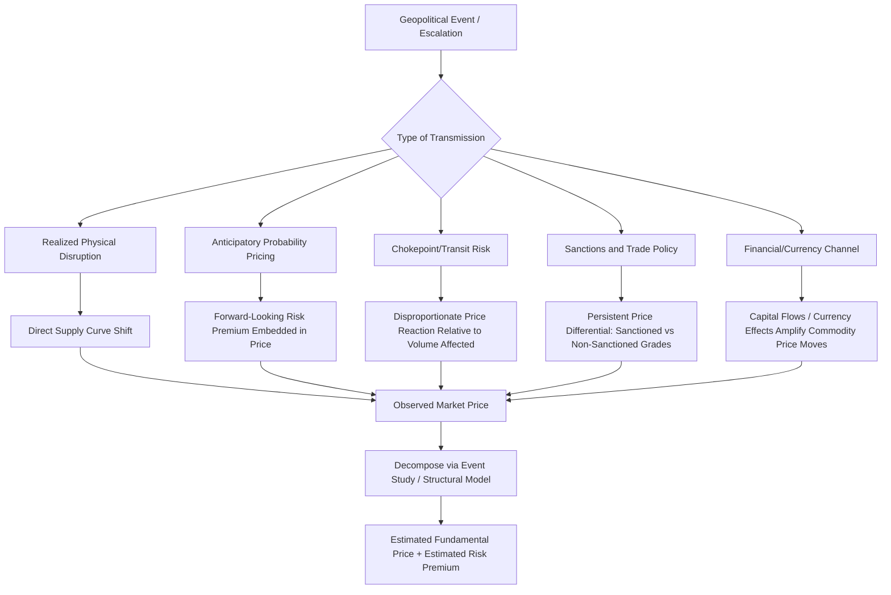

## Geopolitical Risk Pricing in Energy Markets

### Conceptual Foundations

**What Is Geopolitical Risk Pricing?**

Geopolitical risk pricing refers to the mechanisms by which energy markets incorporate the probability and expected severity of political, military, and diplomatic disruptions into observed prices — even before an actual physical supply disruption occurs. Unlike a realized supply shock (a pipeline actually being severed, a facility actually being sanctioned), geopolitical risk pricing captures the market's forward-looking assessment of *disruption probability*, meaning prices can move substantially on news, rhetoric, and unrealized tail risk alone.

**Key Points**

- This distinguishes geopolitical risk pricing from standard supply-demand fundamentals-based pricing: two identical current physical supply-demand balances can produce very different prices depending on perceived future disruption risk.
- The phenomenon is most pronounced in oil markets due to their global integration and historical concentration of production in geopolitically sensitive regions, but is increasingly relevant to natural gas (especially pipeline-dependent regional markets) and, to a lesser extent, other commodities tied to critical mineral supply chains.

### The Risk Premium Framework

**Decomposing Observed Price into Fundamental and Risk Components**

A standard analytical decomposition treats the observed spot or futures price as:

$$P_{observed} = P_{fundamental} + RP_{geopolitical}$$

Where $P_{fundamental}$ is the price that would prevail based purely on current physical supply, demand, and inventory conditions, and $RP_{geopolitical}$ is the additional premium (or, in rare cases, discount) attributable to geopolitical risk perception.

**Option-Theoretic Framing**

A more rigorous economic framing treats geopolitical risk premium as analogous to an option value. The expected value of a potential disruption can be modeled as:

$$E[\Delta P] = \pi \times S$$

Where $\pi$ is the market-perceived probability of a disruption event occurring within the relevant time horizon, and $S$ is the expected severity (price impact) of that disruption conditional on it occurring. The risk premium embedded in current prices reflects the market's continuously updated estimate of $\pi \times S$, meaning that even a small increase in perceived probability $\pi$ for a high-severity event $S$ can move prices meaningfully, without any actual barrel of supply being lost.

**Key Points**

- Because $\pi$ is not directly observable, empirical researchers typically infer geopolitical risk premia indirectly — using event studies, options-implied volatility, or structural models that separate price movements attributable to news/geopolitical events from those attributable to observable fundamentals (inventories, production data, demand indicators).
- This decomposition is inherently model-dependent: different methodological choices (which control variables, which event windows, which fundamental benchmark) can yield different premium estimates for the same historical period. [Inference] There is no single "true" observable geopolitical risk premium figure at any given time; reported premium estimates in research and market commentary should be understood as model-derived approximations rather than a directly measured quantity.

### Diagram: Fundamental Price vs. Geopolitical Risk Premium

<svg xmlns="http://www.w3.org/2000/svg" viewBox="0 0 540 380" font-family="Arial, sans-serif">
<text x="270" y="24" text-anchor="middle" font-size="15" font-weight="bold">Price Decomposition: Fundamental vs. Risk Premium (svg_diagram)</text>
<line x1="70" y1="330" x2="490" y2="330" stroke="black" stroke-width="1.5" />
<line x1="70" y1="330" x2="70" y2="50" stroke="black" stroke-width="1.5" />

<text x="280" y="360" text-anchor="middle" font-size="12">Time</text>

<text x="30" y="190" text-anchor="middle" font-size="12" transform="rotate(-90 30,190)">Price ($/bbl)</text>

<path d="M90,280 L150,275 L210,282 L270,270 L330,278 L390,272 L450,275" fill="none" stroke="#2980b9" stroke-width="2" />
<text x="450" y="260" font-size="10" fill="#2980b9" font-weight="bold">Fundamental Price</text>

<path d="M90,280 L150,270 L200,150 L230,120 L260,180 L300,265 L330,278 L360,200 L390,160 L420,230 L450,275" fill="none" stroke="#c0392b" stroke-width="2" />
<text x="230" y="105" font-size="10" fill="#c0392b" font-weight="bold">Observed Price</text>

<rect x="195" y="120" width="70" height="10" fill="#fbe9e7" opacity="0.7" />
<text x="230" y="330" font-size="9" text-anchor="middle">Event A</text>
<rect x="355" y="160" width="70" height="10" fill="#fbe9e7" opacity="0.7" />
<text x="390" y="330" font-size="9" text-anchor="middle">Event B</text>

<line x1="230" y1="120" x2="230" y2="270" stroke="#e67e22" stroke-width="1.5" stroke-dasharray="3,2" />
<text x="245" y="200" font-size="9" fill="#e67e22">RP</text>
</svg>

### Channels Through Which Geopolitical Risk Transmits to Prices

**1. Actual/Realized Supply Disruption**

Direct physical removal of production or transit capacity (sanctions enforcement, military conflict damaging infrastructure, export bans). This channel operates through standard supply-curve shift mechanics and is the most straightforward to model using conventional supply-demand elasticity frameworks.

**2. Anticipatory/Probability-Based Pricing**

Markets price in the probability of future disruption before it occurs, based on escalating rhetoric, troop movements, sanctions threats, or diplomatic breakdowns. This is the channel most closely associated with the "geopolitical risk premium" concept, since prices move on *information about risk* rather than realized physical events.

**3. Chokepoint and Transit Risk**

Specific geographic transit points (the Strait of Hormuz, the Strait of Malacca, the Suez Canal, major pipeline corridors) carry disproportionate risk-pricing sensitivity because a large share of global trade flows through a narrow physical or political bottleneck, making even localized tension in these areas capable of generating outsized global price reactions relative to the actual volume directly affected at any given moment.

**4. Sanctions and Trade Policy Risk**

Sanctions regimes create both direct supply removal (when enforced) and pricing uncertainty (regarding enforcement stringency, exemption scope, and circumvention effectiveness), often resulting in persistent price differentials between sanctioned and non-sanctioned equivalent grades of a commodity — a measurable, quantifiable manifestation of geopolitical risk pricing distinct from the harder-to-observe pure probability premium.

**5. Currency and Financial Channel Risk**

Geopolitical risk can also transmit through financial channels — capital flight, currency depreciation in producer or consumer nations, and shifts in the dollar-denomination dynamics of global energy trade — which interact with and can amplify direct commodity price effects.

### Mermaid Diagram: Geopolitical Risk Transmission Pathways

### Empirical Measurement Approaches

**1. Event Studies**

Researchers identify discrete geopolitical events (conflict onset, sanctions announcements, attack incidents) and measure abnormal price movements in a defined window around the event, controlling for concurrent fundamental developments (inventory reports, OPEC+ decisions, macroeconomic data releases) to isolate the geopolitical component.

**2. Geopolitical Risk Indices**

Composite indices constructed from textual analysis of news coverage (counting and weighting geopolitical risk-related keywords across major newspapers) provide a quantifiable, time-series proxy for geopolitical risk sentiment that can be regressed against energy price movements. The most widely cited academic example is the Caldara-Iacoviello Geopolitical Risk (GPR) Index, which has been used extensively in energy economics research to study the relationship between geopolitical risk sentiment and oil price dynamics. [Unverified] Specific current index values or the precise current magnitude of estimated relationships between the GPR index and oil prices are not reproduced here, as these are subject to ongoing research updates and data revisions; consult the most recent published academic literature or the index's maintained data source for current figures.

**3. Options-Implied Volatility and Skew**

Because options prices embed the market's assessment of future price distribution (not just expected value), analysis of implied volatility term structure and skew in oil futures options markets can reveal market pricing of tail-risk disruption scenarios — a rising skew toward higher strike (call) options, for instance, can indicate the market is pricing increased probability of a sharp upside price move associated with supply disruption risk.

**4. Structural VAR (Vector Autoregression) Models**

Econometric models that decompose oil price movements into structurally identified supply shocks, demand shocks, and residual/speculative components, with geopolitical risk often proxied through the residual or through explicit geopolitical event variables incorporated into the model structure. [Inference] The specific decomposition results are highly sensitive to model specification choices (variable selection, identification restrictions, sample period), meaning different published SVAR studies can attribute different relative importance to geopolitical/speculative factors versus pure fundamentals for the same historical episode.

### Regional and Fuel-Specific Variation

**Key Points**

- **Oil markets** exhibit the most extensively studied and historically largest geopolitical risk premia due to the global, liquid, and historically OPEC-influenced nature of the market combined with production concentration in politically volatile regions.
- **Natural gas markets**, particularly pipeline-delivered gas in regionally segmented markets (as opposed to globally fungible LNG), can exhibit even more acute localized geopolitical risk pricing because the lack of ready substitutability via alternative routes concentrates risk exposure on specific bilateral or regional supply relationships.
- **LNG markets**, being more globally fungible than pipeline gas, tend to diffuse geopolitical risk premia more broadly across global buyers rather than concentrating it on a single dependent importer, though regional price divergence (e.g., between different LNG demand hubs) can still reflect differential geopolitical exposure.
- **Critical minerals and battery supply chain commodities** are an increasingly studied emerging area for geopolitical risk pricing analysis, given production concentration in a small number of countries for several key inputs to the energy transition. [Speculation] The methodological toolkit for measuring geopolitical risk premia in critical mineral markets is less mature and less standardized than in oil markets, given shorter historical data series and less developed derivatives/options markets for many of these commodities; conclusions in this specific sub-area should be treated as a developing area of research rather than an established consensus framework.

### Policy and Market Design Implications

**Key Points**

- **Strategic reserve credibility** (see prior chapter topic on strategic reserves) directly interacts with geopolitical risk pricing: a credible, rapidly deployable reserve release mechanism can dampen the anticipatory risk premium component by reducing the market's perceived severity ($S$) of a potential disruption, even without any actual release occurring.
- **Diversification** (see prior chapter topic on import diversification) similarly reduces geopolitical risk premium exposure by lowering the probability ($\pi$) that any single geopolitical event materially affects a country's specific supply, even if it does not change the global market-wide premium.
- **Derivative and hedging markets** allow producers, consumers, and intermediaries to transfer geopolitical price risk to parties more willing to bear it (speculators, financial institutions), which can improve overall market risk-bearing efficiency but does not eliminate the underlying aggregate risk, only redistributes who bears it.
- **Information transparency debates**: Some analysts argue that geopolitical risk premia can be amplified by information asymmetries and speculative positioning beyond what "true" fundamental disruption risk would justify, feeding into broader — and often contested — policy debates about the role of speculation versus fundamentals in energy price volatility. [Inference] This is a genuinely contested area in energy economics literature; empirical findings on the relative contribution of speculative activity versus fundamental risk to price volatility vary across studies and time periods, and no single settled consensus figure should be presumed.

### Common Pitfalls in Analyzing Geopolitical Risk Pricing

1. **Attributing all unexplained price movement to geopolitical risk by default**: Residual price movement not explained by a simple fundamentals model may reflect genuine geopolitical risk pricing, but could equally reflect model misspecification, omitted fundamental variables, or unrelated speculative/technical trading dynamics — the two are not automatically synonymous.
2. **Assuming risk premia are symmetric and stable over time**: Geopolitical risk premia can vary substantially in magnitude and even direction (rare cases of geopolitical developments reducing perceived risk, causing a discount rather than premium) depending on context, making static or historically-averaged premium assumptions potentially misleading for forward-looking analysis.
3. **Ignoring the interaction between realized and anticipatory channels**: An actual disruption event often simultaneously updates both the immediate physical supply picture and the market's probability assessment of further escalation, making it analytically difficult to cleanly separate the "realized" and "anticipatory" price impact components in practice.
4. **Overlooking regional/fuel heterogeneity**: Applying oil market-derived geopolitical risk pricing intuitions uncritically to natural gas or critical mineral markets, which have different substitutability, market structure, and derivatives market maturity characteristics, can lead to inaccurate risk assessment.

### Related Topics

- Defining and measuring energy security
- Import dependence and diversification strategies
- Strategic reserves and emergency response mechanisms
- Oil price shocks and macroeconomic transmission channels
- Geopolitics of energy transit chokepoints
- Options-implied volatility and derivatives pricing in commodity markets
- Sanctions economics and enforcement effectiveness
- Critical minerals supply chains for the energy transition