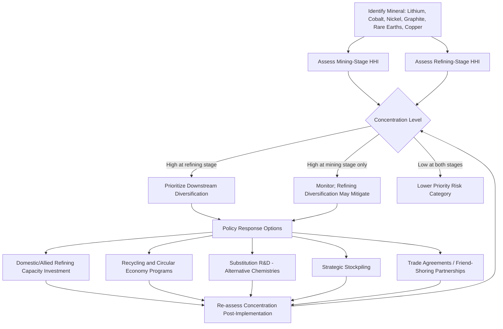

## Critical Minerals Supply Chains for Energy Technologies

### Conceptual Foundations

**Definition and Scope**

Critical minerals are raw materials — predominantly metals — deemed economically important and simultaneously exposed to significant supply risk, typically due to geographic production concentration, limited substitutability, and strategic application in energy, defense, and advanced manufacturing sectors. For energy economics specifically, the relevant subset centers on minerals essential to clean energy technologies: lithium, cobalt, nickel, graphite, copper, and rare earth elements (particularly the "magnet rare earths" — neodymium, praseodymium, dysprosium, and terbium).

**Why This Extends the Energy Security Framework**

The same underinvestment, concentration-risk, and diversification logic applied to fossil fuel supply security (see prior chapter topics) applies with comparable or greater force to critical minerals, because energy transition technologies embed these materials as physical inputs with no fuel-substitution equivalent once a technology is deployed — a wind turbine's rare earth magnet content or an EV battery's lithium/cobalt/nickel content cannot be substituted after manufacture the way a power plant might switch fuels.

### Scale of Mineral Intensity in Energy Technologies

**Key Points**

- Energy transition technologies are significantly more mineral-intensive per unit of output than the fossil fuel infrastructure they replace, since renewable and battery technologies substitute upfront material input for the ongoing fuel input required by combustion-based systems.
- A single electric vehicle battery requires roughly 8–12 kg of lithium and 10–30 kg of cobalt depending on battery chemistry, alongside 50–80 kg of nickel, while a single offshore wind turbine contains approximately 600 kg of rare earth permanent magnets, illustrating why demand growth for these minerals is tightly coupled to the pace of energy transition deployment. [Sustainability Atlas](https://sustainableatlas.org/post/trend-watch-critical-minerals-supply-chains-lithium-cobalt-rare-earths-in-2026-s-3085)
- Lithium demand is projected to rise substantially between 2024 and 2040, driven overwhelmingly by clean energy technologies, whose share of total lithium demand is projected to grow considerably over that period, alongside comparable though smaller proportional growth in graphite demand. [UNCTAD](https://unctad.org/publication/global-trade-update-june-2026-shifting-dynamics-critical-minerals-trade)

### Supply Chain Segmentation: Where Concentration Occurs

A critical analytical distinction — often elided in general commentary — is that concentration risk differs across the supply chain's four distinct stages:

| Stage | Description | Where Concentration Tends to Be Highest |
| --- | --- | --- |
| **Reserves** | Geological deposits identified as economically extractable | Concentrated but somewhat more distributed than downstream stages |
| **Mining/Extraction** | Physical extraction of raw ore | Highly concentrated in specific countries per mineral |
| **Processing/Refining** | Converting raw ore into usable material form (e.g., battery-grade lithium, separated rare earth oxides) | Typically the most concentrated stage — where the highest value-add occurs |
| **Downstream Manufacturing** | Component and product manufacture (cathodes, magnets, cells) | Concentration varies; often follows refining concentration due to co-location advantages |

**Key Points**

- The core issue is not only rising demand — it is also where supply is located, who controls processing, and where economic value is captured, meaning mining-stage concentration statistics alone understate the strategic chokepoint risk that exists further downstream. [UNCTAD](https://unctad.org/news/critical-minerals-are-reshaping-global-trade-demand-surges)
- Supply of critical energy transition minerals is concentrated across reserves, mining, processing and refining, with this concentration being especially acute in processing and refining, where higher-value activities take place. [UNCTAD](https://unctad.org/publication/global-trade-update-june-2026-shifting-dynamics-critical-minerals-trade)

### Current Concentration Landscape

**Mining-Stage Concentration**

The Democratic Republic of the Congo accounted for a large majority of global cobalt mine production, Indonesia for roughly two-thirds of global nickel mine production, and China for close to seventy percent of rare earth mine production as of the most recent reporting year. Three countries — Australia, Chile, and China — together account for over 90% of lithium production. [UNCTAD](https://unctad.org/publication/global-trade-update-june-2026-shifting-dynamics-critical-minerals-trade)[Sustainability Atlas](https://sustainableatlas.org/post/trend-watch-critical-minerals-supply-chains-lithium-cobalt-rare-earths-in-2026-s-3085)

**Refining-Stage Concentration (Typically More Severe)**

China dominates refining for rare earths, lithium and cobalt, and over the past two years, the top refining countries — Indonesia for nickel and China for other key energy minerals — accounted for over three quarters of total growth in refined supply, with several markets including manganese, nickel and graphite seeing virtually all supply growth come from the single dominant supplier. China controls roughly 60% of global rare earth mining and over 85% of rare earth processing, illustrating how concentration compounds moving downstream from mining to refining. [Global Trade Update (June 2026): The shifting dynamics of critical minerals trade | UN Trade and Development (UNCTAD) +2](https://unctad.org/publication/global-trade-update-june-2026-shifting-dynamics-critical-minerals-trade)

**An Important Counter-Trend: Rare Earth Refining Diversification**

Rare earth refining was a notable exception to the broader concentration trend, with new projects in the United States and production increases in Malaysia leading to a modest decline in concentration — highlighting the role of targeted policy and investment support in enabling diversification. This is a useful case study: it demonstrates that policy-driven diversification is achievable, though excluding rare earths, the average share of the top refining country across other minerals actually rose over the same period, showing uneven progress across mineral categories. [IEA](https://www.iea.org/reports/global-critical-minerals-outlook-2026/executive-summary)[IEA](https://www.iea.org/reports/global-critical-minerals-outlook-2026/executive-summary)

### The HHI Framework Applied to Critical Minerals

The same Herfindahl-Hirschman Index methodology used for fossil fuel import diversification analysis applies directly to critical mineral supply concentration:

$$HHI_{mineral} = \sum_{i=1}^{n}\left(\frac{Q_i}{Q_{total}}\right)^2 \times 10{,}000$$

**Example**

Using approximate cobalt mine production shares where the DRC accounts for roughly 74% of global supply with the remainder split among several smaller producers:

$$HHI \approx 74^2 + (\text{remaining shares}^2) \approx 5{,}476 + \sim 500 \approx 5{,}976$$

This falls far above the conventional "highly concentrated" threshold of 2,500, indicating cobalt mine-stage supply concentration is extreme by standard concentration-risk benchmarks — a magnitude of concentration considerably higher than is typically observed even in concentrated oil-exporter groupings.

### Diagram: Critical Minerals Supply Chain Concentration Funnel

<svg xmlns="http://www.w3.org/2000/svg" viewBox="0 0 540 400" font-family="Arial, sans-serif">
<text x="270" y="24" text-anchor="middle" font-size="15" font-weight="bold">Concentration Increases Downstream (svg_diagram)</text>

<rect x="60" y="60" width="420" height="60" fill="#eafaf1" stroke="#27ae60" stroke-width="2" />
<text x="270" y="85" text-anchor="middle" font-size="12" font-weight="bold">Reserves</text>
<text x="270" y="102" text-anchor="middle" font-size="10">Moderately distributed globally</text>
<rect x="100" y="140" width="340" height="60" fill="#fdf2e3" stroke="#e67e22" stroke-width="2" />
<text x="270" y="165" text-anchor="middle" font-size="12" font-weight="bold">Mining / Extraction</text>
<text x="270" y="182" text-anchor="middle" font-size="10">High concentration (2-3 countries dominant)</text>
<rect x="140" y="220" width="260" height="60" fill="#fbe9e7" stroke="#c0392b" stroke-width="2" />
<text x="270" y="245" text-anchor="middle" font-size="12" font-weight="bold">Processing / Refining</text>
<text x="270" y="262" text-anchor="middle" font-size="10">Most concentrated: often single dominant country</text>
<rect x="180" y="300" width="180" height="60" fill="#f4e3f7" stroke="#8e44ad" stroke-width="2" />
<text x="270" y="325" text-anchor="middle" font-size="12" font-weight="bold">Downstream Mfg</text>
<text x="270" y="342" text-anchor="middle" font-size="10">Magnets, cathodes, cells</text>

<line x1="100" y1="120" x2="140" y2="140" stroke="#999" stroke-width="1" />
<line x1="440" y1="120" x2="400" y2="140" stroke="#999" stroke-width="1" />
<line x1="140" y1="200" x2="180" y2="220" stroke="#999" stroke-width="1" />
<line x1="400" y1="200" x2="360" y2="220" stroke="#999" stroke-width="1" />
<line x1="180" y1="280" x2="200" y2="300" stroke="#999" stroke-width="1" />
<line x1="360" y1="280" x2="340" y2="300" stroke="#999" stroke-width="1" />
</svg>

### Structural Drivers of Concentration

**Key Points**

1. **Geological endowment asymmetry**: Unlike oil, whose reserves are geologically distributed across a reasonably wide set of countries, several critical minerals (notably heavy rare earths and cobalt) have highly skewed natural geological distribution independent of any policy choice.
2. **Processing cost and environmental externality arbitrage**: Refining and processing stages are often energy- and chemically-intensive with significant environmental externalities (tailings, effluent, emissions); concentration in specific countries partly reflects historical willingness to bear these externalities domestically, combined with accumulated technical expertise and economies of scale in processing infrastructure that create high barriers to new entrant competition.
3. **Deliberate industrial policy**: Sustained state-directed investment in mining and refining capacity by dominant producers over multi-decade horizons has entrenched processing concentration beyond what pure geological or cost factors alone would predict.
4. **Co-location and vertical integration effects**: Downstream manufacturing (e.g., battery cathode and magnet production) frequently co-locates near refining capacity due to logistics, technical integration, and supply chain coordination advantages, which reinforces and extends upstream concentration into downstream manufacturing stages rather than diluting it.

### Export Controls as Realized Geopolitical Risk

This topic connects directly to the geopolitical risk pricing framework covered earlier in this chapter, but with a critical distinction: unlike the largely anticipatory/probabilistic risk pricing typical of oil markets, critical mineral markets have experienced **materialized** export control risk at significant scale.

**Key Points**

- The recent proliferation of export controls has transformed concerns around high supply concentration from a theoretical vulnerability into an immediate economic security challenge, with 2025 marking the year when the economic risks of highly concentrated supply chains materialised at scale. [IEA](https://www.iea.org/reports/global-critical-minerals-outlook-2026/executive-summary)
- The number of mineral tariff codes subject to Chinese export controls has tripled since 2023, and other countries have introduced new restrictions, including a cobalt export quota by the DRC and trade restrictions by Zimbabwe for lithium and by Mozambique for graphite. [IEA](https://www.iea.org/reports/global-critical-minerals-outlook-2026/executive-summary)
- Major export controls on seven heavy rare earth elements introduced in April 2025 had significant impacts across downstream industries, forcing some automakers to reduce utilisation rates or temporarily halt operations — a direct, observable transmission of upstream mineral supply concentration into real-economy industrial disruption, providing a clear empirical case study of the risk-materialization channel discussed abstractly in the geopolitical risk pricing topic. [IEA](https://www.iea.org/reports/global-critical-minerals-outlook-2026/executive-summary)
- While expanded measures were suspended for one year, the IEA assessed that their full implementation could put a very large volume of downstream production outside China at risk annually across the automotive, high-tech, defence, and related sectors, illustrating the scale of economic exposure created by concentrated processing capacity. [SCI](https://www.soci.org/news/2026/7/critical-minerals-supply-chain-worries-go-from-risk-to-reality)

### Hidden and Second-Order Vulnerabilities

**Key Points**

- Critical mineral supply chains are exposed to disruption risk not only through direct mineral trade restrictions but also through dependencies on associated input chemicals and logistics chains. Impacts on mineral and metal markets can arise even from disruptions centered on oil and gas chokepoints, since key feedstocks such as sulphur — essential for the sulphuric acid required in processing copper, lithium, cobalt, nickel and rare earths — can be affected by unrelated regional conflicts affecting shipping routes, demonstrating an important interdependency between fossil fuel transit security and critical mineral processing security that is easy to overlook in siloed analysis. [SCI](https://www.soci.org/news/2026/7/critical-minerals-supply-chain-worries-go-from-risk-to-reality)
- Minerals with the highest composite risk exposure — gallium, magnet rare earths, yttrium, graphite, tungsten, germanium, tellurium and cobalt — are characterised by high supply concentration, limited availability of substitutes, and strategic applications, with several already subject to some form of export restriction, indicating that risk exposure compounds when concentration coincides with low substitutability rather than either factor alone. [IEA](https://www.iea.org/reports/global-critical-minerals-outlook-2026/outlook)[IEA](https://www.iea.org/reports/global-critical-minerals-outlook-2026/outlook)

### Supply-Demand Balance Outlook

**Key Points**

- Gaps between projected demand and anticipated supply over the next decade have narrowed for copper and lithium, though new risks have emerged for cobalt due to policy shifts in major producers. [IEA](https://www.iea.org/reports/global-critical-minerals-outlook-2026/executive-summary)
- Based on the project pipeline, supply deficits for copper and lithium are projected to persist through 2035, although the outlook has somewhat improved relative to prior assessments. [IEA](https://www.iea.org/reports/global-critical-minerals-outlook-2026/executive-summary)
- Downstream capacity constraints are particularly acute for rare earth metals, alloys, and magnets, and similar trends exist in lithium, where mining growth outside the dominant supplier exceeds existing and planned refining and cathode material production capacity — reinforcing the point that mining-stage diversification alone does not resolve the more binding downstream processing bottleneck. [IEA](https://www.iea.org/reports/global-critical-minerals-outlook-2026/outlook)
- Graphite, nickel, and cobalt face comparable challenges, with midstream and downstream development lagging upstream expansion. [IEA](https://www.iea.org/reports/global-critical-minerals-outlook-2026/outlook)

### Mermaid Diagram: Critical Mineral Risk Assessment and Response Framework

### Policy Responses and Diversification Strategies

Applying the same diversification logic developed for fossil fuel import security, but adapted to the structural realities of mineral processing:

1. **Domestic and allied-country refining capacity investment**: Governments have moved to fund refining and processing capacity outside dominant-supplier countries, following the demonstrated model of rare earth refining diversification described above.
2. **Recycling and circular economy development**: Battery and magnet recycling can reduce long-run dependence on virgin mineral extraction and refining, providing a domestically-controllable secondary supply source largely insulated from foreign export control risk, though current recycling volumes remain small relative to primary demand growth in most mineral categories. [Inference] The pace at which recycling can meaningfully offset primary demand growth depends on battery/product retirement rates and collection infrastructure development, both of which involve multi-year to multi-decade lags relative to current primary demand growth.
3. **Substitution and material efficiency R&D**: Research into alternative battery chemistries (e.g., reducing or eliminating cobalt content) and alternative magnet designs (reducing heavy rare earth dependence) directly addresses the low-substitutability risk factor identified as a key driver of composite risk exposure.
4. **Strategic mineral stockpiling**: Extending the strategic reserve concept discussed earlier in this chapter to mineral inputs rather than fuels, though formal international coordination mechanisms for mineral stockpiling remain considerably less developed than the established IEA oil reserve system. [Speculation] Whether a mature, internationally coordinated critical minerals reserve-release framework analogous to the IEA oil system will develop remains uncertain at the time of this material's preparation.
5. **Trade policy and friend-shoring partnerships**: Sourcing requirements under measures such as the US Inflation Reduction Act are forcing automakers and battery manufacturers to restructure procurement away from countries designated as sources of concern, creating pressure toward alternative supply chain development, while the EU's Critical Raw Materials Act similarly mandates diversification-oriented sourcing requirements. [Sustainability Atlas](https://sustainableatlas.org/post/trend-watch-critical-minerals-supply-chains-lithium-cobalt-rare-earths-in-2026-s-3085)[Sustainability Atlas](https://sustainableatlas.org/post/trend-watch-critical-minerals-supply-chains-lithium-cobalt-rare-earths-in-2026-s-3085)

### Distinctions from Fossil Fuel Security Frameworks

**Key Points**

- Unlike oil, which has a mature, liquid global spot and futures market enabling relatively transparent price discovery, several critical minerals (especially specific rare earth elements and cobalt) have thinner, less transparent markets with fewer standardized benchmark contracts, complicating both price risk hedging and the application of options-implied risk pricing methodologies discussed in the geopolitical risk pricing topic.
- Fossil fuel disruptions are typically transportation/flow interruptions (a pipeline or shipping lane closure affects a continuous flow), whereas mineral export controls often operate as discrete licensing/quota gates that can be adjusted with more granular, targeted specificity (by product category, end-use, or destination country), giving controlling states a more precise policy instrument than is typically available in fossil fuel supply disruption scenarios.
- The demand side for critical minerals is itself driven by energy and climate policy choices (EV adoption rates, renewable deployment targets), creating a feedback loop absent in traditional fossil fuel security analysis, where policy-driven technology adoption directly shapes the magnitude of the security challenge being analyzed.

### Common Pitfalls in Analyzing Critical Mineral Security

1. **Focusing exclusively on mining-stage concentration statistics**: As shown above, refining-stage concentration is frequently more severe and more strategically binding than mining-stage concentration, yet receives less public attention due to being less intuitively visible than raw ore production figures.
2. **Treating all "critical minerals" as a homogeneous risk category**: Risk profiles vary substantially by mineral based on substitutability, existing diversification progress (e.g., rare earth refining vs. cobalt), and criticality to specific end-use technologies.
3. **Underestimating cross-commodity interdependencies**: As illustrated by the sulphur/sulphuric acid example above, mineral processing can depend on inputs and logistics chains whose own security is governed by entirely separate risk factors (e.g., oil and gas transit chokepoints).
4. **Assuming demand projections are policy-independent**: Since mineral demand is substantially driven by climate and industrial policy choices, demand-side projections embed significant policy uncertainty that should be treated as a scenario range rather than a fixed forecast.

### Related Topics

- Defining and measuring energy security
- Import dependence and diversification strategies
- Strategic reserves and emergency response mechanisms
- Geopolitical risk pricing in energy markets
- Battery technology economics and chemistry substitution
- Circular economy and recycling economics for energy technologies
- Industrial policy and resource nationalism
- Renewable energy subsidies and infant industry arguments