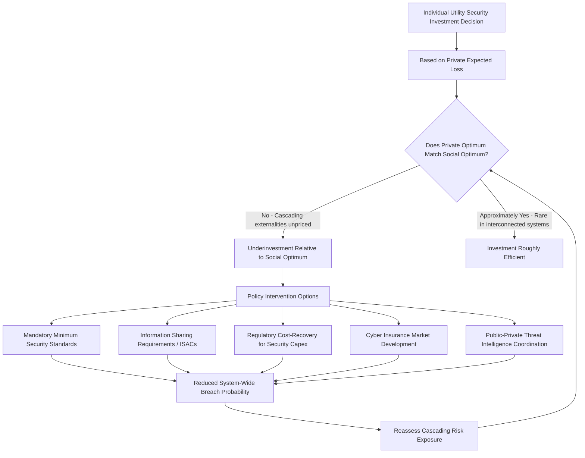

## Cybersecurity Economics of Energy Infrastructure

### Conceptual Foundations

**Why Energy Infrastructure Cybersecurity Is an Economics Problem**

Cybersecurity of energy infrastructure — generation facilities, transmission and distribution grids, pipelines, and increasingly distributed energy resources — is fundamentally an economics problem before it is a technical one. The core question economists bring to this domain is: how much security investment is socially optimal, given that security is costly, disruption risk is probabilistic, and the incentives facing individual firms diverge from the incentives that would maximize system-wide welfare?

**Key Points**

- Energy infrastructure is a canonical example of **critical infrastructure interdependency**: a cyberattack disabling electricity generation or grid control systems cascades into failures across virtually every other economic sector (water treatment, healthcare, finance, telecommunications, other energy subsectors), making the true social cost of a successful attack far larger than the direct commercial loss to the targeted utility.
- This interdependency creates a classic **externality problem**: an individual utility's cybersecurity investment decision is typically based on its own private risk exposure (regulatory fines, direct outage costs, reputational damage), not on the full cascading social cost a breach could impose on dependent sectors and the broader economy.

### The Economics of Underinvestment in Security

**Public Good and Externality Framing**

Security investment by any single grid operator or generator produces spillover benefits: a more secure node reduces contagion risk for interconnected utilities and dependent sectors. Because these spillover benefits are not captured by the investing firm, the standard economic prediction is underinvestment relative to the socially optimal level — structurally analogous to the underinvestment rationale used for strategic petroleum reserves and infant-industry-style renewable subsidies covered elsewhere in this course.

**Formal Framing: Expected Loss and Optimal Security Spending**

A standard economic framework for security investment decisions, adapted from the Gordon-Loeb model widely used in information security economics, holds that a firm should invest in security only up to the point where the marginal cost of additional protection equals the marginal reduction in expected loss:

$$\frac{\partial C_{security}}{\partial S} = -\frac{\partial E[L(S)]}{\partial S}$$

Where $S$ is the level of security investment, $C_{security}(S)$ is the cost of achieving that level, and $E[L(S)]$ is the expected loss from a successful attack as a function of security level (decreasing in $S$). Expected loss is itself typically modeled as:

$$E[L(S)] = \pi(S) \times v \times \text{Severity}$$

Where $\pi(S)$ is the probability of a successful breach at security level $S$ (decreasing in $S$), $v$ is asset/system value, and $\text{Severity}$ is the fraction of value lost or the scale of cascading damage conditional on a successful breach.

**Key Points**

- The Gordon-Loeb framework's most cited theoretical result is that a firm should generally not invest more than roughly 37% of the expected loss from a breach in security spending, since beyond this point diminishing returns to security investment mean the marginal cost of further risk reduction exceeds the marginal expected loss avoided. [Inference] This specific threshold result depends on particular functional-form assumptions about the vulnerability/security-investment relationship in the original model; it is a widely cited theoretical benchmark rather than an empirically validated universal rule for all infrastructure contexts, and critical infrastructure with severe cascading/systemic risk may warrant departure from a purely private-loss-based optimization in favor of a broader social-cost calculation.
- Applied to energy infrastructure specifically, this private-optimization framework systematically understates optimal investment because $\text{Severity}$ as perceived by an individual utility reflects primarily its own direct losses, not the broader cascading social costs of grid failure across dependent economic sectors.

### Diagram: Private vs. Social Optimal Security Investment

<svg xmlns="http://www.w3.org/2000/svg" viewBox="0 0 540 400" font-family="Arial, sans-serif">
<text x="270" y="24" text-anchor="middle" font-size="15" font-weight="bold">Private vs. Social Optimal Security Spending (svg_diagram)</text>
<line x1="80" y1="340" x2="480" y2="340" stroke="black" stroke-width="1.5" />
<line x1="80" y1="340" x2="80" y2="50" stroke="black" stroke-width="1.5" />

<text x="280" y="370" text-anchor="middle" font-size="12">Security Investment Level (S)</text>

<text x="35" y="195" text-anchor="middle" font-size="12" transform="rotate(-90 35,195)">Cost / Expected Loss</text>

<path d="M100,320 C 200,290 320,180 460,80" fill="none" stroke="#2980b9" stroke-width="2.5" />
<text x="420" y="70" font-size="10" fill="#2980b9" font-weight="bold">Marginal Cost of Security</text>

<path d="M100,90 C 220,150 340,250 460,300" fill="none" stroke="#e67e22" stroke-width="2.5" />
<text x="140" y="105" font-size="10" fill="#e67e22" font-weight="bold">Private Marginal Benefit</text>

<path d="M100,60 C 250,120 370,220 460,290" fill="none" stroke="#27ae60" stroke-width="2.5" stroke-dasharray="6,3" />
<text x="160" y="50" font-size="10" fill="#27ae60" font-weight="bold">Social Marginal Benefit (incl. cascading risk)</text>

<circle cx="255" cy="195" r="4" fill="#e67e22" />
<line x1="255" y1="195" x2="255" y2="340" stroke="#e67e22" stroke-width="1" stroke-dasharray="3,2" />
<text x="255" y="358" font-size="10" fill="#e67e22" text-anchor="middle">S*_private</text>
<circle cx="345" cy="228" r="4" fill="#27ae60" />
<line x1="345" y1="228" x2="345" y2="340" stroke="#27ae60" stroke-width="1" stroke-dasharray="3,2" />
<text x="345" y="358" font-size="10" fill="#27ae60" text-anchor="middle">S*_social</text>

<text x="300" y="215" font-size="9" fill="`#c0392b`">Underinvestment gap</text>

</svg>

**Interpretation**: The private optimum $S^*_{private}$ occurs where marginal cost equals the firm's own private marginal benefit (reduced private expected loss). The social optimum $S^*_{social}$ occurs further right, where marginal cost equals the larger social marginal benefit that incorporates cascading system-wide costs. The gap between these two points represents the theoretical underinvestment attributable to unpriced externalities, providing the economic rationale for regulatory intervention.

### Sources of Market Failure Specific to Energy Infrastructure

**Key Points**

1. **Information asymmetry and disclosure disincentives**: Utilities have private incentives to underreport vulnerabilities or breach incidents to avoid reputational damage, regulatory scrutiny, and stock price impacts (for investor-owned utilities), reducing the information available for system-wide risk assessment and peer learning.
2. **Legacy infrastructure and stranded-asset-style investment reluctance**: Much operational technology (OT) in energy infrastructure — industrial control systems, SCADA systems — was designed decades ago for reliability and physical safety rather than cybersecurity, and retrofitting security into long-lived legacy capital assets involves substantial sunk-cost and operational-continuity considerations that create inertia against upgrade investment, distinct from but analogous to stranded-asset dynamics discussed in other energy transition contexts.
3. **Interconnection externalities across firm boundaries**: Because transmission grids and increasingly distributed energy resources (rooftop solar, smart meters, electric vehicle charging infrastructure) are interconnected, one operator's security weakness can become an attack vector into interconnected systems regardless of those systems' own security investment — a "weakest link" public-good-adjacent structure that differs from the "best shot" or "sum of efforts" structures seen in other public-good contexts and has distinct policy implications (see below).
4. **Split incentives in regulated utility rate structures**: Under traditional cost-of-service regulation, utility cybersecurity capital investment is subject to prudency review and rate recovery processes; the interaction between regulatory cost-recovery mechanisms and the pace/scale of desired security investment can create either under- or over-investment incentives depending on specific regulatory design, and this interaction varies considerably across jurisdictions. [Inference] The net direction of this incentive effect (whether cost-of-service regulation systematically encourages or discourages optimal cybersecurity capital spending) is contested in the regulatory economics literature and likely depends on jurisdiction-specific rate case precedent and prudency standards rather than following a single universal pattern.

### Public Good Structure: "Weakest Link" vs. "Total Effort" Models

Security economics literature (following Varian's classic taxonomy of security games) distinguishes between different aggregation structures relevant to how individual firms' security investments combine into system-wide security outcomes:

| Model Type | Description | Energy Infrastructure Relevance |
| --- | --- | --- |
| **Weakest link** | System security determined by the least-secure component | Interconnected grid/SCADA systems where one compromised node can propagate |
| **Best shot** | System security determined by the most-secure/most-effective defender | Less directly applicable to grid interconnection, more relevant to threat intelligence sharing |
| **Total effort / sum of efforts** | System security is the aggregate of all individual contributions | Relevant to sector-wide resilience metrics and aggregate threat-detection capacity |

**Key Points**

- In weakest-link security games, the standard game-theoretic prediction is that individual actors under-invest because they may free-ride on the expectation that other actors will invest sufficiently, or conversely may under-invest strategically since a single laggard undermines system security regardless of others' efforts — both dynamics point toward coordination failure requiring some form of collective governance (minimum security standards, mandatory information sharing, coordinated incident response) rather than reliance on independent firm-level decision-making alone.
- This theoretical structure underlies the rationale for mandatory cybersecurity standards applied sector-wide to critical infrastructure operators (rather than relying on voluntary best practices), since voluntary approaches are theoretically predicted to under-deliver system-wide security in a weakest-link environment.

### Mermaid Diagram: Cybersecurity Investment Decision and Policy Response Framework

### Policy and Market-Based Interventions

**1. Mandatory Standards and Regulation**

Regulatory bodies impose minimum cybersecurity standards on critical energy infrastructure operators (e.g., mandatory compliance frameworks for bulk power system reliability entities), directly addressing the weakest-link coordination failure by establishing a regulated floor below which no operator's security investment can fall, rather than relying purely on voluntary firm-level risk calculus.

**2. Information Sharing Mechanisms**

Information Sharing and Analysis Centers (ISACs) and similar public-private coordination bodies address the information asymmetry and disclosure-disincentive market failure by creating structured, often liability-protected channels for threat intelligence sharing among competitors who would otherwise have no private incentive to share vulnerability information that could benefit rivals or expose their own weaknesses.

**3. Cyber Insurance Markets**

Insurance mechanisms can, in principle, help internalize security externalities by pricing premiums according to assessed risk, creating a market-based incentive for security investment. However, cyber insurance for critical infrastructure faces distinctive challenges:

**Key Points**

- **Correlated/systemic risk**: Unlike many traditional insurable risks, cyberattacks on energy infrastructure can affect multiple insureds simultaneously (a single vulnerability affecting a common vendor's software across many utilities), violating the risk-pooling assumption of independence that underlies conventional insurance pricing models and limiting insurers' capacity to offer coverage at scale without reinsurance or government backstop support.
- **Adverse selection and moral hazard**: Asymmetric information between insurer and insured regarding actual security posture complicates accurate premium pricing, a challenge common to insurance markets generally but particularly acute in a technically complex and rapidly evolving threat domain.
- **Nation-state attack exclusions**: Many cyber insurance policies contain war/nation-state exclusion clauses, which is particularly consequential for energy infrastructure given that a substantial share of the most severe threat scenarios involve state or state-sponsored actors, potentially leaving the most catastrophic risk scenarios outside standard insurance coverage entirely. [Inference] The precise boundary and enforceability of nation-state attribution-based exclusion clauses has been subject to ongoing legal dispute in various jurisdictions and insurance contract cases; specific current legal precedent should be verified against current case law rather than assumed static.

**4. Public-Private Cost-Sharing and Backstop Mechanisms**

Given the correlated/systemic risk problem limiting private insurance market capacity, some analysts and policymakers have proposed government backstop mechanisms for catastrophic cyber risk affecting critical infrastructure, structurally analogous to existing government reinsurance backstops in other catastrophic risk domains (e.g., terrorism risk insurance programs), extending the public-good logic already established for strategic reserves to the cybersecurity domain.

### Cost-Benefit Considerations Specific to Grid Modernization and Distributed Energy Resources

**Key Points**

- The expansion of smart grid technology, distributed energy resources (rooftop solar, home battery storage), and electric vehicle charging infrastructure substantially increases the cyberattack surface of the energy system by multiplying the number of connected, often less-secured endpoints (smart meters, inverters, EV chargers) relative to a traditional centralized generation and one-way transmission model.
- This creates a genuine economic trade-off: the efficiency, decarbonization, and resilience-diversification benefits of grid modernization and distributed energy resources (discussed elsewhere in energy economics contexts) must be weighed against the increased aggregate cybersecurity investment required to secure a much larger and more heterogeneous set of connected devices and control points.
- Security-by-design cost integration (building security into distributed energy resource and smart grid hardware/software from initial design rather than retrofitting afterward) is generally understood in the broader cybersecurity economics literature to be substantially less costly than post-deployment retrofitting, suggesting that upfront standard-setting for emerging distributed energy technology carries high economic leverage relative to reactive security investment after widespread deployment has already occurred. [Inference] While the general "security-by-design is cheaper than retrofit" principle is well-established in cybersecurity economics broadly, precise quantified cost-ratio estimates specific to energy-sector distributed resource deployment are not well standardized in the literature and would require current, context-specific research to state with confidence.

### Common Pitfalls in Analyzing Energy Infrastructure Cybersecurity Economics

1. **Treating cybersecurity spending as a pure cost center rather than a risk-adjusted investment decision**: Framing security spending purely as overhead, rather than applying expected-loss-based investment logic, tends to produce systematically suboptimal (typically insufficient) investment decisions, particularly under budget-constrained regulatory environments.
2. **Ignoring the distinction between private and social optimal investment levels**: As illustrated in the diagram above, policy analysis based solely on individual utility cost-benefit calculations will understate the socially justified level of security investment in an interconnected critical infrastructure system.
3. **Assuming insurance markets can fully substitute for direct security investment or regulation**: Given the correlated-risk and nation-state-exclusion limitations discussed above, cyber insurance is best understood as a partial risk-transfer complement to, not a substitute for, direct security investment and regulatory minimum standards.
4. **Underweighting legacy system retrofit costs and timelines in policy design**: Policy mandates that assume rapid security upgrade timelines without accounting for the operational continuity constraints and capital cycle timelines of legacy OT/SCADA infrastructure risk setting unrealistic compliance expectations that may be technically or financially infeasible within mandated timeframes.

### Related Topics

- Defining and measuring energy security
- Strategic reserves and emergency response mechanisms
- Critical minerals supply chains for energy technologies
- Public goods and externalities in infrastructure economics
- Regulatory economics of utility rate-of-return and cost recovery
- Smart grid and distributed energy resource economics
- Insurance market economics: adverse selection and moral hazard
- Geopolitical risk pricing in energy markets