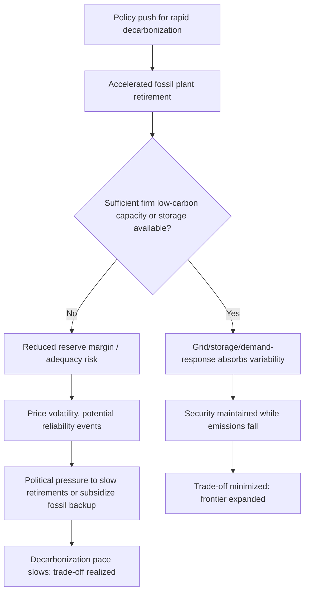

## Energy Security Versus Decarbonization Trade-offs

### Conceptual Framework

Energy security and decarbonization are two policy objectives within the broader "energy trilemma," alongside affordability. Each objective can be defined and measured independently, and while they are often complementary in the long run, they frequently generate tensions in the short-to-medium run due to differences in the time horizons, technologies, and infrastructure required to satisfy each one.

**Key Points**

- Energy security is conventionally defined (following the International Energy Agency, IEA) as the uninterrupted availability of energy sources at an affordable price, encompassing both long-term security (timely investments to supply energy in line with economic development and environmental needs) and short-term security (the ability of the energy system to react promptly to sudden changes in the supply-demand balance).
- Decarbonization refers to the reduction of carbon dioxide ($CO_2$) and other greenhouse gas (GHG) emissions per unit of energy consumed or produced, typically pursued via fuel switching, efficiency gains, and deployment of renewable or nuclear generation.
- The trade-off arises because the fastest, cheapest routes to short-term security (e.g., contracting more of an existing fossil fuel or building peaker gas plants) often lock in emissions-intensive assets, while the fastest routes to decarbonization (e.g., rapid retirement of dispatchable fossil capacity) can strain system adequacy and price stability if not sequenced with adequate firm low-carbon or storage capacity.
- [Inference] The severity of the trade-off is highly context-dependent: countries with large domestic renewable resource bases, strong grid interconnection, and diversified supply chains for low-carbon technology tend to experience smaller and shorter-lived trade-offs than import-dependent or grid-constrained countries.

### Dimensions of Energy Security

Energy security is not a single metric; it is typically decomposed into four dimensions, often summarized by the "4 A's" framework used in energy security literature:

1. **Availability** — the physical existence of energy resources (geological, technical, or geopolitical).
2. **Accessibility** — the ability to bring resources to market, including geopolitical and infrastructural access.
3. **Affordability** — the economic cost of energy to end users, including price volatility.
4. **Acceptability** — the environmental and social acceptability of the energy source, which is where decarbonization goals are formally incorporated into the security concept.

**Key Points**

- Under the 4 A's framework, decarbonization is not external to energy security; "acceptability" already embeds environmental performance. The apparent conflict in policy debates is mostly between *availability/affordability in the short run* and *acceptability (climate) in the long run*.
- Diversification indices, such as the Herfindahl-Hirschman Index (HHI) applied to a country's fuel mix or import-origin mix, are standard tools for quantifying supply concentration risk:

$$HHI = \sum_{i=1}^{n} s_i^2$$

where $s_i$ is the market share (or import share) of source $i$. A higher HHI indicates greater concentration and, all else equal, lower diversification-based security.

### The Trade-off Mechanism

**Short-run tension**

In the short run (operational and investment-cycle time frames of roughly 1–10 years), several mechanisms generate a real trade-off:

- **Dispatchability gap**: Variable renewable energy (VRE) sources such as wind and solar photovoltaics (PV) do not provide firm capacity on demand; system operators must retain or build dispatchable backup (gas peakers, hydro, storage, or demand response) to maintain reliability, which can slow the retirement of fossil assets even as their utilization (capacity factor) declines.
- **Stranded-asset risk vs. adequacy risk**: Retiring fossil generation too quickly, before replacement firm capacity or storage is available, raises loss-of-load risk; retiring it too slowly delays emissions reductions and risks later stranded-asset write-offs.
- **Critical mineral dependency**: Decarbonization technologies (batteries, wind turbines, solar PV, electrolyzers) are intensive in critical minerals (lithium, cobalt, nickel, rare earth elements) whose extraction and refining are geographically concentrated, in some cases more concentrated than oil and gas supply. [Unverified] The degree to which mineral concentration risk quantitatively exceeds fossil fuel concentration risk varies by mineral and is an active area of empirical study; the IEA and others have published comparative concentration statistics that should be checked against the latest release for current figures.
- **Grid and permitting lag**: Transmission expansion and interconnection queues often take longer to build than generation assets themselves, creating a bottleneck period in which security of supply can be more exposed, even as more capacity nominally exists.

**Long-run complementarity**

- Domestically produced renewable electricity reduces exposure to volatile international fossil fuel prices and to the geopolitical leverage of exporting nations, which is a security gain.
- Electrification of end uses (transport, heating) paired with domestic generation reduces the number of tradeable, geopolitically exposed commodity flows a country depends on.
- [Inference] Over sufficiently long horizons (multi-decade), most quantitative energy system models (e.g., IEA World Energy Outlook scenarios) show energy security and decarbonization converging, because a decarbonized system is largely electrified and domestically sourced; the debate is primarily about the transition path, not the end state.

### Formal Representation: Trade-off as a Constrained Optimization Problem

A stylized way to represent the trade-off in energy planning models is as a multi-objective optimization with a security constraint added to a cost/emissions minimization:

$$\min_{\mathbf{x}} \; C(\mathbf{x}) + \lambda \cdot E(\mathbf{x})$$

subject to

$$S(\mathbf{x}) \geq S_{min}$$

where:

- $\mathbf{x}$ is the vector of capacity and dispatch decisions,
- $C(\mathbf{x})$ is system cost,
- $E(\mathbf{x})$ is cumulative emissions,
- $\lambda$ is the shadow price of carbon (or an explicit carbon price),
- $S(\mathbf{x})$ is a security metric (e.g., a reserve margin, diversification index, or loss-of-load-expectation measure),
- $S_{min}$ is a minimum acceptable security threshold.

**Key Points**

- As $S_{min}$ is tightened (more security demanded), the feasible region shrinks, and for a fixed carbon price $\lambda$, achievable emissions reductions in the near term generally rise in cost or slow in pace — this is the formal expression of the trade-off.
- Loss-of-Load-Expectation (LOLE) and Expected Energy Not Served (EENS) are the standard reliability metrics used as $S(\mathbf{x})$ in capacity adequacy studies; many system operators (e.g., PJM, ENTSO-E) target a specific LOLE threshold, commonly around 1 event-day in 10 years, though exact standards vary by jurisdiction and should be checked against the current operator specification.
- The shadow price on the security constraint, $\partial C^* / \partial S_{min}$, is itself an economically meaningful quantity: it represents the marginal cost of an additional unit of security, and is the theoretical basis for valuing capacity markets, strategic reserves, and strategic petroleum reserves.

### Policy Instruments and Where They Sit on the Trade-off

| Instrument | Primary Objective Served | Effect on the Other Objective |
| --- | --- | --- |
| Carbon price / cap-and-trade | Decarbonization | Can raise near-term energy costs, especially if import-dependent fossil substitutes remain in the mix during transition |
| Capacity markets / strategic reserves | Energy security (adequacy) | Can keep marginal fossil plants economically viable longer, slowing decarbonization if not designed with emissions criteria |
| Renewable Portfolio Standards (RPS) / auctions | Decarbonization | Improves diversification (security) but adds VRE integration costs absent complementary flexibility investment |
| Strategic Petroleum Reserves (SPR) | Energy security (short-term) | Neutral to slightly negative for decarbonization (preserves fossil fuel demand resilience) |
| Grid interconnection / regional market coupling | Both | Generally positive for both: improves diversification and enables higher VRE penetration at lower reliability cost |
| Demand response / storage mandates | Both | Generally positive for both: substitutes for fossil peaking capacity |
| Border carbon adjustments | Decarbonization (indirectly, via trade) | [Inference] May have ambiguous security effects depending on how they reshape trade flows in carbon-intensive goods |

**Example**

Germany's *Energiewende* is a frequently cited case: rapid deployment of wind and solar reduced the carbon intensity of electricity generation over time, but the concurrent nuclear phase-out (completed in April 2023) increased reliance on natural gas as a dispatchable bridge fuel. This increased exposure to a single external supplier for pipeline gas, a vulnerability that materialized sharply after the reduction of Russian pipeline gas flows in 2022, which forced a temporary re-commitment of coal capacity and accelerated construction of LNG import terminals. [Unverified] Specific quantitative figures on capacity factors, exact emissions changes, and import shares in any given year should be verified against Bundesnetzagentur or AG Energiebilanzen data for the year in question, since these change annually.

### Diagrammatic Representation of the Trade-off Frontier

The following diagram (svg_diagram) illustrates a stylized production-possibility-frontier-style trade-off between energy security and decarbonization pace, and how investment in flexibility (storage, grids, demand response) shifts the frontier outward rather than merely moving along it.

<svg xmlns="http://www.w3.org/2000/svg" viewBox="0 0 640 440" font-family="Helvetica, Arial, sans-serif">
<title>Energy Security vs. Decarbonization Pace Trade-off Frontier (svg_diagram)</title>
<rect x="0" y="0" width="640" height="440" fill="#ffffff" />
<text x="320" y="28" text-anchor="middle" font-size="17" font-weight="bold" fill="#1a1a1a">Energy Security vs. Decarbonization Pace Frontier (svg_diagram)</text>

<line x1="90" y1="380" x2="90" y2="60" stroke="#333333" stroke-width="2" />
<line x1="90" y1="380" x2="580" y2="380" stroke="#333333" stroke-width="2" />
<text x="335" y="415" text-anchor="middle" font-size="14" fill="#1a1a1a">Decarbonization Pace →</text>
<text x="35" y="220" text-anchor="middle" font-size="14" fill="#1a1a1a" transform="rotate(-90 35 220)">Energy Security Level →</text>

<path d="M 100 100 Q 250 110 340 200 Q 420 280 560 370" fill="none" stroke="#c0392b" stroke-width="3" />
<text x="150" y="90" font-size="12.5" fill="#c0392b">Current frontier (limited flexibility)</text>

<path d="M 100 75 Q 280 85 400 150 Q 500 210 570 300" fill="none" stroke="#1e8449" stroke-width="3" stroke-dasharray="6,4" />
<text x="330" y="130" font-size="12.5" fill="#1e8449">Expanded frontier (with storage, grids, demand response)</text>

<circle cx="150" cy="150" r="6" fill="#2c3e50" />
<text x="160" y="145" font-size="12">A: gradual, high-security path</text>
<circle cx="440" cy="230" r="6" fill="#2c3e50" />
<text x="330" y="255" font-size="12">B: rapid decarbonization, security strained</text>
<circle cx="330" cy="165" r="6" fill="#1e8449" />
<text x="345" y="160" font-size="12" fill="#1e8449">C: rapid + secure, after flexibility investment</text>

<line x1="440" y1="230" x2="335" y2="170" stroke="#7f8c8d" stroke-width="2" stroke-dasharray="3,3" marker-end="url(#arrow)" />
</svg>

### Interaction with Market Structures and Investment Signals

**Key Points**

- In liberalized (deregulated) electricity markets, the "missing money" problem — where energy-only market prices fail to fully compensate capacity for the reliability value it provides — is exacerbated during rapid decarbonization, since price-taking VRE assets suppress wholesale prices (the "merit-order effect") precisely when dispatchable/firm capacity is most needed for security. This is a standard justification cited for capacity markets and reliability-must-run contracts.
- The merit-order effect can be represented conceptually via the supply stack: adding zero-marginal-cost VRE shifts the supply curve rightward, lowering the market-clearing price at a given demand level, which reduces revenue for marginal thermal plants that remain necessary for adequacy.
- Real options theory is often applied academically to value the flexibility of delaying fossil asset retirement versus investing in low-carbon firm capacity under uncertainty about future fuel prices, technology costs, and policy; the greater the policy uncertainty, the higher the option value of waiting, which can itself worsen the trade-off by delaying decarbonization investment. [Inference] This is a theoretical prediction from options-based investment models rather than a universally observed empirical regularity, since actual investment behavior also depends on firm-specific risk tolerance and financing constraints.

### Illustrative Mechanism Diagram (Mermaid)

### Quantitative Indicators Used in Empirical Analysis

- **Import dependency ratio**: net energy imports divided by gross inland energy consumption; a standard Eurostat/IEA metric for tracking exposure to external supply.
- **Reserve margin**: $(\text{Firm capacity} - \text{Peak demand}) / \text{Peak demand}$, used by system operators as a simple adequacy screen ahead of more rigorous probabilistic LOLE/EENS studies.
- **Carbon intensity of electricity**: grams of $CO_2$-equivalent per kilowatt-hour ($gCO_2e/kWh$), the standard decarbonization progress metric for the power sector.
- **VRE penetration rate**: share of annual electricity generation from variable renewables, often used as a proxy (imperfect) for integration difficulty, since the marginal difficulty of integration rises non-linearly with penetration due to correlated output and curtailment.
- [Inference] None of these indicators alone fully captures the trade-off; academic and institutional analyses (IEA, IRENA, national system operators) typically combine several indicators plus scenario modeling to assess trade-off severity for a given country or region, and any single-indicator claim should be treated with caution.

### Regional and Structural Variation

**Key Points**

- Fossil fuel-importing countries with limited domestic renewable resources (e.g., some island states, land-constrained economies) tend to face sharper short-run trade-offs, since decarbonization may require substituting one import dependency (fossil fuels) for another (critical minerals, equipment, or even imported low-carbon electricity via interconnectors).
- Fossil fuel-exporting economies face a distinct version of the trade-off: decarbonization abroad (reducing global fossil fuel demand) can threaten fiscal and export revenue security domestically, even if their own electricity system decarbonizes easily due to resource endowments (e.g., high solar/wind potential in Gulf states).
- Federally or regionally fragmented power systems (where transmission planning and market rules differ across jurisdictions) tend to experience larger trade-offs than well-interconnected single markets, because the diversification and pooling benefits of a larger balancing area are not fully realized.
- [Speculation] Some analysts argue that decentralized, prosumer-heavy grids (distributed solar plus batteries) could eventually reduce both trade-off dimensions simultaneously by increasing local resilience while cutting emissions, but this remains a contested and evolving area, with valid counterarguments about distribution-grid stability, protection coordination, and cost allocation.

### Conclusion

Energy security and decarbonization are not inherently opposed, but they are optimized on different time horizons and via different technological pathways, which produces a genuine short-to-medium-run policy trade-off. The severity of that trade-off is not fixed; it is a function of investment in flexibility (grids, storage, interconnection, demand response), diversification of both fossil and clean-technology supply chains, and the design of market and regulatory instruments (capacity mechanisms, carbon pricing, strategic reserves) that determine whether the trade-off is sharp or shallow. Policy analysis of this trade-off should therefore always specify the time horizon under discussion, since a policy that appears to worsen security in a 5-year window may be a precondition for the security gains realized in a 25-year window.

**Related Topics**

- Capacity markets and the "missing money" problem in liberalized electricity markets
- Critical mineral supply chains and geopolitical concentration risk
- Merit-order effect and wholesale electricity price formation under high VRE penetration
- Strategic Petroleum Reserves and IEA collective emergency response mechanisms
- Loss-of-Load-Expectation (LOLE) and probabilistic resource adequacy modeling
- Just Transition frameworks and distributional effects of decarbonization policy
- Grid interconnection, market coupling, and regional balancing area design
- Real options valuation of energy infrastructure investment under policy uncertainty
- Border carbon adjustments and their trade/security spillovers
- Sector coupling (power-to-gas, power-to-hydrogen) as a security-decarbonization complement