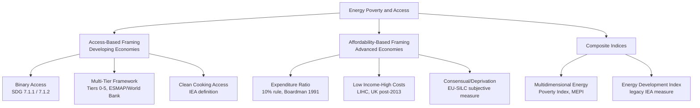

## Defining and Measuring Energy Poverty and Access

### Conceptual Foundations

**Energy poverty** refers to a household's or individual's inability to secure a socially and materially necessitated level of energy services within the home, or an inadequate level of access to modern, reliable, affordable energy for basic needs (lighting, cooking, heating/cooling, and productive uses). The concept sits at the intersection of development economics, welfare economics, and public policy, and is treated differently depending on whether the analytical lens is that of an advanced (OECD-type) economy or a developing economy.

Two broad traditions dominate the literature:

1. **Energy access framing** (dominant in developing-country and multilateral contexts, e.g., World Bank, IEA, SEforALL): poverty is framed around the binary or graduated presence/absence of access to electricity and clean cooking fuels/technologies.
2. **Fuel poverty / energy poverty framing** (dominant in the UK/EU literature): poverty is framed around the affordability of adequate energy services for households that are nominally "connected" but cannot afford sufficient consumption, often tied to thermal comfort.

These traditions differ in outcome variable (access vs. affordability), in typical setting (Global South vs. Global North), and in policy remedy (electrification/infrastructure vs. income support/subsidies/efficiency retrofits). A comprehensive treatment of the topic must integrate both, since the underlying economic problem — energy as a merit good with high fixed costs, network characteristics, and strong welfare implications — is structurally similar.

---

### Why Energy Is Economically Distinct as a Welfare Good

Several features of energy justify treating "poverty" in this domain separately from general income poverty:

- **Necessity with low short-run substitutability**: energy services (lighting, thermal comfort, cooking) have few immediate substitutes once a consumption bundle is fixed by housing stock and appliance ownership.
- **Merit good and positive externalities**: electrification and clean cooking access generate spillovers in health, education, gender equity (time use), and productivity that are not fully captured by market prices, justifying non-market metrics and public intervention.
- **Network and infrastructure dependence**: unlike food or many other basic needs, electricity access is capital-intensive and geographically lumpy (grid extension, transformers), meaning access is often supply-constrained rather than purely a function of household income.
- **Joint determination of access and affordability**: a household can be "connected" but energy-poor due to affordability (self-disconnection, rationing, informal illegal connections), or "unconnected" and therefore trivially energy-poor regardless of income.
- **Multidimensionality**: unlike a single-commodity poverty line, energy poverty spans fuels (electricity, LPG, biomass, kerosene), end-uses (cooking, lighting, heating, cooling, appliances, productive use), and quality attributes (reliability, safety, capacity).

---

### Defining Energy Poverty: Major Conceptual Approaches

#### 1. The Expenditure/Income-Ratio Approach (Fuel Poverty, UK Tradition)

The original and most widely cited operational definition, from Brenda Boardman's 1991 work in the UK context, designates a household as fuel poor if:

$$\frac{E}{Y} > \theta$$

where $E$ is required or actual energy expenditure to achieve adequate warmth, $Y$ is household income, and $\theta$ is a threshold (historically **10%** in the UK's original definition).

**Key Points**

- Simple, transparent, and easy to compute from household budget/expenditure survey data.
- Historically dominant in UK policy (1991–2013) before reform.
- **Critique 1 (arbitrariness of threshold)**: the 10% cutoff was derived from the observed median-times-two expenditure share in the 1988 English House Condition Survey, not from a theoretically grounded welfare threshold — this is largely an [Inference] about the intent of policymakers but is well documented as an empirical, not normative, derivation.
- **Critique 2 (definitional inconsistency)**: using *required* (modeled, standardized) expenditure versus *actual* expenditure produces very different poverty counts; actual expenditure conflates poverty with frugal/rationed behavior (a household that under-heats to save money can appear "not fuel poor" by expenditure share despite living in cold conditions).
- **Critique 3 (regressivity of ratio measures)**: the ratio approach mechanically classifies large low-income households and those in inefficient dwellings as fuel poor even when absolute energy service levels might be adequate, and vice versa.

#### 2. The Low Income–High Costs (LIHC) Approach

Adopted in England following the 2012 Hills Review, replacing the 10% ratio measure. A household is fuel poor if **both**:

1. Its required fuel costs are above the national median, **and**
2. If it spent that amount, its residual income would fall below the official poverty line.

Formally, letting $E_r$ = required energy costs, $Y$ = income, and $Z$ = the poverty line (e.g., 60% of median income after housing costs):

$$\text{Fuel Poor} \iff E_r > \text{median}(E_r) \ \text{AND} \ (Y - E_r) < Z$$

This produces two additional metrics:

- **Fuel poverty gap**: the amount by which a fuel-poor household's residual income falls below the poverty line — used for depth of poverty, not just headcount.
- **Fuel poverty extent (headcount)**: the proportion of households classified as fuel poor.

**Key Points**

- Addresses the LIHC critique that a ratio measure "poverty-proofs" households by making them consume less energy (a household that stops heating entirely can exit fuel poverty under the 10% rule, which is perverse).
- Decouples the measure from a single arbitrary ratio; ties it explicitly to a income-poverty line, linking energy poverty conceptually to the broader poverty literature.
- Still requires a **modeled** measure of required costs (via a standardized "relative income" thermal model of the dwelling, occupancy pattern, and heating regime), which is complex, data-intensive, and contestable in its engineering assumptions.

#### 3. Consensual / Deprivation-Based Approaches

Rather than deriving poverty from expenditure ratios, this approach directly surveys whether households experience specific deprivations:

- Inability to keep the home adequately warm.
- Arrears on utility bills.
- Damp, mold, or condensation in the dwelling.
- Self-reported inability to afford heating.

This is the approach underlying the EU's harmonized indicators via **EU-SILC** (Statistics on Income and Living Conditions), which asks a direct survey question: "Is the household able to keep its home adequately warm?" The share answering "no" is the standard EU energy poverty headline indicator.

**Key Points**

- Captures lived experience directly, sidestepping contested engineering/expenditure modeling.
- Vulnerable to self-report bias, cultural norms around "adequate warmth," and adaptive preferences (households that have long endured cold may under-report deprivation) — this measurement risk is an [Inference] grounded in the general capability/adaptive-preference literature (Sen, Nussbaum) rather than energy-specific validation studies.
- Complements, rather than replaces, expenditure-based measures; most national statistical offices now report a **dashboard** of multiple indicators rather than a single number.

#### 4. Access-Based Definitions (Developing-Country / Multilateral Tradition)

In contexts where a large share of the population lacks any grid or off-grid electricity connection, or relies on solid biomass/kerosene for cooking, the binary question of *access* dominates over *affordability-conditional-on-access*. Major frameworks:

- **IEA "Access to Electricity"**: defined as a household having a source of electricity capable of supplying at minimum basic lighting and phone/radio charging (an intentionally minimal threshold for tracking purposes, distinct from *adequate* access).
- **IEA "Access to Clean Cooking"**: primary reliance on non-solid, non-kerosene fuels/technologies (LPG, natural gas, electricity, biogas, alcohol fuels, or improved biomass stoves meeting ISO/WHO emissions and efficiency tiers) for cooking.
- **SDG Indicator 7.1.1 and 7.1.2**: "Proportion of population with access to electricity" and "Proportion of population with primary reliance on clean fuels and technology," respectively — the two headline targets under SDG 7 ("Affordable and Clean Energy").

**Critique**: binary access indicators say nothing about *quality*, *reliability*, *affordability*, or *sufficiency* of the service received — a household counted as having "access" under the IEA minimal threshold might receive only a few hours of unreliable electricity per day.

#### 5. Multi-Tier Framework (MTF)

Developed by the World Bank's **Energy Sector Management Assistance Program (ESMAP)** specifically to resolve the binary-access critique. Rather than a yes/no access variable, the MTF measures access on a continuous, multidimensional spectrum from **Tier 0 (no access)** to **Tier 5 (full access)**, separately for electricity supply and cooking solutions.

For **electricity access**, the MTF scores households across seven attributes:

| Attribute | What It Captures |
| --- | --- |
| Capacity | Power available (watts) — determines which appliances can run |
| Availability (duration) | Hours of supply per day and per evening |
| Reliability | Frequency/predictability of outages |
| Quality | Voltage stability/surges affecting appliances |
| Affordability | Cost of a standard consumption package relative to income |
| Legality | Whether the connection is authorized/billed |
| Health and safety | Fire/electrocution risk from wiring |

A household's overall tier is generally set by the **lowest-scoring attribute** (a "weakest link" aggregation), reflecting the idea that, e.g., high capacity is not meaningful if supply is only available two hours a day.

For **cooking solutions**, the MTF similarly scores across attributes including cookstove/fuel exposure (emissions), efficiency, convenience (time to acquire fuel and cook), affordability, safety, and fuel availability.

**Key Points**

- The MTF is the current methodological frontier endorsed by SEforALL, ESMAP, and increasingly the IEA for granular tracking under SDG7.
- Requires detailed household survey instruments (the "MTF household survey"), which is far more data-intensive than binary census/DHS-style access questions — limiting its coverage relative to simpler indicators. [Unverified: exact current country coverage, since ESMAP periodically updates survey rollouts.]
- Enables disaggregation of "access" into policy-actionable dimensions (e.g., a country may have near-universal Tier 1+ access but very low Tier 4–5 access, implying supply reliability, not connection, is the binding constraint).

---

### Measuring Energy Poverty: Indicators in Practice

#### Headline Global/National Indicators

- **Electrification rate**: percentage of population/households with access to electricity (SDG 7.1.1); typically sourced from household surveys (DHS, MICS, LSMS) and census data, compiled by the IEA/World Bank/SEforALL in the annual *Tracking SDG7* report.
- **Clean cooking access rate**: percentage of population with primary reliance on clean fuels/technologies (SDG 7.1.2).
- **Energy Poverty Rate / Fuel Poverty Rate** (advanced economies): share of households meeting the LIHC or consensual/deprivation definition.
- **Fuel poverty gap**: aggregate or average monetary shortfall needed to lift fuel-poor households above the relevant threshold — a depth-of-poverty measure analogous to the poverty gap index in general poverty measurement.
- **10% / M/2 indicators**: legacy ratio-based thresholds still reported in several EU member states alongside the harmonized EU-SILC subjective indicator.

#### Composite and Multidimensional Indices

- **Energy Development Index (EDI)** (former IEA construct): combined per-capita commercial energy consumption, per-capita electricity consumption in the residential sector, share of population with electricity access, and share of population relying on modern fuels/cooking. [Note: the IEA has since deprioritized the EDI in favor of MTF-based reporting; treat as historically important but not the current primary tool. Best-effort recollection, confirm current status if precision needed.]
- **Multidimensional Energy Poverty Index (MEPI)**, developed by academic researchers (notably Nussbaumer, Bazilian, and Modi, 2012), adapts the Alkire-Foster methodology (the same counting approach underlying the UN's Multidimensional Poverty Index) to energy. It aggregates deprivations across dimensions such as cooking, lighting, household appliances, entertainment/communication, and services requiring high energy inputs, weighting each dimension and identifying households as "energy poor" if their weighted deprivation count exceeds a cutoff $k$.

The Alkire-Foster counting methodology underlying MEPI can be summarized generally as:

$$M_0 = \frac{1}{n}\sum_{i=1}^{n} c_i(k) \cdot w$$

where $c_i(k)$ is the censored deprivation count for household $i$ (counted only if it meets or exceeds cutoff $k$), and $w$ represents dimension weights; $M_0$ is the adjusted headcount ratio capturing both incidence and intensity of deprivation.

**Key Points**

- Composite indices allow cross-country comparability and headline reporting but embed normative choices (which dimensions, what weights, what cutoff $k$) that materially affect rankings — this is a standard, well-documented critique of counting-based multidimensional indices in general, not specific to energy.
- Because weighting choices are contestable, most technical audiences favor reporting a **dashboard of indicators** (electrification rate, clean cooking rate, MTF tier distribution, affordability ratio) over a single composite score for policy use, while composites remain useful for headline communication and cross-country league tables.

---

### Illustrative Diagram: Access and Poverty Concept Map

---

### Illustrative Diagram: Multi-Tier Framework Structure (svg_diagram)

<svg xmlns="http://www.w3.org/2000/svg" viewBox="0 0 720 380" font-family="Arial, sans-serif">
<text x="360" y="24" text-anchor="middle" font-size="16" font-weight="bold">Multi-Tier Framework for Electricity Access (svg_diagram)</text>

<rect x="40" y="60" width="640" height="30" fill="#d9534f" />
<text x="360" y="80" text-anchor="middle" font-size="12" fill="white">Tier 0 — No Access</text>
<rect x="40" y="100" width="640" height="30" fill="#f0ad4e" />
<text x="360" y="120" text-anchor="middle" font-size="12" fill="white">Tier 1 — Basic lighting, phone charging, radio (very low power, few hours)</text>
<rect x="40" y="140" width="640" height="30" fill="#f7d060" />
<text x="360" y="160" text-anchor="middle" font-size="12" fill="black">Tier 2 — Low power appliances (fan, TV), several hours/day</text>
<rect x="40" y="180" width="640" height="30" fill="#a9d18e" />
<text x="360" y="200" text-anchor="middle" font-size="12" fill="black">Tier 3 — Medium power appliances, most of day, improved reliability</text>
<rect x="40" y="220" width="640" height="30" fill="#6fa8dc" />
<text x="360" y="240" text-anchor="middle" font-size="12" fill="white">Tier 4 — High power appliances, extended hours, high reliability</text>
<rect x="40" y="260" width="640" height="30" fill="#3d5a80" />
<text x="360" y="280" text-anchor="middle" font-size="12" fill="white">Tier 5 — Continuous, high-capacity, high-quality supply</text>

<rect x="40" y="310" width="640" height="55" fill="none" stroke="#333" stroke-width="1" />
<text x="360" y="328" text-anchor="middle" font-size="11" font-weight="bold">Tier determined by weakest-link across:</text>
<text x="360" y="346" text-anchor="middle" font-size="11">Capacity · Availability · Reliability · Quality · Affordability · Legality · Health &amp; Safety</text>

<text x="360" y="372" text-anchor="middle" font-size="10" fill="#555">Source: World Bank ESMAP Multi-Tier Framework methodology</text>

</svg>

---

### Worked Example: Comparing Measurement Approaches on a Single Household

Consider a household with:

- Annual income: $6,000
- Modeled *required* annual energy expenditure for adequate heating: $900
- Actual annual energy expenditure (self-rationed): $450
- National median required energy cost: $700
- National poverty line (60% of median income after housing costs): $4,500

**Under the 10% ratio rule (actual expenditure)**: $450 / 6000 = 7.5\%$ → **not** classified as fuel poor (despite under-heating).

**Under the 10% ratio rule (required expenditure)**: $900 / 6000 = 15\%$ → **classified** as fuel poor.

This single household flips classification depending on whether actual or required expenditure is used — illustrating the definitional sensitivity discussed above.

**Under LIHC**:

1. Is required cost above median? $900 > 700$ → yes.
2. Is residual income below poverty line? $6000 - 900 = 5100$, compared to $4500$ → $5100 > 4500$, so **no**.

   Combined condition fails (needs both) → **not classified** as fuel poor under LIHC, despite meeting the ratio-based definition.

This demonstrates how LIHC's dual-condition structure is more conservative and behaves differently from ratio-based rules, particularly for higher-income households living in inefficient dwellings.

---

### Data Sources Commonly Used in Empirical Work

- **Demographic and Health Surveys (DHS)** and **Multiple Indicator Cluster Surveys (MICS)**: household-level access to electricity, cooking fuel type — widely used in developing-country access studies.
- **Living Standards Measurement Study (LSMS), World Bank**: richer expenditure and asset data enabling affordability-linked analysis.
- **EU Statistics on Income and Living Conditions (EU-SILC)**: subjective/consensual indicators plus income and expenditure for EU fuel poverty analysis.
- **National fuel poverty statistics** (e.g., UK Department for Energy Security and Net Zero annual Fuel Poverty Statistics release, using LIHC methodology).
- **ESMAP Multi-Tier Framework household surveys**: purpose-built survey instrument for MTF scoring, deployed in a rolling set of countries.
- **IEA / World Bank / SEforALL "Tracking SDG7: The Energy Progress Report"**: annual compiled dataset on SDG 7.1.1/7.1.2 indicators by country.

---

### Policy Implications of Definitional Choice

The choice of definition is not merely technical — it materially changes who is counted as poor and therefore who receives support, so it functions as a de facto targeting mechanism:

- Ratio-based measures over-count large households and under-count small, high-income households living in very inefficient homes.
- LIHC explicitly ties eligibility to the general income-poverty line, aligning fuel poverty policy with broader anti-poverty policy but excluding non-poor households in inefficient homes who may still experience genuine thermal deprivation.
- Access-based binary indicators can mask "under-electrification" (nominal access with poor service quality), understating the true scale of the challenge in developing economies — a central motivation for MTF adoption.
- Consensual/subjective measures capture lived deprivation directly but are harder to link mechanically to a specific transfer or subsidy amount, complicating benefit calibration.

[Inference]: Because definitional choice functions as an implicit targeting rule, empirical program evaluations of energy subsidy or electrification interventions should be expected to report sensitivity of poverty-reduction estimates to the chosen definition; this is a methodological expectation drawn from the general poverty-measurement literature rather than a claim about any single specific study's findings.

---

### Related Topics

- Fuel poverty measurement reforms and the Hills Review (UK case study in depth)
- Energy subsidy design and targeting (universal vs. means-tested vs. lifeline tariffs)
- The energy ladder and fuel-stacking behavior in household cooking choices
- Willingness-to-pay and contingent valuation methods for electrification benefits
- Off-grid and mini-grid economics as a pathway to Tier 4–5 access
- Gender dimensions of energy poverty (time poverty, health burden from biomass cooking)
- SDG 7 tracking methodology and the "Tracking SDG7" reporting architecture
- Energy poverty and the just transition / decarbonization trade-offs in advanced economies
- Alkire-Foster multidimensional poverty methodology (general technique underlying MEPI)
- Cross-country econometric studies linking electrification to income, health, and education outcomes