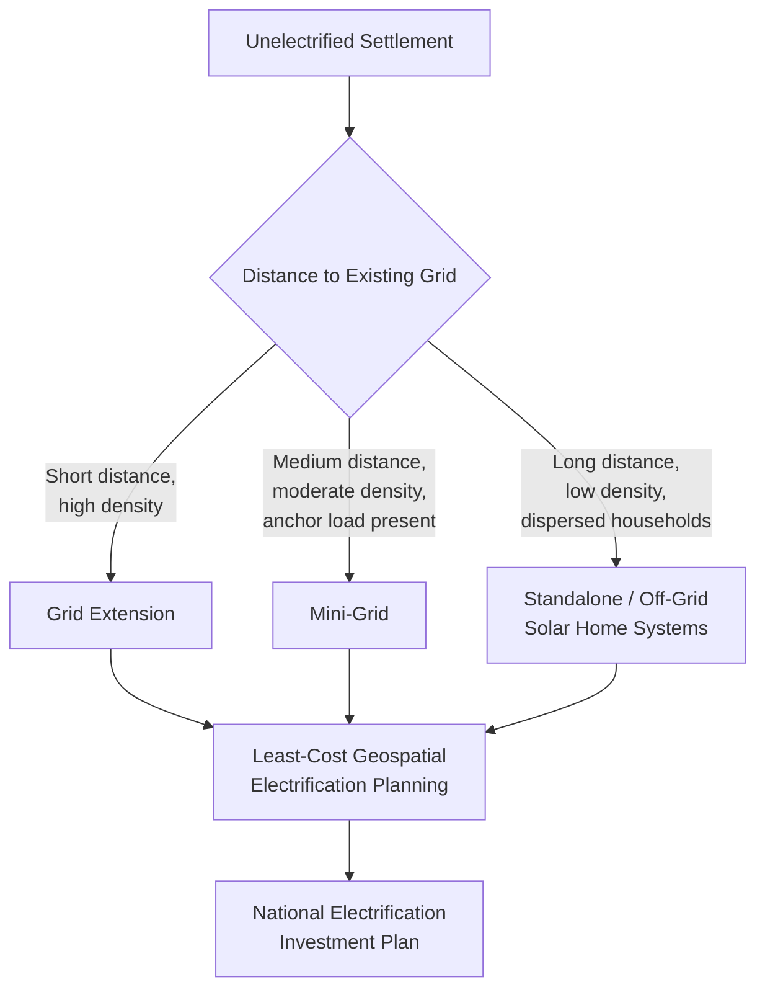

## Electrification Economics in Developing Countries

### Conceptual Foundations

Electrification economics studies the costs, benefits, financing structures, and welfare effects of extending electricity access to unconnected or under-served populations, primarily in low- and middle-income countries. It sits at the intersection of infrastructure economics, development economics, and public finance, because electrification decisions combine three features that rarely coincide elsewhere: **large sunk capital costs**, **strong positive externalities**, and **severe affordability constraints** among the target population.

The central economic problem is that the *social* returns to electrification (health, education, productivity, gender, and time-use benefits) are argued in the literature to exceed the *private* returns captured by a commercial utility charging cost-reflective tariffs, which is the standard justification for public intervention, subsidy, or blended finance in this sector. This is a widely accepted theoretical framing rather than a universally quantified empirical constant, since realized private and social returns vary substantially by context and study design.

---

### Supply-Side Economics: Grid, Mini-Grid, and Off-Grid

The choice of electrification technology is fundamentally a **least-cost planning problem** shaped by population density, distance to existing grid infrastructure, demand density, and terrain.

#### 1. Grid Extension

- Dominant mode historically and generally the lowest per-connection cost where population density is sufficiently high and proximity to the existing transmission/distribution network is close.
- Costs are dominated by **distribution network capital expenditure** (poles, conductors, transformers, service drops) rather than generation, particularly for the "last mile."
- Exhibits strong **economies of density**: cost per connection falls sharply as the number of connections per kilometer of line rises, meaning grid extension economics are highly sensitive to settlement patterns and connection uptake rates (a low uptake rate — the "take-up problem" — can turn an otherwise viable extension uneconomic).

**Key Points**

- Grid extension is generally most economic in "densification" zones near existing infrastructure; per-connection cost rises steeply for dispersed rural populations far from existing lines.
- Utilities and planners commonly use **GIS-based least-cost electrification planning tools** (e.g., the OnSSET / Network Planner methodology) to determine the optimal technology mix by settlement, based on modeled distance-to-grid, population, and demand assumptions.

#### 2. Mini-Grids

- Small, localized generation-and-distribution systems (diesel, solar PV, solar-hybrid, or small hydro) serving a cluster of consumers, either isolated or eventually grid-interconnected.
- Economically favored in medium-density settlements too far from the grid for extension to be cost-effective but with enough anchor demand (schools, health clinics, small enterprises, agro-processing) to support viable unit economics.

**Key Points**

- Mini-grid viability is highly sensitive to **anchor load** — a small number of high-consumption commercial/institutional customers can substantially lower the average tariff needed for cost recovery across the whole customer base.
- **Stranding risk** is a major financing concern: if the national grid later reaches a mini-grid site, the operator's assets may be stranded or require costly interconnection/buyout arrangements. This has become a significant regulatory design issue in several country mini-grid programs; the general magnitude of this risk across countries is context-dependent and not reducible to a single statistic [Inference].
- Regulatory frameworks (tariff-setting methodology, interconnection rules, subsidy eligibility) are widely cited as a binding constraint on mini-grid scale-up in many markets, arguably more than technology cost.

#### 3. Off-Grid / Standalone Systems (Solar Home Systems, Pico-Solar)

- Individual household-level systems, ranging from small pico-solar lighting/phone-charging kits (Tier 1, Multi-Tier Framework) to larger Solar Home Systems (SHS) capable of powering appliances (Tier 2–3).
- Economically favored for the most remote, low-density, low-demand populations where both grid extension and mini-grids are not cost-effective.

**Key Points**

- The dominant commercial innovation enabling scale-up has been **Pay-As-You-Go (PAYGo) financing**, where households pay in small installments (often via mobile money) for a system whose cost would otherwise require unaffordable upfront capital, with remote lock-out technology used to enforce payment.
- Off-grid systems generally deliver lower service tiers than grid or mini-grid connections, so while cost-effective at closing the access gap, they may not fully substitute for higher-tier productive-use electrification.

#### Least-Cost Technology Selection Logic

---

### Demand-Side Economics

#### Willingness to Pay and Connection Uptake

Even where supply is technically available, **connection rates lag availability** in many settings due to:

- Upfront connection fees (wiring, meter, service drop) that can exceed a poor household's monthly income multiple times over.
- Low or uncertain willingness to pay when perceived reliability is low or expected consumption value is uncertain.
- Split incentives in rental housing (landlords bear connection cost, tenants capture benefit).

**Key Points**

- Empirical willingness-to-pay estimates for grid connection vary substantially by country, income level, and elicitation method (stated preference surveys vs. revealed preference from uptake data), so single point estimates should not be treated as generalizable across contexts. The specific magnitudes require citation to a particular study [Unverified], though the general pattern — WTP often below cost-reflective connection charges — is a widely replicated finding in the literature.
- This affordability gap is the standard economic justification for **subsidized connection fees**, **results-based financing**, and **micro-financing of connection costs** (allowing households to pay connection fees in installments similar to PAYGo).

#### The Demand Growth Problem ("Under-Consumption" Post-Connection)

A widely documented phenomenon in rural electrification is that newly connected households often consume far less electricity than utility planners project, undermining the revenue assumptions used to justify grid extension investment.

**Key Points**

- Low initial consumption is generally attributed to a combination of low appliance ownership, income constraints, and unfamiliarity/uncertainty about electricity's productive uses — these are the most commonly cited factors in the literature, but their relative weight is context-specific.
- This creates a **circularity/coordination problem**: households under-invest in appliances because they are uncertain electricity supply will be reliable; utilities under-invest in reliability because measured demand is low. Some studies frame this as a self-reinforcing low-level equilibrium, though this framing should be treated as an analytical model rather than an empirically universal law [Inference].
- Complementary interventions (appliance financing, productive-use promotion programs, agricultural processing equipment subsidies) are commonly paired with electrification programs specifically to break this cycle.

---

### Cost-Benefit Analysis Framework

A standard electrification project cost-benefit analysis compares the discounted stream of costs against the discounted stream of benefits over the project's economic life:

$$NPV = \sum_{t=0}^{T} \frac{B_t - C_t}{(1+r)^t}$$

where $B_t$ is total benefits in year $t$, $C_t$ is total costs in year $t$, and $r$ is the discount rate (often a social discount rate distinct from a commercial hurdle rate when public/social returns are being assessed).

**Cost components** typically include:

- Generation capacity (or grid supply cost allocation)
- Distribution network capital expenditure
- Connection costs (meters, service drops, household wiring)
- Operations and maintenance
- Transmission and distribution losses

**Benefit components** are more contested and generally divided as follows:

| Benefit Category | Description | Measurement Approach |
| --- | --- | --- |
| Direct consumer surplus | Value households place on lighting, appliance use, reduced kerosene/candle spend | Willingness-to-pay studies, expenditure substitution |
| Productivity/income effects | Enterprise creation, extended business hours, agro-processing | Panel data, difference-in-differences on income/enterprise outcomes |
| Health effects | Reduced indoor air pollution (if displacing kerosene lighting/biomass), improved health facility functioning | Health outcome studies, cold-chain/vaccine refrigeration studies |
| Education effects | Extended study hours, lighting quality, school electrification (fans, computers, lab equipment) | Test score and enrollment studies |
| Gender/time-use effects | Reduced time burden from fuel collection, lighting-enabled time reallocation | Time-use surveys |
| Avoided costs | Displaced expenditure on kerosene, candles, battery charging, diesel generator fuel | Household expenditure surveys |

**Key Points**

- A substantial and still-active empirical literature (using randomized and quasi-experimental designs) has produced **mixed findings** on the magnitude of household income and welfare effects from grid electrification, in contrast to the more optimistic assumptions embedded in many earlier cost-benefit appraisals. This divergence between early program-appraisal assumptions and more recent rigorous impact evaluations is a well-documented pattern in the development economics literature, though the precise causal mechanisms and heterogeneity across contexts remain an active research area.
- This has shifted appraisal practice toward more conservative benefit assumptions and greater emphasis on **complementary interventions** (productive-use promotion, appliance access) needed to realize projected income gains, rather than assuming electrification mechanically generates them.

---

### Financing Structures

#### Public Utility Model

- State-owned or state-regulated utility undertakes electrification as part of a national universal access plan, financed through a mix of tariff revenue, government budget allocation, and donor/multilateral concessional lending.
- Tariffs are frequently **cross-subsidized**: urban/industrial consumers pay above cost-reflective rates to subsidize rural/residential "lifeline" tariffs for low-consumption households.

#### Results-Based Financing (RBF)

- Donors or governments disburse subsidy payments to private developers (mini-grid or off-grid) **only after verified connections** are made and operational, shifting execution risk to the developer while ensuring public funds are tied to demonstrated outcomes.
- Widely used in mini-grid and off-grid market development programs across multiple countries as a mechanism to de-risk private investment while maintaining accountability for public subsidy spending. Relative effectiveness compared to alternative subsidy mechanisms is context-dependent and the subject of ongoing program evaluation [Inference].

#### Blended Finance and Development Finance Institution (DFI) Participation

- Concessional capital (grants, guarantees, first-loss tranches) from DFIs and donors is layered with commercial capital to lower the effective cost of capital for private electrification developers, compensating for perceived country and sector risk premiums that would otherwise make projects uninvestable on purely commercial terms.

#### Universal Service Obligation / Cross-Subsidy Levies

- Some countries impose a small levy on all electricity consumers (or telecom users, in some rural connectivity fund models) to fund a dedicated **Rural/Universal Electrification Fund**, used to subsidize connection costs or capital expenditure for underserved areas.

**Key Points**

- Financing structure choice interacts directly with technology choice: grid extension is generally financed through sovereign/utility balance sheets and concessional lending, while mini-grid and off-grid programs increasingly rely on blended private-sector financing models given their smaller, more distributed capital requirements.

---

### Tariff Design and Affordability

#### Increasing Block Tariffs (IBT)

A common tariff structure in developing-country electrification designed to balance cost recovery with affordability: the price per kWh rises in "blocks" as consumption increases, so that a low "lifeline" block covers basic needs at a subsidized rate, while higher consumption blocks are priced closer to or above cost-reflective levels to cross-subsidize the lifeline block.

$$\text{Total Bill} = \sum_{i=1}^{n} p_i \cdot q_i, \quad \text{where } p_1 < p_2 < \dots < p_n$$

with $q_i$ the quantity consumed within block $i$ and $p_i$ the corresponding block price.

**Key Points**

- IBTs are politically popular because they appear pro-poor, but their actual distributional effectiveness depends heavily on the correlation between household income and consumption level — in settings where poor households have not yet connected (or connect but consume very little regardless of income due to appliance constraints), a meaningful share of the lifeline subsidy can leak to non-poor consumers who happen to have low consumption for other reasons; this is a well-established critique in the utility tariff design literature.
- Alternative/complementary mechanisms include **targeted lifeline tariffs conditioned on connection type or geographic zone**, and **direct cash transfers** as an alternative to price subsidies, which avoid the consumption-distorting incentives of below-cost block pricing.

---

### Losses, Theft, and Revenue Collection

A persistent economic challenge in many developing-country utilities is high **Aggregate Technical, Commercial, and Collection (AT&C) losses** — combining technical losses (line losses), commercial losses (unmetered/illegal connections, meter tampering), and collection losses (billed but uncollected revenue).

**Key Points**

- High AT&C losses erode utility revenue, undermining the "virtuous cycle" of tariff revenue funding network maintenance and further expansion, and can perpetuate a low-investment, low-reliability equilibrium.
- Reducing losses is frequently identified as a precondition for improving both financial sustainability and service reliability, though the specific technical/commercial/collection loss decomposition and the most effective remediation strategy (smart metering, prepayment metering, feeder-level accountability, anti-theft enforcement) is highly context-specific and should not be generalized from any single country case without verification [Unverified for any specific figure].

---

### Illustrative Diagram: Electrification Investment and Demand Feedback Loops (svg_diagram)

<svg xmlns="http://www.w3.org/2000/svg" viewBox="0 0 760 420" font-family="Arial, sans-serif" font-size="12">
<text x="380" y="24" text-anchor="middle" font-size="16" font-weight="bold">Electrification Investment and Demand Feedback Loops (svg_diagram)</text>
<rect x="30" y="60" width="180" height="50" rx="6" fill="#6fa8dc" stroke="#333" />
<text x="120" y="90" text-anchor="middle" fill="white">Grid/Mini-Grid Investment</text>
<rect x="290" y="60" width="180" height="50" rx="6" fill="#a9d18e" stroke="#333" />
<text x="380" y="80" text-anchor="middle">Household &amp; Enterprise</text>
<text x="380" y="96" text-anchor="middle">Connections</text>
<rect x="550" y="60" width="180" height="50" rx="6" fill="#f7d060" stroke="#333" />
<text x="640" y="80" text-anchor="middle">Electricity</text>
<text x="640" y="96" text-anchor="middle">Consumption Level</text>
<rect x="550" y="180" width="180" height="50" rx="6" fill="#f0ad4e" stroke="#333" />
<text x="640" y="210" text-anchor="middle">Utility Revenue</text>
<rect x="290" y="180" width="180" height="50" rx="6" fill="#d9534f" stroke="#333" />
<text x="380" y="200" text-anchor="middle" fill="white">Reliability &amp;</text>
<text x="380" y="216" text-anchor="middle" fill="white">Service Quality</text>
<rect x="30" y="180" width="180" height="50" rx="6" fill="#3d5a80" stroke="#333" />
<text x="120" y="200" text-anchor="middle" fill="white">Appliance Ownership</text>
<text x="120" y="216" text-anchor="middle" fill="white">&amp; Productive Use</text>
<rect x="290" y="300" width="180" height="50" rx="6" fill="#8e7cc3" stroke="#333" />
<text x="380" y="320" text-anchor="middle" fill="white">Household Income /</text>
<text x="380" y="336" text-anchor="middle" fill="white">Enterprise Growth</text>
<line x1="210" y1="85" x2="290" y2="85" stroke="#333" stroke-width="2" marker-end="url(#arrow)" />
<line x1="470" y1="85" x2="550" y2="85" stroke="#333" stroke-width="2" marker-end="url(#arrow)" />
<line x1="640" y1="110" x2="640" y2="180" stroke="#333" stroke-width="2" marker-end="url(#arrow)" />
<line x1="550" y1="205" x2="480" y2="205" stroke="#333" stroke-width="2" marker-end="url(#arrow)" />
<line x1="290" y1="205" x2="210" y2="205" stroke="#333" stroke-width="2" marker-end="url(#arrow)" />
<line x1="120" y1="230" x2="120" y2="325" stroke="#333" stroke-width="2" marker-end="url(#arrow)" />
<line x1="210" y1="325" x2="290" y2="325" stroke="#333" stroke-width="2" marker-end="url(#arrow)" />
<line x1="380" y1="300" x2="380" y2="230" stroke="#333" stroke-width="2" stroke-dasharray="5,4" marker-end="url(#arrow)" />
<text x="500" y="270" font-size="10" fill="#555">Dashed = reinforcing feedback into future demand</text>
</svg>

---

### Worked Example: Simplified Grid Extension vs. Mini-Grid Comparison

Assume a settlement of 200 households, 15 km from the nearest grid connection point.

**Grid extension option**:

- Distribution line cost: $12,000/km × 15 km = $180,000
- Transformer and connection hardware: $40,000
- Total capital cost: $220,000
- Per-connection cost: $220{,}000 / 200 = \$1{,}100$

**Mini-grid option** (solar-hybrid):

- Generation + storage + distribution: $150,000
- Per-connection cost: $150{,}000 / 200 = \$750$

In this simplified illustration, the mini-grid has a lower per-connection capital cost due to the avoided long-distance distribution line — but the comparison must also account for **differences in expected reliability, service tier, ongoing operating/fuel costs, asset lifespan, and stranding risk if the grid eventually reaches the settlement**, all of which affect the full lifecycle cost-effectiveness ranking. This example is illustrative only; the cost figures are stylized and not drawn from a specific country dataset. Real-world per-kilometer and per-connection costs vary substantially by terrain, labor costs, and country context and must be sourced from local engineering cost data for actual appraisal [Unverified as general figures].

---

### Measurement and Impact Evaluation Methods

- **Randomized Controlled Trials (RCTs)**: used in several influential studies to estimate the causal effect of grid connection on household income, education, and health outcomes by randomizing connection subsidies or rollout timing.
- **Difference-in-Differences (DiD)**: exploits staggered electrification rollout across villages/districts to compare outcome trends between newly connected and not-yet-connected areas.
- **Instrumental Variables (IV)**: commonly uses variation from historical grid planning decisions (e.g., distance to transmission lines built for reasons unrelated to local economic potential) as an instrument for electrification status, addressing the endogeneity of electrification placement.
- **Multi-Tier Framework (MTF) household surveys**: link electrification impact evaluation to the specific *tier* of service received, rather than binary connection status.

**Key Points**

- Method choice materially affects estimated impact magnitudes; a comprehensive reading of the empirical electrification-impact literature should track the identification strategy used rather than treating point estimates as universally generalizable.

---

### Related Topics

- Defining and measuring energy poverty and access (Multi-Tier Framework detail)
- Least-cost geospatial electrification planning tools (OnSSET, Network Planner methodology)
- Pay-As-You-Go (PAYGo) solar business models and mobile money integration
- Productive use of electricity (PUE) promotion programs
- Utility financial sustainability and AT&C loss reduction strategies
- Results-based financing design in donor-funded energy access programs
- Mini-grid regulatory frameworks and grid-arrival/stranding risk mitigation
- Cross-subsidization and increasing block tariff design trade-offs
- Impact evaluation methodology for infrastructure programs (RCT, DiD, IV approaches)
- Energy access finance: blended finance and development finance institution instruments