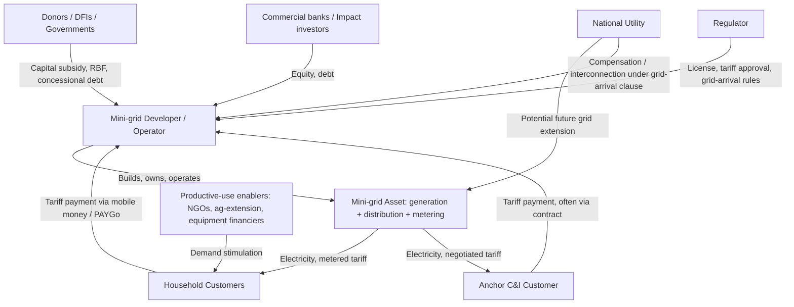

## Off-grid and Mini-grid Business Models

### Conceptual Framework

Off-grid and mini-grid business models are the institutional and financial arrangements through which electricity access is delivered outside the reach of, or as a substitute for, centralized national grid extension. These models are central to energy access economics because grid extension is frequently not the least-cost option for reaching dispersed or low-density populations, and least-cost electrification planning (LCEP) explicitly compares grid extension, mini-grids, and standalone systems on a geospatial, cost-per-connection basis.

**Key Points**

- The World Bank/ESMAP "Multi-Tier Framework" (MTF) reclassified electricity access away from a binary connected/unconnected metric toward a spectrum (Tiers 0–5) measured across capacity, availability, reliability, quality, affordability, legality, and health and safety. This matters economically because off-grid and mini-grid systems often deliver a different (usually lower) tier of service than grid connections, and business models must be evaluated against the tier they actually provide.
- The three broad technology/market segments are: (1) standalone/off-grid systems (solar lanterns, solar home systems, SHS), (2) mini-grids (isolated generation-and-distribution networks typically serving a village, cluster of villages, or commercial/industrial anchor load), and (3) grid extension. Each has a different cost curve as a function of population density and distance from the existing grid.
- [Inference] The relative competitiveness of mini-grids versus grid extension versus standalone systems is highly sensitive to local demand density, anticipated demand growth, and grid-extension cost assumptions; country-specific geospatial planning tools (e.g., OnSSET, the World Bank's Global Electrification Platform) should be consulted rather than relying on generic global averages.

### The Off-Grid / Mini-grid Technology-Market Segmentation

| Segment | Typical Scale | Typical Technology | Typical Ownership | Primary Revenue Model |
| --- | --- | --- | --- | --- |
| Solar lanterns / pico-solar | <10 W | Solar PV + battery + LED | Household-owned (outright or PAYGo) | One-off sale or pay-as-you-go (PAYGo) micro-installments |
| Solar Home Systems (SHS) | 10 W–350 W | Solar PV + battery + DC appliances | Household-owned (PAYGo financed) | PAYGo installments, often mobile-money enabled |
| Mini-grids (isolated) | 10 kW–10 MW | Solar PV, hybrid solar-diesel, small hydro, biomass, wind | Private developer, utility, cooperative, or community | Metered tariff (often cost-reflective or subsidized), connection fees |
| Interconnected mini-grids | Varies | Same as above, designed for eventual/actual grid arrival | Private developer, sometimes with buy-out clause | Metered tariff; often includes grid-arrival compensation clause |
| Grid extension | N/A | Central/national grid | National utility | Regulated tariff (often cross-subsidized) |

### Core Business Model Archetypes for Mini-grids

Mini-grid business models are typically classified by who owns and operates the asset, and this ownership structure determines the risk allocation, financing structure, and regulatory treatment.

1. **Private developer (independent mini-grid operator, IMGO) model** — a private company develops, owns, operates, and bills for the mini-grid under a license or permit; revenue is collected directly from customers via tariffs.
2. **Utility-led model** — the national or regional utility develops and operates mini-grids as an extension of its own service territory, often used where the utility has a legal universal-service obligation.
3. **Community/cooperative model** — a local cooperative or community-based organization owns and/or operates the system, often with technical support from an NGO or donor, with tariffs typically set closer to cost-recovery of operations rather than full capital recovery.
4. **Hybrid public-private partnership (PPP) model** — capital subsidy (often results-based) from a donor or government is combined with private operation and maintenance (O&M), used to bridge the viability gap where full-cost tariffs would be unaffordable.
5. **Anchor-load / commercial-and-industrial (C&I) model** — a mini-grid is built primarily to serve a creditworthy commercial anchor customer (telecom tower, agro-processing facility, mine), with village or household connections added as a secondary revenue stream that improves the load factor and unit economics.

**Example**

In many Sub-Saharan African mini-grid programs (e.g., under frameworks supported by the World Bank's ESMAP and the Africa Minigrids Program), a common structure combines (a) a results-based financing (RBF) capital subsidy per connection or per kW installed, (b) a private developer responsible for construction and 10–15 year operation, and (c) a regulator-approved or negotiated tariff that is cost-reflective but capped, with the subsidy closing the gap between the cost-reflective tariff and an affordability ceiling. [Unverified] Specific subsidy levels, per-connection costs, and tariff caps vary substantially by country and program vintage and should be checked against current program documentation rather than assumed from older published figures.

### Financial Structuring and the Viability Gap

**Key Points**

- The central financial challenge in mini-grid economics is the **viability gap**: the difference between the tariff required for full private cost recovery (capex plus opex plus a required return) and the tariff that is politically or socially acceptable/affordable to end users, who are often also served (or eventually will be served) by a subsidized national grid tariff.
- **Results-Based Financing (RBF)** is the dominant subsidy mechanism used to close this gap: subsidy disbursement is conditioned on verified outputs (e.g., a new connection actually made and metered, or a kW of capacity actually commissioned), rather than on inputs, intended to reduce the risk of subsidizing non-performing assets.
- The standard project finance framing for a mini-grid uses a discounted cash flow (DCF) with the Levelized Cost of Electricity (LCOE) as the core unit-economics metric:

$$LCOE = \frac{\sum_{t=0}^{n} \dfrac{CAPEX_t + OPEX_t}{(1+r)^t}}{\sum_{t=0}^{n} \dfrac{E_t}{(1+r)^t}}$$

where $CAPEX_t$ and $OPEX_t$ are capital and operating expenditures in year $t$, $E_t$ is electricity delivered (kWh) in year $t$, and $r$ is the discount rate (weighted average cost of capital, WACC). Mini-grid LCOE is highly sensitive to the load factor (actual average demand relative to installed capacity), because much of the capex is sized for peak demand while revenue is earned on the (often much lower) average consumption.

- **Demand risk** is typically the single largest driver of mini-grid underperformance relative to business plan projections: household demand for electricity frequently grows more slowly than forecast at project appraisal, directly compressing realized revenue against a fixed capex base. [Inference] This pattern is widely cited across multiple mini-grid evaluation studies, though the magnitude of the demand shortfall varies substantially by country, tariff design, and the presence or absence of complementary productive-use interventions.
- **Productive use of energy (PUE)** interventions — deliberately stimulating income-generating uses of electricity (irrigation pumps, milling, cold storage, welding) alongside or ahead of mini-grid commissioning — are widely used specifically to counteract demand risk by raising and smoothing daytime load, improving the load factor and per-kWh cost recovery.

### Tariff Design Approaches

| Approach | Description | Typical Use Case |
| --- | --- | --- |
| Cost-reflective tariff | Set to recover full capex and opex over the asset life at the required return | Private developer models without heavy subsidy |
| Subsidized/uniform national tariff | Mini-grid customers pay the same regulated tariff as grid customers, gap covered by subsidy | Utility-led or PPP models with strong government commitment to tariff equality |
| Two-part tariff (fixed + volumetric) | Fixed monthly charge covers a share of fixed costs; volumetric (per-kWh) charge covers variable costs and remaining fixed-cost recovery | Common across most mini-grid models to manage revenue stability given low and volatile consumption |
| Lifeline/tiered tariff | Low or subsidized rate for a minimum "lifeline" consumption band, higher rate above it | Programs prioritizing affordability for basic needs while allowing cost recovery on higher (often productive-use) consumption |
| Pay-as-you-go (PAYGo) | Customers pre-pay via mobile money in small increments; a smart meter or SHS controller enforces service disconnection on non-payment | Both mini-grids and standalone SHS; addresses collection risk and enables asset financing against a granular repayment stream |

**Key Points**

- PAYGo is as much a **credit-risk management and asset-financing innovation** as a customer convenience feature: because SHS and mini-grid connection equipment can be remotely disabled on non-payment, the equipment itself becomes closer to viable loan collateral, which has been a key enabler of consumer-financing models for a customer base largely outside formal credit and collateral systems.
- [Inference] PAYGo default and repayment-rate data are proprietary to individual companies and vary widely by market and macroeconomic conditions (e.g., currency depreciation, agricultural income seasonality); specific default-rate figures from older literature should not be assumed to generalize to current markets.

### Grid Arrival Risk and Regulatory Interface

**Key Points**

- **Grid arrival risk** — the risk that the national grid eventually reaches a mini-grid's service area, potentially stranding the mini-grid asset or forcing a costly and legally contested interconnection or buy-out — is one of the most significant deterrents to private mini-grid investment, addressed through several regulatory mechanisms:
  - **Compensation/buy-out clauses**: mandating that the utility compensate the mini-grid developer for the depreciated (or agreed) asset value upon grid arrival.
  - **Interconnection agreements**: converting the mini-grid into an embedded/distributed generator feeding into the arriving grid rather than shutting it down, preserving asset value as a generation source.
  - **Exclusivity zones or "no-go" designations**: temporarily or permanently excluding areas with existing mini-grids from centralized grid-extension planning.
- Licensing regimes for mini-grids range from **light-touch/no-license-required** for very small systems up to full generation-and-distribution licensing similar to that required of the national utility for larger systems. [Unverified] Exact kW thresholds and licensing categories differ by country and are periodically revised, so current national regulatory guidelines should be consulted directly.
- Tariff-setting authority (whether the developer can set its own cost-reflective tariff, or must obtain regulator approval) is one of the most consequential single regulatory design choices, since regulator-imposed tariffs below cost-recovery levels are a frequently cited cause of mini-grid project underperformance and developer exit.

### Value Chain and Stakeholder Map

### Off-Grid Standalone Systems: Business Model Detail

**Key Points**

- The dominant commercial model for solar home systems in the last decade has been **PAYGo consumer financing**, in which a company (often vertically integrated across manufacturing/import, distribution, and financing) sells a system on installment terms typically ranging from several months to a few years, with mobile-money micropayments unlocking continued use via a remote-disable/enable controller.
- Unit economics for PAYGo SHS companies center on **customer acquisition cost (CAC)**, **average revenue per user (ARPU)**, and **default/write-off rates**, analogous to subscription/fintech business metrics rather than traditional utility metrics. A simplified customer lifetime value (LTV) framework is:

$$LTV = \sum_{t=1}^{T} \frac{ARPU_t \times (1 - churn_t)}{(1+r)^t} - CAC$$

- [Inference] Because PAYGo SHS companies are simultaneously hardware distributors, telecom-adjacent payment platforms, and consumer lenders, they face a compound set of regulatory regimes (electronic money regulations, consumer credit rules, import/customs duties on solar equipment, e-waste regulations), and this regulatory burden is frequently cited as a material cost driver, though the magnitude varies significantly by country.
- Standalone systems and mini-grids are not strictly competing models; in a well-functioning market they are sequenced according to the tier of service and density of demand — a standalone SHS may serve a household adequately at low consumption tiers, while demand growth (toward productive uses, refrigeration, or multiple appliances) creates a natural upgrade path toward mini-grid or grid connection, which some national electrification strategies explicitly plan for as "tiered densification."

### Risk Allocation Summary

| Risk Category | Typical Bearer in Private-Led Model | Typical Mitigation |
| --- | --- | --- |
| Demand/off-take risk | Developer/investor | Productive-use programs, anchor loads, conservative sizing, phased capacity additions |
| Currency/FX risk | Developer/investor (if revenue in local currency, debt in hard currency) | Local-currency debt facilities, DFI guarantees, tariff indexation clauses |
| Grid-arrival/stranding risk | Developer/investor, absent regulation | Buy-out clauses, interconnection rights, exclusivity zones |
| Collection/payment risk | Developer/investor | PAYGo/prepayment, mobile money, remote disconnection |
| Regulatory/tariff risk | Developer/investor | Long-term tariff agreements, RBF disbursement independent of tariff level, regulatory sandboxes |
| Technical/O&M risk | Developer/operator | Performance-based O&M contracts, remote monitoring (SCADA/IoT), local technician training |
| Construction/completion risk | Developer/EPC contractor | Fixed-price EPC contracts, performance bonds |

### Illustrative Cost-Structure Comparison

The diagram below illustrates a stylized comparison of the cost components underlying LCOE across the three main electrification pathways, showing why density and distance drive technology choice.

<svg viewBox="0 0 640 380" xmlns="http://www.w3.org/2000/svg" font-family="Helvetica, Arial, sans-serif">
<title>Stylized LCOE Cost Structure by Electrification Pathway (svg_diagram)</title>
<rect x="0" y="0" width="640" height="380" fill="#ffffff"/>
<text x="320" y="28" text-anchor="middle" font-size="16" font-weight="bold" fill="#1a1a1a">Stylized LCOE Cost Structure by Pathway (svg_diagram)</text>

<text x="60" y="70" font-size="13" fill="`#1a1a1a`">Grid Extension</text>

<rect x="180" y="55" width="120" height="24" fill="`#2980b9`"/>

<text x="185" y="72" font-size="11" fill="`#ffffff`">Transmission/distribution capex (high)</text>

<rect x="180" y="82" width="60" height="24" fill="`#5dade2`"/>

<text x="185" y="99" font-size="11" fill="`#1a1a1a`">Generation (shared, low marginal)</text>

<text x="60" y="160" font-size="13" fill="`#1a1a1a`">Mini-grid</text>

<rect x="180" y="145" width="90" height="24" fill="`#c0392b`"/>

<text x="185" y="162" font-size="11" fill="`#ffffff`">Local generation + storage capex</text>

<rect x="180" y="172" width="50" height="24" fill="`#e67e22`"/>

<text x="185" y="189" font-size="11" fill="`#1a1a1a`">O&M + fuel (if hybrid)</text>

<rect x="180" y="199" width="35" height="24" fill="`#f39c12`"/>

<text x="185" y="216" font-size="11" fill="`#1a1a1a`">Local distribution capex</text>

<text x="60" y="270" font-size="13" fill="`#1a1a1a`">Standalone SHS</text>

<rect x="180" y="255" width="55" height="24" fill="`#1e8449`"/>

<text x="185" y="272" font-size="11" fill="`#ffffff`">Unit hardware capex</text>

<rect x="180" y="282" width="20" height="24" fill="`#58d68d`"/>

<text x="185" y="299" font-size="11" fill="`#1a1a1a`">Financing/collection cost</text>

<text x="60" y="345" font-size="12" fill="`#555555`">Bar length is illustrative only; relative cost driver mix</text>

<text x="60" y="362" font-size="12" fill="`#555555`">depends heavily on population density and distance from existing grid.</text>

</svg>

### Monitoring, Evaluation, and Impact Measurement

**Key Points**

- Standard monitoring indicators used by donors and regulators include: number of active connections, verified consumption (kWh/customer/month), tariff collection rate, system uptime/availability (hours per day of service), and productive-use connection share.
- Impact evaluation of energy-access programs commonly draws on randomized controlled trials (RCTs) or quasi-experimental designs to measure downstream effects on household income, education (study hours under lighting), health (reduced kerosene use and indoor air pollution), and micro-enterprise formation. [Inference] The empirical literature on the magnitude of these downstream welfare effects has been mixed across studies and contexts; some influential RCTs have found smaller-than-expected income effects from basic electrification alone absent complementary productive-use support, which underpins the current sector emphasis on demand stimulation rather than relying on electrification supply alone.

### Conclusion

Off-grid and mini-grid business models are best understood as risk-allocation and subsidy-design problems layered on top of an electrical engineering system, rather than as purely technical deployments. The dominant economic challenges — the viability gap between cost-reflective tariffs and affordability, demand-risk-driven underutilization of installed capacity, and regulatory uncertainty around eventual grid arrival — are addressed through a recurring toolkit: results-based capital subsidies, PAYGo/prepayment mechanisms for collection-risk management, tariff structures balancing affordability with cost recovery, and regulatory instruments (licensing thresholds, buy-out clauses, interconnection rights) that de-risk private investment. The choice among standalone systems, mini-grids, and grid extension is a function of population density, distance from the existing grid, and anticipated demand growth, and national electrification strategies increasingly plan these pathways as complementary and sequenced rather than competing.

**Related Topics**

- Least-cost electrification planning (LCEP) and geospatial electrification tools (e.g., OnSSET, Global Electrification Platform)
- World Bank Multi-Tier Framework (MTF) for measuring energy access
- Results-Based Financing (RBF) design in energy access programs
- Productive use of energy (PUE) and agricultural value-chain electrification
- Mobile money and digital financial inclusion as enablers of PAYGo models
- Mini-grid interconnection standards and distributed energy resource (DER) integration
- Energy access finance: blended finance, concessional debt, and de-risking instruments (e.g., guarantees)
- Gender dimensions of energy access and productive-use adoption
- Rural electrification cross-subsidy design in national tariff structures
- Carbon finance and results-based carbon credits for clean cooking and mini-grid programs