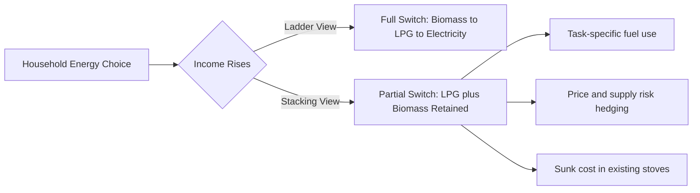

## Clean Cooking Fuel Transition Economics

### Definition and Scope

Clean cooking fuel transition economics studies the household- and market-level factors governing the shift from solid biomass fuels (wood, charcoal, crop residues, dung) and kerosene toward cleaner cooking energy sources: liquefied petroleum gas (LPG), electricity (induction/resistive), biogas, ethanol, natural gas (piped), and improved biomass technologies (efficient stoves, pellets). It sits at the intersection of energy economics, development economics, environmental health, and gender economics, since fuel choice affects household budgets, indoor air pollution, deforestation, time allocation, and public health outcomes.

### The Energy Ladder and Stacking Models

**Energy Ladder Model**

The traditional framework posits that as household income rises, consumers move monotonically up a "ladder" from traditional biomass to transitional fuels (kerosene, charcoal) to modern fuels (LPG, electricity), analogous to an Engel curve for energy quality.

**Fuel Stacking (Multiple Fuel Model)**

Empirical evidence robustly shows households rarely abandon traditional fuels entirely; instead they "stack" — using LPG for quick meals and firewood for slow-cooking or bulk meals, especially in rural areas. Stacking arises because:

- Fuels are imperfect substitutes across cooking tasks (taste, heat control, pot size)
- Price volatility and supply unreliability of modern fuels create precautionary use of free/gathered biomass
- Upfront appliance costs deter full switching even when the fuel itself is affordable

### Household Decision-Making Framework

**Utility Maximization with Fuel Choice**

A standard model treats the household as minimizing the cost of delivered cooking energy services subject to a production function combining fuel, appliance capital, and time:

$$\min_{f_i, K, T} \sum_i p_i f_i + rK + wT \quad \text{s.t. } Q(f_i, K, T) \geq \bar{Q}$$

where $p_i$ is the price of fuel $i$, $f_i$ is quantity consumed, $r$ is the rental/amortized cost of appliance capital $K$, $w$ is the shadow wage (often the opportunity cost of time, frequently women's or children's time spent collecting biomass), and $\bar{Q}$ is required cooking energy service output.

**Key Points**

- Full fuel cost includes appliance capital cost (stove/cylinder), not just per-unit fuel price — this is the central market failure in clean fuel adoption
- Time cost of fuel collection is often zero in cash terms but strictly positive in shadow-price terms, causing biomass to appear artificially cheap in household accounting
- Fuel efficiency (useful energy delivered per unit purchased) differs sharply across fuels: LPG stoves are typically 55-65% thermally efficient versus 10-20% for open three-stone fires, meaning nominal fuel-price comparisons understate LPG's economic competitiveness

### Barriers to Transition

**Upfront Capital Cost and Credit Constraints**

The largest single barrier is not the marginal cost of fuel but the lumpy upfront cost of the stove and, for LPG, the cylinder deposit. Poor households facing binding credit constraints and no formal collateral cannot smooth this cost, even when the net present value of switching is strongly positive over a multi-year horizon.

**Supply Chain and "Last-Mile" Distribution**

LPG cylinder refilling requires dense distribution networks; in remote/rural areas, transport costs and cylinder-empty stockouts raise effective delivered prices well above urban benchmarks, and unreliable refill availability reintroduces stacking behavior even among adopters.

**Price Volatility**

LPG and kerosene prices are linked to international petroleum markets and exchange rates, exposing households to volatility that biomass (often self-gathered, zero cash cost) does not carry. This volatility risk is a rational deterrent to full switching, independent of average price levels.

**Information and Behavioral Failures**

- Underestimation of health costs of indoor air pollution (a classic externality/internality problem, since the health damage is diffuse, delayed, and not salient at point of purchase)
- Present bias: high discount rates among poor households favor free/low-upfront-cost biomass over cash-outlay clean fuels even when clean fuels are cheaper in present-value terms
- Status quo bias and cultural/taste preferences (smoky flavor, cooking practices tied to certain fuels)

**Gender and Intra-Household Bargaining**

Fuel collection and cooking are typically women's and children's tasks; if men control household cash and women bear the time/health cost, a principal-agent misalignment can suppress adoption of cash-cost-saving-but-cash-requiring fuels even when aggregate household welfare would rise. [Inference: the magnitude of this effect is context-dependent and varies substantially by intra-household bargaining structure across studies.]

### Market Failures and the Case for Intervention

**Negative Externalities of Biomass Use**

- **Health**: household air pollution (HAP) from solid fuel combustion is linked by the WHO to several million premature deaths annually, primarily from ischemic heart disease, stroke, COPD, and lower respiratory infections
- **Environmental**: unsustainable fuelwood/charcoal harvesting contributes to localized deforestation and forest degradation, particularly around urban charcoal supply sheds
- **Climate**: incomplete combustion of biomass and kerosene emits black carbon, a short-lived climate pollutant with high radiative forcing per unit mass

**Positive Externalities of Clean Fuel Adoption**

Reduced time poverty (less fuelwood collection time) can be reallocated to income-generating activity, child schooling, or leisure — a case for subsidizing adoption beyond private least-cost incentives (a labor/human-capital externality argument, distinct from the pollution externality).

**Justification for Subsidy**

Given these externalities, the marginal social cost of biomass exceeds its marginal private cost, and the marginal social benefit of clean fuel adoption exceeds the marginal private benefit — the standard Pigouvian logic supports subsidizing clean fuel adoption (via cylinder/stove subsidies) or taxing/regulating biomass harvesting, though the latter is politically and administratively difficult given informal, dispersed biomass markets.

### Policy Instruments

**Supply-Side / Price Subsidies**

- **LPG cylinder and connection subsidies**: reduce the upfront capital barrier directly (e.g., India's Pradhan Mantri Ujjwala Yojana, PMUY, providing free LPG connections to below-poverty-line women)
- **Consumption subsidies**: recurring per-cylinder price subsidies (fiscally costly, prone to leakage to non-target/urban households, and can encourage stacking rather than full switching since low marginal fuel price does not address stove-capital constraints for other fuels)

**Demand-Side Instruments**

- Results-based financing/carbon finance for improved cookstove programs (monetizing avoided emissions via carbon credits)
- Microfinance/pay-as-you-go (PAYG) models for stove and cylinder financing, addressing credit constraints directly
- Behavioral nudges and information campaigns on health risks

**Regulatory and Standards-Based**

- Cookstove performance standards (ISO IWA tiers for efficiency, emissions, safety, durability) to prevent low-quality "improved" stoves from crowding out genuinely clean alternatives
- Fuel quality standards and anti-adulteration enforcement in kerosene/LPG markets

### The Ujjwala Case: Subsidy Design Lessons

India's PMUY connected over 90 million households to LPG by subsidizing the connection deposit, but refill rates among beneficiaries were substantially lower than for market-rate LPG customers. This illustrates a core lesson in transition economics: **removing the capital barrier (connection) does not by itself remove the recurring marginal cost or supply-access barriers to sustained use**. [Unverified: exact refill-rate figures vary by survey year and source; directionally consistent across NSSO, CEEW, and independent evaluations but should be checked against the latest official data for precise numbers.]

### Cost-Benefit and Willingness-to-Pay Analysis

**Full Fuel Cycle Cost Comparison**

A rigorous cross-fuel comparison requires levelizing costs per unit of useful cooking energy delivered:

$$C_{useful} = \frac{p_f + \frac{r K}{Q_{annual}}}{\eta}$$

where $\eta$ is stove thermal efficiency, $p_f$ is fuel price per energy unit, $rK/Q_{annual}$ annualizes appliance capital cost per unit of annual fuel throughput.

**Example**

Comparing firewood at $\eta \approx 0.15$ against LPG at $\eta \approx 0.60$: even if firewood's per-kg nominal price is near zero (self-gathered), a household paying a positive shadow wage for collection time, or purchasing firewood/charcoal in urban markets (common in Sub-Saharan African cities), frequently finds LPG cost-competitive or cheaper per unit of useful heat once efficiency and time costs are internalized — a widely documented finding, though the specific breakeven point is highly sensitive to local fuel prices, collection time, and household discount rates. [Inference: precise breakeven thresholds are location- and time-specific and require local price data rather than generalized international benchmarks.]

**Willingness to Pay (WTP) Studies**

Randomized and quasi-experimental studies typically find stated WTP for improved cookstoves and clean fuels substantially exceeds realized adoption and sustained-use rates, indicating a large "adoption gap" driven by liquidity constraints, intra-household allocation frictions, and post-purchase usage barriers (fuel stacking, maintenance costs, taste/practice mismatch) rather than lack of demand per se.

### Electricity and Induction Cooking as an Emerging Pathway

Where grid electrification and reliable supply exist, induction and electric pressure cooking are gaining attention as a "leapfrog" clean cooking pathway, bypassing LPG import dependence entirely. Economics depend critically on:

- Retail electricity tariff structure relative to LPG price per useful-MJ
- Grid reliability (outages undermine electric cooking's practicality for time-sensitive meals)
- Appliance cost and any load-management/tariff incentives (e.g., time-of-use rates favoring off-peak cooking)

[Speculation: the relative competitiveness of electric cooking versus LPG in a given country over the next decade will depend heavily on renewable generation cost trajectories and grid investment, which are not yet fully reflected in current comparative literature.]

### Diagram: Household Fuel-Switching Cost-Benefit Structure

<svg xmlns="http://www.w3.org/2000/svg" viewBox="0 0 760 420" font-family="sans-serif">
<text x="380" y="25" text-anchor="middle" font-size="16" font-weight="bold">Household Fuel Transition Cost-Benefit Structure (svg_diagram)</text>
<rect x="30" y="60" width="320" height="150" rx="8" fill="#fde2e2" stroke="#c0392b" stroke-width="1.5" />
<text x="190" y="85" text-anchor="middle" font-size="13" font-weight="bold">Barriers (Costs)</text>
<text x="45" y="110" font-size="12">- Upfront stove/cylinder capital</text>
<text x="45" y="130" font-size="12">- Credit constraints</text>
<text x="45" y="150" font-size="12">- Price volatility risk</text>
<text x="45" y="170" font-size="12">- Distribution/last-mile access</text>
<text x="45" y="190" font-size="12">- Behavioral/present bias</text>
<rect x="410" y="60" width="320" height="150" rx="8" fill="#e2f0d9" stroke="#27ae60" stroke-width="1.5" />
<text x="570" y="85" text-anchor="middle" font-size="13" font-weight="bold">Benefits (Returns)</text>
<text x="425" y="110" font-size="12">- Reduced health costs (HAP)</text>
<text x="425" y="130" font-size="12">- Time savings (collection)</text>
<text x="425" y="150" font-size="12">- Higher stove thermal efficiency</text>
<text x="425" y="170" font-size="12">- Reduced deforestation externality</text>
<text x="425" y="190" font-size="12">- Reduced black carbon emissions</text>
<rect x="220" y="250" width="320" height="110" rx="8" fill="#eaf2fb" stroke="#2980b9" stroke-width="1.5" />
<text x="380" y="275" text-anchor="middle" font-size="13" font-weight="bold">Policy Levers</text>
<text x="235" y="300" font-size="12">- Connection/capital subsidy</text>
<text x="235" y="320" font-size="12">- PAYG microfinance</text>
<text x="235" y="340" font-size="12">- Carbon finance for stoves</text>
<line x1="190" y1="210" x2="350" y2="260" stroke="#555" stroke-width="1.5" />
<line x1="570" y1="210" x2="410" y2="260" stroke="#555" stroke-width="1.5" />
<text x="380" y="400" text-anchor="middle" font-size="12" font-style="italic">Net adoption occurs when perceived discounted benefits exceed perceived costs, adjusted for liquidity constraints</text>
</svg>

### Measurement and Evaluation Challenges

- **Self-reported fuel use surveys** often overstate clean fuel adoption relative to sensor-measured stove use monitors (SUMs), since respondents underreport residual biomass stacking
- **Exposure vs. use gap**: adopting a clean stove does not guarantee proportional reduction in personal PM2.5 exposure if stacking continues or ventilation is poor
- Randomized controlled trials (RCTs) on cookstove adoption have produced mixed health impact results, partly attributable to incomplete/inconsistent sustained use rather than technology failure per se [Inference: this is a widely cited explanation in the RCT literature, though the balance of technology-versus-behavior explanations remains debated]

### Related Topics

- Household air pollution and health economics (WHO exposure-response functions)
- Energy subsidy reform and fiscal incidence analysis
- Deforestation economics and fuelwood/charcoal value chains
- Carbon markets and results-based financing for cookstoves
- Intra-household bargaining models in development economics
- Electrification and the grid-reliability–appliance-adoption nexus
- Randomized controlled trials in energy access evaluation
- Just energy transition and gender-responsive energy policy