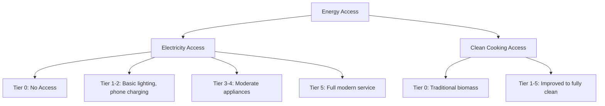

## Energy Access and Human Development Linkages

### Definition and Scope

This topic examines the causal and correlational relationships between access to modern energy services (electricity, clean cooking fuel, mechanical power) and human development outcomes — health, education, income, gender equity, and productivity. It draws on development economics, energy economics, and public health to assess how energy access functions as an input to, rather than merely a byproduct of, economic development.

### Defining Energy Access

**Binary vs. Multi-Tier Frameworks**

Early energy access metrics used a binary connected/not-connected indicator (e.g., percentage of households with a grid connection), which masks large variation in service quality.

The **Multi-Tier Framework (MTF)**, developed by the World Bank's ESMAP program, evaluates access along multiple attributes rather than a single yes/no measure:

- Capacity (power available, watts)
- Duration (hours per day, hours per evening)
- Reliability (outage frequency)
- Quality (voltage stability)
- Affordability (cost as share of household expenditure)
- Legality (formal vs. informal connection)
- Health and safety (fire/electrocution risk)

Access is scored from Tier 0 (no access) to Tier 5 (full modern service), separately for both electricity and cooking solutions.

### Theoretical Channels Linking Energy to Development

**Key Points**

- Energy access is best modeled as an enabling input into a household production function for health, education, and income-generating activity — not a final consumption good in itself
- The relationship is bidirectional: higher income enables energy access (demand-side), while energy access can raise income-generating capacity (supply-side), creating identification challenges in empirical work

**Channel 1: Health**

- Clean cooking fuel reduces household air pollution exposure (see cross-referenced clean cooking transition topic)
- Electrification enables refrigeration for vaccines and medicines at clinics, lighting for night-time medical procedures/deliveries, and powered medical equipment
- Reduced reliance on kerosene lighting lowers fire and burn risk and indoor air pollution from wick lamps

**Channel 2: Education**

- Electric lighting extends study hours after dark; multiple household surveys and quasi-experimental studies associate electrification with increased self-reported study time, though the magnitude and causal strength vary across contexts [Inference: effect sizes differ substantially by study design and baseline lighting alternatives, and are not uniformly large across all settings]
- Reduced time spent on fuel/water collection (often falling on girls) can increase school attendance, an effect operating through the time-allocation channel rather than lighting directly
- Access to information/communication technology (charging phones, radio, television, later internet) enabled by electrification supports educational content access

**Channel 3: Income and Productivity**

- Mechanical power (irrigation pumps, mills, small machinery) raises agricultural and micro-enterprise productivity
- Electrification enables extended business operating hours (evening retail, services)
- Cold chain access (refrigeration) reduces food/perishables loss for small vendors and enables new business lines (cold drinks, dairy)
- Enables adoption of complementary technologies (computers, sewing machines, welding equipment) that raise labor productivity

**Channel 4: Gender Equity**

- Reduces the time burden of fuel and water collection disproportionately borne by women and girls, a time-poverty effect with implications for labor force participation and schooling
- Enables home-based income generation compatible with childcare responsibilities
- Effects on female labor force participation from rural electrification are documented in several country studies, though results are heterogeneous and sometimes small or statistically insignificant depending on context and available complementary economic opportunities [Inference: this heterogeneity reflects a genuine and actively debated pattern in the literature, not merely a methodological artifact]

### Empirical Identification Challenges

**Endogeneity of Electrification Placement**

Grid extension is rarely random: governments prioritize wealthier, more populous, or politically influential areas, creating strong selection bias if simple correlations between electrification and development outcomes are interpreted causally.

**Common Identification Strategies**

- **Difference-in-differences** using staggered rollout of grid infrastructure across regions/time
- **Instrumental variables**, e.g., using distance to transmission lines, terrain ruggedness, or historical infrastructure placement (colonial-era rail lines, dam locations) as instruments for electrification, under the exclusion restriction that these instruments affect outcomes only through electrification
- **Regression discontinuity** at administrative boundaries or grid-extension cutoff distances
- **Randomized encouragement designs**, e.g., randomized subsidies for grid connection among already-passed households

**Mixed Findings in the Literature**

A well-known finding is that several rigorous quasi-experimental studies (using DID or IV designs in African and South Asian contexts) find **smaller income and consumption effects of rural electrification than earlier correlational studies suggested**, once selection bias is addressed. This does not necessarily mean electrification has no economic value, but suggests that electrification alone, without complementary access to credit, markets, and productive-use appliances, may be insufficient to generate large income gains. [Inference: interpretation of "insufficient alone" reflects an ongoing debate in the empirical literature rather than a settled consensus, and results vary meaningfully by country, sample, and identification strategy.]

### The Productive Use of Energy (PUE) Framework

Recognizing that electrification alone does not guarantee income gains, PUE frameworks emphasize pairing electricity access with:

- Access to appliances and equipment financing (irrigation pumps, cold storage, milling machines)
- Market access (roads, buyers) so increased production has an outlet
- Business skills training and credit access
- Demand aggregation to make mini-grid/distribution investments commercially viable

**Example**

A mini-grid operator serving a rural agricultural community may find that residential lighting/phone-charging demand alone does not generate sufficient revenue to sustain operations; pairing the mini-grid with a cold storage facility or agro-processing mill (rice mill, oil press) creates anchor commercial demand that improves both community income outcomes and the mini-grid's financial viability — a business model increasingly promoted by development finance institutions.

### Energy Access and the SDGs

**SDG 7** (Affordable and Clean Energy) is explicitly linked to multiple other Sustainable Development Goals:

- **SDG 3** (Health): via clean cooking and health facility electrification
- **SDG 4** (Education): via lighting and time-allocation channels
- **SDG 5** (Gender Equality): via time-poverty reduction
- **SDG 8** (Decent Work and Economic Growth): via productive use and enterprise development
- **SDG 13** (Climate Action): via the choice of generation technology (renewable mini-grids vs. diesel)

### Energy Poverty Measurement

**Expenditure-Based Measures**

The traditional "10% rule" (energy poverty if energy expenditure exceeds 10% of household income) is widely used but has been criticized for arbitrariness and for not capturing under-consumption (households that spend little on energy because they simply forgo services, not because energy is affordable).

**Low Income, High Costs (LIHC) Indicator**

Used primarily in UK/European contexts: a household is energy poor if its energy costs are above the national median AND, after paying for energy, its residual income falls below the poverty line — capturing the joint condition of low income and disproportionate energy burden.

**Multidimensional Energy Poverty Index (MEPI)**

Analogous to the multidimensional poverty index, MEPI aggregates deprivation across multiple energy-related indicators (cooking fuel, lighting, services, appliance ownership, entertainment/education access) into a composite score, better suited to developing-country contexts where the income-expenditure approach is less informative due to large informal/subsistence sectors.

### Diagram: Energy Access to Development Outcome Pathways

<svg xmlns="http://www.w3.org/2000/svg" viewBox="0 0 780 460" font-family="sans-serif">
<text x="390" y="25" text-anchor="middle" font-size="16" font-weight="bold">Energy Access to Human Development Pathways (svg_diagram)</text>
<rect x="320" y="50" width="140" height="45" rx="6" fill="#dceefb" stroke="#2980b9" stroke-width="1.5" />
<text x="390" y="77" text-anchor="middle" font-size="12" font-weight="bold">Energy Access</text>
<rect x="40" y="140" width="150" height="50" rx="6" fill="#fdf2d9" stroke="#e67e22" stroke-width="1.5" />
<text x="115" y="160" text-anchor="middle" font-size="11" font-weight="bold">Health Channel</text>
<text x="115" y="176" text-anchor="middle" font-size="9">Clean cooking, clinics</text>
<rect x="220" y="140" width="150" height="50" rx="6" fill="#e2f0d9" stroke="#27ae60" stroke-width="1.5" />
<text x="295" y="160" text-anchor="middle" font-size="11" font-weight="bold">Education Channel</text>
<text x="295" y="176" text-anchor="middle" font-size="9">Study hours, time savings</text>
<rect x="400" y="140" width="150" height="50" rx="6" fill="#f9e2f0" stroke="#c0392b" stroke-width="1.5" />
<text x="475" y="160" text-anchor="middle" font-size="11" font-weight="bold">Income Channel</text>
<text x="475" y="176" text-anchor="middle" font-size="9">Productive use, hours</text>
<rect x="580" y="140" width="150" height="50" rx="6" fill="#e2e2fb" stroke="#8e44ad" stroke-width="1.5" />
<text x="655" y="160" text-anchor="middle" font-size="11" font-weight="bold">Gender Channel</text>
<text x="655" y="176" text-anchor="middle" font-size="9">Time poverty reduction</text>
<line x1="390" y1="95" x2="115" y2="140" stroke="#555" stroke-width="1.2" />
<line x1="390" y1="95" x2="295" y2="140" stroke="#555" stroke-width="1.2" />
<line x1="390" y1="95" x2="475" y2="140" stroke="#555" stroke-width="1.2" />
<line x1="390" y1="95" x2="655" y2="140" stroke="#555" stroke-width="1.2" />
<rect x="240" y="240" width="300" height="60" rx="6" fill="#fef9e7" stroke="#f1c40f" stroke-width="1.5" />
<text x="390" y="265" text-anchor="middle" font-size="12" font-weight="bold">Moderated by:</text>
<text x="390" y="285" text-anchor="middle" font-size="10">Complementary inputs (credit, markets, skills)</text>
<line x1="115" y1="190" x2="300" y2="240" stroke="#999" stroke-width="1" />
<line x1="295" y1="190" x2="340" y2="240" stroke="#999" stroke-width="1" />
<line x1="475" y1="190" x2="440" y2="240" stroke="#999" stroke-width="1" />
<line x1="655" y1="190" x2="480" y2="240" stroke="#999" stroke-width="1" />
<rect x="290" y="350" width="200" height="50" rx="6" fill="#d5f5e3" stroke="#1e8449" stroke-width="1.5" />
<text x="390" y="380" text-anchor="middle" font-size="12" font-weight="bold">Human Development Outcomes</text>
<line x1="390" y1="300" x2="390" y2="350" stroke="#555" stroke-width="1.5" />
<text x="390" y="430" text-anchor="middle" font-size="11" font-style="italic">Magnitude of gains depends on complementary factors, not energy access alone</text>
</svg>

### Policy Implications

- Electrification investment should be sequenced or bundled with complementary productive-use interventions (credit, appliance financing, market access) rather than treated as a standalone development lever
- Reliability and quality of supply matter as much as binary connection status; Tier 1-2 access levels deliver far smaller development gains than Tier 4-5
- Gender-differentiated impact evaluation is necessary since aggregate household-level statistics can mask intra-household distributional effects
- Energy poverty measurement should combine expenditure-based and multidimensional deprivation indicators, particularly in contexts with large informal or subsistence economies

### Related Topics

- Clean cooking fuel transition economics
- Rural electrification and mini-grid business models
- Multi-Tier Framework (MTF) for energy access measurement
- Productive use of energy (PUE) and rural enterprise development
- Gender and energy access economics
- Instrumental variable and quasi-experimental methods in development economics
- Sustainable Development Goal 7 and cross-SDG linkages
- Energy poverty indices (LIHC, MEPI) and comparative measurement methodology