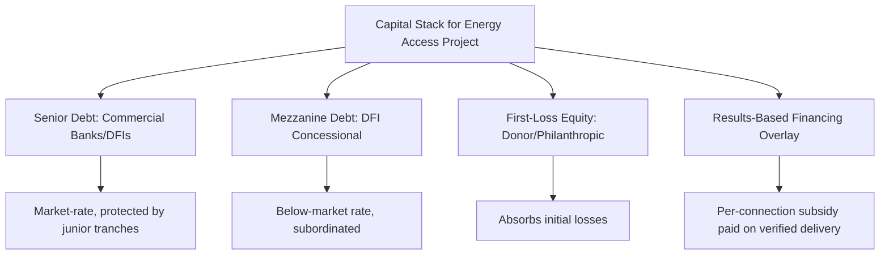

## International Development Finance for Energy Access

### Definition and Scope

International development finance for energy access encompasses the instruments, institutions, and mechanisms through which multilateral development banks (MDBs), bilateral aid agencies, climate funds, and blended finance vehicles mobilize and deploy capital to close energy access gaps in low- and middle-income countries. It addresses why market-rate private capital alone is insufficient to finance energy access at scale, and how concessional and blended structures are designed to correct this.

### Rationale for Concessional Development Finance

**Key Points**

- Energy access projects serving low-income, rural, or dispersed populations frequently exhibit risk-return profiles below the threshold required by commercial investors, even though social returns (health, education, productivity) are high
- This gap between private and social returns is the standard economic justification for concessional finance: public/donor capital absorbs risk or subsidizes returns to "crowd in" private capital that would not otherwise participate
- Key risk factors deterring private capital: currency risk (revenues in local currency, debt often in hard currency), off-taker/counterparty risk (state utility payment reliability), regulatory and tariff-setting uncertainty, small project size relative to transaction costs, and political risk

### The Financing Gap and Blended Finance Logic

**The "Missing Middle" Problem**

Energy access projects — particularly mini-grids and off-grid solar companies — often fall into a financing gap: too large and commercially structured for grant-dependent NGO models, but too small, early-stage, or risky for standard commercial project finance (which favors large utility-scale generation with predictable off-take contracts).

**Blended Finance Structures**

Blended finance uses concessional public/philanthropic capital to alter the risk-return profile of a transaction, mobilizing additional private capital that would not otherwise invest. Common structural mechanisms:

- **First-loss capital**: concessional investors absorb initial losses in a capital stack, protecting senior/commercial investors (e.g., development finance institution equity subordinated to commercial debt)
- **Guarantees**: partial credit guarantees or political risk insurance (e.g., MIGA guarantees) that reduce the effective risk commercial lenders bear
- **Results-based financing (RBF)**: payments made only upon verified delivery of connections or service (e.g., per-connection subsidies disbursed after independent verification), aligning subsidy with actual outcomes rather than upfront capital
- **Technical assistance grants**: de-risking through capacity building, feasibility studies, and project preparation, reducing the transaction costs that deter commercial lenders from smaller deals
- **Currency risk mitigation facilities**: local-currency lending facilities or hedging instruments (e.g., TCX - The Currency Exchange Fund) that reduce currency mismatch risk for energy access companies with local-currency revenues

### Key Institutional Actors

**Multilateral Development Banks (MDBs)**

- **World Bank / IDA-IBRD**: sovereign lending and guarantees for grid extension, utility reform, and off-grid access programs (e.g., ASCENT, Lighting programs historically under Lighting Global/ESMAP)
- **International Finance Corporation (IFC)**: World Bank Group's private-sector arm, providing equity and debt directly to energy access companies and financial intermediaries
- **African Development Bank (AfDB)**: leads initiatives such as the Desert to Power initiative and co-manages the Sustainable Energy Fund for Africa (SEFA)
- **Asian Development Bank (ADB)** and regional counterparts for their respective geographies

**Bilateral and National Development Finance Institutions (DFIs)**

- US International Development Finance Corporation (DFC)
- UK's British International Investment (BII, formerly CDC Group)
- French Agence Française de Développement (AFD) / Proparco
- German KfW / DEG
- These typically provide debt, equity, and guarantees directly to energy access companies or via regional financial intermediaries, often blending commercial and concessional terms.

**Climate and Dedicated Energy Access Funds**

- **Green Climate Fund (GCF)**: channels climate finance, including for renewable mini-grids and off-grid solar with climate mitigation/adaptation co-benefits
- **Sustainable Energy for All (SEforALL)**: convening and advocacy platform tracking SDG7 finance flows, not itself a financing vehicle
- **Global Energy Alliance for People and Planet (GEAPP)**: a philanthropic-backed alliance (Rockefeller Foundation, IKEA Foundation, Bezos Earth Fund) blending grant and catalytic capital for access and clean energy transition in emerging economies
- **Energy Sector Management Assistance Program (ESMAP)**: World Bank-administered multi-donor trust fund providing technical assistance, data (including the Multi-Tier Framework), and analytics

**Results-Based Financing Facilities**

Program examples include performance-based grants for mini-grid developers and off-grid solar companies disbursed per verified connection or per household served, often administered through World Bank or bilateral-funded facilities in Sub-Saharan Africa and South Asia. [Unverified: specific facility names, amounts, and active status change frequently as programs are launched, extended, or wound down; verify current facility details against the administering institution's latest published information.]

### Financing Instruments by Project Type

**Grid Extension**

Predominantly financed via sovereign or sovereign-guaranteed lending from MDBs to national utilities/governments, given the natural monopoly characteristics and public-good elements of transmission/distribution infrastructure.

**Mini-Grids**

Blended finance is especially prevalent here due to smaller unit size, revenue uncertainty pre-operation, and technology/regulatory risk. Typical structure: donor/DFI first-loss equity plus commercial debt plus RBF connection subsidies plus government tariff/regulatory support.

**Off-Grid Solar (Solar Home Systems / Pay-As-You-Go)**

Financed through a mix of:

- Venture capital and private equity into PAYGo companies (early-stage, higher risk tolerance for scale-up)
- DFI debt facilities as companies mature and generate predictable receivables
- Receivables financing/securitization of PAYGo customer payment streams as portfolios scale
- Carbon finance (Verified Emission Reductions from displaced kerosene/diesel use) as a supplementary revenue stream

**Clean Cooking**

Historically underfunded relative to electrification within SDG7 finance flows; increasingly financed via carbon markets (cookstove carbon credits), RBF, and dedicated facilities (e.g., Clean Cooking Fund administered by the World Bank).

### Measuring and Tracking Finance Flows

**SDG7 Tracking**

The **Sustainable Energy for All (SEforALL) / IEA / World Bank "Tracking SDG7"** reporting series and related energy access finance tracking reports monitor annual committed finance against estimated need, consistently finding that committed international finance for energy access falls well below estimates of the investment required to achieve universal access. [Inference: precise finance gap figures vary by year, report, and methodology; directionally the finding of a persistent shortfall has been consistent across multiple years' reports, but exact dollar figures should be checked against the current-year report rather than assumed static.]

**Additionality**

A central evaluation question in blended finance: did concessional capital genuinely enable a transaction that would not have occurred otherwise (additionality), or did it merely subsidize an investment that commercial capital would have funded regardless (a market-distorting outcome)? DFI evaluation frameworks (e.g., IFC's Anticipated Impact Measurement and Monitoring, AIMM) attempt to formalize additionality assessment, though it remains inherently difficult to observe the counterfactual.

### Cost-Effectiveness Considerations

**Levelized Cost of Access**

Comparing financing approaches often uses a levelized cost per connection or per person served metric, incorporating capital subsidy, ongoing operational subsidy (if any), and expected service life:

$$LCOA = \frac{\sum_t \frac{C_t}{(1+r)^t}}{\sum_t \frac{N_t}{(1+r)^t}}$$

where $C_t$ is total cost (capital plus subsidy plus O&M) in year $t$, $N_t$ is number of people/connections served, and $r$ is the discount rate — allowing comparison of grid extension versus mini-grid versus solar home system cost-effectiveness for a given geography.

**Example**

For remote, low-density populations, off-grid solar home systems typically show lower per-connection subsidy requirements than grid extension once transmission/distribution capital costs and transmission losses are factored in, which is a primary rationale multilateral programs use for geospatial least-cost electrification planning (segmenting countries into grid, mini-grid, and off-grid zones based on modeled cost-effectiveness). [Inference: the specific crossover distance/density threshold favoring off-grid over grid extension is highly country- and terrain-specific and requires local geospatial least-cost planning rather than a universal rule of thumb.]

### Governance and Implementation Challenges

- **Absorptive capacity constraints**: recipient country institutions may lack capacity to prepare bankable projects, causing committed finance to go undisbursed
- **Coordination failures**: multiple donors and DFIs operating in the same country/sector without harmonized standards can create duplicated due diligence burdens and fragmented small-scale interventions rather than pooled, larger-scale facilities
- **Currency and macroeconomic risk**: hard-currency-denominated debt exposes local energy access companies to depreciation risk, a recurring cause of financial distress among PAYGo and mini-grid operators
- **Political economy of tariffs**: government reluctance to allow cost-reflective tariffs (to protect consumers politically) can undermine the commercial viability that blended finance is designed to eventually achieve, perpetuating subsidy dependence

### Related Topics

- Clean cooking fuel transition economics
- Energy access and human development linkages
- Mini-grid business models and productive use of energy
- Carbon finance and results-based financing mechanisms
- Currency risk management in emerging market infrastructure finance
- Multilateral development bank governance and lending instruments
- Geospatial least-cost electrification planning
- Additionality and impact measurement in blended finance